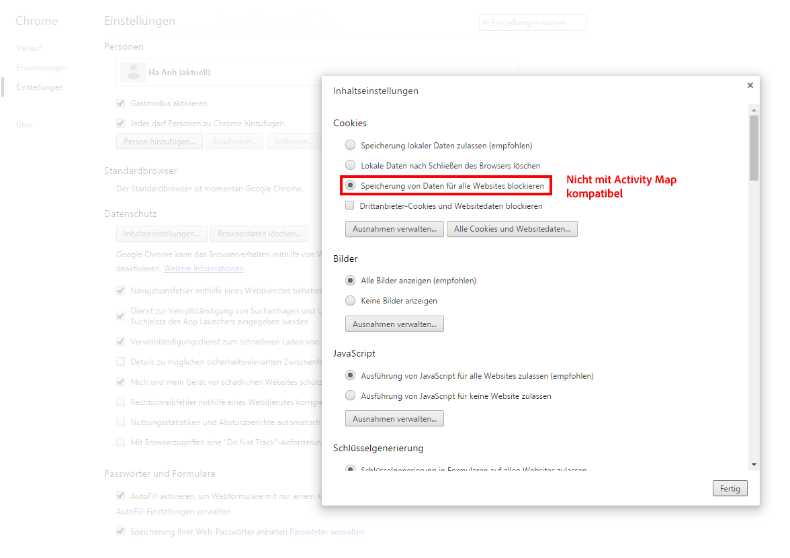
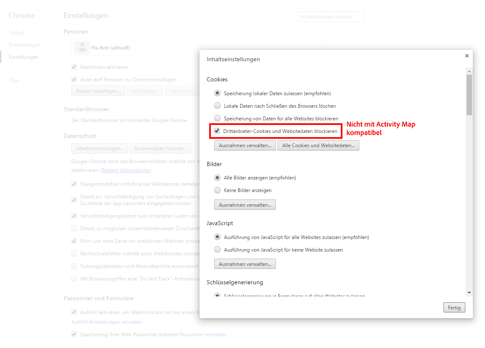
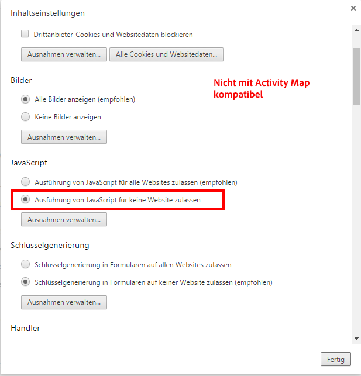
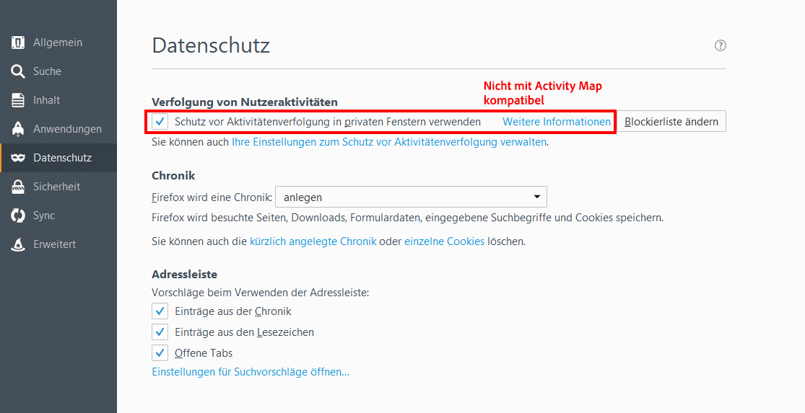
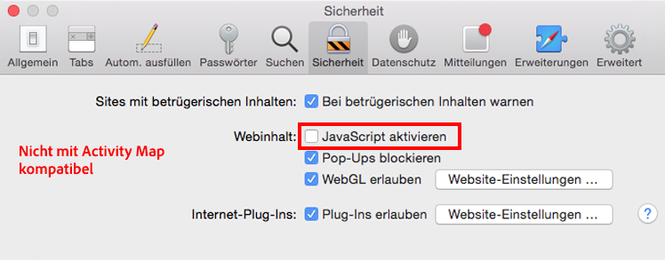
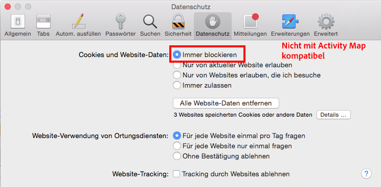
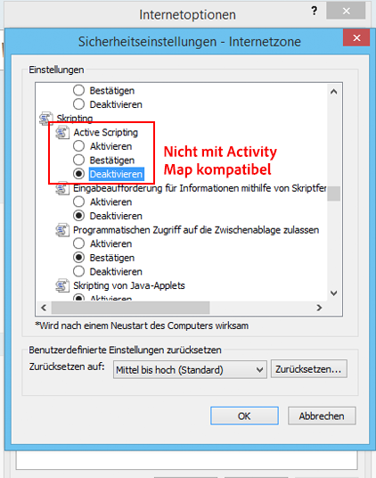

# Fehlerbehebung für Browsererweiterungen

Führt die Browserparameter auf, die nicht mit der Verwendung von Activity Map kompatibel sind. Sie sollten diese Einstellungen deaktivieren.

## Chrome

## Firefox

## Safari

## Internet Explorer

