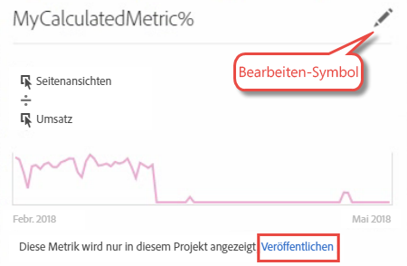

# Project Converter – FAQ

>[!IMPORTANT]
>
>Adobe stellt Ad Hoc Analysis am 1. März 2021 ein. [Weitere Infos](https://adobe.ly/discoverworkspace)

## Project Converter – FAQ {#topic_8231595303AD403E9322645A63632D57}

* [Bekannte Konvertierungsprobleme](/help/analyze/ad-hoc-analysis/c-aha-project-converter/aha2aw-converter-faq.md#section_39C922A58B2E49C9877B363042801361)
* [Häufig gestellte Fragen zur Konversion](/help/analyze/ad-hoc-analysis/c-aha-project-converter/aha2aw-converter-faq.md#section_1E53FE373AF045978F939916124E194E)

## Bekannte Konvertierungsprobleme {#section_39C922A58B2E49C9877B363042801361}

| Problem | Beschreibung |
| --- | --- |
| Minutengranularität mit Aufschlüsselungen oder in Spalten | Wenn die Minutengranularität Aufschlüsselungen enthält oder in Spalten vorhanden ist, kann das Projekt nicht in Analysis Workspace konvertiert werden.  Eine Lösung besteht darin, die Aufschlüsselung für die Minutengranularität zu entfernen, sie aus den Spalten zu entfernen und das Projekt dann zu konvertieren. Anschließend können Sie in Analysis Workspace Aufschlüsselungen für die Minutengranularität anwenden. |
| Interne, berechnete Metrik, die zusammen mit einem Spaltensegment verwendet wird | Wenn Sie eine interne, berechnete Metrik zusammen mit einem Spaltensegment verwenden, kann das Projekt nicht in Analysis Workspace konvertiert werden. Um dieses Problem zu umgehen, entfernen Sie die internen, berechneten Metriken vor der Konvertierung aus dem Projekt und fügen Sie sie dann erneut in Analysis Workspace hinzu. |

## Häufig gestellte Fragen zur Konversion {#section_1E53FE373AF045978F939916124E194E}

<table id="table_48CC119236C94835A6A512E989BE4200"> 
 <thead> 
  <tr> 
   <th colname="col1" class="entry"> Frage </th> 
   <th colname="col2" class="entry"> Antwort </th> 
  </tr>
 </thead>
 <tbody> 
  <tr> 
   <td colname="col1"> 
<b>F: Gibt es Funktionen von Ad Hoc Analysis, die in Analysis Workspace nicht unterstützt werden?</b> 
 </td> 
   <td colname="col2"> 
A: Die Site-Analyse wird in Analysis Workspace nicht unterstützt. Darüber hinaus bestehen leichte Unterschiede bei anderen Visualisierungen in Ad Hoc Analysis und Analysis Workspace. Weitere Informationen dazu können Sie den folgenden Fragen entnehmen. 
 </td> 
  </tr> 
  <tr> 
   <td colname="col1"> 
<b>F: Wie werden Tabelleneinstellungen konvertiert?</b> 
 </td> 
   <td colname="col2"> 
    <ul id="ul_A645A004FB094A1593439A6607FE9A6B"> 
     <li id="li_033CA771F08A4BC3B0BC52CDCCA03FF4"><b>Anzahl an dargestellten Zeilen</b>: Analysis Workspace ist paginiert, um nur 10 Zeilen anzuzeigen (anpassbar für eine Darstellung von bis zu 400 Zeilen gleichzeitig), Ad Hoc Analysis hingegen zeigt bis zu 50.000 Zeilen auf einer Seite an. Beachten Sie, dass sich die Daten dabei alle in Workspace befinden, die Darstellung ist lediglich auf den Standardwert von 10 Zeilen festgelegt. </li> 
     <li id="li_A8B8890149334032A56D8D1C0F8691EA"><b>Erweiterte Suche:</b> Mehrere gleichzeitige Suchoptionen werden nicht unterstützt, eine einzelne Suchoption (wie Alle Wörter, Der exakte Begriff, Eines dieser Wörter oder Keines dieser Wörter) wird nach Analysis Workspace konvertiert. </li> 
    </ul> </td> 
  </tr> 
  <tr> 
   <td colname="col1"> 
<b>F: Wie werden Diagramme/Grafiken konvertiert?</b> 
 </td> 
   <td colname="col2"> 
A: Beachten Sie, dass Diagramme und Grafiken in Workspace als „Visualisierungen“ bezeichnet werden. 
 
    <ul id="ul_597F5AB826EF434295D0CABD0313CAD5"> 
     <li id="li_AFB2805418034721A9519D999128C0A8"><b>Einstellungen</b>: Visualisierungseinstellungen wie die „Anzahl der Elemente“ oder „Anzahl an Balken“ werden in Workspace nicht unterstützt. </li> 
     <li id="li_D5C7EA8815344EDB8585CBB8E1AF583E"><b>Tortendiagramm</b>: Exportiert als <a href="https://docs.adobe.com/content/help/de-DE/analytics/analyze/analysis-workspace/visualizations/donut.html"  >Donut</a>-Visualisierung. Diese Visualisierung wird in Workspace nach 19 Abschnitten abgeschnitten. </li> 
     <li id="li_91659FBFD77C4B3393D78447D658B7B4"><b>Blasendiagramm</b>: Exportiert als <a href="https://docs.adobe.com/content/help/de-DE/analytics/analyze/analysis-workspace/visualizations/scatterplot.html"  >Streudiagramm</a>-Visualisierung. Im Streudiagramm wird die erste Kennzahl standardmäßig auf der X-Achse positioniert und die zweite auf der Y-Achse. Sofern nur eine Kennzahl vorhanden ist, werden Blasendiagramme in Linienvisualisierungen umgewandelt. </li> 
     <li id="li_FA05085FFB1747EBAF63616AC2B8D59C"><b>Histogramm</b>: Unterstützt für Analysis Workspace und Ad Hoc Analysis eine unterschiedliche Bucket-Logik. Daher wird ein Histogramm in eine <a href="https://docs.adobe.com/content/help/de-DE/analytics/analyze/analysis-workspace/visualizations/bar.html"  >Balken</a> visualisierung umgewandelt. </li> 
     <li id="li_959499D20796459CA0F6BBC8F0A8D808"><b>Streudiagramm</b>: In exportierten Projekten in Analysis Workspace wird die Y-Achse als erste Spalte, die X-Achse als zweite und der Durchmesser als dritte Spalte festgelegt. </li> 
     <li id="li_14E06D7A5106405A89A07B44FFD9A92D"><b>Trichteranalysetabellen</b>: Wenn Sie Fallthrough- oder Trichteranalysetabellen anzeigen möchten, klicken Sie mit der rechten Maustaste auf den Checkpoint und wählen eine Aufschlüsselungsoption aus. </li> 
     <li id="li_240F43C386F04111A7632A8FCA37832C"><b>Datumsbereiche für Fallout-Berichtsebene</b>: Angepasste Datumsbereiche werden nicht auf Fallout-Visualisierungen angewendet. </li> 
     <li id="li_1FF5B3FD9E424E7190AF03FD4DD9D654"><b>Flussbericht</b>: Der Fluss wird in ein eigenes Panel verschoben, um die Datumsbereiche und Segmentierung beizubehalten. Wiederholungsinstanzen können unter „Flusseinstellungen“ ein- oder ausgeschlossen werden. </li> 
     <li id="li_BE8F8F6EC2EA49E18EF52539BC1700E0"><b>Konversion Funnel</b>: Wird in eine Freiform-Tabelle konvertiert, da diese Funktion in Analysis Workspace nicht unterstützt wird. Es wird empfohlen, den Conversion Funnel in eine Trichteranalyse-Visualisierung zu konvertieren. Infolgedessen ergibt sich jedoch ein leicht abweichendes Verhalten. </li> 
    </ul> </td> 
  </tr> 
  <tr> 
   <td colname="col1"> 
<b>F: Wie werden Segmente konvertiert?</b> 
 </td> 
   <td colname="col2"> 
    <ul id="ul_15D5B17461E2402DB07DF8B0A10AAC37"> 
     <li id="li_CF9C3D235A664B15B21D9F89DC5EF7D3">Segmente befinden sich innerhalb des konvertierten Projekts (und sind nicht öffentlich). Sie können diese jedoch als öffentlich festlegen, wie im Folgenden dargestellt: 
 
 </li> 
     <li id="li_AE61DAEC5C0047349DD192EFEEDB0BF9">Der Datumsbereich auf Ad Hoc Analysis-Arbeitsbereichsebene wird in Analysis Workspace auf Projekt-/Arbeitsbereichsebene angewendet. </li> 
     <li id="li_B1559E2C18724FE189AF87D0BEF16811">Segmente der Ad Hoc Analysis auf Berichtsebene werden in Workspace auf Tabellenspaltenebene angewendet. </li> 
     <li id="li_0E6DF6D44EA448A4A212BA2BB8E342CF">Tabellensegmente von Ad Hoc Analysis werden in Workspace auf Tabellenspaltenebene angewendet. </li> 
    </ul> 
Die Segmente lassen sich im <a href="https://docs.adobe.com/content/help/de-DE/analytics/components/segmentation/seg-home.html"  >Segment-Builder</a> bearbeiten. 
 </td> 
  </tr> 
  <tr> 
   <td colname="col1"> 
<b>F: Wie werden Datumsbereiche konvertiert?</b> 
 </td> 
   <td colname="col2"> 
    <ul id="ul_A24AB597F3CE4847AF00D49A9A72A395"> 
     <li id="li_24FD18AF64114445939C4FBC03F2D406">In dem Datumsbereich „Letzte X Tage“ in Ad Hoc Analysis wird der heutige Tag <i>nicht einbezogen</i>, in Analysis Workspace hingegen <i>erfolgt die Einbeziehung</i> des aktuellen Tages. Daher wird ein Datumsbereich wie „Letzte 90 Tage“ in den beiden Tools unter Umständen keine genaue Übereinstimmung liefern. Wenden Sie stattdessen Bereiche der Form „Letzte X <b>volle</b> Tage“ in Analysis Workspace an. </li> 
     <li id="li_AA4390470C494748B4B12030B1226720">Der Datumsbereich auf Ad Hoc Analysis-Arbeitsbereichsebene wird in Analysis Workspace auf Projekt-/Arbeitsbereichsebene angewendet. </li> 
     <li id="li_B8F0CDD413154856A315D087FEC4D418">Der Datumsbereich auf Ad Hoc Analysis-Berichtsebene wird in Analysis Workspace auf Tabellenspaltenebene angewendet. </li> 
    </ul> 
Sie haben die Möglichkeit, benutzerdefinierte Datumsbereiche unter Analyse &gt; Komponenten &gt; Datumsbereiche zu bearbeiten. 
 </td> 
  </tr> 
  <tr> 
   <td colname="col1"> 
<b>F: Wie werden berechnete Kennzahlen konvertiert?</b> 
 </td> 
   <td colname="col2"> 
    <ul id="ul_ADA380D5D09B4223AAE4853D4C64F679"> 
     <li id="li_010572F793F54680ABE64117DAB7E800">Berechnete Kennzahlen befinden sich innerhalb des exportierten Projekts (und sind nicht öffentlich). Sie können diese jedoch als öffentlich festlegen, indem Sie mit der rechten Maustaste auf die Kennzahl klicken und die Option Veröffentlichen wählen. 
 
 </li> 
     <li id="li_930546EC8FEB432C8810FAF93556FC9A">Für den Export werden alle Arten berechneter Kennzahlen unterstützt. </li> 
     <li id="li_DFF7C6F8BB2344928D49194DA0F6EC38"><b>Zuordnungstypen</b>: Obwohl in Analysis Workspace der Zuordnungstyp einer berechneten Kennzahl nicht explizit angezeigt wird, wird beim Export der Zuordnungstyp erstellt und zugeordnet, der in Ad Hoc Analysis vorhanden war. </li> 
    </ul> 
Sie haben die Möglichkeit, den Zuordnungstyp im <a href="https://docs.adobe.com/content/help/de-DE/analytics/components/calculated-metrics/cm-overview.html"  >Generator für berechnete Metriken</a> zu bearbeiten, indem Sie auf das Symbol zum Bearbeiten (Bleistift) klicken. 
 </td> 
  </tr> 
  <tr> 
   <td colname="col1"> 
<b>F: Wie werden globale Dateneinstellungen in Ad Hoc Analysis auf konvertierte Projekte angewendet?</b> 
 </td> 
   <td colname="col2"> 
Globale Dateneinstellungen können dazu führen, dass das gleiche Projekt, das zwei Mal exportiert wird, sich unterschiedlich verhält: 
 
    <ul id="ul_E3827883DD8045FAAB359D7E85E3EEFA"> 
     <li id="li_1056CA4813C44638BEB070228AE6914C"><b>Wiederholte Instanzen zählen.</b> Die Einstellung, die während des Exports angewendet wurde, wird auf das exportierte Projekt in Analysis Workspace angewendet. </li> 
     <li id="li_D5405E2862CF434CA82AA9DE000F4BBC"><b>Data Sources.</b> In Analysis Workspace werden alle Analysedaten angezeigt, einschließlich der Datenquellen. </li> 
    </ul> </td> 
  </tr> 
  <tr> 
   <td colname="col1"> 
<b>F: Wenn für mein Projekt in Ad Hoc Analysis ein Zeitplan festgelegt ist, wird dieser nach Analysis Workspace konvertiert?</b> 
 </td> 
   <td colname="col2"> 
Nein. Zeitpläne werden nicht konvertiert. Öffnen Sie in Analysis Workspace das Projekt, für das Sie einen Zeitplan festlegen möchten, und wählen Sie Freigeben &gt; Datei nach Zeitplan senden aus, um einen neuen Zeitplan einzurichten. Vergessen Sie nicht, den Zeitplan Ihres Projekts in Ad Hoc Analysis zu deaktivieren. 
 </td> 
  </tr> 
 </tbody> 
</table>

