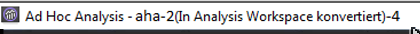
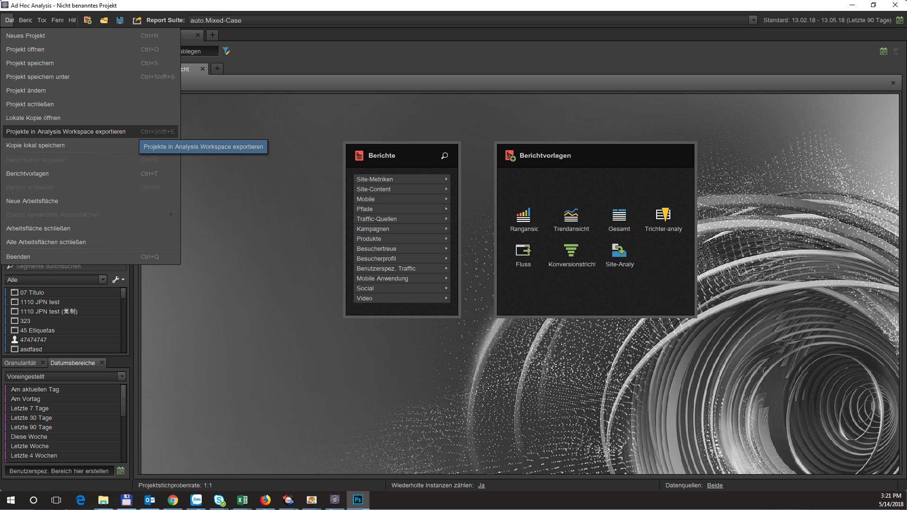
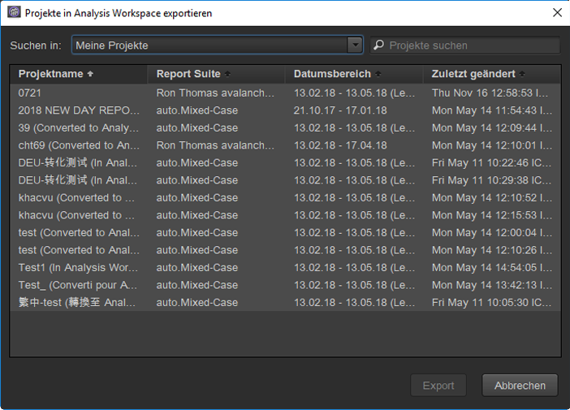
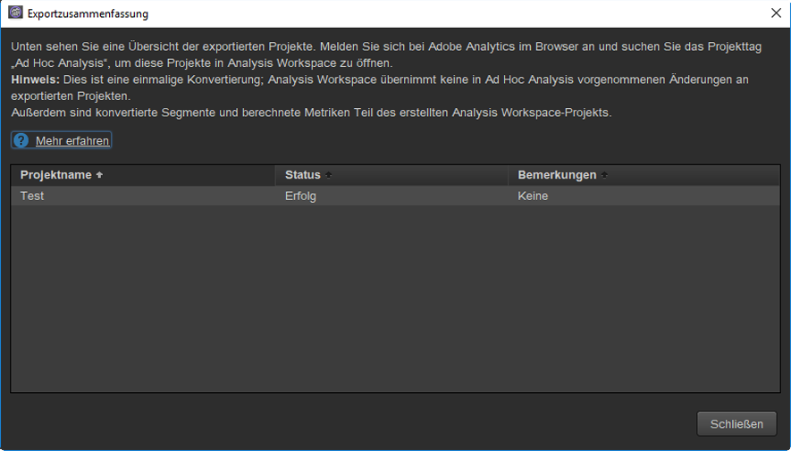
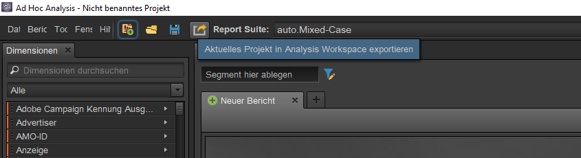

# Projekte in Ad Hoc Analysis konvertieren

>[!IMPORTANT]
>
>Die Adobe bringt Ad Hoc Analysis am 1. März 2021 in den Status als lebensbedrohlich. [Weitere Infos...](https://adobe.ly/discoverworkspace).

## Projekte konvertieren {#topic_5A55F73488704C5D8E42CDD04B5984DE}

Beachten Sie vor dem Konvertieren Ihrer Projekte Folgendes:

* Wenn Sie Projekte konvertieren möchten, müssen Sie als Administrator bei Ad Hoc Analysis angemeldet sein bzw. als Benutzer ohne Administratorberechtigungen aber mit der Berechtigung zur Nutzung von Analysis Workspace.
* Da es sich um eine einmalige Konvertierung handelt, werden alle weiteren Veränderungen, die Sie danach an Ad Hoc Analysis-Projekten vornehmen, nicht in Analysis Workspace dargestellt. Es besteht allerdings die Möglichkeit, ein Projekt erneut zu konvertieren.
* Alle konvertierten Ad Hoc Analysis-Projekte verbleiben weiterhin dort. Innerhalb einer Klammer im Titel des Projekts wird angegeben, dass das Projekt konvertiert wurde und wie häufig. Beispiel:

   

Für das Konvertieren von Ad Hoc Analysis-Projekten bestehen zwei Optionen:

* Projekte für die Konvertierung aus einer Liste auswählen.
* Nur das aktuell geöffnete Projekt konvertieren.

### Projekte aus einer Liste auswählen

1. Klicken Sie in Ad Hoc Analysis auf **[!UICONTROL Datei]** > **[!UICONTROL Projekte in Analysis Workspace exportieren]**.

   

1. Wählen Sie im Dialogfeld **[!UICONTROL Projekte in Analysis Workspace exportieren]** das Projekt zum Konvertieren oder drücken Sie  +  um die gesamte Liste auszuwählen.

   

1. Klicken Sie auf **[!UICONTROL Export]**.
1. In einer [!UICONTROL Exportzusammenfassung] werden nun alle konvertierten Projekte aufgeführt, zusammen mit Statusspalten, in denen angegeben wird, ob das Konvertieren erfolgreich war oder fehlgeschlagen ist, sowie der zugehörige Fehlercode. Wenden Sie sich mit dem `Error-Id: <Error-Code>` an den Adobe-Kundendienst, wenn Sie eine genauere Diagnose benötigen.

   

### Aktuelles Projekt konvertieren

1. Öffnen Sie in Ad Hoc Analysis das Projekt, das Sie konvertieren möchten.
1. Klicken Sie auf **[!UICONTROL Aktuelles Projekt in Analysis Workspace exportieren.]** 

1. In einer [!UICONTROL Exportzusammenfassung] werden nun alle konvertierten Projekte aufgeführt, zusammen mit Statusspalten, in denen angegeben wird, ob das Konvertieren erfolgreich war oder fehlgeschlagen ist, sowie der zugehörige Fehlercode. Wenden Sie sich mit dem `Error-Id: <Error-Code>` an den Adobe-Kundendienst, wenn Sie eine genauere Diagnose benötigen.
