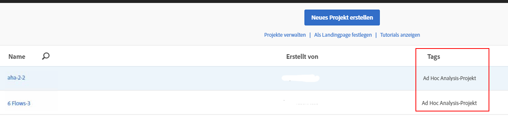

# Anzeigen von konvertierten Projekten in Analysis Workspace

>[!IMPORTANT]
>
>Adobe stellt Ad Hoc Analysis am 1. März 2021 ein. [Weitere Infos](https://adobe.ly/discoverworkspace)

Bevor Sie Ihre Projekte in Workspace anzeigen, machen Sie sich mit den [FAQ](/help/analyze/ad-hoc-analysis/c-aha-project-converter/aha2aw-converter-faq.md#topic_8231595303AD403E9322645A63632D57) und den [Unterschieden in der Terminologie](/help/analyze/ad-hoc-analysis/c-aha-project-converter/aha2aw-converter-faq.md#topic_8231595303AD403E9322645A63632D57) zwischen Ad Hoc Analysis und Workspace vertraut.

1. Navigieren Sie zu **[!UICONTROL Analyse]** > **[!UICONTROL Arbeitsbereich]**. Beachten Sie, dass Projekte, die aus Ad Hoc Analysis konvertiert werden, als „Ad Hoc Analysis-Projekt“ gekennzeichnet werden.

   

1. Klicken Sie auf den Namen des Projekts, um es anzuzeigen.
1. Nehmen Sie bei Bedarf Änderungen am Projekt vor. Beachten Sie, dass diese Änderungen nicht nach Ad Hoc Analysis übertragen werden.

