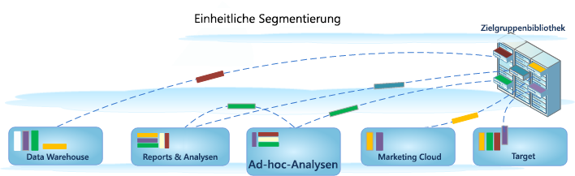

# Segmente erstellen

Ad-hoc-Analysen werden in die Umgebung der Analytics-Segmentierung integriert, sodass Sie Besuchersegmente über Adobe-Produkte hinweg erstellen, freigeben, verwalten und anwenden können. Ad-hoc-Analysen bieten eine Java-basierte Benutzeroberfläche für Segment Builder und Segment Manager, die mit den webbasierten Werkzeugen anderer Analytics-Werkzeuge identisch ist. Dadurch werden Serveraufrufe abgestimmt und dieselben Funktionen wie in einer Java-basierten Konsole bereitgestellt.

Ad Hoc Analysis umfassen bewährte Funktionen zum Erstellen von Segmenten, aber auch neue Funktionsupgrades wie den [Segment Manager](https://marketing.adobe.com/resources/help/en_US/analytics/segment/seg_manage.html) zum Einrichten eines [Segmentverwaltungs arbeitsablaufs](https://marketing.adobe.com/resources/help/en_US/analytics/segment/seg_workflow.html). Sie können wie gewohnt im [Segment-Builder](https://marketing.adobe.com/resources/help/en_US/analytics/segment/seg_build.html) Segmente erstellen und speichern, [oder Sie können über die Ad Hoc Analysis-Konsole](https://marketing.adobe.com/resources/help/en_US/analytics/segment/t_seg_fallout.html) Segmente aus einem Fallout-Bericht erstellen und dann die neuen oder erweiterten Segmente in der Zielgruppenbibliothek speichern, damit sie allgemein zugänglich sind und angewendet werden können. 

## Einheitliche Segmentierung in Ad Hoc Analysis {#section_5FA03A06DE054448AD519CE30C39E294}

Informationen zum Erstellen und Verwalten von Segmenten in der Umgebung der einheitlichen Segmentierung, einschließlich der Ad-hoc-Analysefunktionen, finden Sie in der Dokumentation zum Bereich [Einheitliche Segmentierung](https://marketing.adobe.com/resources/help/en_US/analytics/segment/index.html).

* [Neue Funktionen](../../analyze/ad-hoc-analysis/c-content-ref.md#section_BD58629D1A9346BF879E229FA6BEC7A2)
* [Änderungen der Segmentdefinition](https://marketing.adobe.com/resources/help/en_US/analytics/segment/seg_definition.html)
* [Was ist mit meinen bestehenden Segmenten passiert?](../../analyze/ad-hoc-analysis/c-content-ref.md#section_76CF47142D1A4FB6A0718AD9073049FE)
* [Was ist mit meinen bestehenden Segmentordnern passiert?](../../analyze/ad-hoc-analysis/c-content-ref.md#section_FB04DCF775694E69B761DCA53F301C30)
* [Kann ich mit dem Segment-Manager alle Analytics-Segmente verwalten?](../../analyze/ad-hoc-analysis/c-content-ref.md#section_AF5EDD72C74A4739BD40C4AF125CE489)
* [Was ist ein Treffer-Container? Unterscheidet er sich vom Seitenaufruf-Container?](../../analyze/ad-hoc-analysis/c-content-ref.md#section_65BBE60A836C4001938830DDA15DC256)
* [Welche Berechtigungen und Rechte brauche ich, um Segmente zu verwenden, zu erstellen und zu verwalten?](../../analyze/ad-hoc-analysis/c-content-ref.md#section_648DFA3A882146C485A84ED014EEC707)
* [Was soll ich mit doppelten Segmenten tun, die ...](../../analyze/ad-hoc-analysis/c-content-ref.md#section_E2C3A1B4B4274D1B86CAA9C0359D049C)
* [Wie lautet die Empfehlung von Adobe für das Bereinigen von Segmenten?](../../analyze/ad-hoc-analysis/c-content-ref.md#section_3AC2D265F9084557A24C6FB39DC6EE49)
* [Warum kann ich dieses Segment nicht löschen?](../../analyze/ad-hoc-analysis/c-content-ref.md#section_0FEB6711031A4ABCA915CDA745ECF38D)
* [Weitere Informationen zu bestehenden Segmenten](../../analyze/ad-hoc-analysis/c-content-ref.md#section_83ACAB256F394DCD8B424D8920BDD853)

## Funktionen {#section_BD58629D1A9346BF879E229FA6BEC7A2}

* [Alle Segmente](https://marketing.adobe.com/resources/help/en_US/analytics/segment/seg_overview.html) gelten nun für alle Report Suites. Bisher waren die Segmente spezifisch für die jeweilige Report Suite.
* Der neue [Segment-Manager](https://marketing.adobe.com/resources/help/en_US/analytics/segment/seg_manage.html) ermöglicht die Einrichtung von [Workflows](https://marketing.adobe.com/resources/help/en_US/analytics/segment/seg_workflow.html) und bietet Funktionen zum Teilen, Taggen, Prüfen und Genehmigen.

* Der [Segment-Builder](https://marketing.adobe.com/resources/help/en_US/analytics/segment/seg_build_ui.html) wurde aktualisiert, um das Erstellen von Segmenten zu vereinfachen.
* Sie können Segmente zum Organisieren und Suchen [taggen](https://marketing.adobe.com/resources/help/en_US/analytics/segment/seg_tag.html), anstatt Ordner zu verwenden. Previously, you used folders (in [!DNL ad hoc analysis]) to organize your segments.

* [Sequenzielle Segmente](https://marketing.adobe.com/resources/help/en_US/analytics/segment/seg_sequential.html) können jetzt außerhalb von Ad Hoc Analysis erstellt werden.
* 

>[!NOTE]
>
>In Ad-hoc-Analysen können Sie keine Datumsbereiche zu Segmenten hinzufügen. Diese Funktion ist in Analysis Workspace verfügbar. Außerdem können Sie „Nur vor Sequenz“ oder „Nur nach Sequenz“ in Ad Hoc Analysis nicht verwenden.

## Was ist mit meinen vorhandenen Segmenten passiert? {#section_76CF47142D1A4FB6A0718AD9073049FE}

Ihre vorhandenen Segmente funktionieren genau wie vor der Einführung der Analytics-Segmentierung. Alle Berichte, auf die diese Segmente angewendet wurden, funktionieren weiterhin korrekt.

Die meisten bisherigen vordefinierten und Suite-Segmente werden als [Segment-Vorlagen](https://marketing.adobe.com/resources/help/en_US/analytics/segment/seg_templates.html) in den Segment-Builder migriert. Mit Segmentvorlagen können Sie schnell benutzerdefinierte Segmente für Standard-Zielgruppen erstellen. Segmentvorlagen können nicht direkt auf einen Bericht angewendet werden, aber sie können problemlos zu einem benutzerdefinierten Segment gespeichert werden.

## Was ist mit meinen bestehenden Segmentordnern passiert? {#section_FB04DCF775694E69B761DCA53F301C30}

Anstatt der (Ad Hoc Analysis-)Ordner verwendet der Segment-Manager [Tags](https://marketing.adobe.com/resources/help/en_US/analytics/segment/seg_tag.html). Ihre Ordnernamen werden automatisch zu Tags umgewandelt, und die Tags werden auf die entsprechenden Segmente angewendet.

## Kann ich mit dem Segment-Manager alle Analytics-Segmente verwalten? {#section_AF5EDD72C74A4739BD40C4AF125CE489}

Im Segment Manager der Ad Hoc Analysis sehen Sie nur Ihre eigenen Segmente (Segmente, die Sie selbst erstellt haben) und Segmente, die für Sie freigegeben wurden.

## Was ist ein Trefferbehälter? Unterscheidet er sich vom Seitenansichtscontainer? {#section_65BBE60A836C4001938830DDA15DC256}

Der Seitenansichtscontainer wurde in Treffercontainer umbenannt, um anzuzeigen, dass dieser Container alle Datentypen segmentiert und nicht nur Seitenansichten. Zum Beispiel werden Linktracking-Aufrufe und [!DNL trackAction]-Aufrufe von mobilen SDKs vom Treffer-Container entweder komplett eingeschlossen oder ausgeschlossen.

Beachten Sie, dass sich die Funktionsweise dieses Behälters nicht geändert hat. Er wurde lediglich umbenannt.

## Welche Rechte und Privilegien benötige ich, um Segmente zu verwenden, zu erstellen und zu verwalten? {#section_648DFA3A882146C485A84ED014EEC707}

Alle Benutzer können persönliche Segmente erstellen und bearbeiten. Diese Segmente können unmittelbar mit anderen Analytics-Benutzern geteilt werden.

Admins können alle Segmente bearbeiten, [Segmente für Gruppen freigeben](https://marketing.adobe.com/resources/help/en_US/analytics/segment/t_seg_share.html) und [Rechte](https://marketing.adobe.com/resources/help/en_US/analytics/segment/seg_rights.html) für den Zugriff auf Segmente innerhalb der Organisation festlegen.

## Was mache ich mit doppelten Segmenten, die zwar denselben Namen, aber unterschiedliche Definitionen haben? {#section_E2C3A1B4B4274D1B86CAA9C0359D049C}

Da Segmente jetzt von unterschiedlichen Report-Suites genutzt werden können, kann es vorkommen, dass Sie mehrere Segmente mit demselben Namen haben. Wir empfehlen Folgendes:

* Benennen Sie Segmente um, die denselben Namen, aber unterschiedliche Definitionen haben, oder
* Löschen Sie Segmente, die Sie nicht mehr benötigen.

## Welche Maßnahmen empfiehlt Adobe zum Aufräumen von Segmenten? {#section_3AC2D265F9084557A24C6FB39DC6EE49}

* Markieren Sie alle alten Segmente mit einem Tag.
* Überprüfen Sie all Ihre Segmente.
* Fügen Sie Ihre Segmente gegebenenfalls zu einer Segmentbibliothek hinzu.
* Bestätigen Sie die vorschriftsgemäßen Segmente.
* Markieren Sie Ihre Segmente gemäß den gängigen Best Practices.

## Warum kann ich dieses Segment nicht löschen? {#section_0FEB6711031A4ABCA915CDA745ECF38D}

In der [Experience Cloud](https://marketing.adobe.com/resources/help/en_US/mcloud/t_publish_audience_segment.html) veröffentlichte Segmente können nicht gelöscht oder bearbeitet werden. Sie können das Segment jedoch kopieren und die Kopie bearbeiten.

## Weitere Informationen zu bestehenden Segmenten {#section_83ACAB256F394DCD8B424D8920BDD853}

<table id="table_0AE814A64D2A48ABB28402C4303F420E"> 
 <thead> 
  <tr> 
   <th colname="col1" class="entry"> Segmentkategorie </th> 
   <th colname="col2" class="entry"> Was geschieht mit diesen Segmenten? </th> 
  </tr> 
 </thead>
 <tbody> 
  <tr> 
   <td colname="col1"> Favoriten (Ad Hoc Analysis) </td> 
   <td colname="col2">Diese Ad Hoc Analysis-Segmente werden in Adobe Analytics als gewöhnliche Segmente angezeigt. 
Verwechseln Sie sie nicht mit der Favoriten-Funktion im Segment-Manager, über die Sie Segmente als Favoriten markieren können. 
 </td> 
  </tr> 
  <tr> 
   <td colname="col1">Vorkonfigurierte Segmente: 
    <ul id="ul_BBF3C3F4D41A40AF98DA9DA6D299AD03"> 
     <li id="li_B65A004BDF8743FDABCD3332AEB8A010">Einzelseitenbesuche </li> 
     <li id="li_908CF5F964154C9D9EBBAC2A900DCB49">Besuche von Mobilgeräten </li> 
     <li id="li_4A715F49AA374463B501D731261A3A4C">Besuche über eine kostenlose Suche </li> 
     <li id="li_67CE51237EC34FD4B33942BA14584EBF">Besuche über eine gebührenpflichtige Suche </li> 
     <li id="li_C3820743178A4E9F9E5E5B5C47401DF2">Besuche mit Besucher-ID-Cookie </li> 
    </ul> </td> 
   <td colname="col2"> 
Diese Segmente werden als  <a href="https://marketing.adobe.com/resources/help/en_US/analytics/segment/seg_templates.html" format="http" scope="external">Segmentvorlagen in den Segmentaufbau migriert.</a> 
 
Vorhandene Berichte, für die diese Segmente angewendet werden, funktionieren weiterhin fehlerfrei. 
 </td> 
  </tr> 
  <tr> 
   <td colname="col1">Experience Cloud (Suite)-Segmente: 
    <ul id="ul_6968AFF6DEDA4BC8A7885B07CC1F57DF"> 
     <li id="li_073D9496F0C64AEB855855D01E65C1BA">Nichtkäufer </li> 
     <li id="li_8958FD4272A14E16A9AA08216E8BC573">Käufern </li> 
     <li id="li_1436D7C9651D4AC38E10662DEDDD2B95">Erstbesuche </li> 
     <li id="li_69F42B4F6107407792B0014804A8AF7B">Besuche von sozialen Netzwerken aus </li> 
     <li id="li_29CA111186BE475C943E9F8450BDE8C8">Besuche, die länger als 10 Minuten dauern* </li> 
     <li id="li_1FEF207959DC4D2E9FC925DD43177AA0">Besuche mit mehr als 5 vorherigen Besuchen* </li> 
     <li id="li_219AB1D4FD7E469C9076A23D2CCC7C2C">Besuche von Facebook* </li> 
    </ul> </td> 
   <td colname="col2"> 
 Die meisten dieser Segmente (ausgenommen die mit einem Sternchen * gekennzeichneten) werden als  <a href="https://marketing.adobe.com/resources/help/en_US/analytics/segment/seg_templates.html" format="http" scope="external">Segmentvorlagen in den Segmentaufbau migriert.</a> Darüber hinaus wurden einige neue Segmente hinzugefügt. 
 
Vorhandene Berichte, für die diese Segmente angewendet werden, funktionieren weiterhin fehlerfrei. 
 </td> 
  </tr> 
  <tr> 
   <td colname="col1">Admin-Segmente 
(auch „globale Segmente“ genannt) 
 </td> 
   <td colname="col2"> 
 <b>Admin</b>-Segmente werden in die neue Segmentoberfläche migriert und werden dort als für alle freigegebene Segmente angezeigt. 
 
Der Eigentümer dieser Segmente wird mit dem ältesten Konto in der Liste der Admin-Benutzer im Unternehmen als Admin angelegt. Es können jedoch alle Administratoren diese Segmente löschen, bearbeiten und teilen. 
 
Die Segmentverwaltungsoberfläche der Admin Console, über die Administratoren diese globalen Segmente erstellen und verwalten konnten, gibt es nicht mehr. Administratoren können Segmente nun mit dem neuen Segment-Builder erstellen und diese mit den entsprechenden Gruppen oder Einzelpersonen oder mit allen teilen. 
 </td> 
  </tr> 
 </tbody> 
</table>

