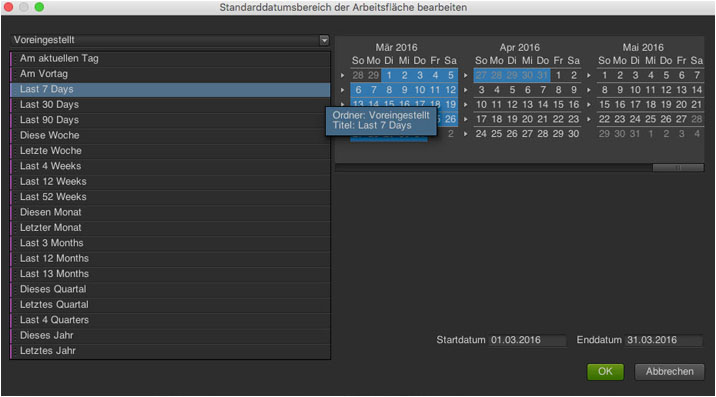

# Datumsbereiche und Datumsbereiche

Im Kalender können Sie Daten und Datumsbereiche festlegen oder eine Voreinstellung auswählen. Sie können Kalenderauswahlen auf Projekt-, Arbeitsbereich- und Berichtsebene treffen. Der Datumsbereich eines Projekts ist das Standarddatum. Allerdings wird der Projektdatumsbereich vom Datumsbereich des Arbeitsbereichs außer Kraft gesetzt. Auf ähnliche Weise setzt der Datumsbereich eines Berichts die Datumseinstellungen eines Arbeitsbereichs und eines Projekts außer Kraft. Sie können keinen Datumsbereich auswählen, der außerhalb Ihres Datenverfügbarkeitsbereichs liegt.

## Dates and date ranges {#concept_AB32765013F449908B5964AB622C75FF}

Im Kalender können Sie Daten und Datumsbereiche festlegen oder eine Voreinstellung auswählen. Sie können Kalenderauswahlen auf Projekt-, Arbeitsbereich- und Berichtsebene treffen. Der Datumsbereich eines Projekts ist das Standarddatum. Allerdings wird der Projektdatumsbereich vom Datumsbereich des Arbeitsbereichs außer Kraft gesetzt. Auf ähnliche Weise setzt der Datumsbereich eines Berichts die Datumseinstellungen eines Arbeitsbereichs und eines Projekts außer Kraft. Sie können keinen Datumsbereich auswählen, der außerhalb Ihres Datenverfügbarkeitsbereichs liegt.

 Eine aktivierte **[!UICONTROL Datum löschen]-Option zeigt an, dass ein Datumsbereich auf Berichtsebene festgelegt wird.**

Sie können auch Datumsangaben (und Zeitdimensionen) in den Bericht oder den [!UICONTROL Tabellenaufbau] ziehen. Sie können spezifische Tage, Wochen, Monate, Jahre oder ein rollierendes Datum auswählen. Wenn Sie den benutzerspezifischen Kalender in „Marketing Reports and Analytics“ nutzen, werden diese Einstellungen automatisch in die Report Suite übernommen und der Bericht wird entsprechend aktualisiert.

Wenn Sie bei der Erstellung eines Projekts einen Datumsbereich auswählen, stellen Sie mit „Vorkonfiguriert“ auf der linken Seite ein rollierendes Datum ein. Verwenden Sie dagegen den Kalender auf der rechten Seite, ist das nicht der Fall. Ob Ihr Datumsbereich rollierend ist, können Sie anhand des Textes „Dieser Datumsbereich rolliert“ erkennen, der neben der Schaltfläche **[!UICONTROL OK]angezeigt wird.**

>[!NOTE]
>
>Wenden Sie sich an Ihren Kundenbetreuer, wenn Sie Hilfe beim Ausführen von Berichten benötigen.

## Alte Datumsfenster {#concept_53AA34DB3CE647608CAF4B41D6EAF45E}

Im zweiten Halbjahr 2010 begann Adobe mit der Migration von Report Suites auf eine einheitliche Datenplattform für eine verbesserte Verarbeitung und Speicherung. Vor der Migration vorhandene Daten werden als veraltete (oder historische) Daten betrachtet, die durch ein Kalenderquartal oder eine Jahresgrenze beschränkt sind.

<!-- 

c_legacy_data.xml

 -->

** So greifen Sie auf historische Datumsfenster zu**

1. [Erstellen oder öffnen Sie ein Projekt.](../../analyze/ad-hoc-analysis/c-getting-started.md#task_918A4539134E4E62B00486DCB8D3D403)
1. Open the [calendar](../../analyze/ad-hoc-analysis/c-dates.md#concept_E8A2E36E595C45C785ECB724CA37FA47), then select **[!UICONTROL Quarter]** or **[!UICONTROL Year]**.

>[!NOTE]
>
>Historische Datumsfenster liegen in Quartals- und Jahresbeschränkungen. Sie können keine Daten anzeigen, die die Grenze zwischen alten Fenstern und der neuen Verarbeitungsplattform überschreiten. Bei Datumsbereichen, die beides umfassen, wird ein Fehler ausgegeben. Ferner gelten die Datumsbereiche nur für den Gregorianischen Kalender, nicht für den benutzerspezifischen Kalender.

