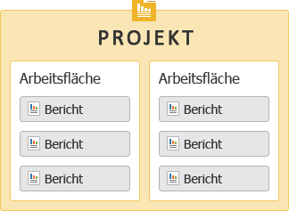
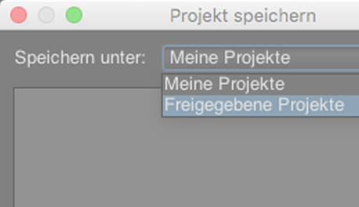

# Erste Schritte mit Ad Hoc Analysis {#concept_48936BA28FAE42DB81F1B2CD4726EB17}

>[!IMPORTANT]
>
>Die Adobe bringt Ad Hoc Analysis am 1. März 2021 zum Lebensende. [Weitere Infos](https://adobe.ly/discoverworkspace)

Sie können sofortige Analysen der Aktivitäten auf Ihrer Website auf höchstem technischen Niveau durchführen. Sie können mehrere Berichte gleichzeitig anzeigen und Segmente auf mehrere Dimensionen anwenden. Sie können die Daten aus einer Mikro- oder einer Makroperspektive analysieren, um ihre Auswirkungen auf wichtige Geschäftsmetriken zu ermitteln.

Mit diesen Funktionen können Sie Fragen zum Site-Traffic, zu den demografischen Angaben über Ihre Besucher, zum Umsatz und zu den Produktumschlägen beantworten. Sie sind dann in der Lage, Ihre Daten zu filtern, zu sortieren und zu segmentieren, um Antworten auf spezifische Fragen zu erhalten. Die Ergebnisse stehen in kürzester Zeit zur Verfügung, was es Ihnen ermöglicht, schnell die Auswirkungen einer Vielzahl von Faktoren zu analysieren.

<table id="table_C9C0444687FC418580F996E1D2ADB61A"> 
 <thead> 
  <tr> 
   <th colname="col1" class="entry"> Erste Schritte – Aufgaben </th> 
   <th colname="col2" class="entry"> Beschreibung </th> 
  </tr> 
 </thead>
 <tbody> 
  <tr> 
   <td colname="col1"> 
1. Melden Sie sich bei Adobe Analytics an. 
 </td> 
   <td colname="col2"> 
Gehen Sie zu <a href="https://experiencecloud.adobe.com"  >marketing.adobe.com</a> und melden Sie sich mit Ihren Adobe Analytics-Anmeldedaten an. 
 </td> 
  </tr> 
  <tr> 
   <td colname="col1"> 
2. Starten Sie Ad Hoc Analysis. 
 </td> 
   <td colname="col2">Klicken Sie auf Adobe Analytics &gt; Werkzeuge &gt; Ad Hoc Analysis und dann auf die Schaltfläche Ad Hoc Analysis starten. 
 
Hinweis: Wenn Sie auf dieser Seite die Schaltfläche <b>Ad Hoc Analysis starten</b> nicht sehen, stellen Sie sicher, dass Ihr Administrator Sie in den Admin Tools der Gruppe <i>Ad Hoc Analysis-Lizenzanwender</i> hinzugefügt hat. 
 
 </td> 
  </tr> 
  <tr> 
   <td colname="col1"> 
3. Erstellen Sie ein Projekt. 
 </td> 
   <td colname="col2"> 
Wählen Sie auf der Startseite eine Report Suite aus und klicken Sie auf Projekt erstellen. 
 
Siehe <a href="/help/analyze/ad-hoc-analysis/c-getting-started.md"   >Projekte und Workspaces</a>. 
 </td> 
  </tr> 
  <tr> 
   <td colname="col1"> 
4. Öffnen Sie einen Bericht. 
 </td> 
   <td colname="col2"> 
Suchen Sie über das Standard-Berichtmenü der Cloud nach einem Bericht. Sie können auch eine Vorlage auswählen. 
 
Siehe <a href="/help/analyze/ad-hoc-analysis/c-getting-started.md"   > Berichtsvorlagen</a>. 
 </td> 
  </tr> 
  <tr> 
   <td colname="col1"> 
5. Konfigurieren Sie den Bericht. 
 </td> 
   <td colname="col2"> 
Berichte können durch Ausführen bestimmter Aufgaben konfiguriert werden, z. B.: 
 
    <ul id="ul_0D2E8C614F2A4899A376BCEECEA374C6"> 
     <li id="li_FA925D52A8FD4DFAB0C88B797B24E72B"> Erstellen von Segmenten zur tiefergehenden Datenprüfung </li> 
     <li id="li_5E91632551D2473BA8BD0637CDC1A9F6"> Hinzufügen von Metriken, Dimensionen und Segmenten zum  <a href="/help/analyze/ad-hoc-analysis/c-tablebuilder.md"   > Tabellenaufbau</a> </li> 
     <li id="li_019316C9A94B4A8C8A77D07C04E50278">Konfigurieren von <a href="/help/analyze/ad-hoc-analysis/c-dates.md"   > Datumsbereichen</a> </li> 
     <li id="li_2B33B325D5EE420AB412B73AD1D231C5"> <a href="/help/analyze/ad-hoc-analysis/c-schedule.md"   > Planen</a> der Auslieferung von Berichten </li> 
    </ul> 
Durchsuchen Sie dieses Hilfesystem nach den benötigten Hilfethemen. 
 </td> 
  </tr> 
 </tbody> 
</table>

## Systemempfehlungen {#concept_6691331B45174290BD9B839806A9B52D}

Obwohl Berichte mit den meisten gängigen Webbrowsern angemessen funktionieren sollten, lassen sich die besten Ergebnisse bezüglich Gestaltung und Funktionsweise der Berichte auf Systemen erzielen, die gewisse Voraussetzungen erfüllen.

<!-- 

c_sys_reqs.xml

 -->

>[!NOTE]
>
>Ab Juli 2018 unterstützt Ad Hoc Analysis nur noch Java 8 oder höher. Adobe unterstützt nicht die Ausführung von Ad Hoc Analysis unter Java 7 oder niedriger.

* Videokarte, die OpenGL 2.0 unterstützt
* Cookies: Erforderlich
* Betriebssystem: Windows und Mac OS.
* Macromedia Flash Player: Version 6 oder neuer
* Monitorauflösung: 800 x 600 (1024 x 768 empfohlen)
* Farbtiefe: 16-Bit oder höher
* JavaScript: Aktiviert
* Java-Version:  Java 1.7 oder neuer  (Siehe obigen Hinweis)

   Wenn nicht die richtige Version von Java installiert ist, wird dies für Sie vorgenommen. Wenn Sie eine nicht kompatible Version von Java installiert haben, lädt Ad Hoc Analysis das Update herunter und fordert Sie zur Installation auf.

## Anweisungen zum Java-Upgrade  {#section_E4C0C6492FF24636A0FF71A59331111D}

Die JAR-Dateien von Adobe sind mit einer sicheren 256-Bit-Verschlüsselung signiert, die von älteren Java-Versionen als 1.7.0_76 nicht unterstützt wird. Dieses 256-Bit-Zertifikat verbessert die Sicherheit unserer Dienste für Sie.

Wenn auf Ihrem Rechner immer noch Java 7 installiert ist, müssen Sie vor dem Maintenance Release von Juli 2018 ein Upgrade durchführen. So geht’s:

* Wenn Sie zum Installieren von Programmen auf Ihrem Rechner berechtigt sind:

   1. Gehen Sie zu https://www.java.com.
   1. Klicken Sie auf **[!UICONTROL Java-Download]**.
   1. Klicken Sie auf **[!UICONTROL Einverstanden und mit Download beginnen]**.
   1. Installieren Sie die neueste Java-Version für Ihr Betriebssystem.

* Wenn Sie **nicht** zum Installieren von Programmen auf Ihrem Rechner berechtigt sind:

   1. Wenden Sie sich an Ihre IT-Abteilung, um die neueste Java-Version zu installieren.

## Ad Hoc Analysis starten {#concept_B1CE3C1E6D1A4311B9835BEB69812E55}

<!-- 

c_login.xml

 -->

Sie können sich über die [!DNL Experience Cloud] oder eine URL anmelden. Wenn Sie sich über „Reports and Analytics“ anmelden, erfolgt die Anmeldung automatisch. Die Anmeldung über eine URL ist nur dann erforderlich, wenn Sie von anderer Stelle auf die Ad Hoc Analysis-URL zugreifen, z. B. über einen Link oder von Ihrem Favoritenmenü aus.

## Über Experience Cloud anmelden {#task_128ED319F3AE49ED886EA3DFA8D0987F}

Schritte, die das Anmelden über [!DNL Experience Cloud] beschreiben.

<!-- 

t_login_suite.xml

 -->

1. Navigieren Sie in einem Browser zu [!DNL marketing.adobe.com].
1. Geben Sie den Firmennamen, Ihren Benutzernamen und Ihr Passwort ein und klicken Sie auf **[!UICONTROL Anmelden]**.
1. Klicken Sie auf **[!UICONTROL Adobe Analytics]** > **[!UICONTROL Werkzeuge]** > **[!UICONTROL Ad Hoc Analysis]**.

   Wenn Sie auf dieser Seite die Schaltfläche **Ad Hoc Analysis starten** nicht sehen, stellen Sie sicher, dass Ihr Administrator Sie in den Admin Tools der Gruppe *Ad Hoc Analysis-Lizenzanwender* hinzugefügt hat.
1. Klicken Sie auf **[!UICONTROL Ad Hoc Analysis starten]**.
1. Speichern Sie die [!DNL discover.jnlp] Datei lokal.

   Sie können diese gespeicherte Datei ausführen, wann immer Sie Ad Hoc Analysis starten möchten.

## Projekte und Workspaces {#concept_FAE346335B0347A192C6C806C775D72B}

Mit einem Projekt wird definiert, welcher Datensatz importiert wird. Hierzu gehören eine Report Suite und ein Datumsbereich. Ein Projekt besteht aus einer beliebigen Anzahl von Berichten mit sämtlichen dazugehörigen Metriken, Einstellungen, Dimensionen und Segmenten. Sie können ein neues Projekt starten, ein gespeichertes Projekt laden oder das automatisch gespeicherte Projekt laden.

<!-- 

c_projects.xml

 -->

Berichte können in einem *Arbeitsbereich* gruppiert werden. Ein Projekt kann mehrere Arbeitsbereiche enthalten, und ein Arbeitsbereich kann mehrere Berichte enthalten. Am besten stellt man sich diese Elemente als untereinander verschachtelt vor:

Sie können immer nur ein Projekt zur selben Zeit öffnen. Allerdings können Sie mehrere Arbeitsbereiche in einem Projekt geöffnet haben. In jedem Arbeitsbereich können Sie mehrere Berichte geöffnet haben.

Der Standarddatumsbereich für ein neues Projekt ist [!UICONTROL Letzte 90 Tage].

## Ein Projekt starten {#task_918A4539134E4E62B00486DCB8D3D403}

Schritte, die den Start eines Projekts beschreiben.

<!-- 

t_project_start.xml

 -->

1. Anmelden.
1. Öffnen Sie ein gespeichertes Projekt oder klicken Sie auf **[!UICONTROL Projekt erstellen]**.
1. Suchen Sie nach einem Bericht oder wählen Sie eine Vorlage aus.

## Einen kürzlich gespeicherten Workspace öffnen {#task_DE4A54180BC24E9DAEC98E2171DC6B40}

Schritte, die beschreiben, wie Sie kürzlich gespeicherte Arbeitsbereiche öffnen.

<!-- 

t_recent_workspace.xml

 -->

1. Klicken Sie auf **[!UICONTROL Datei]** > **[!UICONTROL Zuletzt verwendeter Workspace]**.

   Sie können bis zu fünf zuletzt verwendete Arbeitsbereiche öffnen. Die zuletzt verwendeten Arbeitsbereiche stehen nach Beenden Ihrer Sitzung nicht zur Verfügung.

## Projekte freigeben {#task_5911780D90164F3A8A677C8BC719750D}

Freigegebene Projekte stehen allen Benutzern von Ad Hoc Analysis im Unternehmen zur Verfügung.

<!-- 

t_share_projects.xml

 -->

1. Gehen Sie zu **[!UICONTROL Datei]** > **[!UICONTROL Speichern unter]**.
1. Wählen Sie in der Dropdown-Liste **[!UICONTROL Speichern unter:]** die Option **[!UICONTROL Freigegebene Projekte.]**

   

1. Klicken Sie zum Speichern des Projekts auf **[!UICONTROL Speichern]**.

   Freigegebene Projekte können über **[!UICONTROL Datei]** > **[!UICONTROL Öffnen]** > **[!UICONTROL Freigegebene Projekte]** geöffnet werden.

   >[!NOTE]
   >
   >Sie können Ihre eigenen freigegebenen Projekte löschen, indem Sie sie im Dialogfeld zum Freigeben von Projekten auswählen.

## Workspace umbenennen {#task_0DB177DD6DB54B7F9FE60A0B3FC7CFC3}

Schritte, die beschreiben, wie Sie einen Arbeitsbereich umbenennen können.

<!-- 

t_rename_workspace.xml

 -->

1. Klicken Sie mit der rechten Maustaste auf den Namen des Arbeitsbereichs.
1. Wählen Sie **[!UICONTROL Workspace umbenennen]** aus.
1. Geben Sie einen Namen ein, und klicken Sie dann auf **[!UICONTROL OK]**.

## Lokales Projekt öffnen {#task_1B3EF63A80C74776B24B99D80EAC74AC}

Schritte, die das Öffnen einer lokalen Kopie eines Projekts beschreiben.

<!-- 

t_open_local_project.xml

 -->

1. Klicken Sie auf **[!UICONTROL Datei]** > **[!UICONTROL Lokale Kopie öffnen]**.
1. Navigieren Sie zur lokalen [!DNL .dproj]-Datei, und klicken Sie dann auf **[!UICONTROL Öffnen]**.

## Berichtsvorlagen {#concept_370F674C5B4C45368731AA801C5A45F8}

Vorlagen sind Ausgangspunkte für die Art der Analyse, die Sie durchführen möchten. Eine Vorlage kann eine leere Arbeitsfläche (z. B. ein Rang- oder Fallout-Bericht) sein. Alternativ kann die Vorlage ein Bericht sein, dem Standardmetriken und -dimensionen zugrunde liegen.

<!-- 

c_templates.xml

 -->

Sie können Vorlagen aufrufen, wenn Sie ein Projekt erstellen (**[!UICONTROL Datei]** > **[!UICONTROL Neues Projekt]**) oder indem Sie einen Arbeitsbereich oder einen Bericht hinzufügen.

| Vorlage | Beschreibung |
|--- |--- |
| Rangansicht | Stellt eine leere Arbeitsfläche bereit, in der Sie eine Tabelle aufbauen können. So ordnet beispielsweise der Bericht „Seiten“ die Seiten Ihrer Website auf Grundlage des Datenverkehrs an, und in der Detailtabelle werden Prozentsätze und Zahlen für Metriken wie Seitenansichten und Umsatz angezeigt. |
| Trendansicht | Hiermit können Sie Trends zu Konversionen und Ereignissen während des Berichtzeitraums für eine ausgewählte Zeit-Granularität (Stunde, Tag, Woche, Monat, Quartal oder Jahr) untersuchen. |
| Gesamt | Ein Bericht für Führungskräfte, der Ergebniszahlen anzeigt. Er enthält Daten zu Gesamtumsatz, Seitenansichten und Bestellungen. |
| Fallout | Hiermit können Sie einen Trichter anlegen, in dem die Konversions- und Trichteranalyseraten zwischen Checkpoints angezeigt werden. So können Sie beispielsweise die Trichteranalysepunkte eines Besuchers während eines Kaufprozesses nachverfolgen. |
| Fluss | Zeigt die gängigsten Pfade, die Benutzer auf Seiten, Sitebereichen und Servern nehmen. |
| Konversionstrichter | Zeigt Konversionsprozentsätze zwischen spezifischen Metrikereignissen an. Sie können diesen Bericht nutzen, um sich einen Überblick über die Clickthroughs, die zu Verkäufen geführt haben, sowie über die Anzahl verkaufter Einheiten zu verschaffen. |
| Site-Analyse | Ein Tool zur dreidimensionalen Site-Pfaddarstellung, das zeigt, wie sich Benutzer durch festgelegte Seiten und Ereignisse bewegen. |
| Virtuelle Fokusgruppe | Greift stichprobenartig einen Besuch heraus und zeigt dazu umfassende Daten an. Anhand dieses Berichts können Sie Fokusgruppen aus Ihren Besuchern erstellen. |

## Einen Bericht öffnen {#task_0AC455CDA198497AA546622FB05F300D}

Sie können einen Bericht oder eine Vorlage beim Anlegen eines Projekts oder aus einem bestehenden Projekt heraus öffnen. Verwenden Sie eine Vorlage, um einen Bericht von Grund auf zu konfigurieren.

<!-- 

t_reports_opening.xml

 -->

Es gibt mehrere Methoden, einen Bericht zu öffnen:

* Suchen Sie auf der Seite [!UICONTROL Neuer Bericht] nach einem Bericht oder wählen Sie eine Vorlage aus.
* Klicken Sie im Menü auf **[!UICONTROL Berichte]** und wählen Sie einen Bericht oder eine Berichtsvorlage aus.
* Einen Bericht aus einer Dimension starten: Klicken Sie mit der rechten Maustaste auf einen Dimensionsnamen und wählen Sie **[!UICONTROL Bericht ausführen]** >  **`report name`**.
