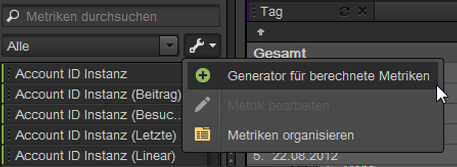

# Metriken

Metriken sind quantitative Informationen über Besucheraktivitäten wie Ansichten, Clickthroughs, Neuladungen, durchschnittliche Besuchszeit, Datum, Einheiten, Bestellungen, Umsatz usw. Metriken und die damit verbundenen Daten werden in den Spalten von Berichten angezeigt.

## Metriken {#concept_46A67930CFDB4A078225C5B189688AF3}

Metriken sind quantitative Informationen über Besucheraktivitäten wie Ansichten, Clickthroughs, Neuladungen, durchschnittliche Besuchszeit, Datum, Einheiten, Bestellungen, Umsatz usw. Metriken und die damit verbundenen Daten werden in den Spalten von Berichten angezeigt.

Zu den Standardmetriken zählen:

* **Traffic**: Zeigt Daten zum Besuchervolumen an.
* **Konversion**: Zeigt Daten zu Erfolgsereignissen auf Ihrer Website. Erfolgsereignisse sind unter anderem Einkäufe, Downloads oder andere Aktionen, die Benutzer auf Ihrer Website ausführen sollen.
* **Errechnet**: Benutzerspezifische Metriken, die durch Kombination anderer Metriken erstellt werden. Sie könnten z. B. eine Metrik erstellen, die die Kosten des Keyword und die Fertigungskosten vom Umsatz subtrahiert und so den Nettoumsatz berechnet. Sie könnten diesen Betrag dann durch die Gesamtanzahl der Bestellungen dividieren, um den Nettoumsatz pro Bestellung zu erhalten.

Informationen zur Verwendung von Metriken in [!DNL Experience Cloud] finden Sie unter [Metrikdefinitionen](https://docs.adobe.com/content/help/en/analytics/components/variables/metrics/metricslist.html) in der *Analysereferenz*.

You can use the [!UICONTROL Organize Metrics] tool to create new folders for your metrics. Sie können Metriken dann beliebig gruppieren. Mit dem Organizer können Sie vorhandene Metriken per Drag-and-Drop in Ihre benutzerspezifischen Ordner kopieren.

Während Sie Ordner erstellen, sie benennen und Metriken beliebig in ihnen organisieren können, können Sie die Standardordner nicht ändern (Ausnahme: Ordner Favoriten und Berechnete Metriken).

## Metriken organisieren {#task_17C844A9387042EAA9983E1E554846B1}

Schritte, die das Organisieren von Metriken und Erstellen von Metrikordnern beschreiben.

<!-- 

t_organize_metrics.xml

 -->

1. Klicken Sie im [!UICONTROL Metrics] Tool-Bereich auf **[!UICONTROL More Actions]**. ( 

   )
1. Klicken Sie auf **[!UICONTROL Organize Metrics]**.
1. Click **[!UICONTROL New]** to create a folder.
1. Wählen Sie die Metriken in anderen Ordnern aus, und ziehen Sie die ausgewählten Metriken in den neuen Ordner.
1. Klicken Sie auf **[!UICONTROL OK]**.

   >[!NOTE]
   >
   >Wenn Sie einen Ordner löschen, werden alle Metriken im Ordner aus Ihrem aktuell ausgewählten Projekt gelöscht.

## Metriken zu einem Bericht hinzufügen {#task_747DD1718B3F4776B83A115D0BE8754C}

Schritte, die das Hinzufügen von Metriken zu einem Bericht beschreiben.

<!-- 

t_add_metrics_dsc.xml

 -->

1. In the [!UICONTROL Metrics] tool pane, locate the metric.

   Sie können Metriken über das Suchfeld oder ein Drilldown im Metrikordner suchen.

1. Drag the metric to the report table or [!UICONTROL Table Builder].

   You may want to specify default metrics in [!UICONTROL Settings] in advance, if you want to reduce the need to repeatedly add metrics to a report.

   See [Ranked Tab - Definitions](/help/analyze/ad-hoc-analysis/c-global-settings.md#reference_FB9BADD7E3DA42C1BB2A02A6E9D5C1CF).

## Aufbau berechneter Metriken {#concept_F8E213CE786A43FB93847C5BA883A29C}

Die Funktion „Aufbau berechneter Metriken“ in Ad Hoc Analysis ist jetzt in die einheitlichen berechneten Metriken von Analytics eingebunden. Die Benutzeroberfläche ist der Funktion „Aufbau berechneter Metriken“ in Analytics ähnlich.

<!-- 

c_calc_metric_builder.xml

 -->

Weitere Informationen zum Aufbau und zur Verwaltung berechneter Metriken finden Sie im [Leitfaden zu berechneten Metriken](https://docs.adobe.com/content/help/de-DE/analytics/components/calculated-metrics/cm-overview.html).

So rufen Sie die Funktion „Aufbau berechneter Metriken“ in Ad Hoc Analysis auf:

1. Klicken Sie im [!UICONTROL Metrics] Bereich auf **[!UICONTROL More Options]** und dann **[!UICONTROL Calculated Metrics Builder]**.

   

1. In der Benutzeroberfläche „Aufbau berechneter Metriken“ können Sie Metriken, Segmente und Funktionen durch Drag &amp; Drop hinzufügen, um individuelle Metriken zu erstellen:

   

