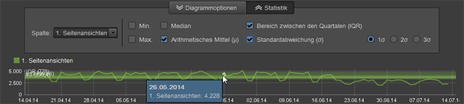

# Berichtübersicht

>[!IMPORTANT]
>
>Die Adobe bringt Ad Hoc Analysis am 1. März 2021 in den Status als lebensbedrohlich. [Weitere Infos...](https://adobe.ly/discoverworkspace).

Standardberichte zeigen Daten zur Website- und Besucheraktivität, zu Trafficmustern, Verweisdaten, Werbekampagnen, Besucherbindung, Produktdaten und mehr an. Sie können Berichte ausführen und dann Tools aufrufen, um Segmente, Metriken und Berichtvergleiche zu konfigurieren.

## Berichtübersicht {#concept_41459A705F2048EEA4EFA80F6BD9FFAB}

Standardberichte zeigen Daten zur Website- und Besucheraktivität, zu Trafficmustern, Verweisdaten, Werbekampagnen, Besucherbindung, Produktdaten und mehr an. Sie können Berichte ausführen und dann Tools aufrufen, um Segmente, Metriken und Berichtvergleiche zu konfigurieren.

Sie können benutzerspezifische Daten erfassen, um Berichte zu erstellen, die spezifisch Ihre Website behandeln. Wenn Sie z. B. eine Suchfunktion auf Ihrer Website haben, können Sie die eingegebenen Suchbegriffe verfolgen und einen Bericht erstellen, der Ihnen diese Begriffe und die Suchergebnisse anzeigt.

Der Standard-Berichtsatz umfasst Themen, die jeder Website gemein sind. Dazu zählen (jedoch nicht ausschließlich):

* Website-Daten
* Besucherdaten
* Traffic-Muster
* Daten zu verweisenden Stellen
* Werbekampagnen
* Besuchertreue
* Produktinformationen

Wenn Sie „Marketing Reports and Analytics“ verwenden, werden Ihnen die Berichtstypen und Menüs vertraut sein. Ad Hoc Analysis kategorisiert Berichte auf Grundlage der folgenden Typen:

**Zusammenfassungsberichte**

Enthält Berichte wie den [!UICONTROL Summenbericht], der Daten zur schnellen Übersicht anzeigt. Diese wurden für Führungskräfte konzipiert, die sich einen allgemeinen Überblick über die Daten verschaffen möchten.

**Konversionsberichte**

Konversionsberichte liefern eine umfassende, genaue und detaillierte Analyse der Kundenaktivität. Die Metriken Kampagnenverwaltung, Verkaufszyklus, Kundenabgang und Kundenkonversion dienen der Messung von E-Commerce-Transaktionen, Verkaufsquellen, Werbungswirksamkeit, Kundenloyalität und vielem mehr.

**Traffic-Berichte**

Traffic-Berichte verschaffen Ihnen einen umfassenden Einblick in die Interaktion der Besucher mit Ihrer Website.

* kritische Aspekte des Besucherverhaltens analysieren.
* Verkehrsmuster beobachten und verstehen.
* bevorzugte Site-Inhalte bestimmen.
* Besucher nach beliebigen messbaren Kriterien segmentieren.

## Kampagnen {#concept_A407CDF1D4AA49BAB396A1666E67FC87}

Zeigt Informationen über die Effektivität Ihrer Werbemaßnahmen an. Sie können feststellen, welche Arten von Werbemaßnahmen den meisten Traffic generieren und welcher Mitarbeiter für die jeweilige Werbemaßnahme verantwortlich ist.

<!-- 

c_reports_campaigns.xml

 -->

Diese Berichte werden in der Regel benutzerspezifisch angepasst und unterscheiden sich daher für jeden Analysten. See the [Admin Console help](https://helpx.adobe.com/de/enterprise/using/admin-console.html) for more information.

## Statistische Berechnungen {#concept_83FF70DB7895435E985699FE9012D585}

Sie können einstellen, welche Standardstatistiken in einem Rangbericht angezeigt werden sollen.

<!-- 

c_Statistical_Calculation_ad_hoc.xml

 -->

Rangberichte können um weitere Standardstatistiken ergänzt werden, die beim Ausführen des Berichts angezeigt werden, z. B. arithmetisches Mittel, Mittelwert, Standardabweichung und andere mathematische Berechnungen, die basierend auf Ihren persönlichen Berichtsanforderungen aus den Daten erstellt werden können.

**So öffnen Sie die Statistikberechnungen für Rangberichte:**

1. Wählen Sie im Menü **[!UICONTROL Werkzeuge]** > **[!UICONTROL Rangansicht]**.

1. Wählen Sie **[!UICONTROL Einstellungen]**.
1. Wählen Sie **[!UICONTROL Standardstatistik]**.

**[!UICONTROL Nullen in statistischen Berechnungen sind zu ignorieren]**. Wählen Sie diese Option aus, um Nullen zu ignorieren und damit durch das Hinzufügen einer weiteren Metrik die bereits berechneten Durchschnittswerte nicht verändert werden. Diese Einstellung wirkt sich auf alle Statistiken aus (aber nicht auf die Summe).

| Berechnung | Beschreibung |
|--- |--- |
| Max. | Der Maximalwert aller Zeilen in einem bestimmten Datensatz. |
| Min | Der Minimalwert aller Zeilen in einem bestimmten Datensatz. |
| Summe | Die Summe aller Werte für jede einzelne Zeile des Datensatzes.  Bei der Summe werden z. B. alle Besuche eines Besuchers zusammengefasst, anstatt den Besucher (unabhängig von der Zahl seiner Besuche) nur einmal zu erfassen. Dieser Wert ist der umfassende Gesamtwert der erfassten Datenpunkte. |
| Mittel | Dieser Mittelwert ist der arithmetische Durchschnittwert der Zeilen eines Datensatzes und wird durch Division der Summe durch die Anzahl ermittelt. Im Gegensatz zum Mittelwert, der im Allgemeinen bei ungleichmäßigen Verteilungen eingesetzt wird, wird das arithmetische Mittel durch Ausreißer stark beeinflusst. |
| Standardabweichung | Dieser Wert gibt die Abweichung vom erwarteten arithmetischen Mittelwert an. Je geringer die Abweichung, desto näher liegen die Datenpunkte am Mittel. Eine hohe Abweichung bedeutet, dass die Datenpunkte über einen großen Wertebereich verteilt sind. |
| Median | Der numerische Wert, der in den Zeilen des Datensatzes die höhere Datenhälfte von der niedrigeren Datenhälfte trennt. Anders als das arithmetische Mittel wird der Mittelwert genutzt, um Ausreißer zu vermeiden. |
| Quartile | Ein Quartil ist eine Gruppe von Werten in einem Datensatz, die durch drei Punkte definiert wird, welche den Datensatz in vier gleichgroße Datengruppen teilen, die jeweils ein Viertel des Datensatzes ausmachen. Das erste Quartil ist das 25. Perzentil, das dritte Quartil ist das 75. Perzentil. (Das zweite Quartil ist das arithmetische Mittel, das vierte Quartil ist die Summe.) |
| Anzahl | Anzahl der Reihen in einem Datensatz. |

## Beispiel der Berechnung arithmetisches Mittel vs. Metrik insgesamt  {#section_7C49196503964FB0A429FA347BC92D09}

Das arithmetische Mittel wird ähnlich wie bei Spalten in Microsoft Excel berechnet. Das bedeutet, dass das **arithmetische Mittel** eines Verhältnisses (z. B. beim Bestimmen der durchschnittlichen Absprungrate) dem Durchschnitt der Verhältnisse und nicht dem Verhältnis der Durchschnitte entspricht. Das Verhältnis der Durchschnitte umfasst den **Gesamtwert** der Absprungraten-Metrik.

<table id="table_9EC56B15C6A340DA8917CB0DBCAC2355"> 
 <thead> 
  <tr> 
   <th colname="col1" align="center" class="entry"> Datum </th> 
   <th colname="col2" align="center" class="entry"> Einmalige Besuche </th> 
   <th colname="col3" align="center" class="entry"> Einträge </th> 
   <th colname="col4" align="center" class="entry"> Absprungrate </th> 
   <th colname="col5" align="center" class="entry"> </th> 
  </tr>
 </thead>
 <tbody> 
  <tr valign="top"> 
   <td colname="col1"> 
Juni 2013 
 
2013. Juli 
 
August 2013 
 </td> 
   <td colname="col2" align="center"> 
344 
 
297 
 
41 
 </td> 
   <td colname="col3" align="center"> 
1000 
 
1000 
 
1000 
 </td> 
   <td colname="col4" align="center"> 
34,4 % 
 
29,7 % 
 
41,0 % 
 </td> 
   <td colname="col5"> </td> 
  </tr> 
  <tr valign="top"> 
   <td colname="col1" align="center" valign="middle"><b>Mittel</b> </td> 
   <td colname="col2" valign="middle"> (344+297+41)/3 </td> 
   <td colname="col3" valign="middle"> (1000+1000+100)/3 </td> 
   <td colname="col4" valign="middle" align="right"> (34,4 + 29,7 + 41,0)/3 = <b>35,0</b> % </td> 
   <td colname="col5" valign="middle"><b>Arithmetisches Mittel der Verhältnisse</b> </td> 
  </tr> 
  <tr valign="top"> 
   <td colname="col1" align="center" valign="middle"><b>Metrik insgesamt</b> </td> 
   <td colname="col2" valign="middle"> 682 </td> 
   <td colname="col3" valign="middle"> 2100 </td> 
   <td colname="col4" valign="middle" align="right"> 682/2100 = <b>32,0</b> % </td> 
   <td colname="col5" valign="middle"><b>Verhältnis der arithmetischen Mittelwerte</b> </td> 
  </tr> 
 </tbody> 
</table>

## Überlagerungen für statistische Berechnungen {#concept_97E1B32DAC734C7B9F8899717283CEEC}

Die Ad Hoc Analysis bieten nun Überlagerungsvisualisierungen für statistische Berechnungen, die Daten über einen bestimmten Zeitraum (Minuten, Stunde, Tage, Wochen) anzeigen.

<!-- 

c_overlay_calculations.xml

 -->

In einem Bericht, der Zeitdaten darstellt, können Sie über die Schaltfläche **[!UICONTROL Statistiken]** Berechnungen auswählen, die als Überlagerung über der Zeitleiste des Berichts angezeigt werden.

Erweiterung der Standardfunktionen  [Statistische Berechnungen](/help/analyze/ad-hoc-analysis/c-overview-standard-reports.md#concept_83FF70DB7895435E985699FE9012D585): Sie können die 1., 2. und 3. Standardabweichung der Überlagerungen auswählen.

## Gruppen-Manager {#concept_E1433974A61144858E87334C006982B2}

Statt eine einzelne Seite in einem Bericht zu verwenden, können Sie mehrere Seiten gruppieren und sie als Kategorien für Start-, Zwischen- oder Endpunkte im Bericht [!UICONTROL Fallout] und [!UICONTROL Site-Analyse] verwenden. Sie können Gruppen vom Hauptmenü aus oder innerhalb des Berichts bearbeiten. Von Ihnen in „Marketing Reports and Analytics“ erstellte Kategorien erscheinen ebenfalls in der [!UICONTROL Checkpoint-Auswahl].

<!-- 

c_groups.xml

 -->

Klicken Sie auf **[!UICONTROL Tools]** > **[!UICONTROL Gruppen-Manager]**.
