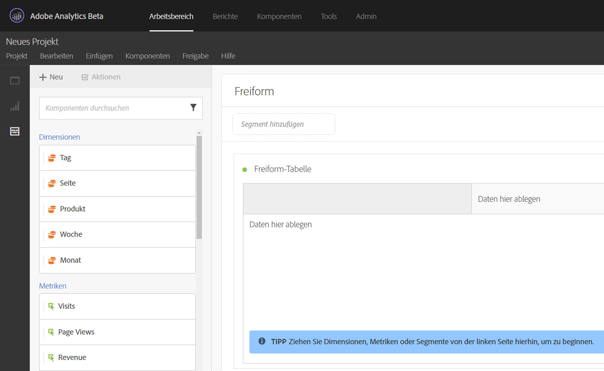
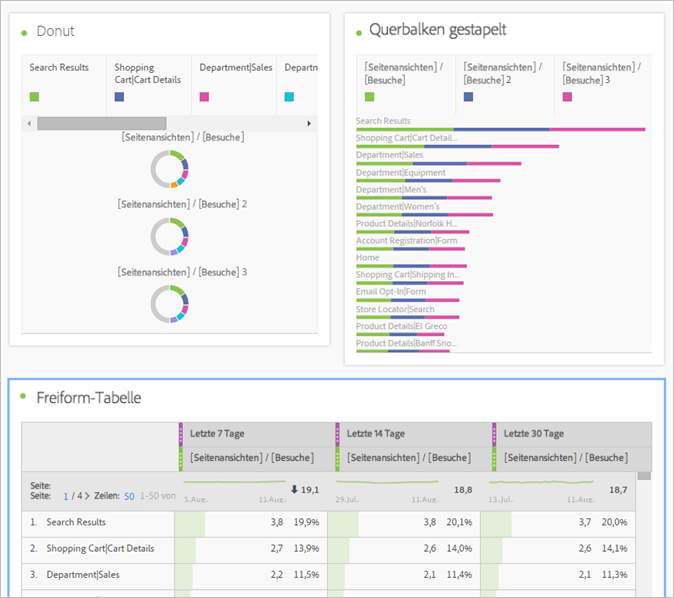
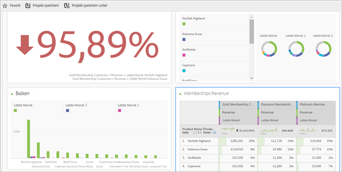
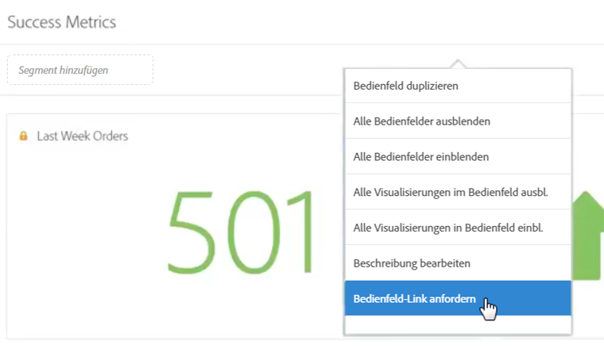
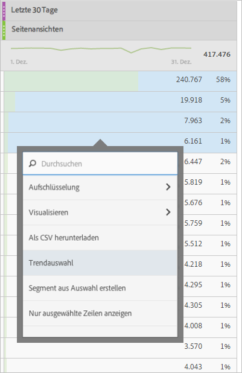
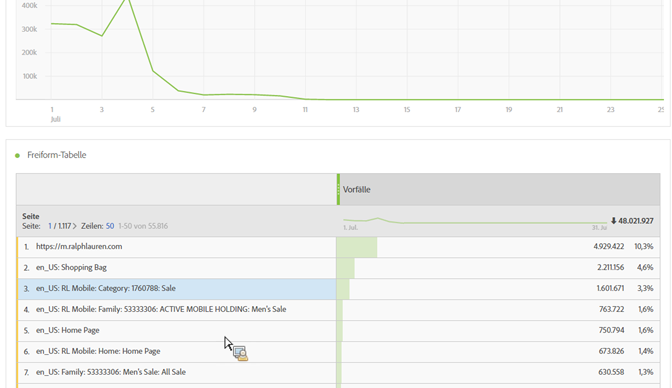
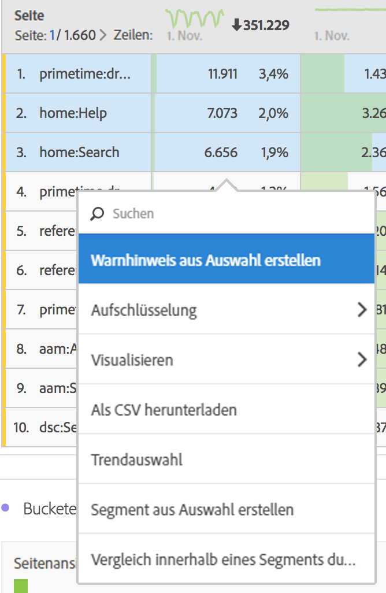
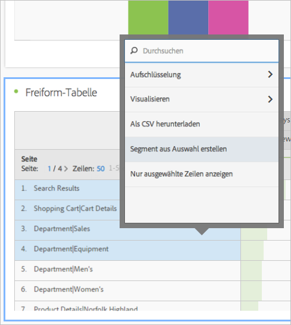
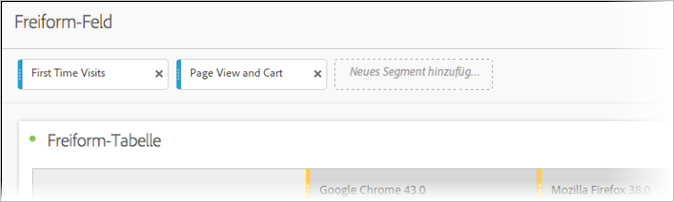

# Übersicht über den Analysis Workspace

Im Analysis Workspace entfallen alle normalen Einschränkungen eines einzelnen Analytics-Berichts. Sie erhalten eine stabile und flexible Arbeitsfläche, in der Sie benutzerdefinierte Analyseprojekte erstellen können. Ziehen Sie per Drag &amp; Drop eine beliebige Anzahl von Datentabellen, Visualisierungen und Komponenten (Dimensionen, Metriken, Segmente und Zeitgranularitäten) in ein Projekt. Erstellen Sie im Handumdrehen Aufschlüsselungen und Segmente, Kohorten für die Analyse sowie Warnhinweise und vergleichen Sie Segmente miteinander, führen Sie Fluss- sowie Fallout-Analysen durch und kuratieren und planen Sie Berichte für die Freigabe für andere in Ihrem Unternehmen.

**[!UICONTROL Analytics]** &gt; **[!UICONTROL Arbeitsbereich]**

## Overview video {#section_B99BF8A326D94ECB91BD69C9888AD10C}

>[!VIDEO](https://www.youtube.com/watch?v=IHOy-QsvVcA)

Eine vollständige YouTube-Playlist ist [hier](https://www.youtube.com/playlist?list=PL2tCx83mn7GuNnQdYGOtlyCu0V5mEZ8sS) verfügbar.

>[!NOTE]
>
>See [What's New in Analysis Workspace](../../analyze/analysis-workspace/new-features-in-analysis-workspace.md#concept_EDB651D6F41E4F7BB4EB5E1EBB95D195) for updates about features.

## Full control over project elements and components {#section_B7E3EDA3EDEE407D833F4FDB69646EEC}

Der Analysis Workspace ermöglicht Unabhängigkeit und Flexibilität:

* Drag &amp; Drop von Komponenten (Dimensionen, Metriken, Segmente und Zeitgranularitäten)
* Drag &amp; Drop von mehreren Visualisierungen in das Projekt
* Visualisierungen lassen sich in einem Projekt jederzeit verschieben, in der Größe verändern und stapeln

Weitere Informationen finden Sie unter [Für weitere Informationen erstellen Sie ein Projekt in Analysis Workspace](../../analyze/analysis-workspace/build-workspace-project/t-freeform-project.md#task_C2C698ACC7954062A28E4784911E6CF2).

## Multiple visualizations in a project {#section_B7670740C2D44130B21DAF0873280DA5}

Erstellen Sie per Drag &amp; Drop beliebig viele Visualisierungen in einem Projekt.

Erstellen Sie ein Projekt, das den Prozentsatz der Veränderung zeigt, mit mehreren Visualisierungen, die den Zellen in einer Freiform-Datentabelle entsprechen.

See [Create an Analysis Workspace project](../../analyze/analysis-workspace/build-workspace-project/t-freeform-project.md#task_C2C698ACC7954062A28E4784911E6CF2) for more information.

## Intra-linking to panels and visualizations {#section_253EA04E067F4A29A8B54CE2B7631086}

In conjunction with the [rich text editing](../../analyze/analysis-workspace/visualizations/text.md#concept_2315D97E27364E3194AC1C459B654B2F) capabilities of Analysis Workspace, you can link down to specific panels and visualizations within a project from a text box, such as to create a project's table of contents. Sie können diese Verknüpfungen dann wie eine Projektverknüpfung freigeben, um eine Person an eine bestimmte Visualisierung oder einen Bereich innerhalb eines Projekts weiterzuleiten. Die neuen Rechtsklickoptionen „Bereichslink abrufen“ und „Visualisierungslink abrufen“ wurden hinzugefügt. So fügen Sie Intra-Linking zu Ihrem Projekt hinzu:

1. Ziehen Sie eine Textvisualisierung in ein Projekt, z. B. neben eine Visualisierung oder Tabelle, für die Kontext erforderlich ist.
1. Füllen Sie das Textfeld z. B. mit einem Inhaltsverzeichnis und markieren Sie dann ein Element, das Sie mit einem Bereich oder einer Visualisierung verknüpfen möchten, z. B. Erfolgsmetriken.

   

1. Scrollen Sie zu diesem Bereich bzw. zu dieser Visualisierung und klicken Sie mit der rechten Maustaste auf den Header des Bereichs.
1. Scroll down and select **[!UICONTROL Get Panel Link]** or **[!UICONTROL Get Visualization Link]**:

   

1. Kopieren Sie diesen Link und fügen Sie ihn zum Erfolgsmetrik-Hyperlink in der Textvisualisierung hinzu. Klicken Sie auf das Häkchen, um den Text zu speichern.

Wenn Bereiche oder Visualisierungen innerhalb Ihres Projekts ausgeblendet sind, können Sie diese durch Klicken auf einen Link einblenden, um sie für Benutzer sichtbar zu machen.

>[!NOTE]
>
>You can also use this feature within the **[!UICONTROL Edit Description]** right-click option.

## Link to other projects {#section_AE886C367C3E4F189B65B1BD9BCDBD8C}

You can link users to other projects that may be of interest to them by going to  **[!UICONTROL Share]** &gt; **[!UICONTROL Get Project Link]** and embedding this link in project descriptions, for example.

## Dynamic visualization of selected cells {#section_182CEC285E4547EBA4608D5F70C9D5D7}

Wenn Sie einzelne Zellen auswählen, wird die Visualisierung dynamisch geändert. [Synchronisieren und sperren](../../analyze/analysis-workspace/analysis-workspace-features.md#section_9D66A001586F49CEB0C565581E44957C) Sie eine Visualisierung an ausgewählten Zellen.

## Lock selected items or positions {#section_9D66A001586F49CEB0C565581E44957C}

Durch das Sperren von Visualisierungen können Sie steuern, welche Freiform-Datentabellenquellen den Visualisierungen entsprechen.

See [Manage data sources](../../analyze/analysis-workspace/visualizations/t-sync-visualization.md#task_A73B065DC3834AFCA422E364A1468099).

## Trend visualizations from selected cells {#section_34930C967C104C2B9092BA8DCF2BF81A}

Erstellen Sie eine Visualisierung aus ausgewählten Zellen. (Rechtsklick &gt; **[!UICONTROL Trendauswahl]**.)

Trendauswahlen werden jetzt mit der Tabelle darunter **verknüpft**. Wenn Sie daher in der Tabelle eine andere Zeile auswählen, bezieht sich das Trenddiagramm auf diese Zeile.

## Dimensions and dimension item breakdowns {#section_1380C1F9E51E4BFB8C5D35E7A53BC70D}

Als Händler erhalten Sie tiefere Einblicke in Ihre Kampagnen, als Sie je hatten, und verstehen so, wie Sie Ihre Kunden binden können. Sie können Ihre Daten für Ihre spezifischen Anforderungen unbegrenzt aufschlüsseln. Erstellen Sie Abfragen mithilfe relevanter Metriken, Dimensionen, Segmente, Zeitachsen und anderer Aufschlüsselungswerte für die Analyse.

See [Break down dimensions](../../analyze/analysis-workspace/components/dimensions/t-breakdown-fa.md#task_B594DA2476E84DFDA8279E831F0BD9C4).

## Segments from table selections {#section_73BC3688089B426D969B3D5B606DA970}

Wählen Sie Zellen in der Freiform-Tabelle aus und erstellen Sie aus der Auswahl ein Segment.

Vergleichen Sie mehrere Segmente und erstellen Sie direkt Segmente, die Sie anwenden. Sie können mehrere Segmente anwenden, um den Fokus auf bestimmte Kunden zu legen, die aufgrund von Verhalten und Interaktion ausgewählt werden, und diese dann vergleichen und gegenüberstellen.

Ziehen Sie ein Segment auf der Projektebene auf den Freiformbereich, damit das Segment auf das gesamte Projekt angewendet wird.

Weitere Informationen finden Sie unter      [Segmente](../../analyze/analysis-workspace/components/t-freeform-project-segment.md#task_11C6A2C7717B48049E5750B9D20FEC80).

## Project and component tagging {#section_F54D688132A541F2982326D5E022B90D}

Im Analysis Workspace können Sie Tags auf Projekte und Komponenten anwenden:

* Anwenden oder Erstellen von Tags auf Projektebene im Informationsbereich (

* Rechtsklick auf Komponenten zum Taggen (oder Erstellen von Tags) im Komponentenbereich
* Suchen von Tags durch Eingabe von „#“ im Suchfeld

## Component actions {#section_CBF4D0A5F63E4B0883077B8D852B800B}

Aktionen auf Komponentenebene führen Sie über das Menü „Aktionen“ durch, das sich oben in der linken Leiste von „Komponenten befindet“. Wählen Sie eine Komponente aus, und klicken Sie auf **[!UICONTROL Aktionen], um die Aktionen anzuzeigen.**

| Komponentenaktion | Beschreibung |
|--- |--- |
| Tag | Organisieren oder verwalten Sie Komponenten, indem Sie Tags darauf anwenden. Dies wird dann bei der jeweiligen Komponentenverwaltung angezeigt, beispielsweise Analysen &gt; Komponenten &gt; Segmente oder Analysen &gt; Komponenten &gt; Projekte. |
| Favorit | Fügen Sie die Komponente Ihrer Favoritenliste hinzu. Dies wird dann bei der jeweiligen Komponentenverwaltung angezeigt, beispielsweise Analysen &gt; Komponenten &gt; Segmente oder Analysen &gt; Komponenten &gt; Projekte  . |
| Genehmigen | Genehmigen Sie die Komponente, um sie zu autorisieren. Dies wird dann bei der jeweiligen Komponentenverwaltung angezeigt, beispielsweise Analysen &gt; Komponenten &gt; Segmente oder Analysen &gt; Komponenten &gt; Projekte. |
| Freigabe | Gilt nur für Segmente. |
| Löschen | Gilt nur für Segmente. |

Weitere Informationen zu diesem Thema finden Sie unter [Visualisierungen](../../analyze/analysis-workspace/visualizations/freeform-analysis-visualizations.md#concept_09242627629147A88A68F1506954C276).

## Additional feature descriptions {#section_5F06AE43C0194CFDBCA7EE0EA3C30B05}

**Was Sie ziehen und stapeln können**

Komponenten

* Dimensionen
* Segmente
* Metriken
* Datumsbereiche
* Zeitgranularitäten (Stunde, Tag, Woche usw.).

**Mehrere Freiform-Tabellen und mehrere Visualisierungen**

Es gibt keine technische Einschränkung für die Anzahl der Freiform-Tabellen und Visualisierungen, die Sie zum Bereich hinzufügen können. Sie können auch eine neue Visualisierung (oder einen Export in eine CSV-Datei) der einzelnen Freiform-Tabellen oder ausgewählten Zeilen einer Tabelle ausführen.

**Anordnen, Sortieren und Kopieren von Spalten**

* Sortieren der vordefinierten Datumsbereiche (ohne benutzerdefinierte Datumsbereiche)
* STRG (oder Command) + Klick + Ziehen einer Spalte kopiert die Spalte. Wenn Sie die Kopie ziehen, wird sie an der neuen Position in die Tabelle eingefügt.

See [Hotkeys Available in Analysis Workspace](../../analyze/analysis-workspace/build-workspace-project/fa-shortcut-keys.md#concept_9A6356084DBC4D468E265E7A65B3E051) for more information.

**Auswahlen und Aktionen**

Sie können Zeilen und Spalten ähnlich wie in Excel auswählen. Anschließend können Sie auf diesen Auswahlen Aktionen ausführen. Beispiel:

* Erstellen Sie Visualisierungen aus Auswahlen
* Kopieren Sie diese in die Zwischenablage (STRG + C oder Command + C)
* Schlüsseln Sie mehrere ausgewählte Zeilen auf. Wählen Sie die Zeilen aus und ziehen Sie dann eine Dimension auf die Auswahl. Oder klicken Sie mit der rechten Maustaste auf die Auswahl und verwenden Sie das Aufschlüsselungsmenü.

**Automatisches Speichern und nicht gespeicherte Änderungen**

Wenn Sie versuchen, den Browser zu schließen (oder die Zurück-Schaltfläche zu verwenden) und das Projekt noch nicht gespeichert wurde, werden Sie aufgefordert, Ihre Änderungen zu speichern. Wenn Ihr System abstürzt, erhalten Sie beim nächsten Laden des Projekts einen Warnhinweis, um den vorherigen Projektzustand wiederherzustellen.

Bereits bestehende (nicht neue) Projekte werden nur automatisch gespeichert, wenn der Browser abstürzt oder Sie aus einem anderen Grund keine Möglichkeit hatten, sie zu speichern.

**„Alle Besuche“**

Ein spezifisches Standardsegment des Analysis Workspace. *`All Visits`* zeigt die Summen für die Komponenten, die Sie zur Tabelle hinzufügen, an.

**Berechnete Metriken**

Verwenden Sie Berechnungen so, wie Sie Standardmetriken verwenden.

Siehe [Berechnete Metriken](https://marketing.adobe.com/resources/help/en_US/analytics/calcmetrics/).
