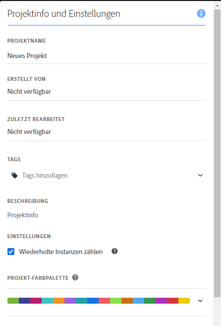
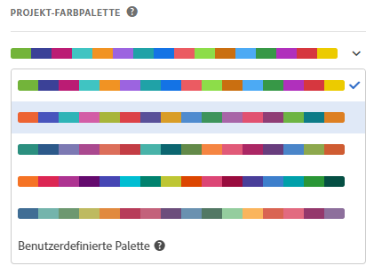

# Visualisierungsfarbpaletten

Sie können die in Workspace verwendete Visualisierungsfarbpalette ändern, indem Sie eine andere Farbpalette auswählen oder Ihre eigene Palette festlegen, die den Markenfarben Ihres Unternehmens entsprechen könnte. Diese Funktion wirkt sich auf die meisten Visualisierungen in Workspace aus. Die Zusammenfassungsänderung, die bedingte Formatierung in Freiformtabellen und die Zuordnungsvisualisierung sind davon jedoch **nicht** betroffen.

>[!NOTE]
>
>Die Farbpalettenunterstützung ist für Internet Explorer 11 nicht aktiviert.

Bitte beachten Sie:

* Es stehen fünf voreingestellte Farbpaletten zur Auswahl. Die Standardpalette und die unten stehende wurden für optimalen Kontrast optimiert und sind für Farbenblindheit besser zugänglich.
* Die dritte bis fünfte Farbpalette unter den ersten beiden wurden auf Farbharmonie optimiert.

## So ändern Sie Ihre Farbpalette:

1. Navigieren Sie zu **[!UICONTROL Workspace]** > **[!UICONTROL Projekt]** > **[!UICONTROL Projektinfo und Einstellungen]**.
1. Aus der Dropdown-Liste **[!UICONTROL Projekt-Farbenpalette]** können Sie eines von fünf voreingestellten Farbschemata auswählen.

   

1. Um Ihre eigene Palette festzulegen, wählen Sie **[!UICONTROL Benutzerdefinierte Palette]** unter den voreingestellten Optionen aus.
1. Geben Sie bis zu 16 kommagetrennte hexadezimale Werte (z. B. #00a4e4) für die Farben an, die Sie verwenden möchten. Wenn Sie beispielsweise nur vier Werte verwenden möchten, werden diese Farben in Visualisierungen, die mehr Farben enthalten, automatisch wiederholt.

