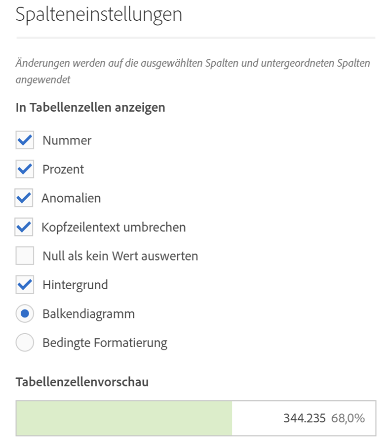

# Spalteneinstellungen

Mithilfe der Spalteneinstellungen können Sie die Spaltenformatierung konfigurieren. Einige davon sind bedingt.

## Column settings {#section_C5A9C13553BF4BFDAD7FACE0139AECA3}

Um die [!UICONTROL Spalteneinstellungen] aufzurufen, ziehen Sie eine Freiform-Tabelle in das Projekt und klicken Sie dann auf das Zahnrad-Symbol in der Spaltenüberschrift.

Sie können Einstellungen **für mehrere Spalten gleichzeitig** bearbeiten. Wählen Sie hierzu einfach mehrere Spalten aus und klicken Sie in einer der Spalten auf das Einstellungs-Symbol. Sämtliche Änderungen, die Sie hier vornehmen, werden auf die markierten Zellen aller Spalten angewendet.

| Element | Beschreibung |
|--- |--- |
| Nummer | Definition, ob in einer Zelle der numerische Wert der Metrik angezeigt wird oder nicht. Ist die Metrik beispielsweise „Seitenansichten“, ist der numerische Wert die Anzahl an Seitenansichten für dieses Zeilenelement. |
| Prozent | Definition, ob in einer Zelle der Prozentwert der Metrik angezeigt wird oder nicht. Ist die Metrik beispielsweise „Seitenansichten“, ist der Prozentwert die Anzahl an Seitenansichten für dieses Zeilenelement geteilt durch die Gesamtanzahl der Seitenansichten für diese Spalte.  Hinweis: Für eine höhere Genauigkeit können Prozentsätze über 100 % angezeigt werden. Außerdem wird die obere Grenze auf 1.000 % verschoben, damit Spalten auch verbreitert werden können. |
| Anomalien | Definition, ob die Anomalieerkennung für die Werte dieser Spalte ausgeführt wird |
| Umbruch Kopfzeilentext | Hiermit können Sie den Kopfzeilentext in Freiformtabellen umbrechen, damit Kopfzeilen besser lesbar und Tabellen einfacher freizugeben sind. Diese Funktion ist beim .pdf-Rendering und für Metriken mit langen Namen nützlich. Standardmäßig aktiviert. |
| Null nicht als Wert interpretieren | Definition, ob in Zellen mit 0-Wert eine 0 oder nichts angezeigt wird. Diese Option ist praktisch, wenn Sie die Daten für einzelne Tage eines Monats anzeigen und einige Tage noch in der Zukunft liegen.  Statt für in der Zukunft liegende Daten eine 0 anzuzeigen, kann die entsprechende Zelle auch leer angezeigt werden. In Diagrammen wird diese Einstellung ebenfalls berücksichtigt (ist diese Einstellung aktiviert, wird in Diagrammen also keine Linie bzw. kein Balken mit 0-Werten angezeigt). |
| Hintergrund | Definition, ob in einer Zelle alle Zellformatierungen ein-/ausgeblendet werden, einschließlich Balkendiagramm und bedingter Formatierung |
| Balkendiagramm | Zeigt ein horizontales Balkendiagramm mit dem Zellenwert in Relation zum Gesamtwert der Spalte an. |
| Bedingte Formatierung | Weitere Informationen dazu finden Sie im unten stehenden Abschnitt. |
| Vorschau der Tabellenzelle | Vorschau der jeweiligen Zelle mit allen ausgewählten Formatierungsoptionen |

## Conditional formatting {#section_3DD847151DA14914888A70FC4FD7BDFB}

Die bedingte Formatierung gilt für Obergrenzen, Mittelwerte und Untergrenzen, die Sie definieren. Das Anwenden bedingter Formatierung (Farben etc.) in Freiformtabellen ist bei Aufschlüsselungen auch automatisch aktiviert, wenn keine „benutzerdefinierten“ Beschränkungen ausgewählt sind.

| Element | Beschreibung |
|--- |--- |
| Bedingte Formatierung | Färbt Zellen je nach Datenwerten wie folgt ein: <ul><li>Grün: hohe Werte</li><li>Gelb: Mittelpunktwerte</li><li>Rot: niedrige Werte</li></ul> Wenn Sie eine Dimension in der Tabelle ersetzen, werden die Grenzwerte für die bedingte Formatierung zurückgesetzt. Wenn Sie eine Metrik ersetzen, werden die Grenzwerte für diese Spalte zurückgesetzt (dabei wird eine Metrik auf der X-Achse und eine Dimension auf der Y-Achse dargestellt). |
| Prozentbegrenzungen verwenden | Verwenden Sie auf Basis der Prozentwerte für die einzelnen Metriken Obergrenzen, Mittelwerte und Untergrenzen. Diese Einstellung funktioniert mit Metriken, die rein prozentbasiert sind (beispielweise Absprungrate) oder eine Anzahl und einen Prozentsatz aufweisen (beispielsweise Seitenansichten). |
| Automatisch generiert | Generiert automatisch Grenzwerte für die bedingte Formatierung. Die Obergrenze entspricht dem höchsten Wert in dieser Spalte. Die Untergrenze entspricht dem niedrigsten Wert und der Mittelpunkt ist der Durchschnittswert der Ober- und der Untergrenze. |
| Benutzerspezifisch | Sie können die Werte für die Felder „Obergrenze“, „Mittelpunkt“ und „Untergrenze“ für die bedingte Formatierung manuell festlegen. So können Sie flexibel bestimmen, ob der Wert einer Säule gut, durchschnittlich oder schlecht ist. |
| Vorschau der Tabellenzelle | Vorschau der jeweiligen Zelle mit allen ausgewählten Formatierungsoptionen |

>[!MORE_ LIKE_ THIS]
>
>* [Data Sources verwalten](/help/analyze/analysis-workspace/visualizations/t-sync-visualization.md)

