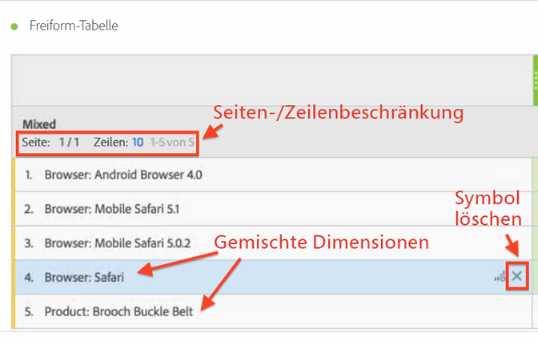
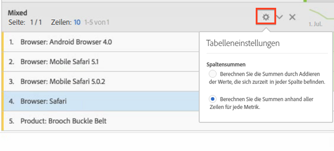

# Statische und dynamische Zeilen

Analysis Workspace-Tabellen generieren dynamische Zeilen, wenn Sie eine Dimension in der Tabelle ablegen; d. h., dass alle für eine bestimmte Metrik zu der Dimension gehörenden Elemente in die Tabelle eingefügt werden.

Wenn Sie zum Beispiel die Dimension „Browser“ in die Tabelle ziehen, dann werden alle Browser-Elemente (z. B. Android-Browser, Mobile Safari, Firefox usw.) dynamisch in die Tabelle eingefügt.

Im Gegensatz dazu wird, wenn Sie manuell eine bestimmte Metrik, ein Segment, einen Datumsbereich oder ein einzelnes Dimensionselement in die Tabelle ziehen, jedes Mal eine fest kodierte oder „statische“ Zeile oder Liste eingefügt. Mit statischen Zeilen können Sie jetzt wie folgt interagieren:

* Wenn Sie auf das Vorschau-Symbol in statischen Zeilen klicken, können Sie eine Vorschau von Segmenten, Metriken und Datumsbereichen anzeigen.
* Klicken Sie auf das Symbol „X“, um die Zeile aus der Tabelle zu löschen.
* Schränken Sie ein, wie viele Zeilen angezeigt werden und aktivieren Sie den Seitenwechsel.
* Fügen Sie Elemente aus gemischten Dimensionen hinzu. Fügen Sie z. B. ein Element aus einer Browser-Dimension und ein weiteres Element aus einer Produkt-Dimension hinzu.

   Siehe folgende Abbildung:

   

Darüber hinaus können Sie (nur), wenn Sie sich im statischen Zeilenmodus befinden, jetzt die Berechnung der Spaltensummen ändern. Klicken Sie einfach auf das Zahnrad-Symbol und schalten Sie zwischen den beiden folgenden Optionen um:

| Option | Beschreibung |
|---|---|
| (Standard) Berechnen Sie die Summen, indem Sie die aktuell in jeder Spalte vorhandenen Werte addieren. | Diese Option berechnet nur die aktuell in der Tabelle vorhandenen Spalten. (Clientseitige Berechnung) |
| Berechnen der Summen anhand aller Zeilen für jede Metrik. | Diese Option bezieht alle Dimensionselemente für diese Dimension ein, auch dann, wenn diese nicht in der Tabelle aufgeführt sind. (Serverseitige Berechnung) |

