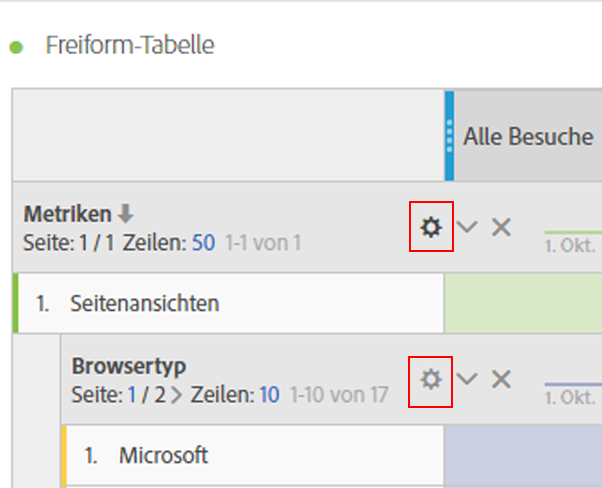
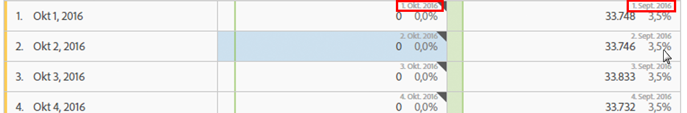

# Zeileneinstellungen

Die Zeileneinstellungen variieren, je nachdem, welche Komponente Sie in die Tabelle gezogen haben.

Sie können außerdem die ausgewählte(n) Zeile(n) mit den [Rechtsklickaktionen in einer Tabelle](../../../../analyze/analysis-workspace/visualizations/freeform-table.md#concept_0D2E24FCCBAF4194AA941448860E422F) verwalten.

Um auf die Tabellenzeileneinstellungen zuzugreifen, klicken Sie auf das Einstellungs-Symbol neben einer Dimension, einem Segment, einer Metrik, einem Zeitraum oder einer Aufschlüsselung im jeweiligen Element:

<table id="table_7ACE6413DB1F40349ED2860020F92E55"> 
 <thead> 
  <tr> 
   <th colname="col1" class="entry"> Zeileneinstellung </th> 
   <th colname="col2" class="entry"> Beschreibung </th> 
  </tr>
 </thead>
 <tbody> 
  <tr> 
   <td colname="col1"> 
<a href="../../../../analyze/analysis-workspace/components/calendar-date-ranges/time-comparison.md#concept_93BCAD81B7A54ABBBA5CD9E419F6F764" format="dita" scope="local"> Datumsvergleiche</a> 
 </td> 
   <td colname="col2"> 
<b>Richten Sie die Daten in allen Spalten so aus, dass sie alle in derselben Zeile beginnen. </b> 
 
Wenn Sie z. B. die Daten in einem Monatsvergleich zwischen Oktober und September 2016 ausrichten, beginnt die linke Spalte mit dem 1. Oktober und die rechte Spalte mit dem 1. September: 
 
 
 
Standardmäßig deaktiviert. 
 </td> 
  </tr> 
  <tr> 
   <td colname="col1"> 
Prozentsatz 
 </td> 
   <td colname="col2"> 
<b>Prozentsätze nach Zeile berechnen</b> 
 
Erzwingt, dass die Freiform-Tabelle die Zellprozentsätze über die gesamte Zeile berechnet, anstatt die Spalte nach unten zu verschieben. Diese ist besonders nützlich für die Trenddarstellung von Prozentangaben. Sie ist standardmäßig aktiviert, wenn Sie das Visualisieren-Symbol verwenden. 
 </td> 
  </tr> 
  <tr> 
   <td colname="col1"> 
Spaltensummen 
 </td> 
   <td colname="col2"> 
Diese Einstellungen werden nur bei <a href="../../../../analyze/analysis-workspace/build-workspace-project/column-row-settings/manual-vs-dynamic-rows.md#concept_C50E7DFBC0504C72A973123192F487D8" format="dita" scope="local"> manuellen (statischen) Zeilen</a> (wenn Sie eine endliche Gruppe aus Elementen ausgewählt haben) angezeigt und nicht bei dynamischen Zeilen (wenn Sie eine Dimension einfügen, die alle Elemente anzeigt). 
Hinweis: Bei <i>metrischen</i> manuellen Zeilen ist diese Einstellung deaktiviert, da es nicht sinnvoll ist, andere Metriken als die aktuellen Zeilen einer Tabelle zu summieren. 
 
 
<b>Berechnen Sie die Summen durch Addieren der Werte, die sich zurzeit in jeder Spalte befinden (standardmäßig aktiviert):</b> 
 
Diese Option berechnet nur die aktuell in der Tabelle vorhandenen Spalten. (Clientseitige Berechnung) 
 
<b>Berechnen Sie die Summen anhand aller Zeilen für jede Metrik (standardmäßig deaktiviert):</b> 
 
Diese Option bezieht alle Dimensionselemente für diese Dimension ein, auch dann, wenn diese nicht in der Tabelle aufgeführt sind. (Serverseitige Berechnung) 
 </td> 
  </tr> 
  <tr> 
   <td colname="col1"> 
Aufschlüsselung 
 </td> 
   <td colname="col2"> 
<b>Aufschlüsselung nach Position:</b> 
 
Sie können Aufschlüsselungen nach fester Position in einer Freiform-Tabelle durchführen. Sie können z. B. festlegen, dass die ersten sieben Zeilen immer aufgeschlüsselt werden. 
 
(Zuvor war die Liste mit den Werten in der Aufschlüsselung „gesperrt“. Dadurch erhielten Sie zum Beispiel bei der Aufschlüsselung des Datums nach Seite eine Liste der ersten 50 Seiten des ausgewählten Zeitraums. Wenn Sie diesen Bericht speicherten und ihn einen Monat später erneut durchführen wollten, hätten sich die ersten 50 Seiten wahrscheinlich geändert. In Analysis Workspace werden jedoch die Ergebnisse der ursprünglichen Aufschlüsselung verwendet und dieselben Seiten angezeigt, aber mit dem aktuellen Monat als Zeitraum.) 
 
So führen Sie Aufschlüsselung anhand eines festen Ortes durch: 
 
    <ol id="ol_A396A11566AA4F52BC3ABBC373CEF477"> 
     <li id="li_BDAB1E9A48D44944A4F7C31F1182B923">Schlüsseln Sie einige Zeilen in Ihrer Tabelle auf. </li> 
     <li id="li_C5610437D3714CCEB9F3C771864B4336">Klicken Sie auf das Einstellungs-Symbol (Zahnrad) neben der Tabellenzeile, die Sie fixieren möchten. </li> 
     <li id="li_675E429DC3B94201978166F9408D30B1">Aktivieren Sie das Kästchen neben Schlüsseln Sie nach Position auf. </li> 
     <li id="li_E8A417D0D6D1438CAE825843BA0A7060">Ändern Sie die Sortierungsreihenfolge oder den Datumsbereich. Die Aufschlüsselungen sind jetzt an die Zeilenposition und nicht die hartcodierten Zeilen gebunden. </li> 
    </ol> 
Standardmäßig deaktiviert. 
 </td> 
  </tr> 
 </tbody> 
</table>

