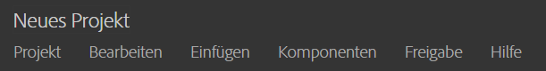
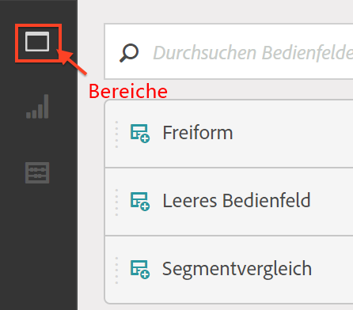

# Projekt erstellen – Übersicht

**[!UICONTROL Analytics]** > **[!UICONTROL Workspace]**

Sie können ein stabiles Analytics-Projekt aus einer beliebigen Kombination von Visualisierungen, Berichtskomponenten und Datentabellen erstellen. Dadurch sind viele Funktionen des Tabellenerstellers aus der Ad Hoc Analysis auch in Analytics verfügbar.

Analysis Workspace bietet Ihnen komplett neue Möglichkeiten zum Vergleich und zur Aufschlüsselung von Daten. Sie können z. B. Rangberichte konfigurieren, sofortige iterative Änderungen an der Datenabfrage vornehmen und die Werte auf Berichtsebene aufrufen und damit arbeiten.

Die Abfrage erfolgt direkt an die Berichts-Engine. Sie können Änderungen inline durchführen, ohne andere Berichte aufzurufen, um Ihre Analyse zu erstellen. Die Ergebnisse sind sofort sichtbar, ohne Browseraktualisierung.

## Workspace -Seite mit Projektliste  {#section_39AA007D7C384F4E869F842F1C7B11F8}

Wenn Sie **[!UICONTROL Analytics]** > **[!UICONTROL Workspace]** erstmalig aufrufen, werden auf der Seite alle Projekte aufgeführt, die Ihnen gehören oder zu denen Ihnen Zugriff gewährt wurde. Sie können diese Seite als Startseite für Adobe Analytics festlegen, indem Sie auf **[!UICONTROL Als Landingpage festlegen]** klicken. (Wenn die Option wie im unten stehenden Screenshot nicht angezeigt wird, ist die Seite bereits Ihre Landingpage.)

Die Workspace -Seite mit Projektliste umfasst die folgenden Informationen:

| Element | Beschreibung |
|---|---|
| [Neues Projekt erstellen](/help/analyze/analysis-workspace/build-workspace-project/t-freeform-project.md) | Klicken Sie auf diesen Link, um ein neues Projekt von Grund auf zu erstellen. |
| Projekte verwalten | Wenn Sie auf diesen Link klicken, wird der Projektkomponentenmanager aufgerufen (**[!UICONTROL Analytics]** > **[!UICONTROL Komponenten]** > **[!UICONTROL Projekte]**). Dort sind all Ihre Projekte aufgeführt und Sie können Projekte taggen, freigeben, löschen, umbenennen, genehmigen, kopieren und in CSV exportieren. |
| Als Landingpage festlegen | Wandelt diese Seite in Ihre Workspace-Landingpage um. |
| Tutorials anzeigen | Takes you to the [Analysis Workspace video tutorials](https://docs.adobe.com/content/help/en/analytics-learn/tutorials/analysis-workspace/analysis-workspace-basics/analysis-workspace-introduction.html). |
| Name | Name des Workspace-Projekts. |
| Inhaber | Die Person, die dieses Projekt erstellt hat (entweder Sie oder eine Person, die das Projekt für Sie freigegeben hat). |
| Typ | Gibt an, ob es sich um ein Workspace-Projekt oder eine [Mobile-Scorecard](https://docs.adobe.com/content/help/de-DE/analytics/analyze/mobapp/home.html)handelt. |
| Projektrolle | Gibt an, ob Sie der Eigentümer des Projekts sind, ob Sie das Projekt bearbeiten können oder ob es sich um ein Duplikat-Projekt handelt. |
| Tags | Auf das Projekt angewendete Tags, entweder im Projektkomponentenmanager oder unter **[!UICONTROL Workspace]** > **[!UICONTROL Projekt]** > **[!UICONTROL Projektinfo und Einstellungen]**. |
| Zuletzt geändert | Datum und Zeitpunkt der letzten Änderung des Projekts. |
| Meine Lieblingsprojekte | Um ein Projekt als Favoriten zu markieren, öffnen Sie das Projekt und klicken Sie auf den Stern neben seinem Namen. Es wird in dieser Liste angezeigt, wenn Sie Workspace das nächste Mal öffnen. |
| Häufig angezeigte Projekte | Liste aller häufig geöffneten Projekte, um den Zugriff zu erleichtern. |

## Projektinfo und Einstellungen {#section_63773D0B9E4543E88068ECECB9EEB4C6}

**[!UICONTROL Workspace]** > **[!UICONTROL Projekt]** > **[!UICONTROL Projektinfo und Einstellungen]**

**[!UICONTROL Projektinfo und Einstellungen]** enthält auf der Projektebene befindliche Informationen über das derzeit aktive Projekt.

| Einstellung | Beschreibung |
|---|---|
| Projekt  Name | Der Name des Projekts. Sie können auf den Namen doppelklicken, um ihn zu bearbeiten. |
| Erstellt von | Name des Projektinhabers. |
| Zuletzt geändert | Das Datum, an dem die letzte Änderung an dem Projekt vorgenommen wurde. |
| Tags | Zeigt eine Liste aller Tags an, die auf ein Projekt angewendet wurden, um die Kategorisierung zu vereinfachen. Sie können Projekte beim Speichern auch taggen. Die Tags eines Projekts können Sie auf der Workspace-Landingpage in der Spalte [!UICONTROL Tags] einsehen. |
| Beschreibung | Eine Beschreibung hilft, den Zweck eines Projekts anzugeben. Sie können auf die Beschreibung doppelklicken, um sie zu bearbeiten. |
| Wiederholte Instanzen in Projekt zählen | Diese Einstellung legt fest, ob wiederholte Instanzen in Berichten gezählt werden sollen. Wenn mehrere sequentielle Werte für dieselbe Variable vorhanden sind, können Sie sie entweder als eine oder mehrere Instanzen der Variablen zählen. |
| Visualisierungsfarbschema | Sie können das in Workspace verwendete Farbschema ändern, indem Sie eine Farbe aus einer anderen Farbpalette auswählen oder Ihre eigene Palette festlegen. Diese Funktion betrifft vieles in Workspace, einschließlich der meisten Visualisierungen. |
| Dichte anzeigen | So können Sie mehr Daten auf dem Bildschirm anzeigen, indem Sie den vertikalen Abstand der linken Schiene, Freiformtabellen und Kohortentabellen reduzieren. |

## Menü „Projekte“ {#section_850CDFCB86A64EB0A0AD5B9E0FCB7013}

Die oberste Ebene des Menüs „Projekte“ sieht wie folgt aus:

Die Untermenüs enthalten die folgenden Optionen.

>[!NOTE]
>
>Mit einem Sternchen (*) markierte Optionen werden nur bei **gespeicherten** Projekten angezeigt.

| Projekt | Vorlage | Einfügen | Komponenten | Freigeben | Hilfe |
|---|---|---|---|---|---|
| Neu | Rückgängig | Neues Bedienfeld | Neues Segment | Projekt freigeben | Videos |
| Öffnen | Leeren | Neues Freiformfeld | Neue Metrik | Projektverknüpfung abrufen* | Tastaturbefehle |
| Speichern | Alle löschen | Neues Bedienfeld für Segmentvergleich | Neuer Datumsbereich | Datei jetzt senden* | Hilfeforum |
| Speichern unter* |  | Neue Freiformtabelle | Neuer Warnhinweis | Datei planmäßig senden* |  |
| Als Landingpage festlegen* |  | Neue Zeile | Komponenten aktualisieren | Projekt kuratieren |  |
| Projekt aktualisieren |  | Neuer Balken |  |  |  |
| CSV herunterladen |  |  |  |  |  |
| PDF herunterladen* |  |  |  |  |  |
| Projektinfo und Einstellungen |  |  |  |  |  |

## Linke Leiste  {#section_271295C26EC840ABB2A8E7EC0498B60E}

Die linke Leiste enthält 3 Symbole, über die Sie mit einem Klick auf Bedienfelder, [Visualisierungen](/help/analyze/analysis-workspace/visualizations/freeform-analysis-visualizations.md) und [Komponenten](/help/analyze/analysis-workspace/components/analysis-workspace-components.md) (Dimensionen, Metriken, Segmente, Datenbereiche) zugreifen können:

  

Zur Liste der in der linken Leiste verfügbaren Bedienfelder wurde ein **[!UICONTROL leeres Bedienfeld]** hinzugefügt. Um ein **neues Kohortenbedienfeld** zu erstellen, ziehen Sie eine Kohortentabellen-Visualisierung auf ein leeres Bedienfeld.
