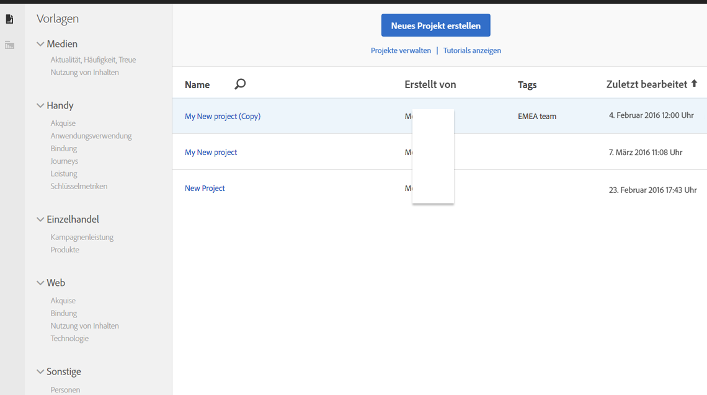
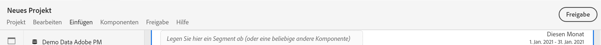
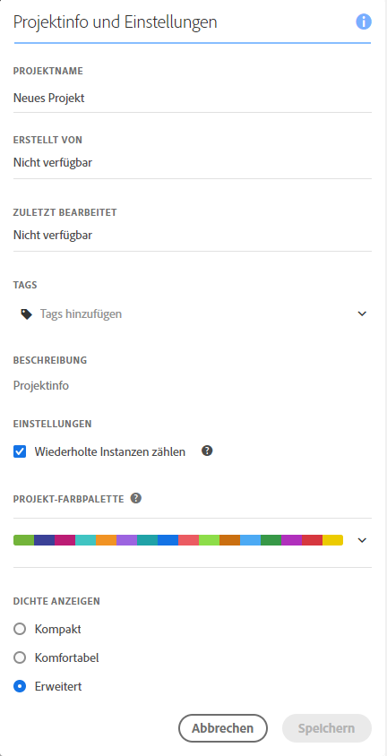
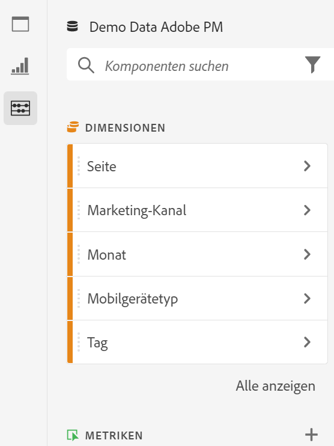
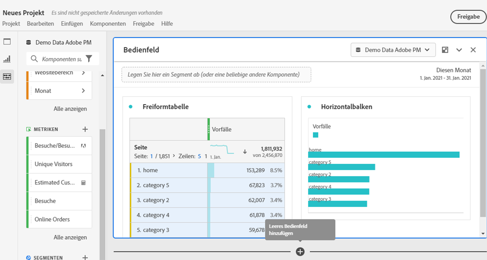
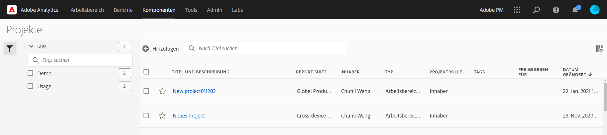

# Übersicht über Projekte

Mit Workspace-Projekten können Sie Datenkomponenten, Tabellen und Visualisierungen kombinieren, um Ihre Analyse zu erstellen und sie anderen Mitarbeitern Ihres Unternehmens freizugeben. Bevor Sie Ihr erstes Projekt starten, erfahren Sie, wie Sie auf Ihre Projekte zugreifen, durch sie navigieren und sie verwalten können.

## Projektliste {#project-list}

Wenn Sie **[!UICONTROL Analytics]** > **[!UICONTROL Workspace]** erstmalig aufrufen, werden auf der Seite alle Projekte aufgeführt, deren Inhaber Sie sind oder zu denen Ihnen Zugriff gewährt wurde. Dies ist auch die Landingpage für Adobe Analytics, es sei denn, Sie haben zuvor eine benutzerdefinierte Landingpage festgelegt.

Die Workspace -Seite mit Projektliste umfasst die folgenden Informationen:

| Element | Beschreibung |
|---|---|
| [Neues Projekt erstellen](/help/analyze/analysis-workspace/home.md) | Klicken Sie auf diesen Link, um ein neues Projekt oder von einer für Sie erstellten [Vorlage](https://experienceleague.adobe.com/docs/analytics/analyze/analysis-workspace/build-workspace-project/starter-projects.html?lang=de#analysis-workspace) zu starten. |
| Projekte verwalten | Wenn Sie auf diesen Link klicken, wird der Projektkomponentenmanager aufgerufen (**[!UICONTROL Analytics]** > **[!UICONTROL Komponenten]** > **[!UICONTROL Projekte]**). Dort sind all Ihre Projekte aufgeführt und Sie können Projekte taggen, freigeben, löschen, umbenennen, genehmigen, kopieren und in CSV exportieren. |
| Als Landingpage festlegen | Wandelt diese Seite in Ihre Workspace-Landingpage um. |
| [Tutorials anzeigen](https://docs.adobe.com/content/help/de-DE/analytics-learn/tutorials/analysis-workspace/analysis-workspace-basics/analysis-workspace-introduction.html) | Sie gelangen zu den Analysis Workspace-Tutorials. |
| Name | Name des Workspace-Projekts. |
| Inhaber | Die Person, die dieses Projekt erstellt hat (entweder Sie oder eine Person, die das Projekt für Sie freigegeben hat). |
| Typ | Gibt an, ob es sich um ein Workspace-Projekt oder eine [mobile Scorecard](https://docs.adobe.com/content/help/de-DE/analytics/analyze/mobapp/home.html) handelt. |
| [Projektrolle](https://experienceleague.adobe.com/docs/analytics/analyze/analysis-workspace/curate-share/share-projects.html?lang=de) | Zeigt Ihre Rolle für das Projekt an – Inhaber, bearbeiten, duplizieren, anzeigen. |
| Tags | Tags, die auf das Projekt angewendet wurden. |
| Zuletzt geändert | Datum und Zeitpunkt der letzten Änderung des Projekts. |
| Meine Favoriten | Um ein Projekt als Favoriten zu markieren, öffnen Sie das Projekt und klicken Sie auf den Stern neben seinem Namen. Wenn Sie Workspace das nächste Mal öffnen, wird das Projekt in dieser Liste angezeigt. |
| Häufig angesehene Projekte | Listet alle häufig geöffneten Projekte auf, um den Zugriff zu erleichtern. |

## Menüleiste {#menu-bar}

Innerhalb eines Projekts bietet das Menü Optionen zum Verwalten Ihres Projekts, zum Hinzufügen von Komponenten, zur Suche von Hilfe und mehr. Auf jede Menüoption kann auch über [Tastenkombinationen](https://experienceleague.adobe.com/docs/analytics/analyze/analysis-workspace/build-workspace-project/fa-shortcut-keys.html?lang=de) zugegriffen werden.

| Menüelement | Beschreibung |
|---|---|
| Projekt | Umfasst allgemeine Aktionen für das Projekt-Management, einschließlich „Neu“, „Öffnen“, „Speichern“, „Speichern unter“ und [Als Vorlage speichern](https://experienceleague.adobe.com/docs/analytics/analyze/analysis-workspace/build-workspace-project/starter-projects.html?lang=de). Sie können auch das gesamte Projekt aktualisieren, um die neuesten Daten und Definitionen abzurufen, indem Sie auf „Projekt aktualisieren“ klicken. Mithilfe der Optionen [CSV und PDF herunterladen](https://experienceleague.adobe.com/docs/analytics/analyze/analysis-workspace/curate-share/download-send.html?lang=de) können Sie Daten aus Workspace exportieren. [Projektinformation und Einstellungen](https://experienceleague.adobe.com/docs/analytics/analyze/analysis-workspace/build-workspace-project/freeform-overview.html?lang=de#info-settings) bieten viele Optionen zum Verwalten Ihres Projekts. |
| Vorlage | Rückgängigmachen oder Wiederholen der letzten Aktion. „Alles löschen“ setzt das Projekt auf den Ausgangspunkt zurück. |
| Einfügen | Fügen Sie neue Bedienfelder oder Visualisierungen aus diesem Menü ein. Sie können auch neue Bedienfelder und Visualisierungen aus der linken Leiste einfügen. |
| [Komponenten](https://experienceleague.adobe.com/docs/analytics/analyze/analysis-workspace/components/analysis-workspace-components.html?lang=de) | Erstellen Sie neue Segmente, berechnete Metriken, Datumsbereiche oder Warnhinweiskomponenten aus Ihrem Projekt. Sie können auch über die linke Leiste neue Komponenten erstellen. Wenn sich Ihre Komponentendefinitionen kürzlich geändert haben, werden die neuesten Definitionen über „Komponenten aktualisieren“ abgerufen. |
| [Freigeben](https://experienceleague.adobe.com/docs/analytics/analyze/analysis-workspace/curate-share/send-schedule-files.html?lang=de) | Sie können PDF-/CSV-Projekte für Empfänger in Ihrem Unternehmen kuratieren, freigeben und planen. |
| Hilfe | Rufen Sie die Hilfedokumentation, Videos und die Analytics [Experience League Community](https://experienceleaguecommunities.adobe.com/t5/adobe-analytics/ct-p/adobe-analytics-community) auf. Verwalten Sie die Sichtbarkeit der Workspace-Tipps sowie von [Debugger](https://www.adobe.io/apis/experiencecloud/analytics/docs.html#!AdobeDocs/analytics-2.0-apis/master/reporting-tricks.md). Finden Sie Details über Workspace und Faktoren, die sich auf die [Projektleistung](https://experienceleague.adobe.com/docs/analytics/analyze/analysis-workspace/workspace-faq/optimizing-performance.html?lang=de) auswirken. |
| Schaltfläche „Freigeben“ oder Inhaber | Wenn Sie im Projekt die Rolle „Inhaber“ oder „Bearbeiten“ innehaben, erhalten Sie über der Button „Freigeben“ oben rechts Zugriff auf die Verwaltung Ihrer Projektempfänger. Wenn Sie im Projekt die Rolle „Duplizieren“ oder „Anzeigen“ innehaben, wird der Name des Projektinhabers angezeigt. |

### Projektinfo und Einstellungen {#info-settings}

**[!UICONTROL Workspace]** > **[!UICONTROL Projekt]** > **[!UICONTROL Projektinfo und Einstellungen]** enthält Informationen auf Projektebene zum derzeit aktiven Projekt.

Zu den Einstellungen gehören:

| Einstellung | Beschreibung |
|---|---|
| Projekt Name | Der Name des Projekts. Sie können auf den Namen doppelklicken, um ihn zu bearbeiten. |
| Erstellt von | Name des Projektinhabers. |
| Zuletzt geändert | Das Datum, an dem die letzte Änderung an dem Projekt vorgenommen wurde. |
| Tags | Zeigt eine Liste aller Tags an, die auf ein Projekt angewendet wurden, um die Kategorisierung zu vereinfachen. |
| Beschreibung | Eine Beschreibung hilft, den Zweck eines Projekts anzugeben. Sie können auf die Beschreibung doppelklicken, um sie zu bearbeiten. |
| Wiederholte Instanzen in Projekt zählen | Diese Einstellung legt fest, ob wiederholte Instanzen in Berichten gezählt werden sollen. Hinweis: Diese Einstellung gilt nicht für Fluss- oder Fallout-Visualisierungen. |
| [Projekt-Farbpalette](https://experienceleague.adobe.com/docs/analytics/analyze/analysis-workspace/build-workspace-project/color-palettes.html?lang=de) | Sie können die in Workspace verwendete Farbpalette für Kategorien ändern, indem Sie aus den vordefinierten Paletten wählen, die für die Farbenblindheit optimiert wurden, oder indem Sie eine benutzerdefinierte Palette angeben. Diese Funktion betrifft vieles in Workspace, einschließlich der meisten Visualisierungen. |
| [Dichte anzeigen](https://experienceleague.adobe.com/docs/analytics/analyze/analysis-workspace/build-workspace-project/view-density.html?lang=de) | So können Sie mehr Daten auf dem Bildschirm anzeigen, indem Sie den vertikalen Abstand der linken Schiene, Freiformtabellen und Kohortentabellen reduzieren. |

## Linke Leiste {#left-rail}

In einem Projekt erfolgt der Zugriff auf [Bedienfelder](https://experienceleague.adobe.com/docs/analytics/analyze/analysis-workspace/panels/panels.html?lang=de), Tabellen, [Visualisierungen](https://experienceleague.adobe.com/docs/analytics/analyze/analysis-workspace/visualizations/freeform-analysis-visualizations.html?lang=de) und [Komponenten](https://experienceleague.adobe.com/docs/analytics/analyze/analysis-workspace/components/analysis-workspace-components.html) von der linken Leiste aus. Das sind Ihre Projektbausteine.

Sie können auch über das [leere Bedienfeld](https://experienceleague.adobe.com/docs/analytics/analyze/analysis-workspace/panels/blank-panel.html?lang=de) auf Visualisierungen und Bedienfelder zugreifen.

Komponenten (Dimensionen, Metriken, Segmente, Datumsbereiche) in der linken Leiste beziehen sich auf die Report Suite des aktiven Bedienfelds. Das aktive Bedienfeld wird durch einen blauen Rand umgeben, und die aktive Report Suite wird oben in der Komponentenleiste aufgeführt.

## Arbeitsfläche des Projekts {#canvas}

Auf der Arbeitsfläche des Projekts können Sie Bedienfelder, Tabellen, Visualisierungen und Komponenten zusammenführen, um Ihre Analyse zu erstellen. Ein Projekt kann viele Bedienfelder enthalten, und jedes Bedienfeld kann aus vielen Tabellen und Visualisierungen bestehen.

Bedienfelder sind hilfreich, wenn Sie Ihre Projekte nach Zeiträumen, Report Suites oder Anwendungsfällen für Analysen organisieren möchten. Das aktive Bedienfeld hat einen blauen Rand und bestimmt, welche Komponenten in der linken Leiste verfügbar sind.

Je nach Ausgangspunkt, den Sie für Ihre Projekte ausgewählt haben, befindet sich auf der Arbeitsfläche zu Beginn entweder eine [Freiformtabelle](https://experienceleague.adobe.com/docs/analytics/analyze/analysis-workspace/visualizations/freeform-table/freeform-table.html?lang=de) oder ein [leeres Bedienfeld](https://experienceleague.adobe.com/docs/analytics/analyze/analysis-workspace/panels/blank-panel.html). Die schnellste Möglichkeit, eine Analyse zu starten, besteht darin, eine oder mehrere Komponenten auszuwählen und sie einfach in die Projektarbeitsfläche zu ziehen. Eine Datentabelle wird automatisch für Sie erstellt. [Erfahren Sie mehr](https://experienceleague.adobe.com/docs/analytics/analyze/analysis-workspace/visualizations/freeform-table/freeform-table.html) über die verschiedenen Optionen zum Erstellen einer Tabelle oder nutzen Sie unser [Tutorial](https://experienceleague.adobe.com/docs/analytics/analyze/analysis-workspace/home.html?lang=de#training-tutorial) für eine Anleitung zum Erstellen Ihres ersten Projekts.

## Projektmanager {#manager}

Analysis Workspace-Projekte können unter **„Analysen“ > „Komponenten“ > „Projekte“** verwaltet werden. Im Projekt-Manager werden die Elemente angezeigt, die von einem bestimmten Benutzer erstellt wurden. Die Inhaberschaft eines Projekts kann unter „Administration“ > „Analytics-Benutzer und -Assets“ > „Assets übertragen“ an einen neuen Benutzer übertragen werden.

Im Projekt-Manager können Sie u. a. Elemente hinzufügen, taggen, freigeben und duplizieren/kopieren. Suchen Sie in der Suchleiste oder mithilfe der Filteroptionen in der linken Leiste nach einem Projekt. Sie können u. a. nach Tag, Inhaber und Projekttyp filtern.

Die folgenden Aktionen können im Projekt-Manager für ein oder mehrere Projekte gleichzeitig ausgeführt werden:

| Aktion | Beschreibung |
|---|---|
| Fügen Sie | Erstellen Sie ein neues Projekt oder beginnen Sie mit einer [Vorlage](https://experienceleague.adobe.com/docs/analytics/analyze/analysis-workspace/build-workspace-project/starter-projects.html). |
| Taggen oder genehmigen | Wählen Sie „Taggen“ oder „Genehmigen“, um Ihre Projekte zu organisieren und die Suche zu erleichtern. |
| [Freigeben](https://experienceleague.adobe.com/docs/analytics/analyze/analysis-workspace/curate-share/share-projects.html) | Stellen Sie ein Projekt für andere Analysis Workspace-Benutzer in Ihrer Organisation zur Verfügung. |
| Löschen | Löschen Sie Ihr Projekt. |
| Umbenennen | Bearbeiten Sie den Namen Ihres Projekts. |
| Kopieren | Erstellen Sie ein Duplikat Ihres Projekts. Dadurch werden ein neues Projekt und eine neue Projekt-ID erstellt. Die mit dem Originalprojekt verknüpften Freigaben oder Zeitpläne werden nicht kopiert. |
| In CSV exportieren | Laden Sie Ihr Projekt als CSV-Datei herunter, die Klartextdaten enthält. |
