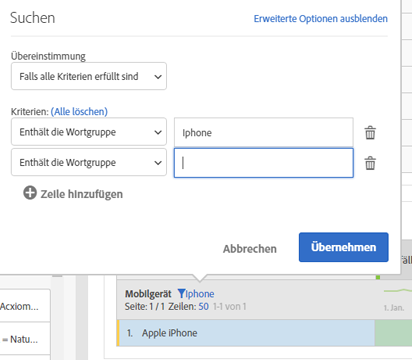

# Paginierung, Filtern und Sortieren von Tabellen

Mit diesem Video auf YouTube können Sie sich einen Überblick verschaffen:

[Paginierung, Filtern und Sortieren von Tabellen in Analysis Workspace](https://www.youtube.com/watch?v=2zxpRPCGspg)

## Advanced filtering options {#section_36E92E31442B4EBCB052073590C1F025}

Wenn Sie auf das Filtersymbol und anschließend neben einer Dimension in einer Freiform-Tabelle auf „Erweiterte Optionen anzeigen“ klicken, können Sie nach folgenden Kriterien filtern:

* Enthält
* Enthält nicht
* Enthält alle Begriffe
* Enthält einen der Begriffe
* Enthält die Wortgruppe
* Enthält keine Begriffe
* Enthält nicht die Wortgruppe
* Gleich
* Ist nicht gleich
* Beginnt mit
* Endet mit

