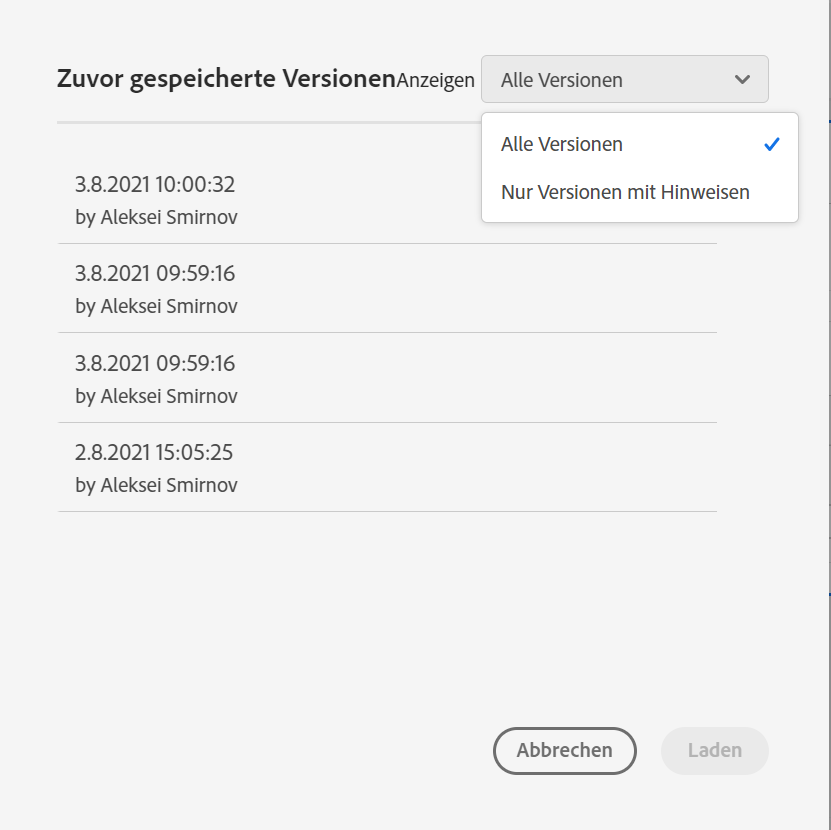

# Projekte speichern

Projekte in Analysis Workspace werden automatisch alle zwei Minuten gespeichert.

Sie können Projekte auch manuell speichern. Beim manuellen Speichern eines Projekts stehen zusätzliche Optionen wie das Hinzufügen von Tags oder Notizen zur Verfügung.

## Projekte manuell speichern {#Save}

Beim manuellen Speichern eines Projekts in Analysis Workspace stehen verschiedene Optionen zur Verfügung.

So speichern Sie ein Projekt manuell:

1. Wenn Ihr Projekt in Analysis Workspace geöffnet ist, wählen Sie **[!UICONTROL Projekt]** und wählen Sie dann aus den folgenden Optionen aus:

   | Aktion | Beschreibung |
   |---|---| 
   | **[!UICONTROL Speichern]** | Speichern Sie die Änderungen an Ihrem Projekt. Wenn das Projekt freigegeben ist, sehen auch die Empfänger des Projekts die Änderungen. Wenn Sie das Projekt zum ersten Mal speichern, werden Sie aufgefordert, dem Projekt einen Namen, eine (optionale) Beschreibung und (optionale) Tags hinzuzufügen. |
   | **[!UICONTROL Mit Hinweisen speichern]** | Bevor Sie das Projekt speichern, fügen Sie Notizen zu den Änderungen im Projekt hinzu. Notizen werden mit der Projektversion gespeichert und stehen allen Editoren unter [!UICONTROL Projekt] > [!UICONTROL Frühere Version öffnen] zur Verfügung. |
   | **[!UICONTROL Speichern unter]** | Erstellen Sie ein Duplikat Ihres Projekts. Das ursprüngliche Projekt bleibt davon unberührt. |
   | **[!UICONTROL Als Vorlage speichern]** | Speichern Sie Ihr Projekt als [benutzerdefinierte Vorlage](https://experienceleague.adobe.com/docs/analytics/analyze/analysis-workspace/build-workspace-project/starter-projects.html?lang=de), die für Ihr Unternehmen unter **[!UICONTROL Projekt > Neu]** zur Verfügung steht. |

## Automatisches Speichern {#Autosave}

Alle Projekte in Analysis Workspace werden automatisch alle 2 Minuten auf Ihrem lokalen Computer gespeichert. Dazu gehören neu erstellte Projekte, die noch nicht manuell gespeichert wurden.

* **Neue Projekte:** Auch wenn neue Projekte automatisch gespeichert werden, müssen Sie jedes neue Projekt beim ersten Mal manuell speichern. Analysis Workspace fordert Sie auf, neue Projekte manuell zu speichern, wenn Sie zu einem anderen Projekt wechseln, die Browser-Registerkarte schließen usw.

   Wenn Sie aus irgendeinem Grund unerwartet den Zugriff auf ein neu erstelltes Projekt verlieren, bevor Sie es manuell speichern, wird eine Wiederherstellungsversion Ihres Projekts auf der Analysis Workspace-Landingpage in einem Ordner namens `Recovered Projects (Last 7 Days)`. Sie müssen das wiederhergestellte Projekt wiederherstellen und manuell an einem gewünschten Ort speichern.

   So stellen Sie ein wiederhergestelltes Projekt wieder her:

   1. Navigieren Sie zu [!UICONTROL **Wiederhergestellte Projekte**] auf der Landingpage von Analysis Workspace.

      

   1. Öffnen Sie das Projekt und speichern Sie es an einem gewünschten Ort.

* **Bestehende Projekte:** Wenn Sie ein Projekt mit noch nicht automatisch gespeicherten Änderungen aus irgendeinem Grund verlassen, fordert Sie Analysis Workspace entweder auf, Ihre Änderungen zu speichern, oder gibt eine Warnmeldung aus.

   Im Folgenden finden Sie einige gängige Szenarien:

### Ein anderes Projekt öffnen

Wenn Sie ein zusätzliches Projekt öffnen, während Sie an einem Projekt arbeiten, das noch nicht automatisch gespeicherte Änderungen enthält, werden Sie von Analysis Workspace aufgefordert, das aktuelle Projekt zu speichern, bevor Sie es verlassen.

Die folgenden Optionen sind verfügbar:

* **Speichern:** Ersetzt die neueste automatisch gespeicherte lokale Kopie Ihres Projekts durch Ihre neuesten Änderungen.
* **Speichern unter:** Speichert Ihre neuesten Änderungen als neues Projekt. Das ursprüngliche Projekt wird nur mit den neuesten automatisch gespeicherten Änderungen gespeichert.
* **Änderungen verwerfen:** Verwirft Ihre neuesten Änderungen. Das Projekt behält die neuesten automatisch gespeicherten Änderungen bei.

### Verlassen oder Schließen einer Registerkarte

Wenn Sie von der Seite weg navigieren oder die Browser-Registerkarte schließen, während Sie ein Projekt mit noch nicht automatisch gespeicherten Änderungen anzeigen, warnt der Browser, dass Ihre nicht gespeicherten Änderungen verloren gehen. Sie können entscheiden, ob Sie die Registerkarte verlassen oder abbrechen möchten.

### Browser-Abstürze oder Zeitüberschreitung der Sitzung

Wenn Ihr Browser abstürzt oder die Sitzung abbricht, werden Sie beim nächsten Zugriff auf Analysis Workspace aufgefordert, alle Änderungen am Projekt wiederherzustellen, die noch nicht automatisch gespeichert wurden.

Im Folgenden finden Sie das Dialogfeld Projektwiederherstellung , das beim ersten Zugriff auf Analysis Workspace nach einem Absturz oder einer Zeitüberschreitung angezeigt wird.

Auswählen **Ja** , um das Projekt von der letzten automatisch gespeicherten Kopie wiederherzustellen.

Auswählen **Nein** , um die automatisch gespeicherte Kopie zu löschen und die letzte vom Benutzer gespeicherte Version des Projekts zu öffnen.

Bei **neuen** Projekten, die noch nie gespeichert wurden, können nicht gespeicherte Änderungen nicht wiederhergestellt werden.

## Öffnen einer vorherigen Version {#previous-version}

So öffnen Sie eine frühere Version eines Projekts:

1. Gehen Sie zu **[!UICONTROL Projekt]** > **[!UICONTROL Frühere Version öffnen]**

   

1. Überprüfen Sie die Liste der verfügbaren älteren Versionen.
   [!UICONTROL Zeitstempel] und [!UICONTROL Editor] werden ebenso wie [!UICONTROL Notizen] angezeigt, wenn diese beim Speichern im [!UICONTROL Editor] hinzugefügt wurden. Versionen ohne Notizen werden 90 Tage lang gespeichert. Versionen mit Notizen werden für ein Jahr gespeichert.
1. Wählen Sie eine frühere Version aus und klicken Sie auf **[!UICONTROL Laden]**.
Die vorherige Version wird dann mit einer Benachrichtigung geladen. Die vorherige Version wird nur dann zur aktuell gespeicherten Version Ihres Projekts, wenn Sie auf **[!UICONTROL Speichern]** klicken. Wenn Sie die geladene Version verlassen, sehen Sie bei der Rückkehr die zuletzt gespeicherte Version des Projekts.
