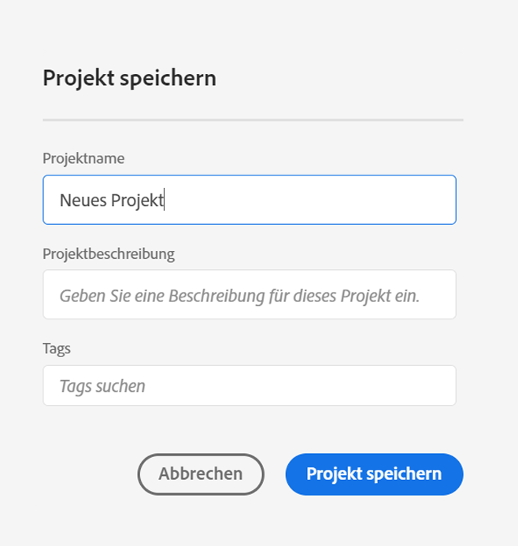
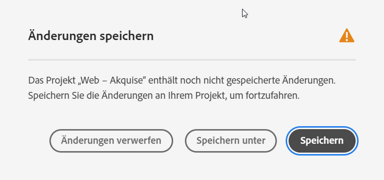
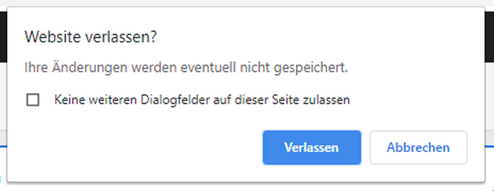

# Projekte speichern

Um Ihre Änderungen an einem Projekt zu speichern, gehen Sie zum Menü **[!UICONTROL Projekt]** in Workspace. Darüber hinaus speichert Adobe in bestimmten Fällen Projekte automatisch.

## Projektoptionen speichern {#Save}

Es gibt verschiedene Speicheraktionen, die Sie im Menü **[!UICONTROL Projekt]** ausführen können, je nachdem, wie Sie in Zukunft auf Ihre Analyse zugreifen möchten.

| Aktion | Beschreibung |
|---|---| 
| **[!UICONTROL Speichern]** | Speichern Sie die Änderungen an Ihrem Projekt. Wenn das Projekt freigegeben ist, sehen auch die Empfänger des Projekts die Änderungen. Wenn Sie das Projekt zum ersten Mal speichern, werden Sie aufgefordert, dem Projekt einen Namen, eine (optionale) Beschreibung und (optionale) Tags hinzuzufügen. |
| **[!UICONTROL Speichern unter]** | Erstellen Sie ein Duplikat Ihres Projekts. Das ursprüngliche Projekt bleibt davon unberührt. |
| **[!UICONTROL Als Vorlage speichern]** | Speichern Sie Ihr Projekt als [benutzerdefinierte Vorlage](https://docs.adobe.com/content/help/de-DE/analytics/analyze/analysis-workspace/build-workspace-project/starter-projects.html), die für Ihr Unternehmen unter **[!UICONTROL Projekt > Neu]** zur Verfügung steht. |

## Automatisches Speichern {#Autosave}

Bestehende Projekte, d.h. Projekte, die bereits mindestens einmal gespeichert wurden, werden alle zwei Minuten automatisch auf Ihrem lokalen Rechner gespeichert. Neue Projekte, die noch nie gespeichert wurden, werden derzeit nicht automatisch gespeichert.

Es gibt einige Szenarien, in denen Sie nicht gespeicherte Änderungen an einem Projekt verlassen können, was zu verschiedenen verfügbaren Aktionen führt.

### Öffnen eines anderen Workspace-Projekts

Adobe bietet die Möglichkeit, vor dem Verlassen der Seite zu speichern. Nach dem Verlassen eines bestehenden Projekts wird die automatisch gespeicherte lokale Kopie gelöscht.

### Verlassen oder Schließen einer Registerkarte

Der Browser warnt, dass nicht gespeicherte Änderungen verloren gehen. Sie können entscheiden, ob Sie die Registerkarte verlassen oder abbrechen möchten.

### Browser-Abstürze oder Zeitüberschreitung der Sitzung

Bei **bestehenden** Projekten wird dem Benutzer nach der Rückkehr zu Workspace ein Modal zur **Projektwiederherstellung** angezeigt. Durch Auswahl von „Ja“ wird das Projekt von der automatisch gespeicherten lokalen Kopie wiederhergestellt. „Nein“ löscht die automatisch gespeicherte lokale Kopie und öffnet die letzte vom Benutzer gespeicherte Version des Projekts.

Bei **neuen** Projekten, die noch nie gespeichert wurden, können nicht gespeicherte Änderungen nicht wiederhergestellt werden.