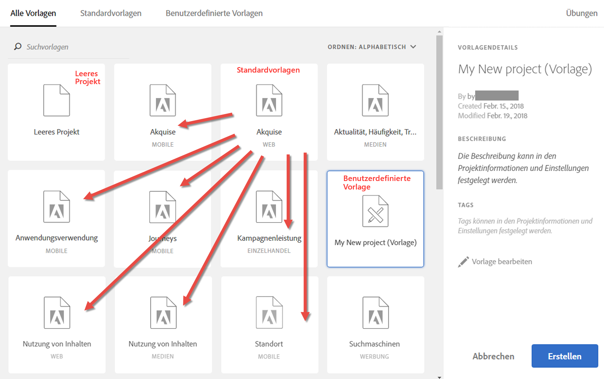
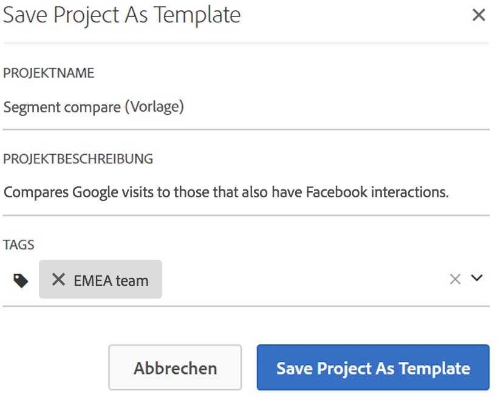
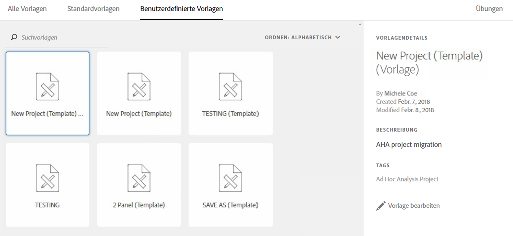

# Vorlagen

Für die Erstellung eines Projekts gibt es folgende Ausgangspunkte:

* **Leeres Projekt (Standard)**: Anweisungen hierzu finden Sie unter [Erstellen eines Projekts in Analysis Workspace](/help/analyze/analysis-workspace/home.md).
* **Standardvorlage**: Diese Vorlagen werden von Adobe erstellt und mit dem Produkt geliefert.
* **Benutzerdefinierte Vorlage**: Diese Vorlagen können von Benutzern mit Administratorrechten oder von Nichtadministratoren erstellt, freigegeben oder gelöscht werden, sofern ihnen die Berechtigung [!UICONTROL Analysis Workspace: als Vorlage speichern] in der Admin Console erteilt wurde. [Weitere Informationen ...](https://docs.adobe.com/content/help/de-DE/analytics/admin/admin-console/permissions/product-profile.html)

## Erstellen einer benutzerdefinierten Vorlage {#create-custom-template}

Benutzer mit Administratorrechten können aus jedem erstellten Projekt eine benutzerdefinierte Vorlage machen. So geht’s:

1. Öffnen Sie das Projekt.
1. Wählen Sie **[!UICONTROL Projekt]** > **[!UICONTROL Als Vorlage speichern]**.

   

   Das Projekt wird unter dem aktuellen Projektnamen gefolgt von dem Wort (Vorlage) in Klammern gespeichert. Administratoren können diese Benennung durch Bearbeiten der Vorlage ändern.

   >[!NOTE]
   >
   >Projektvorlagen sind standardmäßig für jeden in Ihrer Organisation sichtbar. Sie können sie ordnen, indem Sie Tags auf sie anwenden. (Wählen Sie **[!UICONTROL Projekt]** > **[!UICONTROL Projektinfo und Einstellungen]** aus, um Tags und Beschreibungen zu bearbeiten.)

### Auf benutzerdefinierte Vorlagen anwendbare Aktionen

| Aktion | Beschreibung |
|--- |--- |
| Vorlage   bearbeiten | Lässt einen Administrator die Vorlage durch Änderung der Datenquelle, Anpassung von Komponenten, Visualisierungen, Datumsbereichen usw. bearbeiten.  Um eine Standardvorlage zu bearbeiten, können Sie entweder<ul><li>die Liste von benutzerdefinierten Vorlagen in Analysis Workspace öffnen, eine auswählen und auf „Vorlage bearbeiten“ klicken oder</li><li>in Analytics „Komponenten“ > „Projekte“ auswählen und dann nach Vorlagen filtern. Klicken Sie auf den Namen der Vorlage, die Sie bearbeiten möchten.</li></ul>**Hinweis:** Nachdem Sie eine Vorlage bearbeitet haben, haben Sie je nach Situation zwei Optionen: „Speichern“ oder „Speichern unter“. Sie unterscheiden sich in Folgendem:<ul><li>**Speichern:** Die benutzerdefinierte Vorlage wird für alle Benutzer aktualisiert. Wenn jemand anderer ein Projekt aus dieser benutzerdefinierten Vorlage erstellt, sieht er die von Ihnen gemachten Änderungen.</li><li>**Speichern unter:** Erstellt eine Kopie der benutzerdefinierten Vorlage mit Ihren Änderungen. (Dass Sie im Bearbeitungsmodus sind, lässt sich daran erkennen, dass das Menüelement „Freigabe“ > „Projekt freigeben“ deaktiviert ist.)</li></ul> |
| Nach Vorlagen suchen | Klicken Sie im Dialogfeld „Benutzerdefinierte Vorlagen“ auf „Vorlagen suchen“. |
| Vorlagen ordnen | Sie können Vorlagen alphabetisch, nach Relevanz und nach Erstellungsdatum ordnen.  Klicken Sie im Dialogfeld „Benutzerdefinierte Vorlagen“ auf „Ordnen“. |
| Tags auf eine Vorlage anwenden | Öffnen Sie die Vorlage und wählen Sie „Projekt“ > „Projektinfo und Einstellungen“. Klicken Sie auf „Tags hinzufügen“. |
| Vorlagenbeschreibung ändern | Öffnen Sie die Vorlage und wählen Sie „Projekt“ > „Projektinfo und Einstellungen“. Doppelklicken Sie auf die Beschreibung und bearbeiten Sie sie. |

## Standardvorlagen

Wenn Sie einen Workspace zum ersten Mal öffnen, sind Vorlagen in der linken Leiste verfügbar. Analysis Workspace-Vorlagen decken häufige Anwendungsfälle ab. Diese sind senkrecht danach gruppiert, wohin sie gehören, und werden je nach der Report Suite, die Sie auswählen, mit verschiedenen Dimensionen, Segmenten, Metriken und Visualisierungen aufgefüllt.

Sie können diese fertig ausgefüllten Vorlagen unverändert übernehmen oder an Ihre spezifischen Anforderungen anpassen (indem Sie beispielsweise Metriken oder Visualisierungen hinzufügen oder austauschen) und dann unter einem neuen Namen speichern.

Hier finden Sie ein Tutorial zu [Standardvorlagen in Analysis Workspace](https://docs.adobe.com/content/help/en/analytics-learn/tutorials/analysis-workspace/analysis-workspace-basics/standard-templates-in-analysis-workspace.html) (2:46)

Im Folgenden finden Sie verfügbare Vorlagen und die Fragen, die die einzelnen Vorlagen beantworten.

### Schulung

Diese Standardvorlagen führen Sie durch die gängige Terminologie und die Schritte zum Erstellen Ihrer ersten Analyse in Workspace. Sie sind als Standardvorlage im Modal „Neues Projekt“ enthalten und ersetzen das Beispielprojekt, das bislang neuen Anwendern angeboten wurde, die keine anderen Projekte in ihrer Liste haben.

* **Schulungsanleitung – Internal Search Analysis**: Das Tutorial zur internen Suche hilft Ihnen zu verstehen, wonach Ihre Besucher auf der Website oder in der Mobile App suchen, jedoch nicht finden. Durch die Analyse dieser Art von Daten können sich Optimierungsmöglichkeiten für Inhalte offenbaren.

* **Schulungsanleitung – Marketing Analysis**: In diesem Tutorial erfahren Sie, wie Sie eine Marketing-Analyse für Ihre Führungskräfte erstellen, einschließlich der wichtigen benutzerdefinierten Dimensionen und Metriken.

### Werbung

>[!IMPORTANT]
>
>Werbevorlagen sind nur verfügbar, wenn Ihre Report Suite für Advertising Cloud aktiviert ist.

* **Paid Search-Suchmaschinen**: Diese Vorlage bietet eine Aufschlüsselung nach Werbe-Trends, Anzeigenplattformen, Keywords, Konten, Kampagnen und mehr.

### Handel

* **Magento: Marketing und Handel**: Diese Vorlage schlüsselt Ihre E-Commerce-Konversionen nach der Marketing-Kanal-Attribution auf und bietet Einblicke nach Suchbegriff, Landingpage, Standort und mehr. Eine Videoübersicht finden Sie unter:

>[!VIDEO](https://docs.adobe.com/content/help/en/analytics-learn/tutorials/integrations/magento/magento-analysis-workspace-template.html)

### Medien

* **Audio-Konsum**: Welche Inhalte werden von Benutzern am häufigsten aufgerufen?
* **Neuigkeit - Häufigkeit - Treue**: Wer sind meine treuen Leser?

### Mobile

>[!IMPORTANT]
>
>Mobile Vorlagen sind nur dann verfügbar, wenn Ihre Report Suite für „Mobile“ aktiviert ist.

* **Messaging:** Mit Augenmerk auf die Leistung von In-App- und Push-Nachrichten
* **Standort:** Beinhaltet eine Karte zur Anzeige von Standortdaten
* **Schlüsselmetriken:** Sehen Sie sich die wichtigsten Metriken Ihrer App genauer an.
* **App-Nutzung:** Wie viele App-Benutzer, Starts und erste Starts hat die App verzeichnet und wie lange dauerte eine durchschnittliche Sitzung?
* **Akquise:** Erfahren Sie mehr zur Leistung von mobilen Akquiselinks
* **Leistung:** Welche Leistung erzielt die Anwendung und wo haben Benutzer Probleme?
* **Bindungsgrad:** Wer sind meine treuen Benutzer und was tun sie?
* **Journeys:** Welche markanten Verwendungsmuster weist meine App auf?

### Einzelhandel

* **Kampagnenleistung:** Welche Kampagnen erzielen den höchsten Umsatz?
* **Produkte:** Welche Produkte schneiden am besten ab?

### Web

* **Akquise:** Was sind die wichtigsten Faktoren, durch die Traffic auf meine Website geleitet wird?
* **Content-Konsum:** Wohin navigieren Besucher auf meiner Website am häufigsten?
* **Bindungsgrad:** Welche Arten von Benutzern bleiben meiner Website wahrscheinlich treu?
* **Technologie:** Welche Technologien werden verwendet, um auf meine Website zu gelangen?

### Personen

>[!NOTE]
>
>Die Personenvorlage und die zugehörige Metrik für Personen sind nur im Rahmen von [Adobe Experience Cloud Device Co-op](https://docs.adobe.com/content/help/de-DE/device-co-op/using/data/people.html) verfügbar.

Diese Vorlage basiert auf der Personen-Metrik, die eine deduplizierte Version der Metrik „Unique Visitors“ ist. Die Metrik für Personen bietet einen Messwert im Hinblick darauf, wie oft Verbraucher, die mehrere Geräte verwenden, mit Ihrer Marke interagieren. Mithilfe der Vorlage können Sie

* Ihre Daten für die USA/Kanada gegen die restliche Welt segmentieren (Device Co-op ist momentan nur in Nordamerika verfügbar);
* die Metriken für Personen und Unique Visitors nebeneinander vergleichen;
* die Komprimierungsrate anzeigen (dabei handelt es sich um eine berechnete Metrik, mit der Sie bestimmen können, um wie viel geringer die Metrik für Personen als Prozentsatz der Unique Visitors ist);
* die Gesamtzahlen der Gerätetypen vergleichen, die Ihre Kunden verwenden;
* anzeigen, wie viele Geräte durchschnittlich pro Person verwendet werden;
* herausfinden, wie Sie die Segmentstapelung mit der Metrik für Personen verwenden;
* Entdecken Sie, wie die Experience Cloud ID in Ihrer Umgebung zur Effizienzverbesserung der Metrik für Personen beiträgt.

### Journey IQ: Vorlage für geräteübergreifende Analyse

<!--This content is mirrored in the CDA doc.-->

Mit dieser Vorlage können Sie wichtige geräteübergreifende Leistungsdaten erfassen. Sie steht nur Kunden zur Verfügung, die Zugriff auf [geräteübergreifende Analysen](https://docs.adobe.com/content/help/de-DE/analytics/components/cda/cda-home.html) (Cross-Device Analytics, CDA) haben.

* **Besondere Anmerkung für die Mitglieder des Co-op-Diagramms**: Zeigt, welcher Teil Ihrer Report Suite Besucher enthält, die aus Regionen stammen, in denen das Co-op-Diagramm unterstützt wird, und welcher Teil aus Regionen stammt, in denen es nicht unterstützt wird.
* **Identifizierung der Benutzer**: Zeigt an, wie oft Besucher Ihrer Site mit Methoden identifiziert werden, die auf geräteübergreifenden Analysen basieren.
* **Messen der Zielgruppengröße**: Zeigt einen Vergleich von „Eindeutige Geräte“ mit „Personen“ an. Der Anteil dieser beiden Zahlen wird als „geräteübergreifende Komprimierung“ bezeichnet, eine berechnete Metrik, die in diesem Bedienfeld angezeigt wird. Diese Komprimierungsmetrik hängt von einer Vielzahl von Faktoren ab:
   * **Verwenden des Co-op-Diagramms oder des privaten Diagramms**: Im Allgemeinen erhalten Organisationen, die die Co-op-Funktion von Geräten verwenden, bessere Komprimierungsraten als Organisationen, die das private Diagramm verwenden.
   * **Anmelderate**: Je mehr Benutzer sich auf Ihrer Site anmelden, desto besser kann Adobe Besucher geräteübergreifend identifizieren und zuordnen. Sites mit einer niedrigen Anmelderate haben auch niedrige Komprimierungsraten.
   * **Experience Cloud ID-Abdeckung**: Es können nur Besucher mit einer ECID zugeordnet werden. Ein geringerer Prozentsatz der Site-Besucher, die eine ECID verwenden, steht im Zusammenhang mit niedrigeren Komprimierungsraten.
   * **Verwendung mehrerer Geräte**: Wenn Besucher Ihrer Site nicht mehrere Geräte verwenden, erhalten Sie niedrigere Komprimierungsraten.
   * **Berichtsgranularität**: Die Komprimierung nach Tag ist in der Regel kleiner als die Komprimierung nach Monat oder Jahr. Die Wahrscheinlichkeit, dass eine Person mehrere Geräte verwendet, ist innerhalb eines Tages geringer als innerhalb eines ganzen Monats. Bei der Segmentierung, Filterung oder Verwendung von Aufschlüsselungsdimensionen kann es auch zu einer niedrigeren Komprimierungsrate kommen.
* **Personenbasierte Segmente**: Enthält eine Segment-Dropdown-Liste, mit der Sie gerätespezifische Daten anzeigen können. In diesem Bedienfeld können Sie mit Segmenten experimentieren, um festzustellen, wie sich das Einschließen oder Ausschließen von Gerätetypen auf Berichte auswirkt.
* **Analyse der geräteübergreifenden Journey**: Bietet Fluss- und Fallout-Berichte je nach Gerätetyp.
* **Geräteübergreifende Zuordnung**: Kombinieren Sie die Funktionen von Journey IQ und Attribution IQ miteinander.
* **Weitere Tipps und Tricks**: Hilfreiche Themen rund um CDA, mit denen Sie die Nutzung optimieren können.