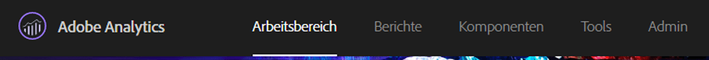
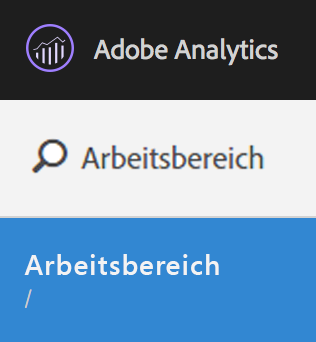
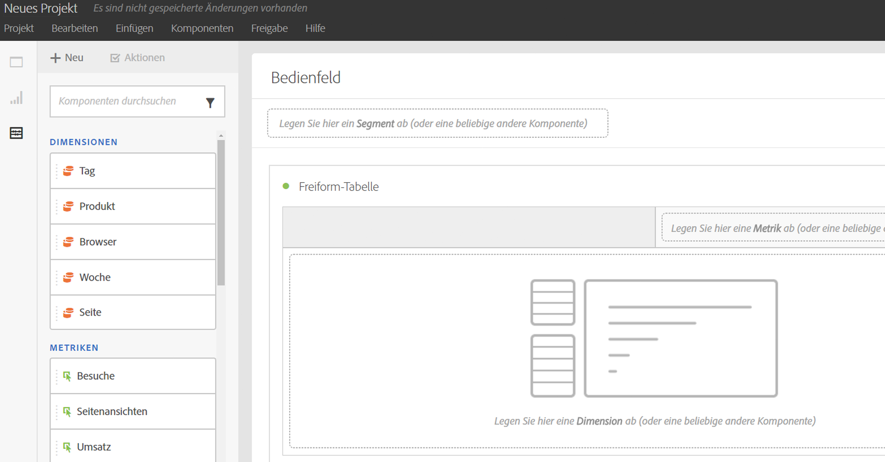
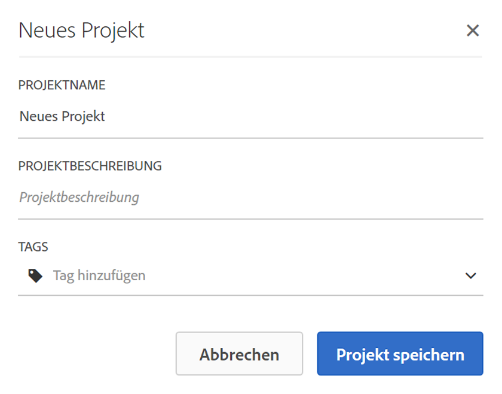
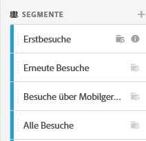
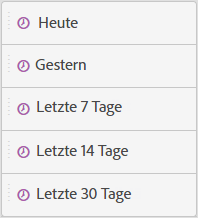
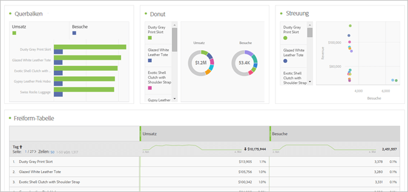
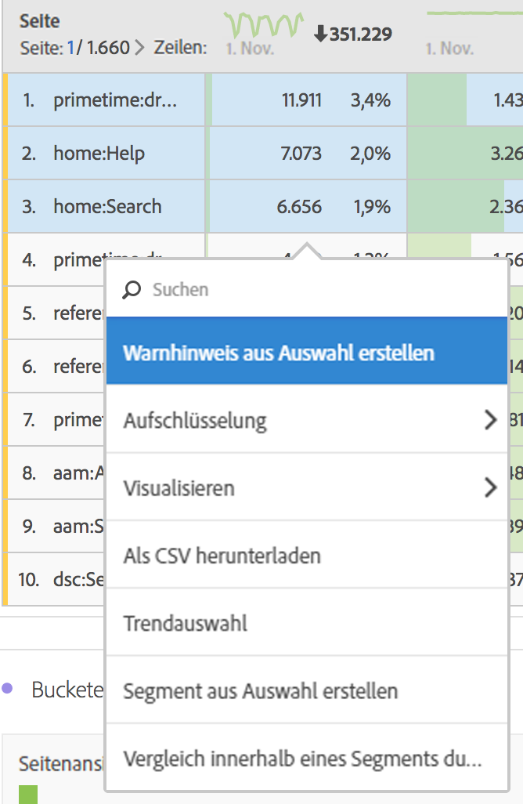

# Workspace-Projekt erstellen

Erstellen Sie ein Projekt und fügen Sie dem Freiform-Bedienfeld Komponenten (Dimensionen, Metriken, Segmente, Datumsbereiche) hinzu.

In diesem Beitrag werden die Elemente der Benutzeroberfläche des Analysis Workspace erläutert und Sie erfahren, wie ein Projekt erstellt wird. Spezifische Anwendungsfälle finden Sie unter [Anwendungsfälle für den Analysis Workspace](../../../analyze/analysis-workspace/freeform-analysis-examples-use-cases.md#concept_173D1EB783F24EA89E754628BA30FF4B).

## Erstellen Sie ein Projekt

1. Legen Sie die Benutzerberechtigung zum Erstellen und Kuratieren von Projekten fest.

   Damit Sie ein Projekt in Analysis Workspace erstellen oder kuratieren können, müssen die Administratoren Sie zuerst zu einer Gruppe hinzufügen, für die die Berechtigung zum **Erstellen/Kuratieren von Projekten in Analysis Workspace** aktiviert ist, oder zu einer Benutzergruppe mit **[!UICONTROL Zugriff auf alle Berichte].** ( **[!UICONTROL Admin]** &gt; **[!UICONTROL User Management]** &gt; [Groups](https://marketing.adobe.com/resources/help/en_US/reference/groups.html)).

1. In the [!DNL Experience Cloud], click **[!UICONTROL Analytics]** &gt; **[!UICONTROL Workspace]**.

   

   Geben Sie alternativ einen Schrägstrich (/) ein, um die Berichtssuche zu öffnen, und geben Sie *`workspace`*.

   

1. Click **[!UICONTROL Create New Project]**.

   Für die Erstellung eines Projekts gibt es folgende Ausgangspunkte:

* Ein leeres Projekt (Standard). Eine Anleitung finden Sie unten.
* Eine Standardvorlage. Diese Vorlagen wurden von Adobe erstellt und können sofort verwendet werden. Eine Anleitung finden Sie unter [Vorlagen](../../../analyze/analysis-workspace/build-workspace-project/starter-projects.md#concept_49B9A327C5004DB0A4BE6291435625C5)
* Eine benutzerdefinierte Vorlage. Diese Vorlagen werden von Benutzern mit Administratorrechten erstellt. Eine Anleitung finden Sie unter [Vorlagen](../../../analyze/analysis-workspace/build-workspace-project/starter-projects.md#concept_49B9A327C5004DB0A4BE6291435625C5)

   

1. To create a project from a blank project, click **[!UICONTROL Blank Project]**.

   * Then click **[!UICONTROL Create]**, or
   * einfach auf **[!UICONTROL Eingabe]**.
   Ein leeres Projekt wird angezeigt, das einen Freiformbereich und eine Datentabellenvisualisierung enthält.

   

   >[!NOTE]
   >
   >Manchmal wird beim Laden eines Projekts (oder beim Wechsel zu einer Report Suite) die Meldung "Inkompatible Report Suite"angezeigt, wenn nicht alle Komponenten (Metriken/Dimensionen) des Projekts in der Report Suite enthalten sind. Sie können eine Liste der nicht kompatiblen Komponenten anzeigen und wissen somit, warum Sie die Meldung erhalten.

<table id="table_3989E45D9D4241CBB2E58B29DA257B2F"> 
 <thead> 
  <tr> 
   <th colname="col1" class="entry"> Element </th> 
   <th colname="col2" class="entry"> Beschreibung </th> 
  </tr> 
 </thead>
 <tbody> 
  <tr> 
   <td colname="col1"><a href="../../../analyze/analysis-workspace/components/analysis-workspace-components.md#concept_BEBE3A75E072495D9E2F895567BBD462" format="dita" scope="local"> Komponenten</a> </td> 
   <td colname="col2"> 
Dimensionen, Metriken, Segmente und Datumsbereiche, die Sie in Projekte ziehen können 
 </td> 
  </tr> 
  <tr> 
   <td colname="col1"><a href="../../../analyze/analysis-workspace/visualizations/freeform-analysis-visualizations.md#concept_09242627629147A88A68F1506954C276" format="dita" scope="local"> Visualisierungen</a> </td> 
   <td colname="col2"> 
Elemente, die Sie in den Bereich oder die Projektbereiche der Benutzeroberfläche ziehen können 
 </td> 
  </tr> 
  <tr> 
   <td colname="col1"><a href="../../../analyze/analysis-workspace/visualizations/freeform-table.md#concept_0D2E24FCCBAF4194AA941448860E422F" format="dita" scope="local">Freiformbereich</a> </td> 
   <td colname="col2"> 
Die Arbeitsfläche bzw. der Arbeitsbereich, in dem Sie mit dem Analysis Workspace interagieren 
 </td> 
  </tr> 
 </tbody> 
</table>

1. Speichern Sie Ihr Projekt. Vergeben Sie einen Namen für das Projekt, geben Sie eine Beschreibung an (optional, aber hilfreich) und taggen Sie das Projekt (optional). Klicken Sie dann auf **[!UICONTROL Projekt speichern]**.

   

1. Sie können eine Visualisierung oder ein Bedienfeld nun per Rechtsklick kopieren und das kopierte Element dann an einer anderen Stelle innerhalb des Projekts oder in ein anderes Projekt einfügen.

   Mithilfe dieser Funktion können Sie Bausteine – vordefinierte Visualisierungen/Bedienfelder – erstellen und diese in andere Projekte kopieren, wodurch Ihnen ein schnellerer Start mit Ihren unternehmensspezifischen Daten ermöglicht wird.

   >[!NOTE]
   >
   >Nach dem Kopieren/Speichern unter beziehen sich die Intra-Links jetzt auf das Projekt, in dem sie leben, und nicht auf das ursprüngliche Projekt, aus dem sie kopiert wurden.

## Komponenten und Visualisierungen hinzufügen {#task_CDAC9B3007BE4A3790AFAD3746D669B1}

1. Erstellen Sie Ihr Projekt durch Ziehen *`components`* und *`visualizations`* zum Projekt.

   **Komponenten**

   Die Komponenten-Symbolleiste zeigt suchbare Dimensionen, Metriken, Segmente und Datumsbereiche an, die Sie häufig verwenden.

<table id="table_4626163E26DE46CB86391868BBA3AD32"> 
 <thead> 
  <tr> 
   <th colname="col1" class="entry"> Komponente </th> 
   <th colname="col2" class="entry"> Beschreibung </th> 
  </tr> 
 </thead>
 <tbody> 
  <tr> 
   <td colname="col1"> Dimensionen (orange) </td> 
   <td colname="col2"> 
Werden auf der Projektebene angewendet 
 
 
 
Prop#, eVar# und event# werden an die Namen der Dimensionen angehängt. Daraufhin können Sie nach diesen Zahlen suchen. Beispiel: „Interne Kampagne“ wird in der linken Schiene als „Interne Kampagne (evar2)“ angezeigt. 
 
 Beachten Sie, dass die Zahlen für prop, eVar und Ereignisse nicht in der Tabelle angezeigt werden (damit die Titel kurz gehalten werden). 
 
Es gibt eine standardmäßige Sortierreihenfolge für einige Out-of-the-Box-Dimensionen, wenn diese in eine Freiform-Tabelle gezogen oder in der linken Schiene angezeigt werden. Wenn zum Beispiel „Stunde des Tages“ in einer Tabelle abgelegt oder in der linken Schiene angezeigt wird, ist die Sortierreihenfolge aufsteigend von 0:00 Uhr bis 23:00 Uhr. Sie haben auch die Möglichkeit, nach einer Metrikspalte zu sortieren. 
 </td> 
  </tr> 
  <tr> 
   <td colname="col1"> Metriken (grün) </td> 
   <td colname="col2"> 
Werden auf der Projektebene angewendet. 
 
 
 
  Vorfälle ist die Standardmetrik für die Datentabelle. 
 </td> 
  </tr> 
  <tr> 
   <td colname="col1"> Segmente (blau) </td> 
   <td colname="col2"> 
Können per Drag &amp; Drop nur auf Bereichsebene angewendet werden, Sie können jedoch Inline-Segmente in der Datentabelle erstellen. 
 
 
 
Weitere Informationen finden Sie unter <a href="../../../analyze/analysis-workspace/freeform-analysis-examples-use-cases.md#concept_173D1EB783F24EA89E754628BA30FF4B" format="dita" scope="local"> Anwendungsfälle für den Analysis Workspace</a> . 
 </td> 
  </tr> 
  <tr> 
   <td colname="col1"> Datumsbereiche und Granularitäten (violett) </td> 
   <td colname="col2"> 
Können per Drag &amp; Drop nur auf Bereichsebene angewendet werden. Sie können ein Projekt aus dem Kalender erstellen, wenn Sie einen Datumsbereich konfigurieren. 
 
 
 </td> 
  </tr> 
 </tbody> 
</table>

**[Visualisierungen](../../../analyze/analysis-workspace/visualizations/freeform-analysis-visualizations.md#concept_09242627629147A88A68F1506954C276)**

Der Bereich [!UICONTROL Visualisierungen] enthält standardmäßige Analytics-Graphen, Ringdiagramme, Datentabellen, [Kohorten](../../../analyze/analysis-workspace/visualizations/cohort-table/cohort-analysis.md#concept_9D240A490265427DA694D18D14EACC0E)-Tabellen, Venn-Diagramme usw. Sie können mehrere Visualisierungen per Drag &amp; Drop in Ihrem Projekt platzieren.

1. Schritt

## Daten mit dem Kontextmenü per Rechtsklick individuell anpassen {#concept_8117C300F21843B99F4E1B9AB7B11B6F}

Im Kontextmenü (Rechtsklick) können Sie die folgenden Aktionen ausführen (abhängig von der in der Tabelle angeklickten Zelle).

<table id="table_0F84CC5B604D4D41BD0C9668DF525929"> 
 <thead> 
  <tr> 
   <th colname="col1" class="entry"> Aktion </th> 
   <th colname="col2" class="entry"> Beschreibung </th> 
  </tr>
 </thead>
 <tbody> 
  <tr> 
   <td colname="col1"><a href="../../../analyze/analysis-workspace/components/calendar-date-ranges/time-comparison.md#concept_93BCAD81B7A54ABBBA5CD9E419F6F764" format="dita" scope="local"> Spalte mit Zeitraum hinzufügen</a> </td> 
   <td colname="col2"> </td> 
  </tr> 
  <tr> 
   <td colname="col1"><a href="../../../analyze/analysis-workspace/components/calendar-date-ranges/time-comparison.md#concept_93BCAD81B7A54ABBBA5CD9E419F6F764" format="dita" scope="local"> Zeiträume vergleichen</a> </td> 
   <td colname="col2"> </td> 
  </tr> 
  <tr> 
   <td colname="col1"> 
In die Zwischenablage kopieren 
 </td> 
   <td colname="col2"> </td> 
  </tr> 
  <tr> 
   <td colname="col1"> 
Auswahl löschen 
 </td> 
   <td colname="col2"> </td> 
  </tr> 
  <tr> 
   <td colname="col1"><a href="/help/components/c-alerts/intellligent-alerts.md" format="dita" scope="local"> Warnhinweis aus Auswahl erstellen</a> </td> 
   <td colname="col2"> </td> 
  </tr> 
  <tr> 
   <td colname="col1"><a href="../../../analyze/analysis-workspace/components/dimensions/t-breakdown-fa.md#task_B594DA2476E84DFDA8279E831F0BD9C4" format="dita" scope="local"> Aufschlüsselung</a> 
    <ul id="ul_18C83B8514AD4C1C86C071AA8402CB5C"> 
     <li id="li_6CA84ED293EA4940A7495DA9D9121264">Dimensionen </li> 
     <li id="li_EA16EE017B2E4A6998918706938A21BF">Metriken </li> 
     <li id="li_0405D339CD01405DB508A7D8D1A976B4">Segmente </li> 
     <li id="li_819CE81C552F49BB9C1B83ED3B42C5F7">Zeit </li> 
    </ul> </td> 
   <td colname="col2"> </td> 
  </tr> 
  <tr> 
   <td colname="col1"><a href="../../../analyze/analysis-workspace/visualizations/freeform-analysis-visualizations.md#concept_09242627629147A88A68F1506954C276" format="dita" scope="local"> Visualisieren</a> </td> 
   <td colname="col2"> </td> 
  </tr> 
  <tr> 
   <td colname="col1"><a href="../../../analyze/analysis-workspace/curate-share/download-send.md#concept_BB548979F47F45739679B830428C3025" format="dita" scope="local"> Als CSV herunterladen</a> </td> 
   <td colname="col2"> </td> 
  </tr> 
  <tr> 
   <td colname="col1"><a href="../../../analyze/analysis-workspace/analysis-workspace-features.md#concept_4D69EE46E3C24EEB97C935A8789364F9" format="dita" scope="local"> Trendauswahl</a> </td> 
   <td colname="col2"> </td> 
  </tr> 
  <tr> 
   <td colname="col1"><a href="../../../analyze/analysis-workspace/components/t-freeform-project-segment.md#task_11C6A2C7717B48049E5750B9D20FEC80" format="dita" scope="local"> Segment aus Auswahl erstellen</a> </td> 
   <td colname="col2"> </td> 
  </tr> 
  <tr> 
   <td colname="col1"><a href="../../../analyze/analysis-workspace/c-panels/c-segment-comparison/segment-comparison.md#concept_74FAC1C6D0204F9190A110B0D9005793" format="dita" scope="local"> In Segmentvergleich ausführen</a> </td> 
   <td colname="col2"> </td> 
  </tr> 
  <tr> 
   <td colname="col1"> Nur ausgewählte Zeilen anzeigen </td> 
   <td colname="col2"> </td> 
  </tr> 
  <tr> 
   <td colname="col1"> Alle Zeilen anzeigen </td> 
   <td colname="col2"> </td> 
  </tr> 
 </tbody> 
</table>

Informationen zum Kopieren und Auswählen von Zeilen finden Sie unter [Tastatur- und Mausinteraktionen in Analysis Workspace](../../../analyze/analysis-workspace/build-workspace-project/fa-shortcut-keys.md#concept_9A6356084DBC4D468E265E7A65B3E051).
