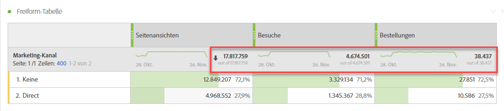
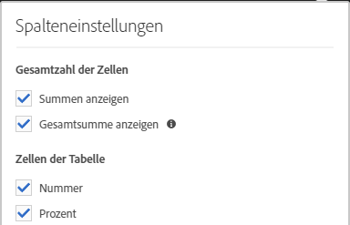
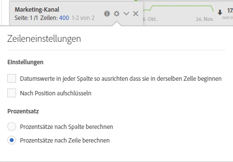

# Workspace-Summen

In Freiformtabellen wird auf jeder Unterteilungsebene eine Zeile insgesamt angezeigt, die zwei Summen enthalten kann:

* **[!UICONTROL Gesamtsumme]** (graue „von“-Zahl) – dieser Gesamtwert stellt alle erfassten Treffer dar, manchmal auch als „Report Suite-Gesamtsumme“ bezeichnet. Wenn ein Segment entweder auf Bedienfeldebene oder in der Freiformtabelle angewendet wird, passt sich diese Summe an, um alle Treffer wiederzugeben, die den Segmentkriterien entsprechen.
* **[!UICONTROL Tabellensumme]** (schwarze Zahl) - dieser Gesamtwert entspricht in der Regel der [!UICONTROL Gesamtsumme] oder einer Untergruppe davon. Er spiegelt alle Tabellenfilter wider, die innerhalb der Freiformtabelle angewendet werden, einschließlich der Option [!UICONTROL Keine einschließen].

## Gesamteinstellung anzeigen {#display-total}

Unter **[!UICONTROL Spalteneinstellungen]** finden Sie die Optionen **[!UICONTROL Summen anzeigen]** und **[!UICONTROL Gesamtsumme anzeigen]**. Wenn diese Einstellungen deaktiviert sind, werden die Summen aus der Tabelle entfernt. Dies kann in Fällen gewünscht werden, in denen Summen beispielsweise in bestimmten [Szenarien mit berechneten Metriken](https://docs.adobe.com/content/help/de-DE/analytics/components/calculated-metrics/calcmetrics-reference/cm-totals.html) keinen Sinn ergeben.

## Gesamteinstellungen für statische Zeile {#static-row-total}

Die Gesamtwerte für [statische Zeilen](https://docs.adobe.com/content/help/de-DE/analytics/analyze/analysis-workspace/build-workspace-project/column-row-settings/manual-vs-dynamic-rows.html) verhalten sich anders und werden unter **[!UICONTROL Zeileneinstellungen]** gesteuert.

* **[!UICONTROL Summe der aktuellen Zeilen als Gesamtsumme anzeigen]**: Zeigt eine clientseitige Summe der Zeilen in der Tabelle, was bedeutet, dass die Gesamtsumme die Metriken wie Besuche oder Besucher **nicht** dedupliziert.
* **[!UICONTROL Gesamtsumme anzeigen]**: Zeigt eine serverseitig Summe an, d. h. die Gesamtsumme dedupliziert Metriken wie Besuche oder Besucher.

## Häufig gestellte Fragen

| Fragen | Antwort |
|---|---|
| Auf welcher Summe basieren die grauen Spaltenprozentsätze? | Dies hängt von der Einstellung **[!UICONTROL Prozentwerte]** unter **[!UICONTROL Zeileneinstellungen]** ab:<ul><li>Prozentsatz nach Spalte berechnen - Dies ist die Standardeinstellung. Prozentsätze basieren auf der Tabellensumme.</li><li>Prozentsatz nach Zeile berechnen - Prozentsätze werden auf Basis der Gesamtsumme berechnet.</li></ul> |
| Wie wirkt sich die Einstellung **[!UICONTROL Nicht angegeben (keine) einschließen]** auf die Gesamtwerte aus? | Wenn die Einstellung **[!UICONTROL Nicht angegeben (keine) einschließen]** deaktiviert ist, wird die Zeile „Keine/Nicht angegeben“ aus der Tabelle und der Tabellensumme entfernt und wird in alle berechneten Metriken übernommen, die [Metriktypen ‚Gesamt‘](https://docs.adobe.com/content/help/de-DE/analytics/components/calculated-metrics/calcmetric-workflow/m-metric-type-alloc.html) verwenden. |
| Wenn benutzerdefinierte Tabellenfilter auf eine Freiformtabelle angewendet werden, werden alle berechneten Metriken und die bedingte Formatierung für den Filter berücksichtigt? | Derzeit nicht. **[!UICONTROL Nicht angegeben (keine) einschließen]** wird berücksichtigt, benutzerdefinierte Tabellenfilter haben jedoch keine Auswirkungen auf Folgendes:<ul><li>Maximaler/minimaler Spaltenbereich, der bei der bedingten Formatierung verwendet wird, wird über alle Daten hinweg angezeigt.</li><li>Berechnete Metriken, die Metriktypen **[!UICONTROL insgesamt]** nutzen.</li><li>Berechnete Metriken mit Funktionen, die über Zeilen in einer Freiformtabelle berechnen - d. h. Spaltensumme, Spaltenmax., Spaltenanzahl, Anzahl, Mittelwert, Median, Perzentil, Quartil, Zeilenzahl, Standardabweichung, Varianz, Kumulativer Wert, Kumulativer Durchschnitt, Regressionsvarianten, T-Score, T-Test, Z-Score, Z-Test.</li></ul> |
| Was spiegelt der Metriktyp **[!UICONTROL Gesamtsumme]** in berechneten Metriken wider? | Die **[!UICONTROL Gesamtsumme]** bezieht sich weiterhin auf die **[!UICONTROL Gesamtsumme]** und spiegelt keine Filter wider, die auf eine Tabelle oder die **[!UICONTROL Tabellensumme]** angewendet wurden. |
| Welcher Gesamtwert wird angezeigt, wenn Daten entweder kopiert und aus einer Freiformtabelle eingefügt oder über CSV heruntergeladen werden? | Die Zeile insgesamt spiegelt nur die **[!UICONTROL Tabellensumme]** wider und berücksichtigt die Einstellung **[!UICONTROL Summen anzeigen]**. |

