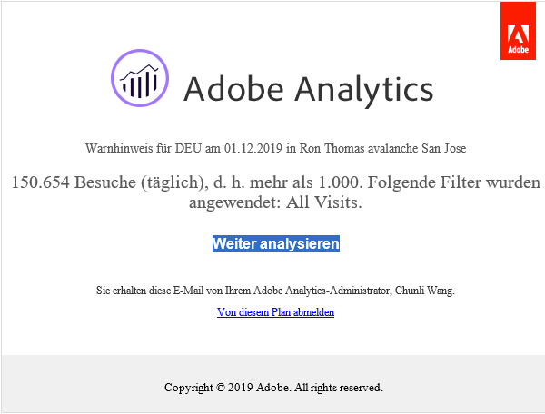
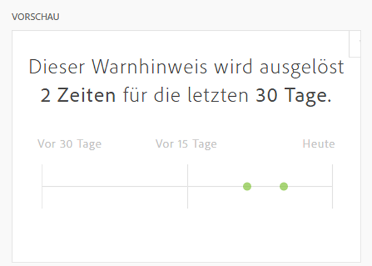

# Warnhinweiserstellung

>[!IMPORTANT]
>
>Intelligente Warnhinweise sind nur für Kunden von Adobe Analytics Prime und Adobe Analytics Ultimate verfügbar.

## Warnhinweiserstellung aufrufen

Für den Zugriff auf die Warnhinweiserstellung gibt es vier Möglichkeiten:

* Mithilfe des folgenden Tastaturbefehls in Analysis Workspace:

   `ctrl (or cmd) + shift + a`
* Indem Sie zu **[!UICONTROL Workspace]** > **[!UICONTROL Komponenten]** > **[!UICONTROL Neuer Warnhinweis]** navigieren.
* Indem Sie ein oder mehrere Freiform-Tabellenzeilenelemente auswählen, mit der rechten Maustaste klicken und **[!UICONTROL Warnhinweis aus Auswahl erstellen auswählen]**.
* Indem Sie in einem Reports &amp; Analytics-Bericht zu **[!UICONTROL Mehr]** > **[!UICONTROL Warnhinweis hinzufügen]** navigieren.

## Warnhinweise erstellen

Die Benutzeroberfläche der Warnhinweiserstellung ähnelt dem Segment-Manager und dem Manager für berechnete Metriken in Analytics:

<!--Meike, I edited this table for validation -->

**Warnungsname**

Geben Sie einen Namen für den Warnhinweis an. Der Warnhinweisname könnte den Namen des Berichts oder den Schwellenwert einer Metrik enthalten.

**Zeitgranularität**

Geben Sie an, wann die Metrik überprüft werden soll: stündlich, täglich, wöchentlich oder monatlich.

>[!NOTE]
>
>Bei Report Suites mit einem benutzerdefinierten Kalender wird die monatliche Abstufung in der Warnhinweiserstellung nicht unterstützt.

**Empfänger**

Geben Sie an, wo der Warnhinweis hingeschickt werden soll. Ein Warnhinweis kann an einen Analyse-Benutzer, eine Analyse-Gruppe, eine E-Mail-Adresse oder eine Telefonnummer gesendet werden.

>[!IMPORTANT]
>
>Die Telefonnummer muss über ein vorangestelltes Pluszeichen („+“) und eine [Landesvorwahl](https://countrycode.org/) verfügen.

Die E-Mail, die ein Benutzer erhalten würde, sobald ein Warnhinweis ausgelöst wurde, sieht in etwa so aus:

**Ablaufdatum**

Legen Sie das Ablaufdatum eines Warnhinweises fest.

**Warnhinweis senden, wenn...**

*... Jede dieser Metriken ist ein Auslöser*

* Ziehen Sie Metriken per Drag &amp; Drop in die Arbeitsfläche, um Auslöser hinzuzufügen.

   Wenn nicht alle Komponenten (Metriken/Dimensionen/Segmente) des Warnhinweises mit der aktuell ausgewählten Report Suite kompatibel sind, wird die Meldung **Nicht kompatible Komponenten** angezeigt.
* Legen Sie den Schwellenwert fest, den die Metrik überschreiten muss, damit ein Warnhinweis ausgegeben wird. Sie können diesen Wert auf einen Schwellenwert und anschließend auf eine der folgenden Bedingungen setzen:

   * Anomalie vorhanden
   * Anomalie liegt über erwartetem Wert
   * Anomalie liegt unter erwartetem Wert
   * ist größer oder gleich
   * ist kleiner oder gleich
   * ändert sich um
   * Sie können einen Schwellenwert von 90 %, 95 %, 99 %, 99,75 % und 99,9 % festlegen.

   Beachten Sie, dass Sie auch berechnete Metriken verwenden können.

*... Mit diesen Filtern*

* Platzieren Sie mittels Drag-and-Drop Segmente oder Dimensionen, um Filter hinzuzufügen. Wenn Sie zum Beispiel ein Segment vom Typ „Nur Mobilgeräte“ hinzufügen, würde die Regel nur für Mobilgeräte ausgelöst werden.
* Zusätzliche Filter werden mithilfe einer AND-Anweisung hinzugefügt.

**Eine Regel hinzufügen**

Per Klick auf das Zahnrad-Symbol können Sie AND- oder OR-Regeln hinzufügen.

## Warnungen in der Vorschau anzeigen {#section_10D75BA7B77E4C5FAF58A719C082E070}

Die interaktive Warnhinweisvorschau zeigt Ihnen basierend auf Daten aus der Vergangenheit, wie oft damit zu rechnen ist, dass ein Warnhinweis ausgelöst wird.

Beispiel: Wenn Sie die Zeitgranularität auf „Stündlich“ festlegen, kann Ihnen die Vorschau verraten, dass der Warnhinweis zu einer bestimmten Metrik während der letzten 30 oder 31 Tage x-mal ausgelöst worden wäre.

Wenn Sie feststellen, dass Warnhinweise zu oft ausgelöst werden würden, können Sie den Schwellenwert im [Warnhinweis-Manager](/help/components/c-alerts/alert-manager.md) anpassen.

