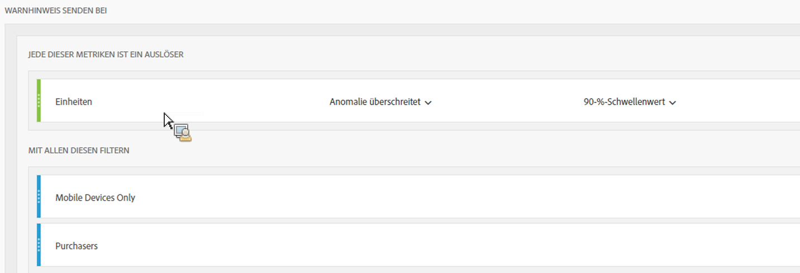

# Intelligente Warnhinweise – Anwendungsfälle

## Erstellen eines einfachen Warnhinweises, der nach zwei Segmenten gefiltert wird {#section_2E96FFFA93D44F7D8DBCEC97203204AA}

<!-- 

Update screenshots for better readability.

 -->

## Erstellen eines Warnhinweises aus einer Tabellenauswahl {#section_AE6D42E1255D498D908A2FA60370A419}

In Freiform-Tabellen können Sie nun kontextbezogene Warnhinweise erstellen, indem Sie mit der rechten Maustaste auf eine Tabellenzeile klicken und **[!UICONTROL Warnhinweis aus Auswahl erstellen auswählen]**.

Dadurch wird die Warnhinweiserstellung unverzüglich mit den entsprechenden Werten ausgefüllt, um einen Warnhinweis mit den korrekten Metriken und Filtern zu erstellen:

## Warnhinweise zusammenfassen (stapeln), anstatt mehrere Warnhinweise zu erstellen {#section_B27B0856BA104B9FB6D0BBB317633F18}

Durch das Stapeln von Warnhinweisen wird dafür gesorgt, dass Warnhinweise kombiniert werden und nicht separat angezeigt werden.

