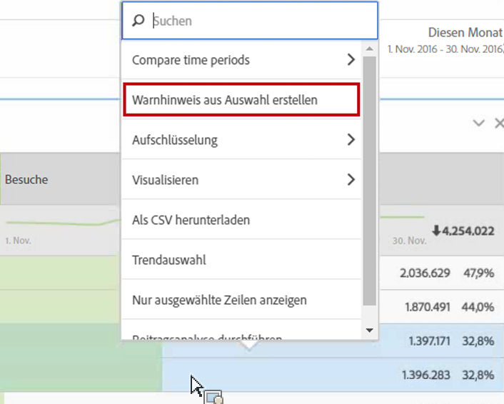
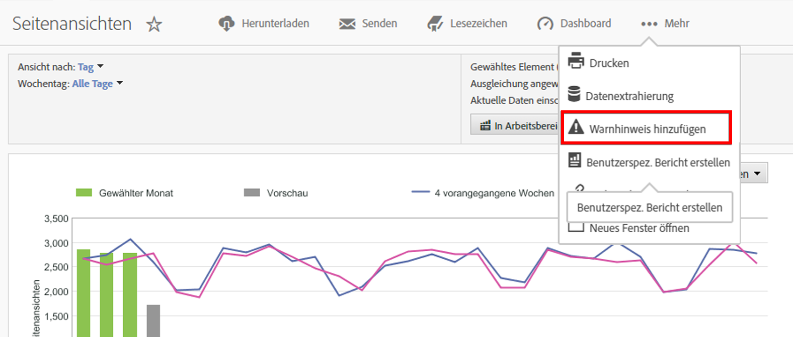

# Übersicht über intelligente Warnhinweise

Intelligente Warnhinweise ermöglichen eine feiner abgestufte Kontrolle über Warnhinweise und integrieren die Anomalieerkennung in das Warnhinweissystem.

Im Folgenden finden Sie eine Videoschulung zu [intelligenten Warnhinweisen](https://docs.adobe.com/content/help/en/analytics-learn/tutorials/data-science/intelligent-alerts.html) (5:34)

## Überblick

Die neuen Funktionen „Warnhinweiserstellung“ und „Warnhinweis-Manager“ in Analysis Workspace ersetzen die bisherigen Funktionen in Reports &amp; Analytics. Mithilfe intelligenter Warnhinweise können Sie:

* Warnhinweise erstellen, die auf Anomalien basieren (90-%-, 95-%-, 99-%-, 99,75-%- und 99,9-%-Schwellen, Änderungen in %, darüber/darunter)
* In einer Vorschau anzeigen, wie oft ein Warnhinweis ausgelöst wird
* Warnhinweise per E-Mail oder SMS mit Links zu automatisch erstellten Projekten in Analysis Workspace verschicken
* „Gestapelte“ Warnhinweise erstellen, die mehrere Metriken in einem Warnhinweis vereinen.

Es gibt vier Möglichkeiten, in die Warnhinweiserstellung zu gelangen:

* Direkt zum Warnhinweiserstellung wechseln: **[!UICONTROL Komponenten]** > **[!UICONTROL Warnhinweise]**
* Verwenden des Tastaturbefehls in Workspace: `Ctrl + Shift + A` (Windows) oder `Cmd + Shift + A` (Mac)
* Ein oder mehrerer Freiformtabellen-Zeilenelemente auswählen, mit der rechten Maustaste klicken und **[!UICONTROL Warnhinweis aus Auswahl erstellen]** auswählen. Dadurch wird der Warnhinweiserstellung geöffnet und die entsprechenden Metriken und angewendeten Filter werden vorab ausgefüllt. Falls erforderlich, können Sie den Warnhinweis dann bearbeiten.

   

* Indem Sie in einem Reports &amp; Analytics-Bericht zu **[!UICONTROL Mehr]** > **[!UICONTROL Warnhinweis hinzufügen]** navigieren. Dadurch wird die Warnhinweiserstellung geöffnet und die entsprechenden Metriken und angewendeten Filter aus dem Bericht werden vorausgefüllt. Falls erforderlich, können Sie den Warnhinweis dann bearbeiten.

   

Bei den prozentualen Schwellenwerten handelt es sich um Standardabweichungen. Beispiel: 95 % = 2 Standardabweichungen und 99 % = 3 Standardabweichungen. Je nach der von Ihnen ausgewählten Zeitgranularität  werden [verschiedene Modelle](../virtual-analyst/c-anomaly-detection/statistics-anomaly-detection.md) verwendet, um zu berechnen, wie weit jeder Punkt von der Norm entfernt ist (Anzahl der Standardabweichungen). Wenn Sie einen niedrigeren Schwellenwert festlegen (z. B. 90 %), erhalten Sie mehr Anomalien als bei einem höheren Schwellenwert (99.75 %).

>[!IMPORTANT]
>
>Die Verwendung von Zeitstempeldaten zur Erstellung von Warnhinweisen kann dazu führen, dass Warnhinweise falsch ausgelöst werden. Adobe empfiehlt die Verwendung von Daten ohne Zeitstempel für intelligente Warnhinweise.

## Anomalie-Suche nach Warnungen

Wenn ein Warnhinweis eine Anomalieerkennung verwendet, hängt der Trainings-Zeitraum von der für den Warnhinweis ausgewählten Granularität ab.

* Monatliche Granularität: 15 Monate + derselbe Bereich im letzten Jahr
* Wöchentliche Granularität: 15 Wochen + derselbe Bereich im letzten Jahr
* Tägliche Granularität: 35 Tage + derselbe Bereich im letzten Jahr
* Stündliche Granularität: 336 Stunden

Weitere Informationen finden Sie unter [Statistische Verfahren zur Anomalieerkennung](../virtual-analyst/c-anomaly-detection/statistics-anomaly-detection.md).
