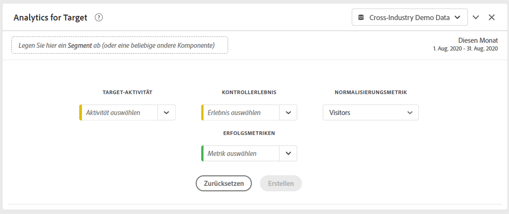
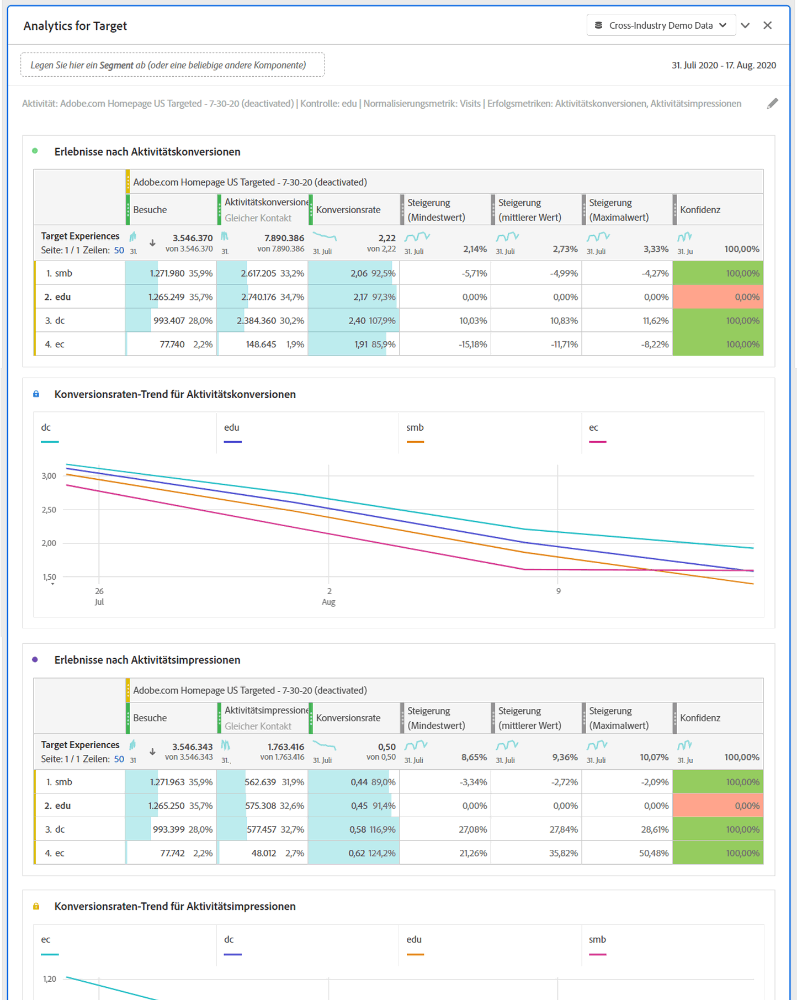

# Bedienfeld „Analytics for Target“ (A4T)

Im Bedienfeld „Analytics for Target“ (A4T) können Sie Ihre Adobe Target-Aktivitäten und -Erlebnisse in Analysis Workspace analysieren. Es ermöglicht Ihnen außerdem, Steigerung und Konfidenz für bis zu drei Erfolgsmetriken zu sehen. Um auf das A4T-Bedienfeld zuzugreifen, navigieren Sie zu einer Report Suite mit aktivierten A4T-Komponenten. Klicken Sie dann auf das Bedienfeldsymbol ganz links und ziehen Sie das Bedienfeld „Analytics for Target“ in das Analysis Workspace-Projekt.

## Bedienfeldeingaben {#Input}

Sie können das A4T-Bedienfeld mithilfe der folgenden Eingabeeinstellungen konfigurieren:

| Einstellung | Beschreibung |
|---|---|
| Target-Aktivität | Wählen Sie aus einer Liste von Target-Aktivitäten aus oder ziehen Sie eine Aktivität per Drag-and-Drop aus der linken Leiste. Hinweis: Die Liste wird mit den Aktivitäten der letzten 6 Monate gefüllt, die mindestens 1 Treffer hatten. Wenn Sie eine Aktivität nicht in der Liste sehen, ist sie möglicherweise älter als 6 Monate. Sie kann immer noch von der linken Leiste hinzugefügt werden, die einen Lookback-Zeitraum von bis zu 18 Monaten hat. |
| Kontrollerlebnis | Wählen Sie Ihr Kontrollerlebnis aus. Sie können es bei Bedarf in der Dropdown-Liste ändern. |
| Normalisierungsmetrik | Wählen Sie aus „Unique Visitors“, „Besuche“ oder „Aktivitäts-Impressions“ aus. Für die meisten Anwendungsfälle der Analyse wird „Unique Visitors“ empfohlen. Diese Metrik (auch als Zählmethodik bezeichnet) wird zum Nenner der Steigerungsberechnung. Sie wirkt sich auch darauf aus, wie die Daten aggregiert werden, bevor die Konfidenzberechnung angewendet wird. |
| Erfolgsmetriken | Wählen Sie bis zu 3 standardmäßige (nicht berechnete) Erfolgsereignisse aus den Dropdown-Listen aus oder ziehen Sie Metriken per Drag-and-Drop aus der linken Leiste. Jede Metrik verfügt über eine eigene Tabelle und Visualisierung im gerenderten Bedienfeld. |
| Kalenderdatumsbereich | Dieser wird automatisch aufgefüllt, basierend auf dem Datumsbereich der Aktivität von Adobe Target. Sie können ihn bei Bedarf ändern. |

## Bedienfeldausgabe {#Output}

Das Bedienfeld „Analytics for Target“ enthält umfangreiche Daten und Visualisierungen, die Ihnen helfen, die Leistung Ihrer Adobe Target-Aktivität und -Erlebnisse besser zu verstehen. Oben im Bedienfeld wird eine Zusammenfassungszeile angezeigt, die Sie an die ausgewählten Bedienfeldeinstellungen erinnert. Sie können das Bedienfeld jederzeit bearbeiten, indem Sie oben rechts auf den Stift zum Bearbeiten klicken.

Für jede ausgewählte Erfolgsmetrik wird eine Freiformtabelle und ein Konversionsraten-Trend angezeigt:

Für jede Freiformtabelle werden die folgenden Metrikspalten angezeigt:

| Metrik | Beschreibung |
|---|---|
| Normalisierungsmetriken | Unique Visitors, Besuche oder Aktivitäts-Impressions |
| Erfolgsmetrik | Die im Builder ausgewählte Metrik |
| Konversionsrate | Erfolgsmetrik/Normalisierungsmetrik |
| Steigerung | Vergleicht für jedes Erlebnis die Konversionsrate mit dem Kontrollerlebnis. Hinweis: Steigerung ist eine „gesperrte Metrik“ für die Dimension „Target-Erlebnisse“. Sie kann nicht mit anderen Dimensionen aufgeschlüsselt oder verwendet werden. |
| Steigerung (Mindestwert) | Stellt den schlechtesten Aufstieg dar, den ein Variantenerlebnis bei einem Konfidenzintervall von 95 % im Vergleich zum Kontrollerlebnis aufweisen kann. Berechnung: (x/y ± 1,96 std_err(x,y)) / (x_control/y_control 1,96 std_err(x_control,y_control)). Hier ist std_err(x,y) gleich sqrt(xx/y - (x/y)^2), wobei xx die Summe der Quadrate angibt. |
| Steigerung (mittlerer Wert) | Stellt den mittleren Aufstieg dar, den ein Variantenerlebnis bei einem Konfidenzintervall von 95 % im Vergleich zum Kontrollerlebnis aufweisen könnte. Dies ist „Steigerung“ in Reports &amp; Analytics. Berechnung: (x/y)/(x_control/y_control) - 1 |
| Steigerung (Maximalwert) | Stellt den besten Aufstieg dar, den ein Variantenerlebnis bei einem Konfidenzintervall von 95 % im Vergleich zum Kontrollerlebnis aufweisen kann. Berechnung: siehe Aufstieg (unten). |
| Konfidenz | Die Student-t-Verteilung berechnet das Konfidenzniveau, das die Wahrscheinlichkeit angibt, mit der ein Test bei seiner Wiederholung dieselben Ergebnisse liefert. Ein fester bedingter Formatierungsbereich von 75 %/85 %/95 % wurde auf die Metrik angewandt. Diese Formatierung kann bei Bedarf unter „Spalteneinstellungen“ angepasst werden. Hinweis: Konfidenz ist eine „gesperrte Metrik“ für Target-Erlebnisse. Sie kann nicht mit anderen Dimensionen aufgeschlüsselt oder verwendet werden. Berechnung: Wenden Sie einen zweiseitigen t-Test mit y+y_control-2 Freiheitsgraden an, um den p-Wert zu finden, ob x/y gleich x_control/y_control ist. Berechnen Sie den t-Score, wobei stderr gleich sqrt( (xx/y-(x/y)^2)/y + (xx_control/y_control-(x_control/y_control)^2)/y_control) ist. Geben Sie 1-p als Konfidenz zurück, dass sie unterschiedlich sind. |

Wie bei allen Bedienfeldern in Analysis Workspace können Sie Ihre Analyse fortsetzen, indem Sie zusätzliche Tabellen und [Visualisierungen](https://docs.adobe.com/content/help/de-DE/analytics/analyze/analysis-workspace/visualizations/freeform-analysis-visualizations.html) hinzufügen, die Ihnen bei der Analyse Ihrer Adobe Target-Aktivitäten helfen. Sie können ein Segment auch entweder auf Panel-Ebene oder innerhalb der Freiformtabelle anwenden. Beachten Sie, dass Sie beim Hinzufügen in der Freiformtabelle eine Überlagerung über die gesamte Tabelle durchführen müssen, um die Steigerungs- und Konfidenzberechnungen beizubehalten. Segmente auf Spaltenebene werden derzeit nicht unterstützt.

## Häufig gestellte Fragen (FAQ) {#FAQ}

| Frage | Antwort |
|---|---|
| Welche Aktivitäten werden in A4T unterstützt? | [Erfahren Sie mehr](https://docs.adobe.com/content/help/de-DE/target/using/integrate/a4t/a4t-faq/a4t-faq-activity-setup.html) darüber, welche Aktivitäten unterstützt werden. |
| Werden berechnete Metriken bei Steigerungs- und Konfidenzberechnungen unterstützt? | Nein. [Erfahren Sie mehr](https://docs.adobe.com/content/help/de-DE/target/using/integrate/a4t/a4t-faq/a4t-faq-lift-and-confidence.html) darüber, warum berechnete Metriken bei Steigerung und Konfidenz nicht unterstützt werden. Berechnete Metriken können jedoch außerhalb dieser Metriken in A4T-Berichten verwendet werden. |
| Warum unterscheiden sich Unique Visitors zwischen Target und Analytics? | [Erfahren Sie mehr](https://docs.adobe.com/content/help/de-DE/target/using/integrate/a4t/a4t-faq/a4t-faq-viewing-reports.html) über die Unterschiede zwischen Unique Visitors in den Produkten. |
| Warum werden nicht verwendete Erlebnisse zurückgegeben, wenn ich in meiner Analyse ein Hit-Segement für eine bestimmte Target-Aktivität anwende? | Die A4T-Dimension ist eine Listenvariable, d. h. sie kann mehrere Aktivitäten (und Erlebnisse) gleichzeitig enthalten. [Weitere Infos](https://docs.adobe.com/content/help/en/target/using/integrate/a4t/a4t-faq/a4t-faq-viewing-reports.html) |
| Berücksichtigt die Konfidenzmetrik extreme Bestellungen oder wendet sie eine Bonferroni-Korrektur für mehrere Bestellungen an? | Nein. [Erfahren Sie mehr](https://docs.adobe.com/content/help/en/target/using/integrate/a4t/a4t-faq/a4t-faq-lift-and-confidence.html) darüber, wie Analytics Konfidenz berechnet. |
| Können Steigerungs- und Konfidenzmetriken mit anderen Dimensionen oder Aufschlüsselungen verwendet werden? | Steigerung und Konfidenz sind „gesperrte Metriken“ für die Dimension „Target-Erlebnisse“, da sie ein Kontrollerlebnis und ein Variantenerlebnis für die Berechnung erfordern. Sie können daher nicht aufgeschlüsselt oder mit anderen Dimensionen verwendet werden. |
| Wann werden Steigerung und Konfidenz neu berechnet? | Steigerung und Konfidenz werden bei jeder Ausführung (oder erneuten Ausführung) des Bedienfelds, bei einer Änderung des Datumsbereichs oder bei Anwendung eines Segments auf das Bedienfeld oder die Tabelle neu berechnet. Wenn Sie einen Segmentfilter auf die Freiformtabelle anwenden, muss er über alle Spalten hinweg angewendet werden. Andernfalls wird die Konfidenz nicht korrekt aktualisiert. Segmente auf Spaltenebene werden derzeit nicht unterstützt. |

Weitere Informationen zu „Analytics for Target“-Berichten finden Sie unter [A4T-Reporting](https://docs.adobe.com/content/help/de-DE/target/using/integrate/a4t/reporting.html).
