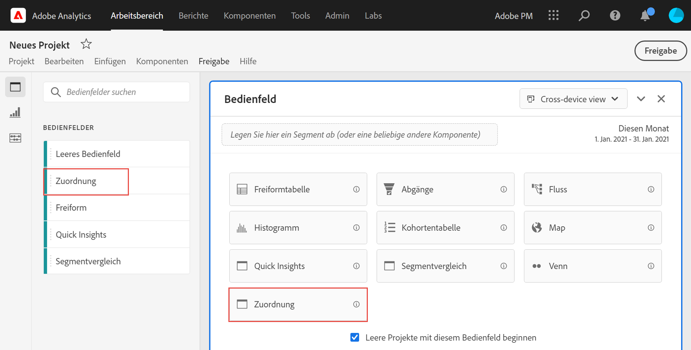
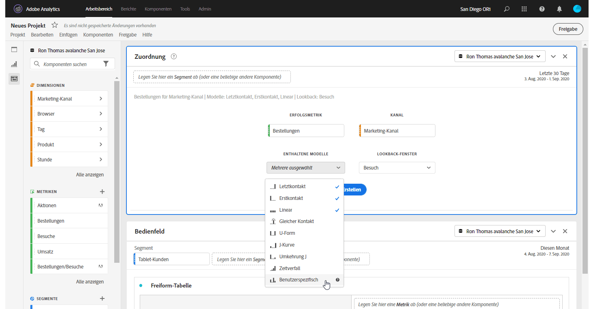
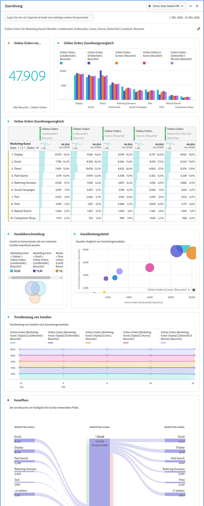

# Attributionsbedienfeld

Das Bedienfeld [!UICONTROL Attribution] ist eine einfache Möglichkeit, eine Analyse zum Vergleichen verschiedener Zuordnungsmodelle zu erstellen. Dabei handelt es sich um eine Funktion in [Attribution IQ](../attribution/overview.md), die Ihnen einen eigenen Arbeitsbereich bietet, um Attributionsmodelle zu verwenden und zu vergleichen.

## Erstellen eines Attributionsbedienfeldes

1. Klicken Sie links auf das Bedienfeldsymbol.
1. Ziehen Sie das Bedienfeld [!UICONTROL Zuordnung] in Ihr Analysis Workspace-Projekt.

   

1. Fügen Sie eine Metrik hinzu, die Sie zuordnen möchten, und fügen Sie eine beliebige Dimension hinzu, gegen die Sie zuordnen möchten. Beispiele sind Marketing-Kanäle oder benutzerdefinierte Dimensionen wie interne Promotions.

   

1. Wählen Sie die [Attributionsmodelle und das Lookback-Fenster](../attribution/models.md) aus, die Sie vergleichen möchten.

1. Das Attributionsbedienfeld gibt einen umfangreichen Satz an Daten und Visualisierungen zurück, die die Attribution für die ausgewählte Dimension und Metrik vergleichen.

   

## Visualisierungen der Attribution

* **Gesamtmetrik**: Die Gesamtanzahl der im Berichtszeitfenster aufgetretenen Konversionen. Hierbei handelt es sich um die Konversionen, die über die von Ihnen ausgewählte Dimension hinweg mit Attributen versehen werden.
* **Vergleichsleiste**: Vergleicht visuell die zugeordneten Konvertierungen über die einzelnen Dimensionselemente Ihrer ausgewählten Dimension hinweg. Jede Balkenfarbe stellt ein bestimmtes Attributionsmodell dar.
* **Zuteilungstabelle**: Zeigt dieselben Daten wie das Balkendiagramm an, das als Tabelle dargestellt wird. Durch die Auswahl verschiedener Spalten oder Zeilen in dieser Tabelle werden das Balkendiagramm sowie mehrere andere Visualisierungen im Bedienfeld gefiltert. Diese Tabelle ähnelt jeder anderen Freiform-Tabelle in Workspace, sodass Sie Komponenten wie Metriken, Segmente oder Aufschlüsselungen hinzufügen können.
* **Überschneidungsdiagramm**: Ein Venn-Diagramm, das die drei wichtigsten Dimensionselemente und deren gemeinsame Teilnahme an einer Konversion anzeigt. Beispielsweise gibt die Größe der Blasenüberlagerung an, wie oft Konversionen auftraten, wenn ein Besucher beiden Dimensionselementen ausgesetzt war. Durch die Auswahl anderer Zeilen in der angrenzenden Freiformtabelle wird die Visualisierung entsprechend Ihrer Auswahl aktualisiert.
* **Leistungsdetails**: Ermöglicht den visuellen Vergleich von bis zu drei Zuordnungsmodellen mithilfe eines Streudiagramms.
* **Trendleistung**: Zeigt standardmäßig den Trend der Konversionsleistung nach Zuordnungsmodell für die erste Dimension an, die in der angrenzenden Freiform-Tabelle aufgeführt ist. Sie können in der Freiform-Tabelle verschiedene Dimensionzeilen auswählen, um den Trend für die ausgewählten Dimensionen anzuzeigen (z. B. Gesamtumsatz für jedes Zuordnungsmodell für Social-Kampagnen und gebührenpflichtige Suche). Alternativ können Sie Zellen in den Spalten für beliebige Metrik- und Zuordnungstypkombinationen in der Freiform-Tabelle auswählen, um die Trendleistung nach Dimensionswert für die angegebenen Zuordnungsmodelle (z. B. Gesamtumsatz nach Marketing-Kanal mit Last Touch- und First Touch-Zuordnung) anzuzeigen.
* **Fluss**: Hier können Sie sehen, mit welchen Kanälen am häufigsten interagiert wird und in welcher Reihenfolge die Journey eines Besuchers angezeigt wird.
