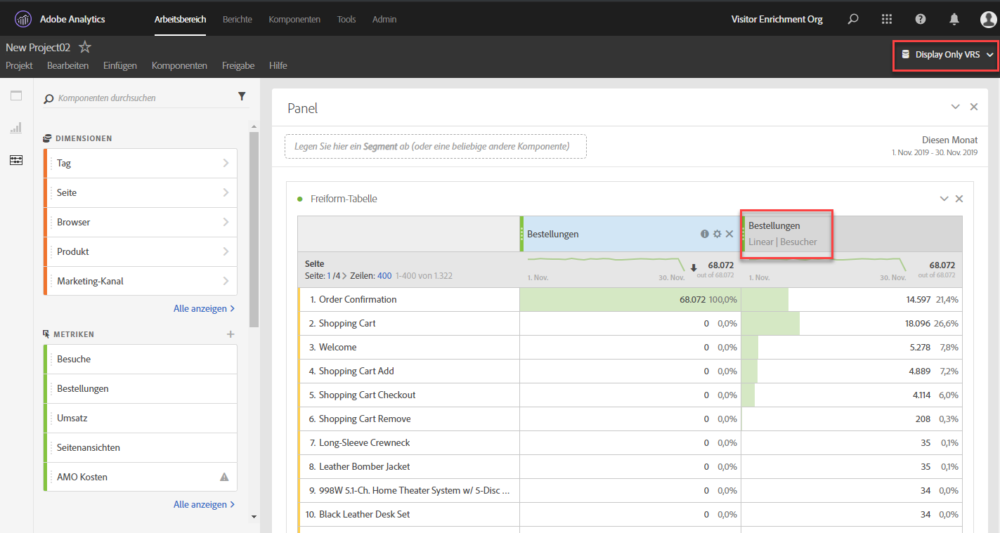

# Übersicht über das Zuordnungsbedienfeld

>[!IMPORTANT] Das Zuordnungs-Bedienfeld steht allen Kunden der Adobe Analytics Ultimate-, Prime-, Select- und Foundation-SKUs zur Verfügung.

Das Zuordnungsbedienfeld ist eine [Zuordnungs-IQ](../../attribution-iq.md) -Funktion, mit der Sie viele neue Arten von Zuordnungsmodellen zu Freiformtabellen, Visualisierungen und berechneten Metriken hinzufügen können. Alle Attributionsmodelle weisen zwei Komponenten auf:

* **** Zuordnungsmodell: Das Modell beschreibt die Verteilung der Konversionen an die Treffer in einer Gruppe. Zum Beispiel First Touch oder Last Touch.
* **** Zuordnungs-Lookback-Fenster: Das Lookback-Fenster beschreibt, welche Gruppen von Treffern für jedes Modell berücksichtigt werden. Beispiel: Besuch oder Besucher.

## Zuordnungsmodelle

| UI-Symbol | Zuordnungsmodell | Definition | Verwendungszweck |
| --- | --- | --- | --- |
|  | Letztkontakt | 100 % Gutschrift für den Touchpoint, der zuletzt vor der Konvertierung aufgetreten ist. | Das einfachste und gängigste Zuordnungsmodell. Es wird häufig für Konversionen mit einem kurzen Überlegungszyklus verwendet. Letztkontakt wird häufig durch Teams verwendet, die das Suchmaschinenmarketing verwalten oder Schlüsselwörter für die interne Suche analysieren. |
|  | Erstkontakt | 100 % Gutschrift für den Touchpoint, der zuerst im Zuordnungs-Lookback-Fenster angezeigt wird. | Ein weiteres allgemeines Zuordnungsmodell, das zur Analyse von Marketingkanälen nützlich ist, um das Markenbewusstsein oder die Kundenakquise zu fördern. Es wird häufig von Display- oder Social-Marketing-Teams verwendet, ist aber auch ideal zur Bewertung der Effektivität von Onsite-Produktempfehlungen. |
|  | Selber Kontakt | 100 % Gutschrift für den Treffer, bei dem die Konversion erfolgte. Wenn bei demselben Treffer wie bei einer Konversion kein Berührungspunkt eintritt, wird er unter "Keine"zusammengefasst. | Ein hilfreiches Modell zur Bewertung des Inhalts oder der Benutzererfahrung, das/die unmittelbar zum Zeitpunkt der Konvertierung präsentiert wurde. Produkt- oder Designteams verwenden dieses Modell oft, um die Effektivität einer Seite zu bewerten, auf der eine Konversion stattfindet. |
|  | Linear | Ermöglicht die gleiche Gutschrift für jeden Touchpoint, der vor einer Konversion gesehen wurde. | Nützlich für Konvertierungen mit längeren Bedenkzeiten oder Benutzererfahrungen, die eine häufigere Kundenbindung erfordern. Es wird häufig von Teams verwendet, die die Effektivität von Benachrichtigungen über mobile Apps messen oder abonnementbasierte Produkte nutzen. |
|  | U-förmig | Die erste Interaktion wird mit 40 % gutgeschrieben, die letzte Interaktion mit 40 % gutgeschrieben und die verbleibenden 20 % werden auf alle dazwischen liegenden Berührungspunkte aufgeteilt. Bei Konvertierungen mit einem einzigen Touchpoint wird 100 % gutgeschrieben. Bei Konvertierungen mit zwei Berührungspunkten werden beide 50 % gutgeschrieben. | Ein großartiges Modell für diejenigen, die Interaktionen schätzen, die eine Konversion eingeführt oder geschlossen haben, aber dennoch unterstützende Interaktionen erkennen möchten. Die U-förmige Zuordnung wird häufig von Teams verwendet, die einen ausgewogeneren Ansatz verfolgen, aber Kanälen, die eine Konversion gefunden oder geschlossen haben, mehr Anerkennung zollen möchten. |
|  | J-förmig | Die letzte Interaktion wird mit 60 % gutgeschrieben, die erste Interaktion mit 20 % wird gutgeschrieben und die restlichen 20 % werden auf alle dazwischen liegenden Berührungspunkte aufgeteilt. Bei Konvertierungen mit einem einzigen Touchpoint wird 100 % gutgeschrieben. Bei Konvertierungen mit zwei Berührungspunkten werden 75 % der letzten Interaktion gutgeschrieben und 25 % der ersten gutgeschrieben. | Dieses Modell ist ideal für diejenigen, die Finder und Schließer priorisieren, aber sich auf das Schließen von Interaktionen konzentrieren möchten. Die J-Shaped-Zuordnung wird häufig von Teams verwendet, die einen ausgewogeneren Ansatz verfolgen und Kanälen, die eine Konversion geschlossen haben, mehr Anerkennung zollen möchten. |
|  | Umgekehrtes J | Gutschriften in Höhe von 60 % an den ersten Touchpoint, 20 % an den letzten Touchpoint und die restlichen 20 % an alle dazwischen liegenden Berührungspunkte. Bei Konvertierungen mit einem einzigen Touchpoint wird 100 % gutgeschrieben. Bei Konvertierungen mit zwei Berührungspunkten wird der ersten Interaktion eine Gutschrift von 75 % und der letzten 25 % gutgeschrieben. | Dieses Modell ist ideal für diejenigen, die Finder und Schließer priorisieren, aber sich auf das Suchen von Interaktionen konzentrieren möchten. Die umgekehrte J-Zuordnung wird von Teams verwendet, die einen ausgewogeneren Ansatz verfolgen und Kanälen, die eine Konversion initiiert haben, mehr Anerkennung zollen möchten. |
|  | Benutzerspezifisch | Ermöglicht Ihnen die Angabe der Gewichtungen, die Sie für First Touch-Punkte, Last Touch-Punkte und dazwischen liegende Berührungspunkte festlegen möchten. Die angegebenen Werte werden auf 100 % normalisiert, selbst wenn die eingegebenen benutzerspezifischen Zahlen nicht zu 100 addiert werden. Bei Konvertierungen mit einem einzigen Touchpoint wird 100 % gutgeschrieben. Bei Interaktionen mit zwei Berührungspunkten wird der mittlere Parameter ignoriert. Die ersten und letzten Berührungspunkte werden dann auf 100 % normalisiert und die Gutschrift wird entsprechend zugewiesen. | Dieses Modell ist perfekt für diejenigen, die eine vollständige Kontrolle über ihr Zuordnungsmodell wünschen und spezielle Bedürfnisse haben, die andere Zuordnungsmodelle nicht erfüllen. |
|  | Zeitdekation | Folgt und exponentieller Abfall mit einem benutzerdefinierten Parameter für die Halbwertszeit, wobei der Standardwert 7 Tage ist. Die Stärke der einzelnen Kanäle hängt von der Zeit ab, die zwischen der Aufnahme des Berührungspunkts und der anschließenden Konversion verstrichen ist. Die Formel, die zur Bestimmung der Gutschrift verwendet wird, `2``(-t/halflife)``t` ist die Zeit zwischen einem Berührungspunkt und einer Konversion. Alle Berührungspunkte werden dann auf 100 % normalisiert. | Ideal für Teams, die regelmäßig Videowerbung betreiben oder gegen Ereignisse mit einem bestimmten Datum vermarkten. Je länger eine Konversion nach einem Marketing-Ereignis erfolgt, desto weniger Gutschrift wird gewährt. |
|  | Beitrag | 100 % Gutschrift für alle eindeutigen Touchpoints. Die Gesamtanzahl der Konversionen ist im Vergleich zu anderen Zuordnungsmodellen überhöht. Durch den Beitrag werden Kanäle dedupliziert, die mehrmals angezeigt werden. | Ausgezeichnet, um zu verstehen, wer oft Kunden einer bestimmten Interaktion ausgesetzt sind. Medienunternehmen verwenden dieses Modell häufig zur Berechnung der Inhaltsgeschwindigkeit. Einzelhandelsunternehmen verwenden dieses Modell oft, um zu verstehen, welche Teile ihrer Site für die Konversion von entscheidender Bedeutung sind. |

## Lookback-Fenster

Ein Lookback-Fenster ist der Zeitraum, in dem eine Konversion zurückblicken sollte, um Berührungspunkte einzuschließen. Zuordnungsmodelle, die der ersten Interaktion mehr Anerkennung zollen, sehen bei der Anzeige verschiedener Lookback-Fenster größere Unterschiede.

* **** Lookback-Fenster besuchen: Sieht bis zum Beginn eines Besuchs zurück, bei dem eine Konversion stattgefunden hat. Die Lookback-Fenster für Besuche sind schmal, da sie nicht über den Besuch hinausblicken. Rückblickfenster für Besuche berücksichtigen die geänderte Besuchsdefinition in Virtual Report Suites.
* **** Lookback-Fenster für Besucher: Betrachtet alle Besuche bis zum 1. des Monats des aktuellen Datumsbereichs. Besucher-Lookback-Fenster sind breit, da sie viele Besuche umfassen können. Wenn der Datumsbereich des Berichts beispielsweise der 15. September bis 30. September ist, umfasst der Zeitbereich für die Besucherrückmeldung den 1. September bis den 30. September.

## Beispiel 

Siehe folgendes Beispiel:

1. Am 15. September gelangt ein Besucher über eine gebührenpflichtige Suchwerbung zu Ihrer Site und verlässt sie dann.
2. Am 18. September gelangt der Besucher erneut über einen Link in sozialen Medien zu Ihrer Site, den er von einem Freund erhalten hat. Sie fügen mehrere Artikel zum Warenkorb hinzu, erwerben aber nichts.
3. Am 24. September sendet Ihr Marketing-Team eine E-Mail mit einem Coupon für einige der Artikel in ihrem Warenkorb. Sie wenden den Coupon an, besuchen aber mehrere andere Websites, um zu sehen, ob andere Coupons verfügbar sind. Sie finden eine andere über eine Display-Anzeige und kaufen dann letztendlich für 50 Euro ein.

Je nach Lookback-Fenster und Zuordnungsmodell erhalten Kanäle eine unterschiedliche Gutschrift. Im Folgenden finden Sie einige wichtige Beispiele:

* Bei Verwendung von **First Touch** und einem **Besuch-Lookback-Fenster** betrachtet die Zuordnung nur den dritten Besuch. Zwischen E-Mail und Anzeige war E-Mail zuerst, sodass E-Mail 100 % des Kaufs 50 USD gutgeschrieben wird.
* Mithilfe von **First Touch** und einem **Besucher-Lookback-Fenster** betrachtet die Zuordnung alle drei Besuche. Die gebührenpflichtige Suche war die erste, sodass sie 100 % des Kaufs 50 $ gutgeschrieben wird.
* Bei Verwendung eines **linearen** Fensters und eines **Besuchs-Lookback-Fensters** wird die Gutschrift zwischen E-Mail und Anzeige aufgeteilt. Beide Kanäle erhalten jeweils eine Gutschrift von 25 USD.
* Die Gutschrift wird mithilfe eines **linearen** Fensters **und eines** Besucher-Lookback-Fensters zwischen gebührenpflichtiger Suche, Social, E-Mail und Anzeige aufgeteilt. Jeder Kanal erhält eine Gutschrift von 12,50 USD für diesen Kauf.
* Mithilfe des **J-förmigen** Fensters und eines **Besucher-Lookback-Fensters** wird die Gutschrift in gebührenpflichtige Suche, Social, E-Mail und Anzeige aufgeteilt.
   * 60 % der Gutschrift wird für 30 USD gewährt.
   * 20 % der Gutschrift wird der gebührenpflichtigen Suche gutgeschrieben, für 10 $.
   * Die restlichen 20 % werden zwischen Social und E-Mail aufgeteilt und erhalten jeweils 5 USD.
* Bei Verwendung von **Zeitdekation** und einem **Besucher-Lookback-Fenster** wird die Gutschrift zwischen gebührenpflichtiger Suche, Social, E-Mail und Anzeige aufgeteilt. Verwenden der standardmäßigen 7-Tage-Halbwertszeit:
   * Lücke von 0 Tagen zwischen Display-Touchpoint und Konvertierung. `2``(-0/7)` `= 1`
   * Lücke von 0 Tagen zwischen E-Mail-Touchpoint und Konversion. `2``(-0/7)` `= 1`
   * Abstand von 6 Tagen zwischen Social Touch-Point und Konversion. `2``(-6/7)` `= 0.552`
   * Lücke von 9 Tagen zwischen dem Touchpoint der gebührenpflichtigen Suche und der Umrechnung. `2``(-9/7)` `= 0.41`
   * Die Normalisierung dieser Werte führt zu Folgendem:
      * Anzeigen: 33,8 %, 16,88 $
      * E-Mail: 33,8 % erhalten 16,88 $
      * Social: 18,6 % mit 9,32 $
      * Gebührenpflichtige Suche: 13,8 % mit 6,92 $

> [!TIP] Andere Konversionsereignisse wie Bestellungen oder benutzerspezifische Ereignisse werden ebenfalls aufgeteilt, wenn die Gutschrift zu mehr als einem Kanal gehört. Wenn beispielsweise zwei Kanäle mit einem linearen Zuordnungsmodell zu einem benutzerspezifischen Ereignis beitragen, erhalten beide Kanäle 0,5 des benutzerspezifischen Ereignisses. Diese Ereignisfraktionen werden über alle Besuche summiert und dann zur Berichterstellung auf die nächste Ganzzahl gerundet.

## Zuordnen zu Marketingkanälen

Als Marketingkanäle zum ersten Mal eingeführt wurden, hatten sie nur First Touch- und Last Touch-Dimensionen. Mit diesen zusätzlichen Zuordnungsmodellen sind explizite First Touch-/Last Touch-Dimensionen nicht mehr erforderlich. Adobe bietet allgemeine **Marketingkanal** -Dimensionen, damit diese mit Ihrem bevorzugten Zuordnungsmodell verwendet werden können. Diese allgemeinen Dimensionen der Marketingkanäle verhalten sich identisch mit den Dimensionen des Last Touch-Kanals, sind jedoch anders gekennzeichnet, um Verwirrung bei der Verwendung von Marketingkanälen mit einem anderen Zuordnungsmodell zu vermeiden.

Da die Marketingkanaldimensionen von einer traditionellen Besuchsdefinition abhängen (wie in ihren Verarbeitungsregeln definiert), kann ihre Besuchsdefinition nicht mit Virtual Report Suites geändert werden.

## Zuordnen mit Variablen mit mehreren Werten

Einige Dimensionen in Analytics können bei einem einzelnen Treffer mehrere Werte enthalten. Häufige Beispiele sind Listenvariablen und die Produktvariable.

Wenn die Zuordnung auf Treffer mit mehreren Werten angewendet wird, erhalten alle Werte im selben Treffer die gleiche Gutschrift. Da viele Werte diese Gutschrift erhalten können, kann sich die Berichtssumme von der Summe der einzelnen Zeileneinträge unterscheiden. Die Berichtssumme wird dedupliziert, während jeder einzelne Dimensionswert richtig gutgeschrieben wird.

## Zuordnen mit Segmentierung

Die Zuordnung wird immer vor der Segmentierung ausgeführt und die Segmentierung wird ausgeführt, bevor Berichtsfilter angewendet werden. Dieses Konzept gilt auch für Virtual Report Suites, die Segmente verwenden.

Wenn Sie z. B. eine VRS mit angewendetem Segment "Treffer anzeigen"erstellen, können Sie mithilfe einiger Zuordnungsmodelle andere Kanäle in einer Tabelle sehen.

