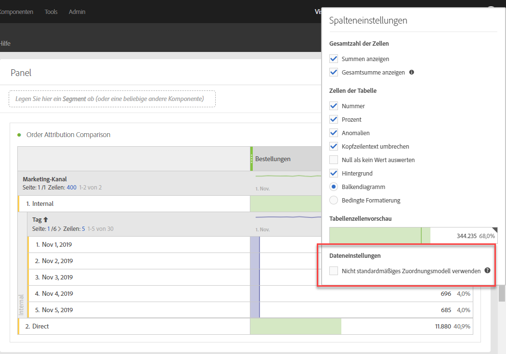
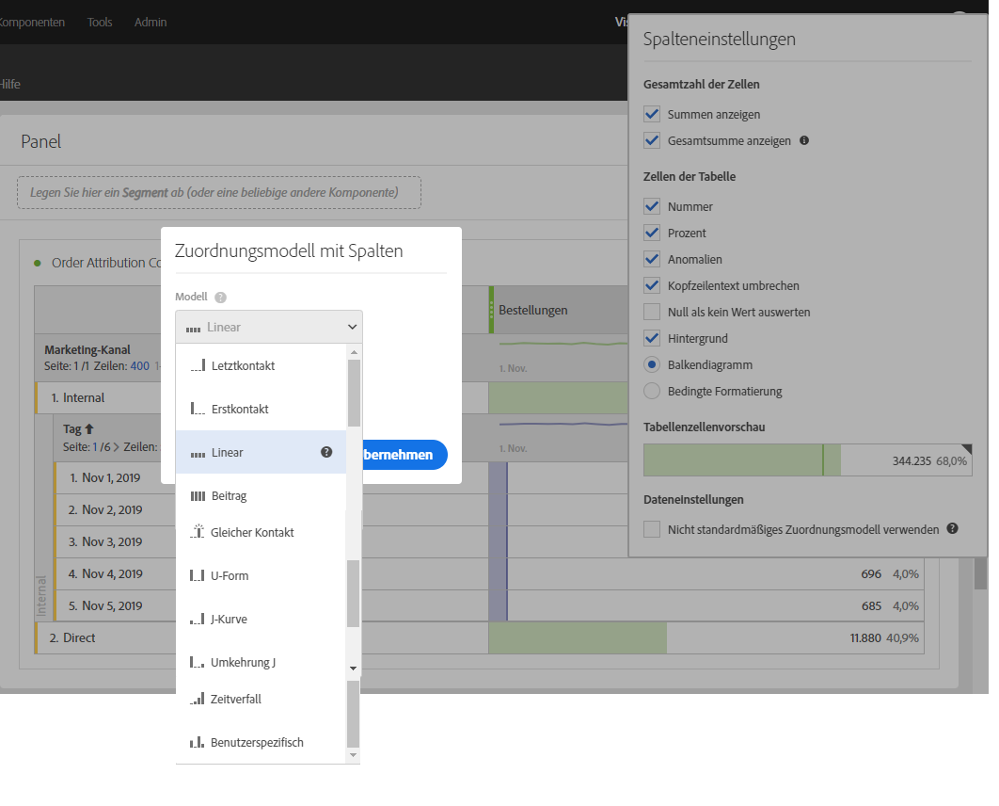
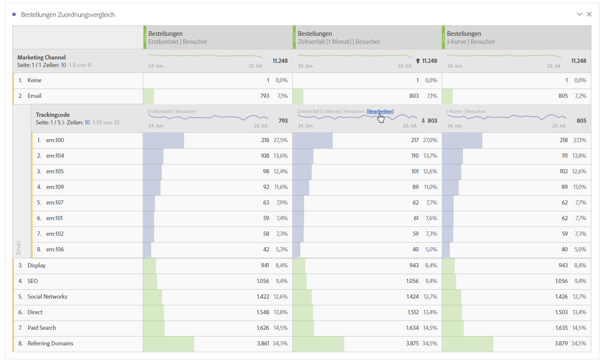
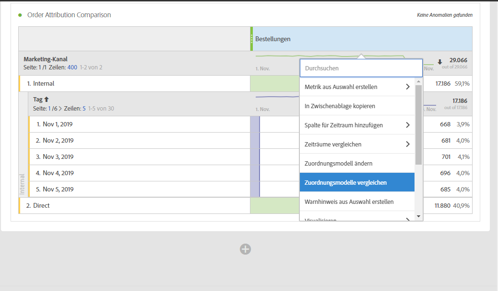
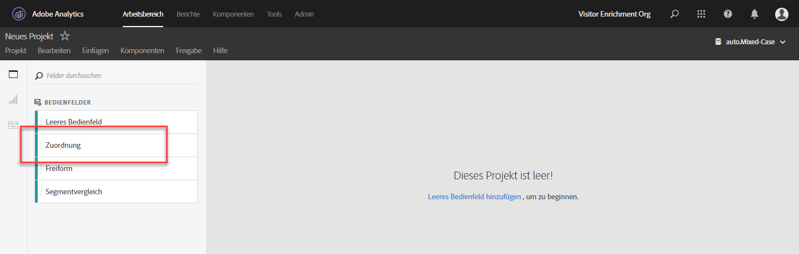
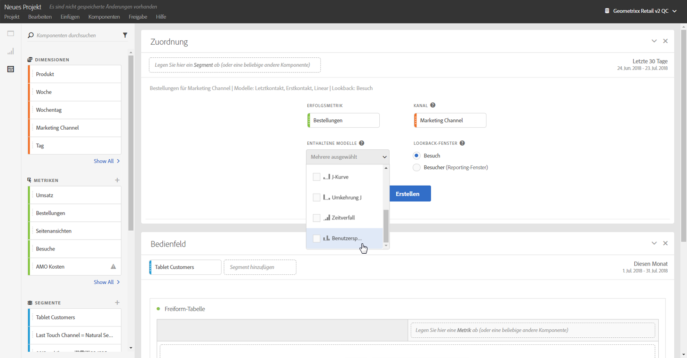
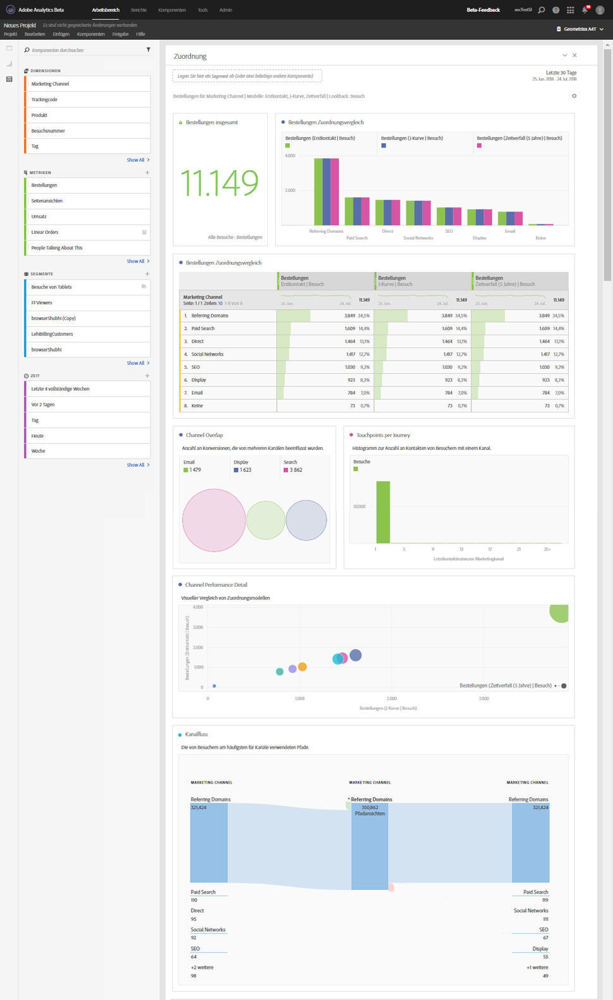

# Attribution in Analysis Workspace verwenden

Mit Attribution IQ in Analysis Workspace können Sie unterstützte Attributionsmodelle miteinander vergleichen, die wichtigsten zur Konversion führenden Marketing-Sequenzen mit erweiterten Fluss- und Fallout-Visualisierungen visualisieren, Trends für Marketing-Kanäle oder Kampagnen einfach offenlegen, um die Leistung über einen Zeitraum anzuzeigen, nach statistischen Abweichungen in der Kanal-/Kampagnenleistung suchen und gewarnt werden, wenn die Leistung sich verschlechtert oder verbessert.

## Attribution in Freiformtabellen verwenden {#section_F2F72AE840EB4EA781302A559726E6F4}

Analysis Workspace-Freiformtabellen unterstützen Attributionsmodelle, die für beinah jede Metrik verwendet werden können. Attributionsmodelle können für eine Freiformtabellenspaltenmetrik in „Spalteneinstellungen“ festgelegt werden:

1. Klicken Sie auf das Zahnradsymbol „Einstellungen“ in einer Freiformtabellenspalte.

   

1. Überprüfen Sie **[!UICONTROL Data Settings]** unter **[!UICONTROL Use non-default attribution model]**. Weitere Informationen zu den unterschiedlichen Attributionsmodellen finden Sie in der [Übersicht zu Attribution IQ](attribution.md).

   

## Attributionsmodelle auf Aufschlüsselungen anwenden {#section_ED1E7532CF084B5AB0942BD80B4770C9}

Auf die Aufschlüsselungen in einer Freiformtabelle kann auch ein beliebiges Attributionsmodell angewendet werden. Dieses kann mit der übergeordneten Spalte übereinstimmen oder sich von dieser unterscheiden. Sie möchten vielleicht beispielsweise lineare Bestellungen in Ihrer Dimension „Marketingkanäle“ analysieren, wenden jedoch U-förmige Bestellungen auf spezifische Trackingcodes in einem Kanal an. Bewegen Sie zum Bearbeiten des auf eine Aufschlüsselung angewendeten Attributionsmodells einfach den Mauszeiger auf das Aufschlüsselungsmodell und klicken Sie auf „Bearbeiten“:

## Attributionsmodellvergleich {#section_1D74C09549CC4EC8A952A7392C76D375}

If you&#39;d like to quickly and easily compare one attribution model to another, right click a metric and select **[!UICONTROL Add comparative attribution model]**:

Dadurch können Sie Attributionsmodelle schnell und einfach miteinander vergleichen, ohne eine Metrik hereinzuziehen und sie zweifach zu konfigurieren.

## Attributionsbereich und -visualisierungen {#section_6B02F28182F14ECC9FC5020F224726E6}

Der Attributionsbereich bietet eine einfache Möglichkeit, eine Analyse zu erstellen, mit der verschiedene Attributionsmodelle verglichen werden. Klicken Sie für den Zugriff auf den Attributionsbereich

1. ganz links auf das Bereichssymbol.
1. Ziehen Sie den Attributionsbereich in Ihr Analysis Workspace-Projekt.

   

1. Fügen Sie eine mit Attributen zu versehende Erfolgsmetrik und eine beliebige Kanaldimension hinzu, mit der die Attribution abgeglichen werden soll (beispielsweise Marketingkanäle oder interne Promotions).

   

1. Wählen Sie die zu vergleichenden [Attributionsmodelle](attribution.md) und das Lookback-Fenster aus.

   Der Attributionsbereich gibt eine Vielzahl an Daten und Visualisierungen zurück, mit denen Sie besser nachvollziehen können, wie Ihre Marketing-Kanäle (oder andere Dimensionen) interagieren:

   

   Im Folgenden werden die einzelnen Visualisierungen beschrieben:

| Visualization | Beschreibung |
|--- |--- |
| Metrik insgesamt | Die Gesamtanzahl der im Berichtszeitfenster aufgetretenen Konversionen. Hierbei handelt es sich um die Konversionen, die über die von Ihnen ausgewählte Dimension hinweg mit Attributen versehen werden. |
| Balkendiagramm für Metrikattributionsvergleich | Hiermit können Sie die mit Attributen versehenen Konversionen in Ihrer ausgewählten Dimension über die Dimensionselemente hinweg visuell vergleichen. Jede Balkenfarbe stellt ein unterschiedliches Attributionsmodell dar, das ausgewählt wurde. |
| Metrikattributions-Freiformtabelle | Zeigt dieselben Daten wie das Balkendiagramm an. Durch das Auswählen von unterschiedlichen Spalten oder Zeilen in dieser Tabelle werden das Balkendiagramm und verschiedene der anderen Visualisierungen im Bereich gefiltert. Diese Tabelle fungiert einfach als eine weitere Freiformtabelle in Workspace und ermöglicht es Ihnen, Metriken, Segmente, Aufschlüsselungen usw. hinzuzufügen. |
| Dimensionsüberschneidungsdiagramm | Ein Mengendiagramm, das die obersten drei Dimensionen (z. B. Kanäle) und anzeigt, wie oft sie zusammen in einer Konversion partizipieren. So gibt beispielsweise die Größe der Blasendiagrammüberschneidung die Häufigkeit der Konversionen an, wenn bei einem Besucher beide Dimensionselemenente (z. B. Kanälen) angewandt wurden. Durch die Auswahl anderer Zeilen in der Freiformtabelle wird die Visualisierung zum Berücksichtigen Ihrer Auswahl entsprechend aktualisiert. |
| Marketing-Touchpoints pro Journey | Ein Histogramm, das die Anzahl der Marketing-Touchpoints (oder eine beliebige Dimension) eines Besuchers im Berichtsdatumsbereich angibt. Dies ist hilfreich, um nachzuvollziehen, wie wirkungsvoll die Mehrkontaktattribution für Ihren Datensatz ist. Wenn nahezu alle Besucher nur einen einzelnen Touchpoint aufweisen, unterscheiden sich unterschiedliche Attributionsmodelle in den zugehörigen Ergebnissen nicht sonderlich voneinander. |
| Marketing-Kanalleistungsdetails | Hiermit können Sie bis zu drei Attributionsmodelle visuell mit einem Streudiagramm vergleichen. |
| Marketingkanalfluss | Hiermit können Sie anzeigen, mit welchen Kanälen am häufigsten interagiert wird und wie sich die Reihenfolge in der Customer Journey eines Besuchers gestaltet. |
