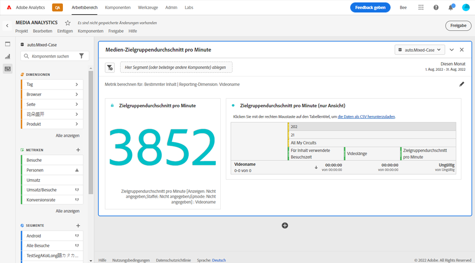
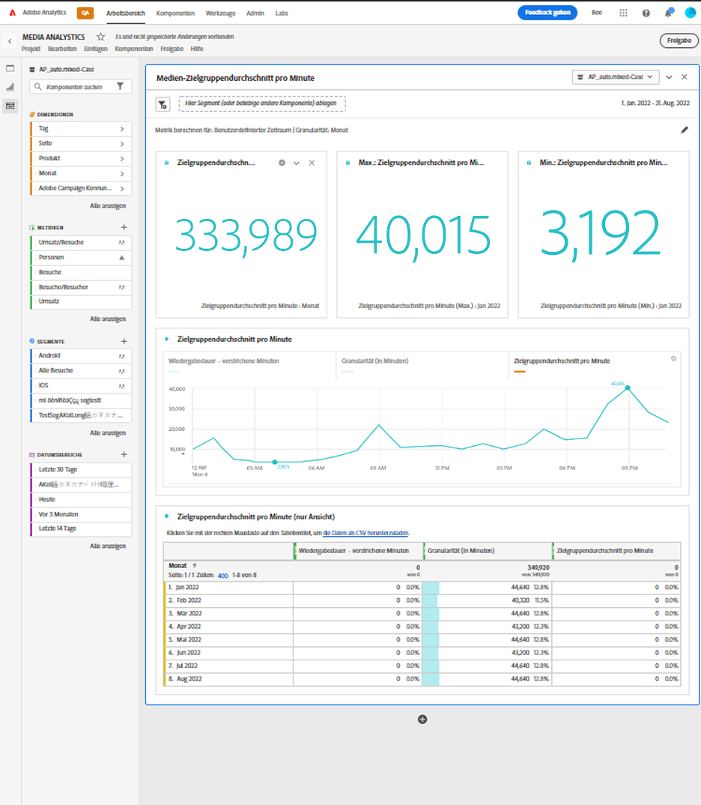

# Bedienfeld „Zielgruppendurchschnitt pro Minute“

Media Analytics-Kunden können das Bedienfeld für den Zielgruppendurchschnitt pro Minute verwenden, um die durchschnittliche Nutzung ihrer Inhalte besser zu verstehen. Der Zielgruppendurchschnitt pro Minute ermöglicht Vergleiche von Inhalten beliebiger Längen oder Genres. Darüber hinaus können Kunden diesen digitalen Zielgruppendurchschnitt pro Minute mit Metriken zum linearen TV-Durchschnitt pro Minute vergleichen oder ihn anhängen. Dieses Bedienfeld bietet mehr Flexibilität, um den Zielgruppendurchschnitt für benutzerdefinierte Zeiträume zu messen sowie für Fälle, bei denen die Klassifizierung der Dauer nachträglich aktualisiert wurde. Die aktuelle Metrik für den Zielgruppendurchschnitt pro Minute funktioniert nur, wenn die Dauer zur Verarbeitungszeit verfügbar ist.

In Analysis Workspace bezeichnet der Zielgruppendurchschnitt pro Minute die Zeit, die mit der Ansicht Ihres Medien-Streams verbracht wurde, geteilt durch die Inhaltsdauer oder die Gesamtauswahl des Zeitraums mit der ausgewählten Granularität.

Das Bedienfeld „Medien-Zielgruppendurchschnitt pro Minute“ ermöglicht die Analyse des Zielgruppendurchschnitts pro Minute je nach dem ausgewählten Inhalt, wenn die Dauer mithilfe von Klassifizierungen zur Verfügung gestellt wird.
Das Bedienfeld „Zielgruppendurchschnitt pro Minute“ bietet außerdem Analysen über einen ausgewählten Zeitraum, die nach bestimmten Inhalten gefiltert werden können – unabhängig davon, ob die Dauer mit Klassifizierungen verfügbar ist oder nicht. Um auf das Bedienfeld „Medien-Zielgruppendurchschnitt pro Minute“ zuzugreifen, navigieren Sie zu einer Report Suite, während die Media Analytics-Komponenten aktiviert sind. Klicken Sie dann auf das Bedienfeld-Symbol ganz links und ziehen Sie das Bedienfeld in Ihr Analysis Workspace-Projekt.

<!-- For more information, see the Media Average Minute Audience introduction video:
<< replace with AMA video when available >> -->

<!-- >[!VIDEO](https://video.tv.adobe.com/v/330177/?quality=12) -->

## Bedienfeldeingaben {#Input}

Sie können das Bedienfeld „Medien-Zielgruppendurchschnitt pro Minute“ mithilfe der folgenden Eingabeeinstellungen konfigurieren:

| Einstellung | Beschreibung |
|---------|------------|
| Datumsbereich der Bedienfelder | Der Datumsbereich des Panels ist standardmäßig „Heute“. Sie können es so verändern, dass Sie einen einzelnen Tag oder mehrere Monate auf einmal betrachten können.    Diese Visualisierung ist auf 1.440 Datenzeilen beschränkt (z. B. 24 Stunden bei einer Granularität auf Minutenebene). Wenn eine Kombination aus Datumsbereich und Granularität mehr als 1.440 Zeilen zur Folge hat, wird die Granularität automatisch aktualisiert, um den vollständigen Datumsbereich anzuzeigen. |
| Ziehen Sie ein Segment (oder beliebige andere Komponenten) hierher | Wie andere Bedienfelder filtert diese Einstellung Ihre Auswahl anhand von Segmenten, die Sie erstellt haben. Dies ist eine hervorragende Möglichkeit, bestimmte Plattformen, Live-Streams oder andere gängige Mediensegmente anzusehen. |
| Metrik berechnen für | Mit dieser Einstellung können Sie wählen, ob Sie den Zielgruppendurchschnitt pro Minute für einen bestimmten Inhalt anzeigen möchten, indem Sie *Spezifischer Inhalt* wählen, oder ob Sie den Zielgruppendurchschnitt pro Minute für einen bestimmten Zeitraum anzeigen möchten, indem Sie *Benutzerdefinierter Zeitraum* wählen.   Die Option für bestimmte Inhalte funktioniert nur, wenn die Dauer mithilfe von Klassifizierungen aktualisiert wurde. Wenn die Dauer nicht verfügbar ist oder Sie den Zielgruppendurchschnitt pro Minute für eine Zeitreihe mit mehreren Inhalten oder Inhalten ohne bestimmte Dauer anzeigen möchten (z. B. während eines Live-Streams oder -Ereignisses), sollten Sie einen benutzerdefinierten Zeitraum auswählen. Diese Einstellung ändert den Workflow und die Berichtsausgabe. |

### Bestimmter Inhalt

| Einstellung | Beschreibung |
|---------|------------|
| Berichtsdimensionen | Wenn Sie einen bestimmten Inhalt auswählen, können Sie für die Berichtsausgabe entweder das Feld für den Videonamen oder die Inhalts-ID verwenden, um den Inhalt und den zugehörigen Zielgruppendurchschnitt pro Minute für den ausgewählten Zeitraum anzuzeigen. |
| Inhalte filtern nach (optional) | Sie können den spezifischen Inhalt nach der gewünschten Ansicht oder der Struktur Ihrer Daten filtern. |
| Sendung, Staffel, Folge | Wenn Sie „Sendung, Staffel, Folge“ auswählen, werden Ihre verfügbaren Sendungen im Dropdown-Menü angezeigt, die Sie mithilfe einer Suche filtern können (oder indem Sie den Namen der Sendung per Drag-and-drop aus der linken Spalte ziehen). Sie können Ihre Auswahl hier beenden, um alle Staffeln Ihrer Sendung zu sehen, oder Sie können nach einzelnen Staffeln und dann nach einzelnen Folgen filtern. Diese Einstellung zeigt die Daten für diese Sendungen, Staffeln oder Folgen für den ausgewählten Zeitraum an. |
| Benutzerdefinierte Dimension | Wenn sich der Name Ihrer Sendung unter einer benutzerdefinierten Dimension befindet, können Sie ihn entweder über die Suche im Dropdown-Menü der Dimension (optional) oder über die Suche in der linken Spalte finden. Das Dimensionselement wird basierend auf dieser Auswahl automatisch ausgefüllt und als Folge behandelt. |
| Keine | Sie können *Keine* wählen, um alle Videonamen anzuzeigen, für die Daten über den Zielgruppendurchschnitt pro Minute für die von Ihnen gewählte Auswahl vorliegen. |

### Erweiterte Einstellungen für spezifischen Inhalt

| Einstellung | Beschreibung |
|---------|------------|
| Tabelleneinstellungen | Die Standardeinstellung zeigt die Berechnungswerte in der Tabelle an, wobei Zähler und Nenner des Zielgruppendurchschnitts pro Minute als die vorangehenden Spalten in der Tabelle angezeigt werden. Wenn Sie diese Option deaktivieren, werden diese beiden Spalten entfernt, sodass nur der Zielgruppendurchschnitt pro Minute neben dem Videonamen oder der Inhalts-ID verbleibt. |
| Besuchszeit-Kennzahl | Sie können die standardmäßige mit dem Inhalt verbrachte Zeit auswählen, die nur die Inhaltsdauer enthält, oder die mit der Medienwiedergabe verbrachte Zeit verwenden, die die mit dem Inhalt und den Werbeanzeigen verbrachte Zeit als Zählerberechnung für den Zielgruppendurchschnitt pro Minute enthält. |

### Benutzerdefinierter Zeitraum

| Einstellung | Beschreibung |
|---------|------------|
| Granularität | Die Standardgranularität beträgt 5 Minuten. Sie können jedoch eine beliebige andere Granularität auswählen, die als Nenner für die Zeitreihe innerhalb Ihrer allgemeinen Zeitraumauswahl in der Kalenderauswahl verwendet wird. Wenn Sie beispielsweise 12:00 Uhr bis 12:30 Uhr mit einer Granularität von 5 Minuten auswählen, erhalten Sie den Zielgruppendurchschnitt pro Minute über die gesamte halbe Stunde sowie sechs Zeilen mit dem Zielgruppendurchschnitt pro Minute für jeden 5-minütigen Zeitraum. Diese Zeilen werden als Datenpunkte für das Zeitreihendiagramm verwendet. |
| Inhalte filtern nach (optional) | Sie können den spezifischen Inhalt nach der gewünschten Ansicht oder der Struktur Ihrer Daten filtern. |
| Sendung, Staffel, Folge | Wenn Sie *Sendung, Staffel, Folge* auswählen, werden Ihre verfügbaren Sendungen in der Dropdown-Liste angezeigt, die Sie per Suche filtern können (oder indem Sie den Sendungsnamen aus der linken Spalte ziehen und ablegen). Sie können Ihre Auswahl hier beenden, um alle Staffeln Ihrer Sendung zu sehen, oder Sie können nach einzelnen Staffeln und dann nach einzelnen Folgen filtern. Diese Einstellung zeigt die Daten für diese Sendungen, Staffeln oder Folgen für den ausgewählten Zeitraum an. |
| Benutzerdefinierte Dimension | Wenn sich der Name Ihrer Sendung unter einer benutzerdefinierten Dimension befindet, können Sie ihn entweder über die Suche im Dropdown-Menü der Dimension (optional) oder über die Suche in der linken Spalte finden. Das Dimensionselement wird basierend auf dieser Auswahl automatisch ausgefüllt und als Folge behandelt. |
| Keine | Sie können *Keine* auswählen, um alle Videonamen über den ausgewählten Zeitraum anzuzeigen. |

### Erweiterte Einstellungen für benutzerdefinierte Zeiträume

| Einstellung | Beschreibung |
|---------|------------|
| Tabelleneinstellungen | Die Standardeinstellung zeigt die Berechnungswerte in der Tabelle an, die den Zähler und Nenner des Zielgruppendurchschnitts pro Minute als die vorangehenden Spalten in der Tabelle anzeigt. Wenn Sie diese Option deaktivieren, werden die beiden Spalten entfernt, sodass neben dem Zeitraum nur der Zielgruppendurchschnitt pro Minute verbleibt. |

## Bestimmte Ausgaben im Inhaltsbedienfeld

Das Bedienfeld „Medien-Zielgruppendurchschnitt pro Minute“ gibt Folgendes zurück:

* Gesamtwert des Zielgruppendurchschnitts pro Minute für Ihre gesamte Auswahl
* Filter und Zielgruppendurchschnitt pro Minute für die einzelnen Videos, die in einer Tabelle angezeigt werden
* Mit dem Inhalt verbrachte Zeit und Videolänge (Dauer), wenn diese erweiterte Einstellung ausgewählt wurde

Sie können das Bedienfeld jederzeit bearbeiten und neu erstellen. Klicken Sie dazu oben rechts auf den Stift „Bearbeiten“.

### Bestimmte Inhaltsdatenquelle

Die einzige Kennzahl, die in diesem Bedienfeld verwendet werden kann, ist „Zielgruppendurchschnitt pro Minute“.

| Metrik | Beschreibung |
|--------|-------------|
| Zielgruppendurchschnitt pro Minute | Die Zeit, die mit der Ansicht Ihres Medien-Streams verbracht wurde, dividiert durch die Videolänge (Dauer), die über Classifications bereitgestellt wird. |

## Benutzerdefinierter Zeitraum für die Bedienfeldausgabe {#custom-time-period-output}

Das Bedienfeld „Medien-Zielgruppendurchschnitt pro Minute“ gibt den Zielgruppendurchschnitt pro Minute für Ihre gesamte Auswahl, den maximalen und minimalen Zielgruppendurchschnitt pro Minute sowie das Liniendiagramm mit dem Zielgruppendurchschnitt pro Minute für die gesamte Auswahl zurück. Die nachstehende Tabelle zeigt die Filter und den Zielgruppendurchschnitt pro Minute für die Granularitäten sowie die mit dem Inhalt verbrachte Zeit und die Granularität für jeden Zeitraum, an dem diese erweiterte Einstellung ausgewählt wurde.

Sie können das Bedienfeld jederzeit bearbeiten und neu erstellen. Klicken Sie dazu oben rechts auf den Stift „Bearbeiten“.

### Datenquelle für den benutzerdefinierten Zeitraum

Die einzige Kennzahl, die in diesem Bedienfeld verwendet werden kann, ist „Zielgruppendurchschnitt pro Minute“.

| Metrik | Beschreibung |
|---|---|
| Zielgruppendurchschnitt pro Minute | Die mit der Ansicht Ihres Medien-Streams verbrachte Zeit dividiert durch die Gesamtauswahl oder die ausgewählte Granularität in Minuten. |

<!-- For more information about Media Average Minute Audience, visit [MA doc page]( https://url). -->
