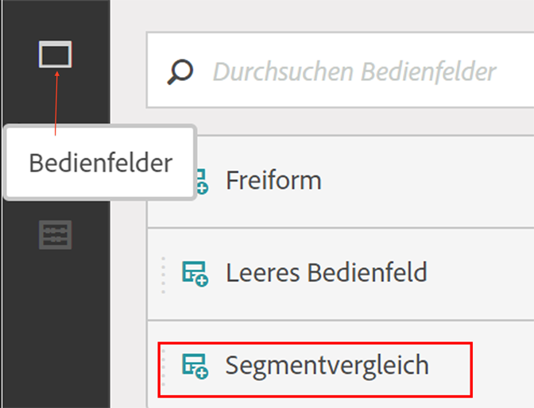
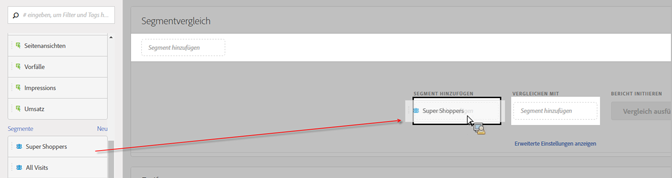
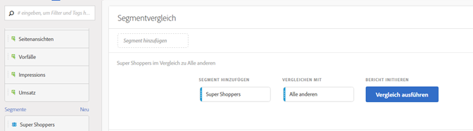
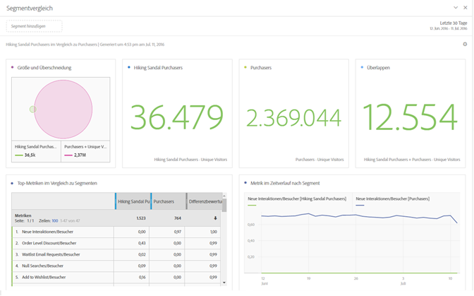
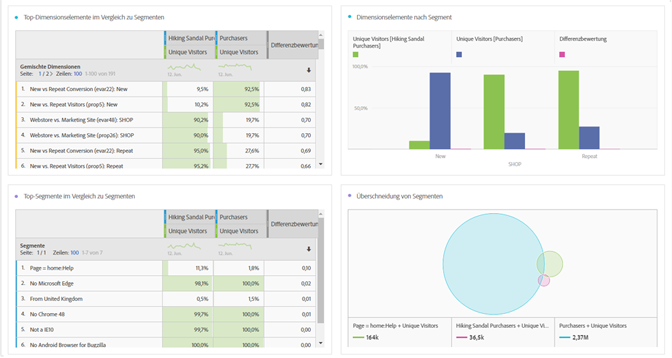

# Segmente vergleichen

Erläutert das Vorgehen zum Vergleichen von Segmenten in Analysis Workspace.

>[!NOTE]
>
>You can also compare segments within a [fallout analysis](../../../../analyze/analysis-workspace/visualizations/fallout/compare-segments-fallout.md#section_E0B761A69B1545908B52E05379277B56).

## Compare segments {#section_8F2BFC45131C49B4A2E08A063CD7A91F}

1. Navigate to **[!UICONTROL Analytics]** &gt; **[!UICONTROL Workspace]** and open a project.

1. Wählen Sie in der Leiste **[!UICONTROL Bedienfelder]** am linken Seitenrand **Segmentvergleich]aus und ziehen Sie die Option auf ein neues oder ein vorhandenes Objekt.[!UICONTROL **

   

1. Stellen Sie sicher, dass der für den Vergleich passende Datumsbereich festgelegt ist.
1. Wählen Sie Segmente aus, die Sie vergleichen möchten, und legen Sie diese auf dem Bedienfeld ab. Angenommen, Sie besitzen ein Segment „Spitzenkunden“:

   

   Nachdem Sie das Segment auf das Bedienfeld gezogen haben, erstellt Analytics automatisch ein Segment **[!UICONTROL Alle anderen], das alle enthält, die NICHT im ausgewählten Segment enthalten sind, in diesem Fall alle Kunden, die keine Spitzenkunden sind.** Es ist daher nicht erforderlich, dass Sie dieses Segment selbst erstellen. „Alle anderen“ wird im Bedienfeld automatisch zum Feld **[!UICONTROL Vergleichen mit]hinzugefügt.** Sie können es nach Belieben löschen und die Superkunden mit einem beliebigen anderen Segment vergleichen.

   

1. Klicken Sie auf **[!UICONTROL Erweiterte Optionen anzeigen], um Komponenten (Dimensionen, Metriken oder Segmente) aus Ihrem Segmentvergleich auszuschließen.** Weitere Informationen finden Sie im Abschnitt [Ausschluss von Komponenten bei Vergleichen](../../../../analyze/analysis-workspace/c-panels/c-segment-comparison/compare-segments.md#section_5E98FFA0744140C08D83700E3F025937).

1. Nachdem Sie für „Vergleichen mit“ das gewünschte Segment ausgewählt haben, klicken Sie auf **[!UICONTROL Erstellen]**.

   Durch diese Aktion wird ein Backend-Prozess gestartet, bei dem alle Dimensionen, Metriken und anderen Segmente durchlaufen werden und nach statistischen Unterschieden zwischen den beiden Segmenten gesucht wird. Oben im Werkzeug zeigt ein Fortschrittsbalken an, wie viel Zeit verbleibt, bis das Scannen aller Metriken und Dimensionen im Hinblick auf wesentliche Unterschiede abgeschlossen ist. Darüber hinaus werden die von Ihnen am häufigsten verwendeten Metriken, Dimensionen und Segmente priorisiert und zuerst ausgeführt. So erhalten Sie schnell die relevantesten Ergebnisse.

   Nachdem der Backend-Prozess den Scan abgeschlossen hat, sind einige neue Visualisierungen verfügbar:

   

   

1. Interpretieren Sie die Ergebnisse Ihres Segmentvergleichs anhand der Informationen im Abschnitt zu [neuen Visualisierungen, Tabellen und Zusammenfassungen](../../../../analyze/analysis-workspace/c-panels/c-segment-comparison/segment-comparison.md#concept_74FAC1C6D0204F9190A110B0D9005793).

## Exclude components from comparison {#section_5E98FFA0744140C08D83700E3F025937}

Es kann von Zeit zu Zeit erforderlich sein, einige Dimensionen, Metriken oder Segmente bei Segmentvergleichen auszuschließen. Hier ein Beispiel: Sie möchten das Segment mit US-amerikanischen Mobilanwendern und das Segment mit deutschen Mobilanwendern vergleichen. Es wäre nicht sinnvoll, geographische Dimensionen einzubeziehen, da es offensichtliche Standortunterschiede zwischen den beiden Segmenten gibt. Sie können solche Dimensionen ausschließen. So geht’s:

1. Nachdem Sie die zu vergleichenden Segmente in den Bereich gezogen haben, klicken Sie auf **[!UICONTROL Erweiterte Optionen anzeigen], um Komponenten (Dimensionen, Metriken oder Segmente) aus Ihrem Segmentvergleich auszuschließen.**

   

1. Verschieben Sie die Komponenten, die Sie ausschließen möchten, per Drag-and-Drop in den Bereich **[!UICONTROL Ausgeschlossene Komponenten].** (Sie können dieses als eine Blacklist mit auszuschließenden Komponenten betrachten.) Sie können diese Komponenten als Standard festlegen oder auf die Option **[!UICONTROL Alle löschen]klicken, um eine neue Auswahl zu treffen.**

   

1. Klicken Sie auf **[!UICONTROL Als Standard festlegen]**, um diese Komponenten aus **allen** Segmentvergleichen auszuschließen.

1. Wenn Sie die Liste mit ausgeschlossenen Komponenten verändern müssen, doppelklicken Sie beispielsweise einfach auf „Dimensionen“. Die Liste mit ausgeschlossenen Dimensionen wird dann angezeigt:

   

1. Löschen Sie einfach alle nicht erforderlichen Dimensionen, indem Sie auf das x-Symbol neben den einzelnen Dimensionen klicken. Speichern Sie dann die Liste, indem Sie auf **[!UICONTROL Als Standard festlegen klicken]**.

