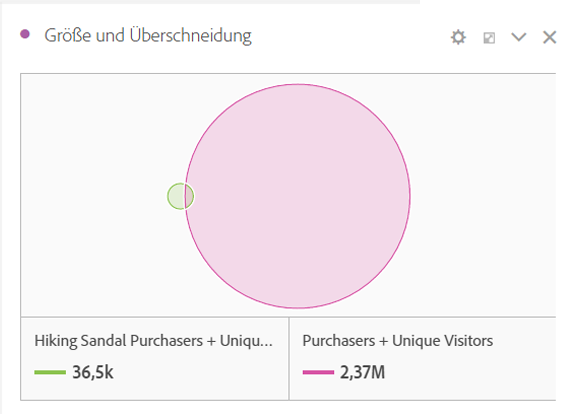
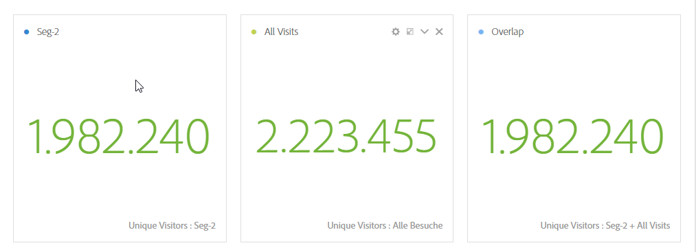
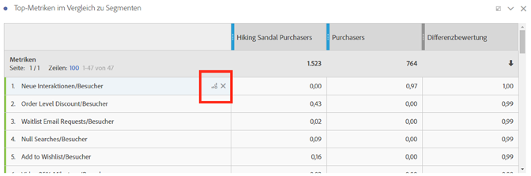
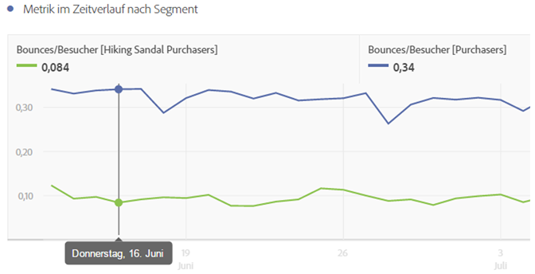
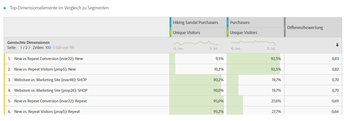
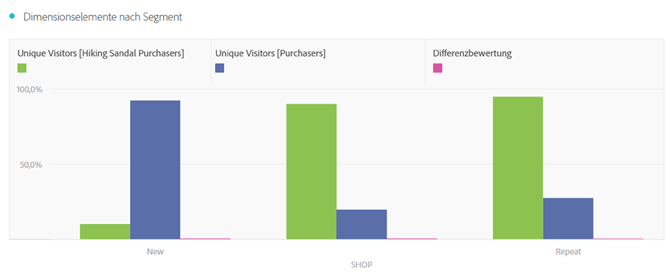
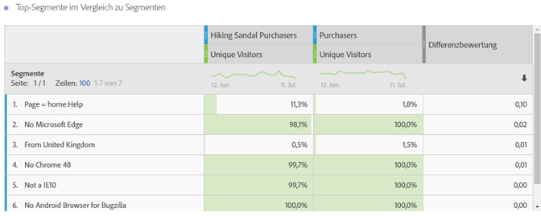

# Überblick über das Segment-IQ

Das Werkzeug für den Segmentvergleich (Segment-IQ) findet die meisten statistisch signifikanten Unterschiede zwischen beliebig vielen Segmenten mithilfe einer automatischen Analyse jeder einzelnen Metrik und Dimension, auf die Sie Zugriff haben. Es entdeckt automatisch die wesentlichen Merkmale der Zielgruppensegmente, die für die KPIs Ihres Unternehmens ausschlaggebend sind, und zeigt Ihnen, wie stark sich die Segmente überschneiden.

Es kann viele Stunden oder sogar Tage dauern, bis Analytiker über große Bereiche der Metriken und Dimensionen Ihres Unternehmens hinweg relevante Unterschiede zwischen Segmenten aufdecken. Diese Analyse ist nicht nur mühsam und zeitraubend, Sie können außerdem nie sicher sein, ob Sie nicht einen wichtigen Unterschied in einem Segment verpasst haben, der sich stark auf Ihre zielgerichtete Marketing-Maßnahme auswirkt.

[Segmentvergleich auf youtube](https://www.youtube.com/watch?v=fO3PNB93U_w&list=PL2tCx83mn7GuNnQdYGOtlyCu0V5mEZ8sS&index=38) (4:46)

Hierzu führt das Werkzeug für den Segmentvergleich einige wichtige neue Konzepte, Visualisierungen und Tabellen ein:

## “Everyone else” segment {#section_30AEE8181E5D46D9AB27F7CA3815D0CD}

Aus praktischen Gründen haben wir das Segment "Alle anderen" hinzugefügt, sodass Sie es nicht manuell erstellen müssen. Nehmen Sie beispielsweise die Zielgruppe Käufer vor. Sie müssen kein Segment für Nichtkäufer erstellen, da es bereits im Segment "Alle anderen" enthalten ist und schnell entfernt werden kann, wenn Sie stattdessen ein anderes Segment für den Vergleich hinzufügen möchten.

## Size and overlap {#section_885A71EE458C43189A77B8F552CA346A}

Die Visualisierung „Größe und Überschneidung“ zeigt die komparativen Größen aller ausgewählten Segmente und wie stark sich diese überschneiden. Wenn Sie den Mauszeiger auf die Visualisierung bewegen, sehen Sie, wie viele Besucher in den einzelnen sich überschneidenden oder sich nicht überschneidenden Bereichen enthalten sind. Sie können auch mit der rechten Maustaste auf die Überschneidung klicken, um für weitere Analysen ein ganz neues Segment zu erstellen. Wenn sich zwei Segmente nicht überschneiden (wenn z. B. das Segment "alle anderen" verwendet wird), sehen Sie auch, dass dies in diesem visuellen Element dargestellt wird.

## Population summaries {#section_21F2B66C60184A71B89E2982A6FB945D}

Auf der rechten Seite der Visualisierung der Größe und Überschneidung zeigt das Werkzeug für den Segmentvergleich die Gesamtzahl der in jedem Segment enthaltenen Unique Visitors und die Population der Überschneidung an.

## Top metrics {#section_E4A38516424949B79A559DC8793071F2}

>[!NOTE]
>
>Zeilenelemente, die nach Abschluss des Segmentvergleichs angewendet werden, erhalten keinen Differenzwert; Die Tabelle lädt nur Metrikdaten für die beiden Segmente, die verglichen werden.

Die Tabelle der Top-Metriken zeigt die Metriken, die für die größten statistischen Unterschiede zwischen den beiden von Ihnen ausgewählten Segmenten sorgen. Jede Zeile dieser Tabelle steht für eine für einen Unterschied sorgende Metrik. Diese Metriken sind danach geordnet, wie stark ihr Unterschied zwischen den einzelnen Segmenten ist. Die Metriken werden auch pro Besucher angezeigt, was bedeutet, dass, wenn „Besuche“ in der Tabelle angezeigt wird, die zugehörigen Zahlen in der Tabelle die durchschnittliche Anzahl der Besuche pro Besucher in den einzelnen Segmenten anzeigen. Wir liefern außerdem einen Differenzwert, der anzeigt, wie unterschiedlich diese Metrik in diesen beiden Segmenten vorhanden ist. Der Wert 1 zeigt, dass ein großer statistischer Unterschied besteht, während der Wert 0 zeigt, dass kein statistischer Unterschied vorliegt.

Einzelheiten zur Berechnung der einzelnen Werte der Tabellen finden Sie unter [Im Segmentvergleich verwendete statistische Tests](../../../../analyze/analysis-workspace/c-panels/c-segment-comparison/statistical-test.md#concept_0B6AC754EAED460283D4626983F838F4).

Die Tabelle „Top-Metriken“ ist ähnlich wie alle anderen Tabellen, die Sie in Analysis Workspace verwenden. Sie können eine beliebige Metrik, die für Sie von Interesse ist, auf die Tabelle ziehen und sich die für sie geltenden Vergleichswerte ansehen.

Sie können die Tabelle beliebig anpassen. Wir haben in jeder Tabellenzeile auch ein neues Symbol für das Erstellen einer Visualisierung hinzugefügt. Wenn Sie auf dieses Symbol klicken, werden eine ganz neue Tabelle und eine Visualisierung über dem Werkzeug für den Segmentvergleich erstellt, falls Sie die Tabelle „Top-Metriken“ nicht in Unordnung bringen und eine vertiefende Analyse lieber in einer neuen Tabelle durchführen möchten. Falls die Metrik nicht relevant ist, können Sie auf „X“ klicken, um sie insgesamt aus der Tabelle zu entfernen. Wie bei anderen Freiform-Tabellen können Sie durch die Liste der angezeigten Metriken blättern oder die Top 10, 20, 50 usw. anzeigen, wenn Sie mehr als die standardmäßig angezeigten fünf Linienelemente sehen möchten.

Rechts neben der Tabelle der Metriken befindet sich eine verknüpfte Visualisierung. Das Werkzeug für den Segmentvergleich zeigt standardmäßig die Top-Metrik in der Tabelle für jedes Segment als Trend über die letzten 30 Tage an. Wenn Sie eine andere in der Tabelle „Top-Metriken“ vorhandene Metrik visualisieren möchten, wählen Sie diese einfach aus, indem Sie darauf klicken. Daraufhin wird die Visualisierung auf der rechten Seite aktualisiert und zeigt die ausgewählte Metrik an.

## Top dimension items {#section_439C1782B153427CB4FB85E177146EC0}

>[!NOTE]
>
>Zeilenelemente, die nach Abschluss des Segmentvergleichs angewendet werden, erhalten keinen Differenzwert; Die Tabelle lädt nur Metrikdaten für die beiden Segmente, die verglichen werden.

Ähnlich wie bei der Tabelle „Top-Metriken“ liefert das Segmentvergleichswerkzeug in der Tabelle „Top-Dimensionselemente“ die Dimensionselemente über all Ihre Dimensionen hinweg, die für die stärksten Unterschiede sorgen. Alle Zeilen zeigen den Prozentsatz der einzelnen Segmente an, die dieses Dimensionselement enthalten.

Wenn Sie z. B. Segment A mit Segment B vergleichen, zeigt sich in der Tabelle „Top-Dimensionselemente“ möglicherweise, dass 100 % der Besucher in Segment A das Dimensionselement „Browsertyp: Google“ haben, während nur 19,6 % von Segment B dieses Dimensionselement besitzen.

Rechts neben der Tabelle der Top-Dimensionselemente zeigt das Segmentvergleichswerkzeug das ausgewählte Top-Dimensionselement zusammen mit anderen Top-Dimensionselementen aus der Dimension für den Vergleich an:

## Top segments table {#section_6A0C39F930564240AF7A157005C7A80B}

>[!NOTE]
>
>Zeilenelemente, die nach Abschluss des Segmentvergleichs angewendet werden, erhalten keinen Differenzwert; Die Tabelle lädt nur Metrikdaten für die beiden Segmente, die verglichen werden.

Die Tabelle „Top-Segmente“ ist hilfreich, weil sie zeigt, welche Segmente (außer den beiden für den Vergleich ausgewählten Segmenten) zwischen den beiden ausgewählten Segmenten sehr unterschiedliche Überschneidungen aufweisen. Wenn Sie z. B. Segment A mit Segment B vergleichen, kann die Tabelle „Top-Segmente“ zeigen, dass ein drittes Segment „Wiederkehrende Besuche“ eine starke Überschneidung mit Segment A, jedoch keine Überschneidung mit Segment B aufweist.

Außerdem wird das stark differenzierende zusätzliche Segment rechts neben der Tabelle in einer Überschneidungsvisualisierung angezeigt:

Die Überschneidungsvisualisierung bietet eine grafische Darstellung des Unterschieds bei der Überschneidung zwischen allen drei Segmenten. Wie bei den anderen verknüpften Visualisierungen können Sie in der Tabelle auf die einzelnen zusätzlichen Segmente klicken, damit die Visualisierung mit dem ausgewählten Segment aktualisiert wird.

Klicken Sie hier für weitere Informationen zu den [statistischen Tests](../../../../analyze/analysis-workspace/c-panels/c-segment-comparison/statistical-test.md#concept_0B6AC754EAED460283D4626983F838F4), die beim Segmentvergleich verwendet werden.
