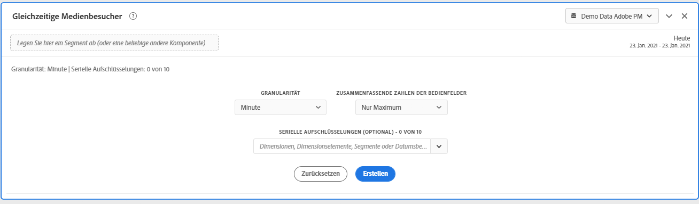
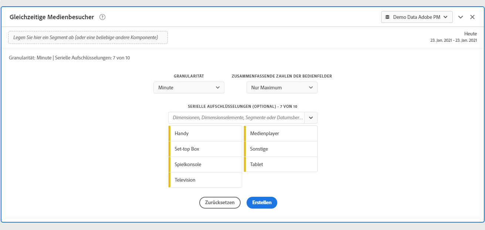
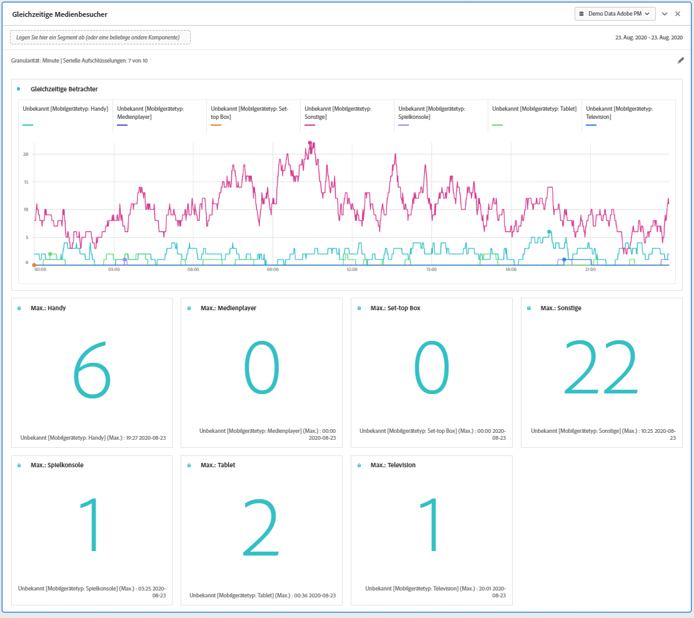
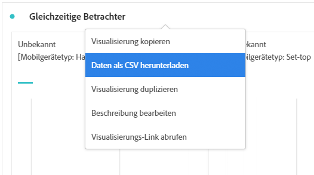

# Medienkonforme Viewer-Bedienfeld

>[!IMPORTANT]
>
>Diese Funktion ist in Limited Testing für Medienanalysekunden verfügbar. [Weitere Informationen ...](https://docs.adobe.com/content/help/de-DE/analytics/landing/an-releases.html)

Media Analytics-Kunden können gleichzeitige Viewer analysieren, um zu verstehen, wo es zu einer Spitzenzeitäquivalenz kam oder wo es zu Dropdown-Listen kam, um wertvolle Einblicke in die Qualität von Inhalten und die Interaktion mit Viewern zu erhalten und um bei der Fehlerbehebung oder Planung für Volumen oder Skalierung zu helfen.

In Analysis Workspace bezeichnet der Begriff &quot;Concurrent Viewers&quot;die Anzahl der individuellen Besucher, die Ihre Medienstreams zu einem bestimmten Zeitpunkt anzeigen, unabhängig von der Anzahl der Sitzungen.

Das Bedienfeld &quot;Medienzeitgleich-Viewer&quot;ermöglicht die Analyse von gleichzeitigen Viewern im Zeitverlauf mit Details zur Spitzenzeitäquivalenz und der Möglichkeit, Unterteilungen und Vergleichen vorzunehmen.  Um auf das Medienkonforme Viewer-Bedienfeld zuzugreifen, navigieren Sie zu einer Report Suite mit aktivierten Media Analytics-Komponenten. Klicken Sie dann auf das Bedienfeldsymbol ganz links und ziehen Sie das Bedienfeld in Ihr Analysis Workspace-Projekt.

## Bedienfeldeingaben {#Input}

Sie können das Media Concurrent Viewers-Bedienfeld mithilfe der folgenden Eingabeeinstellungen konfigurieren:

| Einstellung | Beschreibung |
|---|---|
| Datumsbereich des Bereichs | Der Datumsbereich des Bedienfelds ist standardmäßig &quot;Heute&quot;.  Sie können sie bearbeiten, um einen oder mehrere Monate gleichzeitig Ansicht.     Diese Visualisierung ist auf 1440 Datenzeilen beschränkt (z. B. 24 Stunden bei einer Granularität auf Minutenebene).  Wenn eine Kombination aus Datumsbereich und Granularität zu mehr als 1440 Zeilen führt, wird die Granularität automatisch aktualisiert, um den vollständigen Datumsbereich aufzunehmen. |
| Granularität | Die Standardeinstellung für die Granularität ist &quot;Minute&quot;.    Diese Visualisierung ist auf 1440 Datenzeilen beschränkt (z. B. 24 Stunden bei einer Granularität auf Minutenebene).  Wenn eine Kombination aus Datumsbereich und Granularität zu mehr als 1440 Zeilen führt, wird die Granularität automatisch aktualisiert, um den vollständigen Datumsbereich aufzunehmen. |
| Zusammenfassende Zahlen der Bedienfelder | Um Daten zu Datum und Uhrzeit für gleichzeitige Viewer anzuzeigen, steht eine Zusammenfassungsnummer zur Verfügung. Die Maximal zeigt Details zur Spitzenzeitäquivalenz an. Das Minimum zeigt Details zum Trough an.  Die Standardeinstellung im Bereich zeigt nur Maximum an, Sie können es jedoch ändern, um Minimum oder sowohl Maximum als auch Minimum anzuzeigen.  Wenn Sie Aufschlüsselungen verwenden, wird jeweils eine Zusammenfassungsnummer angezeigt. |
| Aufschlüsselung der Reihen | Optional können Sie Ihre Visualisierung nach Segmenten, Dimensionen, Dimensionselementen oder Datumsbereichen unterteilen.   - Sie können bis zu 10 Zeilen auf einmal Ansicht. Aufschlüsselungen sind auf eine einzelne Ebene beschränkt.  - Beim Ziehen einer Dimension werden die Elemente der obersten Dimension automatisch anhand des ausgewählten Bereichsdatumsbereichs ausgewählt.  - Ziehen Sie zum Vergleichen von Datumsbereichen 2 oder mehr Datumsbereiche in den Filter für die Aufschlüsselung der Serie. |

### Standardmäßige Ansicht

### Aufschlüsselung nach Serie, Ansicht

## Bedienfeldausgabe {#Output}

Das Medienkonforme Viewer-Bedienfeld gibt ein Liniendiagramm und Zusammenfassungsnummern zurück, die Details zum maximalen und/oder minimalen gleichzeitigen Viewer enthalten.  Oben im Bedienfeld wird eine Zusammenfassungszeile angezeigt, die Sie an die ausgewählten Bedienfeldeinstellungen erinnert.

Sie können das Bedienfeld jederzeit bearbeiten und neu erstellen, indem Sie oben rechts auf den Stift zum Bearbeiten klicken.

Wenn Sie die Aufschlüsselung der Serie ausgewählt haben, werden eine Zeile im Liniendiagramm und eine Zusammenfassungsnummer für jede der folgenden Zeilen angezeigt:

### Datenquelle

Die einzige Metrik, die in diesem Bedienfeld verwendet werden kann, sind gleichzeitige Viewer:

| Metrik | Beschreibung |
|---|---|
| Gleichzeitige Betrachter | Anzahl der individuellen Besucher, die Ihre Medienstreams zu einem bestimmten Zeitpunkt anzeigen, unabhängig von der Anzahl der Sitzungen.  Dies unterscheidet sich vom Berichte &quot;Gleichzeitiger Viewer&quot;im Bereich &quot;Berichte&quot;, der &quot;Gleichzeitige aktive Sitzungen&quot;verwendet.  Durch die Verwendung individueller Besucher werden unerwünschte &quot;Spitzen&quot;an den Grenzen der Show (wo die Sitzungen gleichzeitig enden und beginnen) entfernt. |

Eine Freiformtabelle ist in dieser Ansicht nicht verfügbar.  Zur Ansicht der Datenquelle können Sie mit der rechten Maustaste auf das Liniendiagramm klicken und als .csv-Datei herunterladen.  Serienunterteilungen werden einbezogen.

## Häufig gestellte Fragen (FAQ) {#FAQ}

| Frage | Antwort |
|---|---|
| Wo ist die Freiformtabelle? Wie kann ich die Datenquelle anzeigen? | Die Freiformtabelle ist in dieser Ansicht nicht verfügbar.  Sie können die Datenquelle herunterladen, indem Sie mit der rechten Maustaste auf das Liniendiagramm klicken und die CSV-Datei herunterladen. |
| Warum hat sich meine Granularität verändert? | Diese Visualisierung ist auf 1440 Datenzeilen beschränkt (z. B. 24 Stunden bei einer Granularität auf Minutenebene).  Wenn eine Kombination aus Datumsbereich und Granularität zu mehr als 1440 Zeilen führt, wird die Granularität automatisch aktualisiert, um den vollständigen Datumsbereich aufzunehmen.  Wenn Sie von einem größeren auf einen kleineren Datumsbereich wechseln, wird die Granularität auf das niedrigste zulässige Detail aktualisiert, sobald der Datumsbereich geändert wurde. Um eine höhere Granularität Ansicht, bearbeiten Sie das Bedienfeld und erstellen Sie es erneut. |
| Wie vergleiche ich Videonamen, Segmente, Inhaltstypen usw. | Um diese in einer einzigen Visualisierung zu vergleichen, ziehen Sie Segmente, Dimensionen oder bestimmte Dimensionselemente in den Filter für die Aufschlüsselung der Serie.  Die Ansicht ist auf 10 Aufschlüsselungen beschränkt.  Um mehr als 10 Ansichten zu ermöglichen, müssen Sie mehrere Bedienfelder verwenden. |
| Wie vergleiche ich Datumsbereiche? | Um Datumsbereiche in einer einzigen Visualisierung zu vergleichen, verwenden Sie die Aufschlüsselungen der Reihen, indem Sie zwei oder mehr Datumsbereiche ziehen.  Diese Datumsbereiche setzen den Datumsbereich des Bereichs außer Kraft. |
| Wie ändere ich den Visualisierungstyp? | Dieses Bedienfeld ermöglicht nur die Visualisierung der Linie für die Zeitreihen. |
| Kann ich die Anomalieerkennung ausführen? | Nein.  Die Anomalieerkennung ist für dieses Bedienfeld nicht verfügbar. |
| Warum sollten Sie eindeutige Besucher anstelle von aktiven Sitzungen verwenden? | Die Verwendung individueller Besucher ermöglicht das Entfernen unerwünschter Spitzen an den Grenzen der Show (wobei die Sitzungen gleichzeitig enden und beginnen). |
| Was bedeutet es, gleichzeitige Viewer mit höherer Granularität als Minute zu haben? | Bei einer Granularität von mehr als einer Minute stellen gleichzeitige Viewer die Summe der eindeutigen gleichzeitigen Viewer für alle Minuten innerhalb dieses Zeitraums dar.  Beispielsweise ist die Granularität gleichzeitiger Viewer auf Stundenebene die Summe der eindeutigen gleichzeitigen Viewer für alle Minuten innerhalb der Stunde. |
| Was ist, wenn ich mehr als einen Tag auf der Minutenebene der Granularität sehen möchte? | Wenn Sie bis zu 1 Monat lang auf Daten mit Granularität auf Minutenebene zugreifen möchten, können Sie die Analytics Berichte-API (2.0 oder 1.4) verwenden. Weitere Informationen zu Analytics-APIs finden Sie im Benutzerhandbuch für [Analytics-API-Berichte](https://www.adobe.io/apis/experiencecloud/analytics/docs.html#!AdobeDocs/analytics-2.0-apis/master/reporting-guide.md). |

<!-- For more information about Media Concurrent Viewers, visit [MA doc page]( https://url). -->
