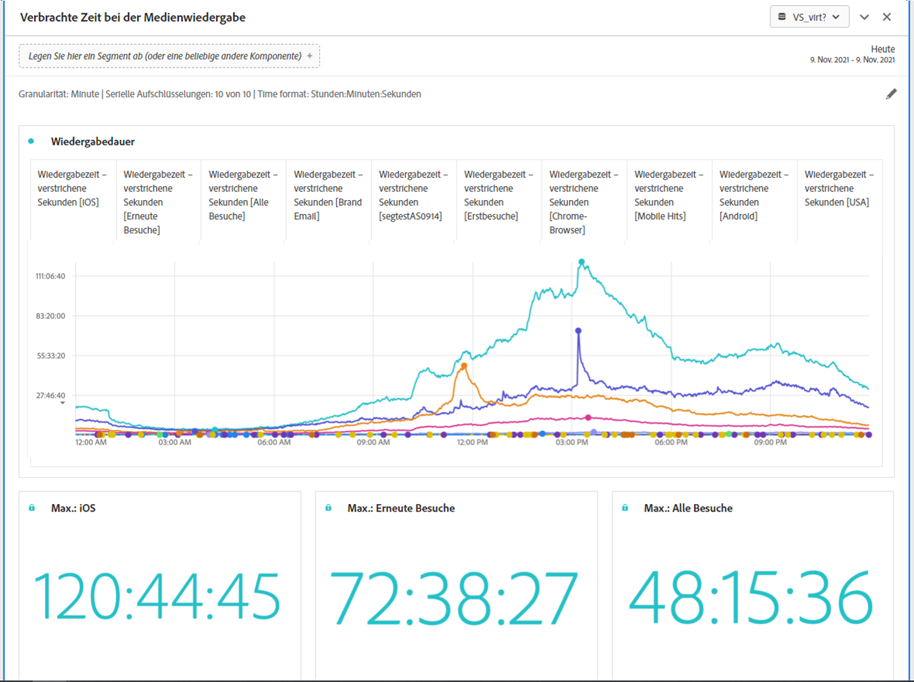

# Zeiteingaben und Ausgaben des Bedienfelds &quot;Medienwiedergabe&quot; {#Inputs-and-outputs}

Sie können den Bereich &quot;Besuchszeit für Medienwiedergabe&quot;mit den folgenden Eingabe- und Ausgabeeinstellungen anpassen.

## Panel-Eingaben {#Input}

Sie können das Panel „Verbrachte Zeit bei der Medienwiedergabe“ mithilfe der folgenden Eingabeeinstellungen konfigurieren:

| Einstellung | Beschreibung |
|---|---|
| Datumsbereich der Bedienfelder | Der Datumsbereich des Panels ist standardmäßig „Heute“. Sie können ihn so verändern, dass Sie einen einzelnen Tag oder viele Monate auf einmal betrachten können. Diese Visualisierung ist auf 1.440 Datenzeilen beschränkt (z. B. 24 Stunden bei einer Granularität auf Minutenebene). Wenn eine Kombination aus Datumsbereich und Granularität zu mehr als 1440 Zeilen führt, wird die Granularität automatisch reduziert, um den vollständigen Datumsbereich zu erlauben. |
| Granularität | Die Standardeinstellung für die Granularität ist „Minute“. Diese Visualisierung ist auf 1.440 Datenzeilen beschränkt (z. B. 24 Stunden bei einer Granularität auf Minutenebene). Wenn eine Kombination aus Datumsbereich und Granularität zu mehr als 1440 Zeilen führt, wird die Granularität automatisch reduziert, um den vollständigen Datumsbereich zu erlauben. |
| Zusammenfassende Zahlen der Bedienfelder | Um Details zu Datum und Uhrzeit für die verbrachte Zeit bei der Medienwiedergabe anzuzeigen, steht eine zusammenfassende Zahl zur Verfügung. Das Maximum zeigt Details zu Spitzenzeiten von gleichzeitigen Aufrufen an. Das Minimum zeigt Details zum Tiefstand an. In der Summe wird die gesamte Wiedergabezeit für diese Auswahl dargestellt. Im Panel wird standardmäßig nur der maximale Wert angezeigt. Sie können dies jedoch ändern, sodass das Minimum, die Summe oder eine beliebige Kombination der drei Werte angegeben wird. Wenn Sie Aufschlüsselungen verwenden, wird jeweils eine Zusammenfassungsnummer angezeigt. |
| Serienaufschlüsselung | Optional können Sie Ihre Visualisierung nach Segmenten, Dimensionen, Dimensionselementen oder Datumsbereichen unterteilen.
– Sie können bis zu 10 Zeilen auf einmal ansehen. Aufschlüsselungen sind auf eine einzelne Ebene beschränkt.

– Beim Ziehen einer Dimension werden die oberen Dimensionselemente automatisch anhand des im Panels ausgewählten Datumsbereichs ausgewählt.
– Ziehen Sie zum Vergleichen von Datumsbereichen zwei oder mehr Datumsbereiche in den Filter für die Aufschlüsselung der Serie. |
| Zeitformat | Sie können die Wiedergabedauer entweder in Stunden:Minutes:Sekunden (Standard) oder in Minuten anzeigen (in Ganzzahlen, auf 0,5 aufgerundet). |
| Anzeige der Datumsreihe | Wenn Sie mindestens zwei Datumsbereichssegmente als Serienaufschlüsselungen platziert haben, sehen Sie die Option zur Auswahl einer Überlagerung (Standard) oder einer Sequenz. Bei der Überlagerung werden die Linien mit einem gemeinsamen X-Achsen-Beginn gezeigt, sodass sie parallel laufen, während bei der Sequenz die Linien mit ihrem jeweiligen X-Achsen-Beginn dargestellt werden. Wenn die Daten aufeinanderfolgend sind (z. B. Segment 1 endet um 20:44 Uhr und Segment 2 startet um 20:45 Uhr), werden die Zeilen nacheinander dargestellt. |

### Standardansicht

## Panel-Ausgabe {#Output}

Das Panel „Verbrachte Zeit bei der Medienwiedergabe“ gibt ein Liniendiagramm und zusammenfassende Zahlen zurück, die Details zur maximalen Wiedergabedauer, minimalen Wiedergabedauer und/oder der Summe der Wiedergabedauer enthalten. Oben im Bedienfeld wird eine Zusammenfassungszeile angezeigt, die Sie an die ausgewählten Bedienfeldeinstellungen erinnert.

Sie können das Bedienfeld jederzeit bearbeiten oder erneut erstellen, indem Sie oben rechts auf den Stift zum Bearbeiten klicken.

Wenn Sie Serienaufschlüsselung ausgewählt haben, wird für jeden der folgenden Punkte eine Zeile im Liniendiagramm und eine Zusammenfassungsnummer angezeigt:

### Datenquelle

Die einzige Metrik, die in diesem Panel verwendet werden kann, ist „Wiedergabedauer“.

| Metrik | Beschreibung |
|---|---|
| Wiedergabedauer | Summe der Stunden:minutes:Sekunden (oder Minuten) des Inhalts, der während der ausgewählten Granularität betrachtet wurde, einschließlich Pausen, Pufferung und der Zeit bis zum Start. |
