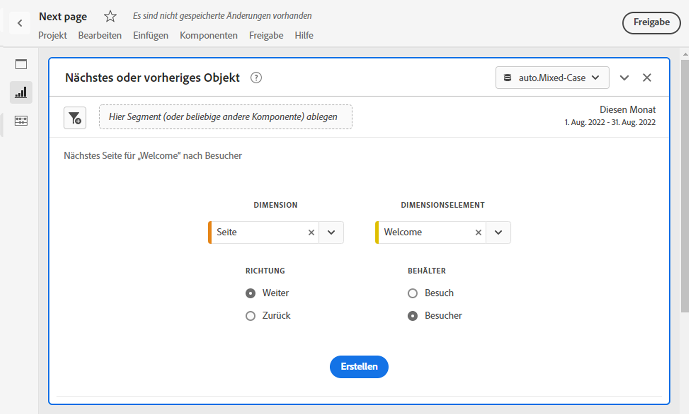
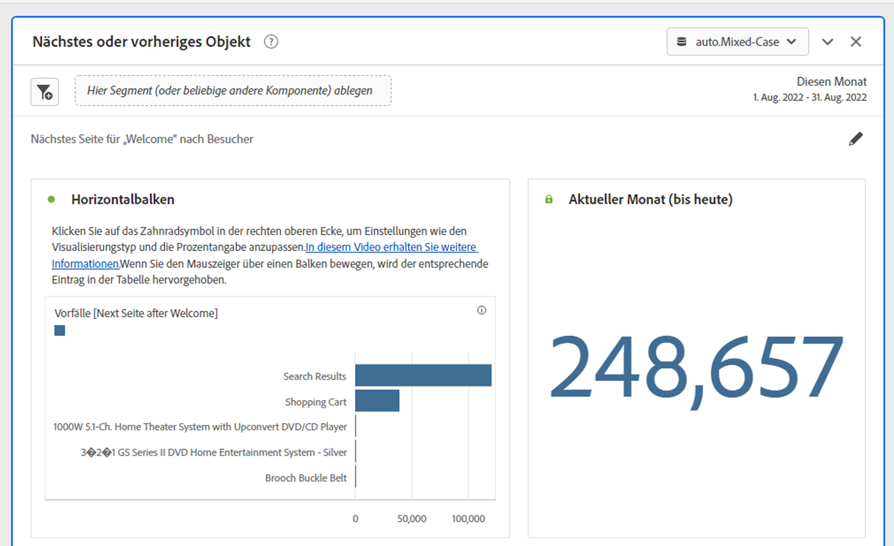
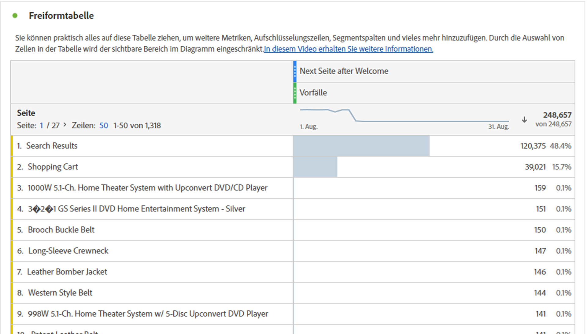

# Nächstes oder vorheriges Objekt-Panel

Die [!UICONTROL Nächstes oder vorheriges Element] wurde in Reports &amp; Analytics als Bericht gestartet, unter [!UICONTROL Berichte] > [!UICONTROL Am häufigsten] > [!UICONTROL Nächste Seite/Vorherige Seite]. Dieses Workspace-Bedienfeld enthält eine Reihe von Tabellen und Visualisierungen, mit denen Sie das nächste oder vorherige Dimensionselement für eine bestimmte Dimension einfach identifizieren können. Beispiel:

## Zugriff auf den Bereich

Sie können über [!UICONTROL Berichte] oder innerhalb [!UICONTROL Arbeitsbereich].

| Zugangspunkt | Beschreibung |
| --- | --- |
| [!UICONTROL Berichte] | <ul><li>Das Bedienfeld wurde bereits in einem Projekt abgelegt.</li><li>Die linke Leiste ist ausgeblendet.</li><li>Wenn Sie [!UICONTROL Nächste Seite], wurden die Standardeinstellungen bereits angewendet, z. B. [!UICONTROL Seite] für [!UICONTROL Dimension]und der obersten Seite als [!UICONTROL Dimension], [!UICONTROL Nächste] für [!UICONTROL Richtung] und [!UICONTROL Besuch] für [!UICONTROL Container]. Sie können alle diese Einstellungen ändern.</li></ul> |
| Workspace | Erstellen Sie ein neues Projekt und wählen Sie in der linken Leiste das Bedienfeldsymbol aus. Ziehen Sie dann die [!UICONTROL Nächstes oder vorheriges Element] oberhalb der Freiformtabelle angezeigt. Beachten Sie, dass [!UICONTROL Dimension] und [!UICONTROL Dimension] -Felder sind leer. Wählen Sie eine Dimension aus der Dropdownliste aus. [!UICONTROL Dimensionen] werden basierend auf der Variablen [!UICONTROL Dimension] auswählen. Das oberste Dimensionselement wird hinzugefügt, Sie können jedoch ein anderes Element auswählen. Die Standardeinstellung ist &quot;Weiter&quot;und &quot;Besucher&quot;. Auch hier können Sie diese ändern.
 |

{style=&quot;table-layout:auto&quot;}

## Panel-Eingaben {#Input}

Sie können die [!UICONTROL Nächstes oder vorheriges Element] Bedienfeld mit den folgenden Eingabeeinstellungen:

| Einstellung | Beschreibung |
| --- | --- |
| Dropzone Segment (oder andere Komponente) | Sie können Segmente oder andere Komponenten per Drag-and-Drop verschieben, um die Ergebnisse Ihrer Bedienfelder weiter zu filtern. |
| Dimension | Die Dimension, für die Sie die nächsten oder vorherigen Elemente untersuchen möchten. |
| Dimensionselement | Der spezifische Artikel im Mittelpunkt Ihrer nächsten/vorherigen Anfrage. |
| Richtung | Geben Sie an, ob Sie nach dem [!UICONTROL Nächste] oder [!UICONTROL Vorherige] Dimensionselement. |
| Container | [!UICONTROL Besuch] oder [!UICONTROL Besucher] (Standard) bestimmen den Umfang Ihrer Anfrage. |

{style=&quot;table-layout:auto&quot;}

Klicken **[!UICONTROL Build]** , um das Bedienfeld zu erstellen.

## Bedienfeldausgabe {#output}

Die [!UICONTROL Nächstes oder vorheriges Element] -Bedienfeld gibt einen umfangreichen Satz an Daten und Visualisierungen zurück, damit Sie besser verstehen können, welche Vorkommen bestimmten Dimensionselementen folgen oder vorausgehen.

| Visualisierung | Beschreibung |
| --- | --- |
| Horizontalbalken | Führt die nächsten (oder vorherigen) Elemente basierend auf dem ausgewählten Dimensionselement auf. Wenn Sie den Mauszeiger über eine einzelne Leiste bewegen, wird das entsprechende Element in der Freiformtabelle markiert. |
| Zusammenfassungszahl | Allgemeine Zusammenfassungsnummer aller nächsten oder vorherigen Dimensionselementvorkommen für den aktuellen Monat (bisher) |
| Freiformtabelle | Führt die nächsten (oder vorherigen) Elemente basierend auf dem ausgewählten Dimensionselement im Tabellenformat auf. Hierbei handelte es sich beispielsweise um die beliebtesten Seiten (nach Vorfällen), die Besucher nach (oder vor) der Startseite oder Workspace-Seite aufriefen. |

{style=&quot;table-layout:auto&quot;}
