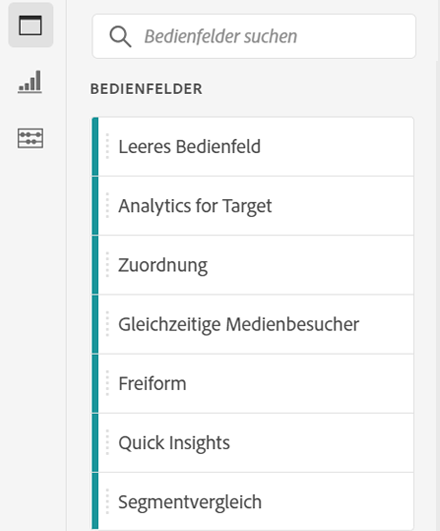
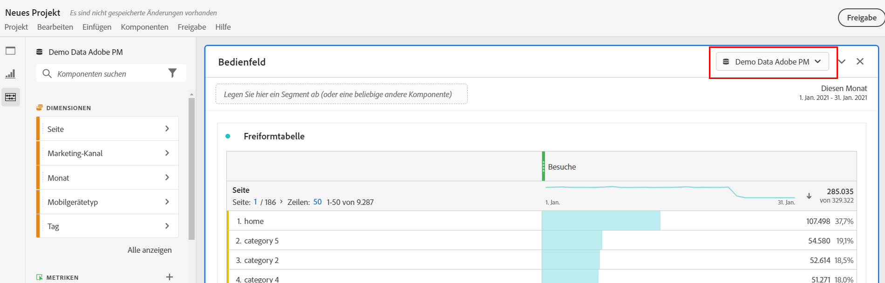
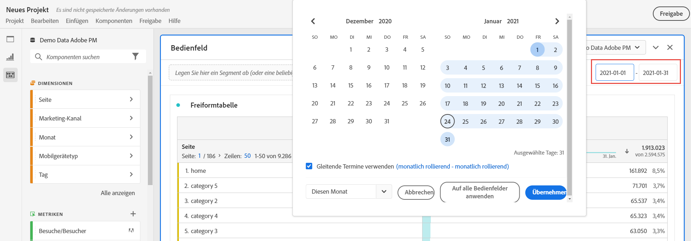
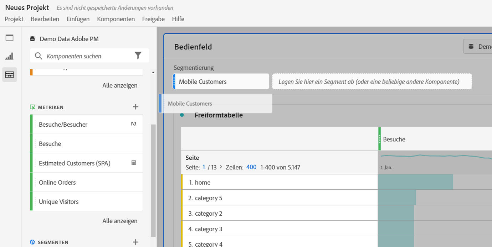
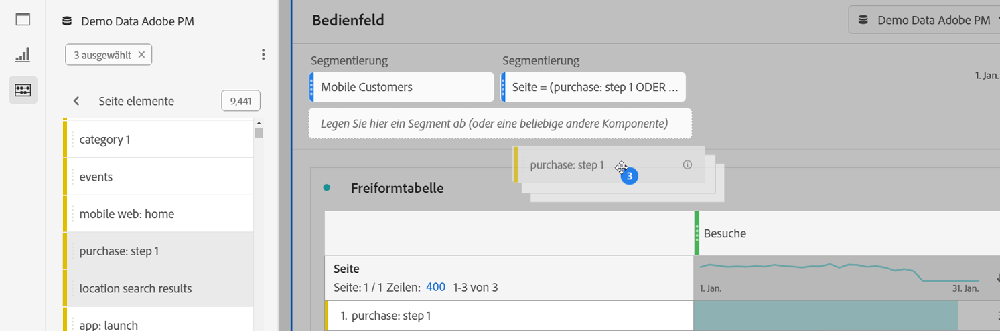
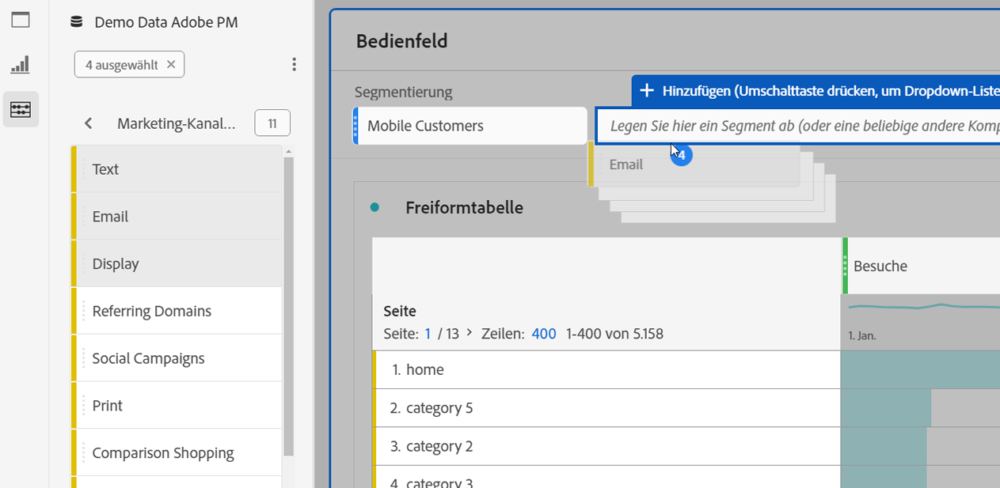

# Übersicht über Bedienfelder

A [!UICONTROL panel] is a collection of tables and visualizations. Sie können auf Bedienfelder über das Symbol oben links in Workspace zugreifen. Bedienfelder sind hilfreich, wenn Sie Ihre Projekte nach Zeiträumen, Report Suites oder Anwendungsfällen für Analysen organisieren möchten. Die folgenden Bedienfeldtypen sind in Analysis Workspace verfügbar:

| Name des Bedienfelds | Beschreibung |
|---|---|
| [Leeres Bedienfeld](blank-panel.md) | Wählen Sie aus den verfügbaren Bereichen und Visualisierungen, um Ihre Analyse Beginn. |
| [Bedienfeld „Quick Insights“](quickinsight.md) | Sie können rasch eine Freiformtabelle und eine entsprechende Visualisierung erstellen, um Einblicke schneller zu analysieren und bereitzustellen. |
| [Analytics for Target-Bedienfeld](a4t-panel.md) | Target-Aktivitäten und Erlebnisse in Analysis Workspace analysieren. |
| [Attributionsbedienfeld](attribution.md) | Vergleichen und visualisieren Sie im Handumdrehen eine beliebige Anzahl von Zuordnungsmodellen unter Verwendung verschiedener Dimensionen und Konversionsmetriken. |
| [Freiform-Bedienfeld](freeform-panel.md) | Führen Sie unbegrenzte Vergleiche und Aufschlüsselungen durch und fügen Sie dann Visualisierungen hinzu, um eine umfangreiche Datengeschichte zu erzählen. |
| [Medienkonforme Viewer-Bedienfeld](media-concurrent-viewers.md) | Analysieren Sie gleichzeitige Betrachter über einen längeren Zeitraum. Sie erhalten Details zum maximalen gleichzeitigen Zugriff und die Möglichkeit, aufzuschlüsseln und zu vergleichen. |
| [Bedienfeld „Segmentvergleich“](c-segment-comparison/segment-comparison.md) | Vergleichen Sie schnell zwei Segmente über alle Datenpunkte hinweg, um automatisch relevante Unterschiede zu ermitteln. |

[!UICONTROL Quick Insight]-, [!UICONTROL Blank] - und [!UICONTROL Freiform] -Bedienfelder bieten einen hervorragenden Beginn Ihrer Analyse, während [!UICONTROL Analytics für Zielgruppe], [!UICONTROL Attribution IQ],   Media Concurrent ViewersundSegmentvergleichsich zu erweiterten Analysen eignen. In Projekten steht eine `"+"`-Schaltfläche zur Verfügung, mit der Sie jederzeit leere Bedienfelder hinzufügen können.

The default starting panel is the [!UICONTROL Freeform] panel, but you can make the [blank panel](/help/analyze/analysis-workspace/c-panels/blank-panel.md) your default as well.

## Bereichsbericht-Suite {#report-suite}

Tabellen und Visualisierungen innerhalb eines Bedienfelds leiten Daten aus der oben rechts im Bedienfeld ausgewählten [!UICONTROL Report Suite] ab. Die Report Suite bestimmt auch, welche Komponenten in der linken Leiste verfügbar sind. In einem Projekt können Sie je nach Anwendungsfall Ihrer Analyse eine oder [viele Report Suites](https://docs.adobe.com/content/help/de-DE/analytics/analyze/analysis-workspace/build-workspace-project/multiple-report-suites.html) verwenden.

## Bereichskalender {#calendar}

Der Bedienfeldkalender steuert den Tabellenbereich und die Visualisierungen innerhalb eines Berichte.

Hinweis: Wenn eine (violette) Datumsbereichskomponente in einer Tabelle, Visualisierung oder einem Bereich-Dropzone verwendet wird, wird der Bereichskalender überschrieben.

## Bereich-Dropzone {#dropzone}

Mit dem Bedienfeld-Dropzone können Sie Segment- und Dropdown-Filter auf alle Tabellen und Visualisierungen innerhalb eines Bedienfelds anwenden. Sie können einen oder mehrere Filter auf einen Bereich anwenden. Der Titel über jedem Filter kann geändert werden, indem Sie auf den Stift bearbeiten klicken, oder Sie können mit der rechten Maustaste klicken, um ihn ganz zu entfernen.

### Filter segmentieren

Ziehen Sie ein beliebiges Segment aus der linken Leiste in den Ablagebereich des Bedienfelds, um mit dem Filtern des Bedienfelds zu beginnen.

### Ad-hoc-SegmentFilter

Nicht-Segmentkomponenten können auch direkt in die Dropzone gezogen werden, um **Ad-hoc-Segmente** zu erstellen. So sparen Sie Zeit und Mühe beim Aufrufen des Segmentaufbaus. Auf diese Weise erstellte Segmente werden automatisch als Segmente auf Trefferebene definiert. Diese Definition kann geändert werden, indem Sie auf das Informationssymbol (i) neben dem Segment klicken, dann auf das Bleistiftsymbol zum Bearbeiten und im Segmentaufbau bearbeiten.

Ad-hoc-Segmente sind lokal im Projekt und werden nicht in der linken Leiste angezeigt, es sei denn, Sie veröffentlichen sie.

### Dropdown-Filter {#dropdown-filter}

Neben Segmentdaten können Sie mit **Dropdown-Filtern** auch mit den Daten auf kontrollierte Weise interagieren. Sie können beispielsweise einen Dropdown-Filter für Mobilgerätetypen hinzufügen, damit Sie das Bedienfeld nach Tablet, Mobiltelefon oder Desktop segmentieren können.

Dropdown-Filter können auch verwendet werden, um viele Projekte zu einem zu konsolidieren. Wenn Sie beispielsweise mehrere Versionen desselben Projekts mit unterschiedlichen Ländersegmenten verwenden, können Sie alle Versionen in einem Projekt zusammenfassen und einen Dropdown-Filter &quot;Land&quot;hinzufügen.

**Erstellen und verwenden Sie Dropdown-Filter:**

1. Wenn Sie einen Dropdownfilter mit Elementen [!UICONTROL der]Dimension erstellen möchten, z. B. mit Werten innerhalb der Dimension [!UICONTROL Marketing Kanal] , klicken Sie in der linken Leiste auf das Symbol mit dem Pfeil neben Ihrer Dimension. Dadurch werden alle verfügbaren Elemente verfügbar gemacht. Wählen Sie ein oder mehrere Komponentenelemente aus der linken Leiste aus und legen Sie sie **bei gedrückter Umschalttaste** im Bedienfeld-Dropzone ab. Dadurch werden die Komponenten zu einem Dropdown-Filter und nicht zu einem einzigen Segment.
1. Wenn Sie einen Dropdown-Filter mit einer anderen Komponente wie Metriken, Segmente oder Datumsbereichen erstellen möchten, wählen Sie in der linken Leiste einen Komponententyp aus und legen Sie ihn in der Dropzone des Bereichs ab, **während Sie die Umschalttaste** gedrückt halten.
1. Wählen Sie eine der Optionen aus dem Dropdownmenü aus, um die Daten im Bedienfeld zu ändern. You can also choose to not filter any of the panel data by selecting **[!UICONTROL No filter]**.

[Sehen Sie sich das Video](https://www.youtube.com/watch?v=vpJywtsFVPI) an, um mehr über das Hinzufügen von Dropdown-Filtern zu Ihrem Projekt zu erfahren.
