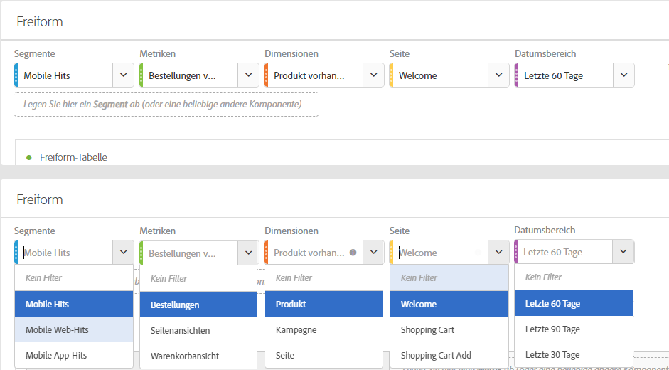
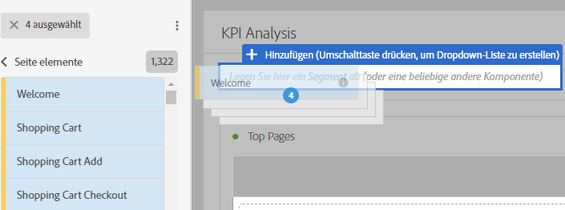
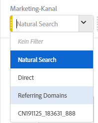

# Übersicht über Bedienfelder

Ein Bedienfeld ist eine Sammlung von Tabellen und Visualisierungen. Sie können auf Bedienfelder über das Symbol oben links in Workspace zugreifen. Bedienfelder sind hilfreich, wenn Sie Ihre Projekte anhand von Zeiträumen, Geschäftsbereichen, Standorten usw. organisieren möchten. Die folgenden vier Arten von Bedienfeldern sind in Analysis Workspace verfügbar: „Leeres Bedienfeld“, „Attribution“, „Freiform-Bedienfeld“ und „Segmentvergleich“.

Die Bedienfelder „Leeres Bedienfeld“ und „Freiform-Bedienfeld“ bieten sich an, wenn Sie mit Ihrer Analyse beginnen, wohingegen sich „Attribution IQ“ und „Segmentvergleich“ für fortgeschrittenere Analysen eignen. Wir haben außerdem eine „+“-Schaltfläche hinzugefügt, damit Sie jederzeit leere Bedienfelder hinzufügen können.

Das standardmäßige Start-Bedienfeld ist das Freiform-Bedienfeld. Sie können jedoch auch das [leere Bedienfeld](../../../analyze/analysis-workspace/c-panels/blank-panel.md#concept_B0AD924A792F4166B13448AC253CE7E2) als Ihren Standard festlegen.

## Dropdown-Filter in Bedienfeldern {#section_D2828EEDD52944528E87F470EAB581CF}

Die Dropzone für Bedienfelder verfügt über Dropdown-Filterfunktionen. Mit diesen Filtern können Sie kontrolliert mit den Projektdaten interagieren und somit tiefgreifende Analysen durchführen, Ihre Projekte vereinfachen und/oder Erkenntnisse mit anderen teilen.

Beispiel für ein vereinfachtes Projekt: Angenommen, Sie haben für länderspezifisches Reporting mehrere Versionen eines Projekts/Bedienfelds. Jetzt können Sie diese Projekte/Bedienfelder zu einem einzigen Projekt komprimieren und stattdessen ein Dropdown für Länder hinzufügen, um verschiedene Datensätze herauszufiltern.

Beachten Sie:

* Sie können mehrere Komponenten (oder Dimensionselemente) miteinbeziehen und dann in einem Dropdown zwischen ihnen wechseln, um den Bedienfeldinhalt zu filtern.
* Sie können außerdem mehrere Dropdown-Listen auf demselben Bedienfeld erstellen.
* Sie können den Titel der Dropdown-Liste anpassen, indem Sie auf den Titel klicken und ihn ändern, oder den Titel ganz entfernen, indem Sie auf das „x“ daneben klicken.
* Sie können Dropdown-Filter mit jedem Komponententyp erstellen: Dimensionen, Datumsbereichen, Segmenten und Metriken. Beachten Sie, dass Dropdown-Datumsbereiche immer die Datumsbereiche des Bedienfelds überschreiben.
* Wir behalten die Komponentenfarben von der linken Leiste bei: Gelb für Dimensionen, Grün für Metriken, Blau für Segmente und Violett für Datumsbereiche.
* Die Dropzone erstellt weiterhin Treffersegmente für Elemente, die als Segmente hineingezogen werden. Sie können sie wie gewohnt ändern, indem Sie auf das Informationssymbol (i) neben dem Segment klicken, dann das stiftförmige Bearbeitungssymbol auswählen und die Bearbeitung im Segment Builder durchführen.

**So erstellen und verwenden Sie Dropdown-Filter:**

1. Select any items from the left rail and, **while holding down the  key**, drop them into the panel drop zone.

   

   Dadurch werden die Komponenten in eine Dropdown-Liste und nicht in ein Segment umgewandelt. (Sie können auch Segmente hinzufügen, indem Sie den Schlüssel nicht gedrückt halten.)

   

1. Wählen Sie eine der Optionen aus der Dropdown-Liste aus, um die Daten im unteren Bedienfeld zu ändern. (Sie können auch auf die Filterung von Bedienfelddaten verzichten, indem Sie **[!UICONTROL Kein Filter auswählen]**.)
1. Wenn Sie beispielsweise die Daten auch nach Marketingkanälen aufteilen möchten, können Sie ein weiteres Dropdown namens „Marketingkanal“ hinzufügen:

   

