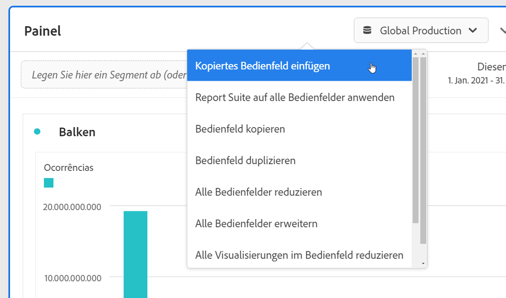

# Übersicht über Bedienfelder

Ein [!UICONTROL Bedienfeld] ist eine Sammlung von Tabellen und Visualisierungen. Sie können auf Bedienfelder über das Symbol oben links in Workspace oder über ein [leeres Bedienfeld](blank-panel.md) zugreifen. Bedienfelder sind hilfreich, wenn Sie Ihre Projekte nach Zeiträumen, Report Suites oder Anwendungsfällen für Analysen organisieren möchten. Die folgenden Bedienfeldtypen sind in Analysis Workspace verfügbar:

| Name des Bedienfelds | Beschreibung |
| --- | --- |
| [Leeres Bedienfeld](blank-panel.md) | Wählen Sie zum Beginnen Ihrer Analyse aus den verfügbaren Bedienfeldern und Visualisierungen. |
| [Bedienfeld „Quick Insights“](quickinsight.md) | Sie können rasch eine Freiformtabelle und eine entsprechende Visualisierung erstellen, um Einblicke schneller zu analysieren und bereitzustellen. |
| [Analytics for Target-Bedienfeld](a4t-panel.md) | Target-Aktivitäten und Erlebnisse in Analysis Workspace analysieren. |
| [Attributionsbedienfeld](attribution.md) | Vergleichen und visualisieren Sie im Handumdrehen eine beliebige Anzahl von Attributionsmodellen unter Verwendung verschiedener Dimensionen und Konversionskennzahlen. |
| [Freiform-Bedienfeld](freeform-panel.md) | Führen Sie unbegrenzte Vergleiche und Aufschlüsselungen durch und fügen Sie dann Visualisierungen hinzu, um eine ausführliche Story mit den Daten zu erzählen. |
| [Bedienfeld „Gleichzeitige Medienbetrachter“](media-concurrent-viewers.md) | Analysieren Sie gleichzeitige Betrachter über einen längeren Zeitraum. Sie erhalten Details zum maximalen gleichzeitigen Zugriff und die Möglichkeit, aufzuschlüsseln und zu vergleichen. |
| [Bedienfeld „Segmentvergleich“](c-segment-comparison/segment-comparison.md) | Vergleichen Sie schnell zwei Segmente über alle Datenpunkte hinweg, um automatisch relevante Unterschiede zu ermitteln. |

[!UICONTROL Quick Insights-], [!UICONTROL leere] und [!UICONTROL Freiform-]Bedienfelder eignen sich hervorragend als Ausgangspunkt für Ihre Analyse, während sich die Bedienfelder für [!UICONTROL Analytics for Target], [!UICONTROL Attribution IQ], [!UICONTROL gleichzeitige Medien-Viewer] und [!UICONTROL Segmentvergleich] mehr für erweiterte Analysen eignen. In Projekten steht eine `"+"`-Schaltfläche zur Verfügung, mit der Sie jederzeit leere Bedienfelder hinzufügen können.

Das standardmäßige Startbedienfeld ist das [!UICONTROL Freiform-]Bedienfeld. Sie können jedoch auch das [leere Bedienfeld](/help/analyze/analysis-workspace/c-panels/blank-panel.md) als Standard festlegen.

## Report Suite {#report-suite}

Tabellen und Visualisierungen innerhalb eines Bedienfelds leiten Daten von der [!UICONTROL Report Suite] ab, die oben rechts im Bedienfeld ausgewählt wurde. Von der Report Suite hängt auch ab, welche Komponenten in der linken Leiste verfügbar sind. In einem Projekt können Sie je nach Anwendungsfällen Ihrer Analyse eine oder [viele Report Suites](https://docs.adobe.com/content/help/de-DE/analytics/analyze/analysis-workspace/build-workspace-project/multiple-report-suites.html) verwenden. Um eine einzelne Report Suite auf alle Bedienfelder in einem Projekt anzuwenden, **klicken Sie mit der rechten Maustaste auf die Bedienfeldkopfzeile > „Report Suite auf alle Bedienfelder anwenden“**.

Die Liste der Report Suites ist nach Relevanz sortiert, die Adobe danach definiert, wie kürzlich und häufig die Suite vom aktuellen Benutzer verwendet wurde und wie häufig die Suite innerhalb der Organisation eingesetzt wird.

## Kalender {#calendar}

Der Bedienfeldkalender steuert den Reporting-Bereich für Tabellen und Visualisierungen innerhalb eines Bedienfelds.

Hinweis: Wenn eine (violette) Datumsbereichskomponente in einer Tabelle, Visualisierung oder dem Ablagebereich eines Bedienfelds verwendet wird, wird der Bedienfeldkalender überschrieben.

## Ablagebereich {#dropzone}

Mit dem Ablagebereich eines Bedienfeld können Sie Segment- und Dropdown-Filter auf alle Tabellen und Visualisierungen innerhalb eines Bedienfelds anwenden. Sie können einen oder mehrere Filter auf ein Bedienfeld anwenden. Der Titel über jedem Filter kann durch Klicken auf den Bearbeitungsstift geändert werden, oder Sie können mit der rechten Maustaste klicken, um ihn ganz zu entfernen.

### Segmentfilter

Ziehen Sie ein beliebiges Segment aus der linken Leiste in den Ablagebereich des Bedienfelds, um mit dem Filtern des Bedienfelds zu beginnen.

### Ad-hoc-Segmentfilter

Komponenten, die keine Segmente sind, können auch direkt in den Ablagebereich gezogen werden, um Ad-hoc-Segmente zu erstellen, wodurch Sie sich das Aufrufen von Segment Builder ersparen. Auf diese Weise erstellte Segmente werden automatisch als Segmente auf Trefferebene definiert. Diese Definition kann geändert werden, indem Sie auf das Informationssymbol (i) neben dem Segment und dann auf das stiftförmige Bearbeitungssymbol klicken und sie in Segment Builder bearbeiten.

Ad-hoc-Segmente sind projektgebunden und werden in Ihrer linken Leiste nicht angezeigt, es sei denn Sie machen sie öffentlich.

### Dropdown-Filter {#dropdown-filter}

Zusätzlich zu den Segmentfiltern ermöglichen Ihnen Dropdown-Filter eine kontrollierte Interaktion mit den Daten. Sie können beispielsweise einen Dropdown-Filter für Gerätetypen hinzufügen, damit Sie das Bedienfeld nach Tablet, Mobiltelefon oder Desktop segmentieren können.

Dropdown-Filter können auch verwendet werden, um viele Projekte zu einem zusammenzufassen. Wenn Sie beispielsweise mehrere Versionen desselben Projekts mit unterschiedlichen Ländersegmenten verwenden, können Sie alle Versionen in einem Projekt zusammenfassen und einen Dropdown-Filter „Land“ hinzufügen.

So erstellen Sie Dropdown-Filter:

1. Wenn Sie einen Dropdown-Filter mit [!UICONTROL Dimensionselementen] erstellen möchten, z. B. Werte innerhalb der Dimension [!UICONTROL Marketing-Kanal], klicken Sie in der linken Leiste auf das Pfeilsymbol neben Ihrer Dimension. Dadurch werden alle verfügbaren Elemente angezeigt. Wählen Sie ein oder mehrere Komponentenelemente aus der linken Leiste aus und legen Sie sie im Ablagebereich des Bedienfelds ab, **während Sie die Umschalttaste** gedrückt halten. Dadurch werden die Komponenten in einen Dropdown-Filter und nicht in ein einzelnes Segment umgewandelt.
1. Wenn Sie einen Dropdown-Filter mit einer anderen Komponente wie z. B. Kennzahlen, Segmente oder Datumsbereiche erstellen möchten, wählen Sie in der linken Leiste einen Komponententyp aus und legen Sie ihn im Ablagebereich des Bedienfelds ab, **während Sie die Umschalttaste** gedrückt halten.
1. Wählen Sie eine der Optionen aus der Dropdown-Liste aus, um die Daten im Bedienfeld zu ändern. Sie können auch auf die Filterung von Bedienfelddaten verzichten, indem Sie **[!UICONTROL Kein Filter]** auswählen.

[Sehen Sie sich das Video an,](https://docs.adobe.com/content/help/de-DE/analytics-learn/tutorials/analysis-workspace/using-panels/using-panels-to-organize-your-analysis-workspace-projects.html) um mehr über das Hinzufügen von Dropdown-Filtern zu Ihrem Projekt zu erfahren.

## Rechtsklick auf Menü {#right-click}

Weitere Funktionen für ein Bedienfeld sind verfügbar, wenn Sie mit der rechten Maustaste auf die Bedienfeldkopfzeile klicken.

Folgende Einstellungen sind verfügbar:

| Einstellung | Beschreibung |
| --- | --- |
| Kopiertes Bedienfeld/kopierte Visualisierung einfügen | Sie können das kopierte Bedienfeld oder die kopierte Visualisierung an einer anderen Stelle innerhalb des Projekts oder in ein ganz anderes Projekt einfügen. |
| Bedienfeld kopieren | Ermöglicht es Ihnen, mit der rechten Maustaste auf ein Bedienfeld zu klicken und es zu kopieren, sodass Sie es an einer anderen Stelle innerhalb des Projekts oder in ein anderes Projekt einfügen können. |
| Report Suite auf alle Bedienfelder anwenden | Damit können Sie die Report Suite des aktiven Bedienfelds auf alle Bedienfelder im Projekt anwenden. |
| Bedienfeld duplizieren | Fertigt ein exaktes Duplikat des aktuellen Bedienfelds an, das Sie dann bearbeiten können. |
| Alle Bedienfelder reduzieren/erweitern | Reduziert und erweitert alle Projektbedienfelder. |
| Alle Visualisierungen im Bedienfeld reduzieren/erweitern | Reduziert bzw. erweitert alle Visualisierungen im aktuellen Bedienfeld. |
| Beschreibung bearbeiten | Hiermit können Sie einen Text zur Beschreibung des Bedienfelds hinzufügen (oder bearbeiten). |
| Bereichslink abrufen | Sie können Personen zu einem bestimmten Bereich innerhalb eines Projekts leiten. Wenn auf den Link geklickt wird, muss sich der Empfänger anmelden, bevor er zu genau dem Bedienfeld weitergeleitet wird, mit dem er verknüpft ist. |
