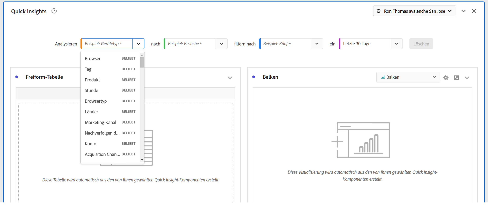
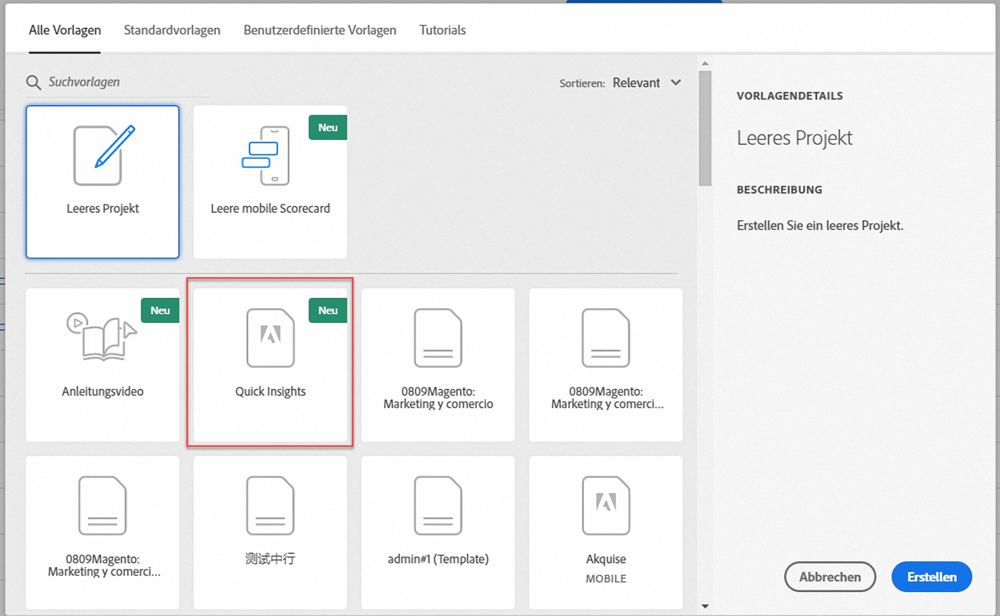
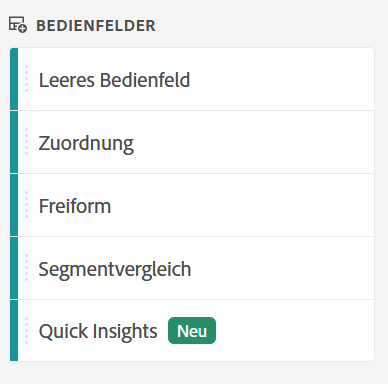
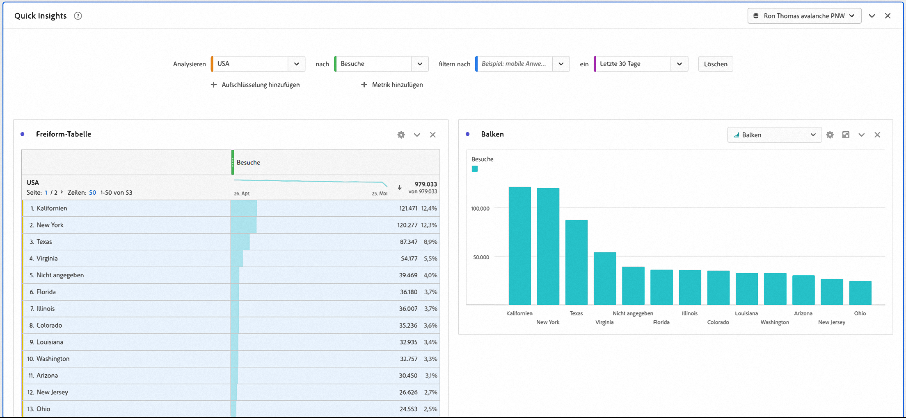
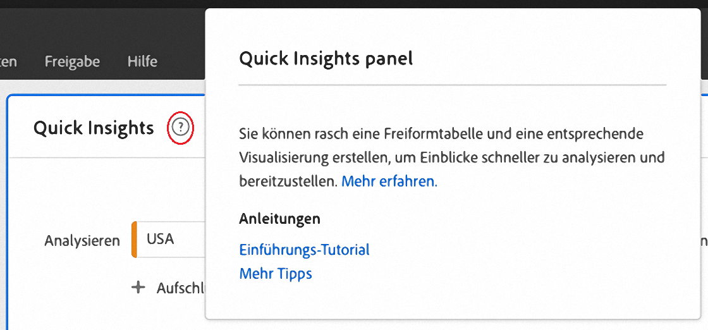
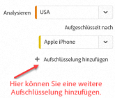
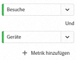
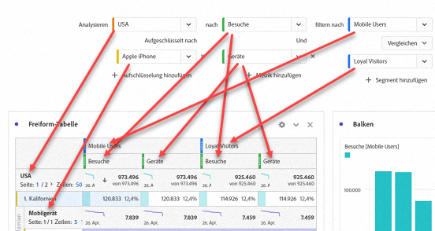
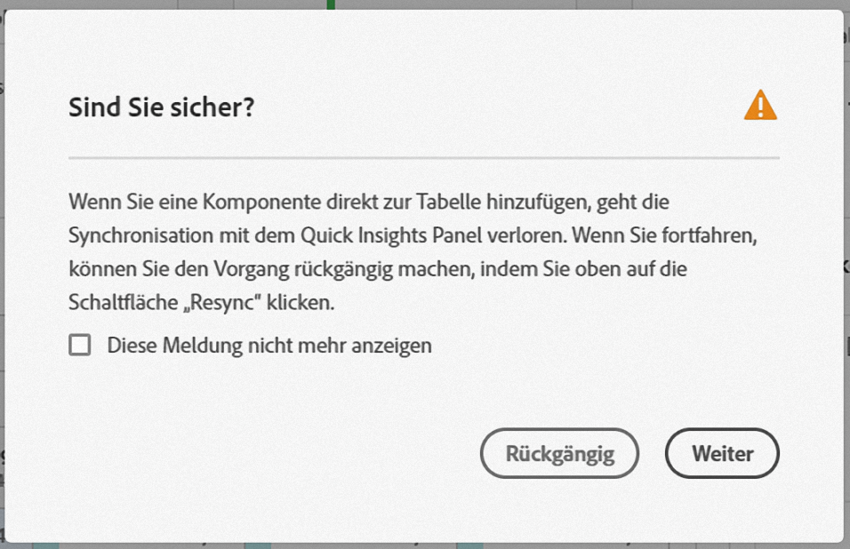

# Bedienfeld „Quick Insights“

[!UICONTROL Quick Insights] bietet Nicht-Analytikern und neuen Benutzern von [!UICONTROL Analysis Workspace] die Möglichkeit, betriebliche Fragen schnell und einfach zu beantworten. Es ist auch ein großartiges Tool für fortgeschrittene Benutzer, die eine einfache Frage schnell beantworten möchten, ohne selbst eine Tabelle erstellen zu müssen.

Wenn Sie [!UICONTROL Analysis Workspace] zum ersten Mal verwenden, fragen Sie sich vielleicht, welche Visualisierungen am nützlichsten sind, welche Dimensionen und Metriken Einblicke ermöglichen, wo Elemente per Drag-and-Drop eingefügt werden können, wo ein Segment erstellt werden kann usw.

Um Ihnen dabei zu helfen und basierend auf der Nutzung von Datenkomponenten durch Ihre eigene Firma in [!UICONTROL Analysis Workspace], verwendet [!UICONTROL Quick Insights] einen Algorithmus, der Ihnen die beliebtesten Dimensionen, Metriken, Segmente und Datumsbereiche präsentiert, die Ihre Firma verwendet. In der Dropdown-Liste werden Dimensionen, Metriken und Segmente angezeigt, die als [!UICONTROL Beliebt] getaggt sind, wie im Folgenden gezeigt:

[!UICONTROL Quick Insights] hilft Ihnen bei Folgendem:

* Ordnungsgemäßes Erstellen einer Datentabelle und einer zugehörigen Visualisierung in [!UICONTROL Analysis Workspace].
* Vertrautmachen mit der Terminologie und dem Vokabular für grundlegende Komponenten und Bestandteile von [!UICONTROL Analysis Workspace].
* Ausführen einfacher Aufschlüsselungen von Dimensionen, Hinzufügen mehrerer Metriken oder Vergleichen von Segmenten in einer [!UICONTROL Freiformtabelle].
* Ändern oder Ausprobieren verschiedener Visualisierungstypen, um das Suchwerkzeug für Ihre Analyse schnell und intuitiv zu finden.

## Grundlegende Terminologie

Im Folgenden finden Sie einige grundlegende Begriffe, mit denen Sie vertraut sein müssen. Jede Datentabelle besteht aus zwei oder mehr Bausteinen (Komponenten), die Sie für Ihre Daten verwenden.

| Baustein (Komponente) | Definition |
|---|---|
| [!UICONTROL Dimension] | Dimensionen sind Beschreibungen oder Eigenschaften metrischer Daten, die in einem Projekt angezeigt, aufgeschlüsselt und verglichen werden können. Es handelt sich um nicht-numerische Werte und Daten, die in Dimensionselemente aufgeschlüsselt werden. Beispielsweise sind „Browser“ und „Seite“ Dimensionen. |
| [!UICONTROL Dimensionselement] | Dimensionselemente sind individuelle Werte für eine Dimension. Beispielsweise wären „Chrome“, „Firefox“, „Edge“ usw. Dimensionselemente für die Browser-Dimension. |
| [!UICONTROL Metrik] | Metriken sind quantitative Informationen über Besucheraktivitäten wie Ansichten, Clickthroughs, Neuladungen, durchschnittliche Besuchszeit, Einheiten, Bestellungen, Umsatz usw. |
| [!UICONTROL Visualisierung] | Workspace bietet [eine Reihe von Visualisierungen](/help/analyze/analysis-workspace/visualizations/freeform-analysis-visualizations.md), mit denen Sie visuelle Darstellungen Ihrer Daten erstellen können, wie beispielsweise Balkendiagramme, Donut-Diagramme, Histogramme, Liniendiagramme, Karten und Streudiagramme. |
| [!UICONTROL Dimensionsaufschlüsselung] | Mit einer Dimensionsaufschlüsselung können Sie eine Dimension buchstäblich nach anderen Dimensionen aufschlüsseln. In unserem Beispiel könnten Sie die US-Bundesstaaten nach Mobilgeräten aufschlüsseln, um die Besuche der Mobilgeräte pro Bundesland zu erhalten, oder Sie könnten Mobilgeräte nach Mobilgerätetypen, Regionen, internen Kampagnen usw. aufschlüsseln. |
| [!UICONTROL Segment] | Mit Segmenten können Besucheruntergruppen anhand von Merkmalen oder Website-Interaktionen identifiziert werden. Sie können beispielsweise [!UICONTROL Besuchersegmente] basierend auf Attributen erstellen (Browser-Typ, Gerät, Anzahl der Besuche, Land, Geschlecht) oder basierend auf Interaktionen (Kampagnen, Keyword-Suche, Suchmaschinen) oder auf der Grundlage von Ausstiegen und Einstiegen (Besucher von Facebook, einer definierten Landingpage, einer Referrer-Domäne) oder basierend auf benutzerspezifischen Variablen (Formularfeld, definierte Kategorien, Kunden-ID). |

## Erste Schritte mit Quick Insights

1. Melden Sie sich mit den Ihnen zur Verfügung gestellten Zugangsdaten bei Adobe Analytics an.
1. Wechseln Sie zu [!UICONTROL Workspace] und klicken Sie auf **[!UICONTROL Neues Projekt erstellen]** und dann auf **[!UICONTROL Quick Insights]**. (Sie können auf dieses Bedienfeld auch über das Menü **[!UICONTROL Bedienfeld]** in der linken Leiste zugreifen.)

   

   

1. Lesen Sie zunächst das kurze Tutorial, um sich mit einigen der Grundlagen des [!UICONTROL Bedienfelds „Quick Insights“] vertraut zu machen. Sie können auch auf **[!UICONTROL Tutorial überspringen]** klicken.
1. Wählen Sie die Bausteine (auch als Komponenten bezeichnet) aus: Dimensionen (orange), Metriken (grün), Segmente (blau) oder Datumsbereiche (violett). Sie müssen mindestens eine Dimension und eine Metrik auswählen, damit eine Tabelle automatisch erstellt wird.

   

   Sie haben drei Möglichkeiten, die Bausteine auszuwählen:
   * Aus der der linken Leiste per Drag-and-Drop ziehen.
   * Wenn Sie wissen, wonach Sie suchen: Beginnen Sie mit der Eingabe. [!UICONTROL Quick Insights] füllt die Lücken für Sie aus.
   * Klicken Sie auf die Dropdown-Liste und durchsuchen Sie die Liste.

1. Wenn Sie mindestens eine Dimension und eine Metrik hinzugefügt haben, wird Folgendes erstellt:

   * Eine Freiformtabelle mit der Dimension (hier US-Bundesstaaten) in senkrechter Richtung und der Metrik (hier Besuche) oben in waagerechter Richtung. Sehen Sie sich diese Tabelle an:

   

   * Eine begleitende Visualisierung, in diesem Fall ein [Balkendiagramm](/help/analyze/analysis-workspace/visualizations/bar.md). Die erstellte Visualisierung basiert auf dem Datentyp, den Sie der Tabelle hinzugefügt haben. Zeitbasierte Daten (z. B. [!UICONTROL Besuche] pro Tag/Monat) verwenden standardmäßig ein [!UICONTROL Liniendiagramm]. Alle nicht zeitbasierten Daten (z. B. [!UICONTROL Besuche] pro [!UICONTROL Gerät]) verwenden standardmäßig ein [!UICONTROL Balkendiagramm]. Sie können den Visualisierungstyp ändern, indem Sie auf den Dropdown-Pfeil neben dem Visualisierungstyp klicken.

1. (Optional) Führen Sie einen Drilldown für Dimensionen durch und zeigen Sie Dimensionselemente an, indem Sie auf den Pfeil „>“ rechts neben der Dimension klicken.

1. Versuchen Sie, einige weitere Verfeinerungen hinzuzufügen, wie nachfolgend unter „Weitere Tipps“ beschrieben.

1. Klicken Sie auf **[!UICONTROL Projekt > Speichern]**, um das Projekt zu speichern.

## Weitere Tipps

Weitere nützliche Hinweise werden im [!UICONTROL Quick Insights Builder] angezeigt, einige davon hängen von Ihrer letzten Aktion ab.

* Schließen Sie zunächst das Tutorial **[!UICONTROL Weitere Tipps]** ab: Greifen Sie über das Hilfe- Symbol (?) neben dem Titel [!UICONTROL Quick Insights] darauf zu. Dieses Tutorial wird 24 Stunden nach dem Erstellen eines Projekts mit mindestens einer Dimension und einer Metrik angezeigt.

   

* **Aufschlüsselung nach**: Sie können bis zu drei Aufschlüsselungsebenen für Dimensionen verwenden, um einen Drilldown zu den Daten durchzuführen, die Sie benötigen.

   

* **Weitere Metriken hinzufügen**: Mithilfe des AND-Operators können Sie bis zu 2 weitere Metriken hinzufügen.

   

* **Weitere Segmente hinzufügen**: Mithilfe des AND- oder OR-Operators können Sie bis zu 2 weitere Segmente hinzufügen. Sehen Sie sich an, was mit der Tabelle passiert, wenn Sie „Mobilbenutzer OR Treue Besucher“ hinzufügen. Sie finden sie nebeneinander über den Metriken. Wenn Sie „Mobilbenutzer AND Treue Besucher“ hinzufügen, werden die Ergebnisse beider Segmente zusammen angezeigt und in der Tabelle übereinander gestapelt.

   

## Bekannte Einschränkungen

Wenn Sie versuchen, die Datei direkt in der Tabelle zu bearbeiten, wird das Bedienfeld [!UICONTROL Quick Insights] nicht mehr synchronisiert. Sie können die vorherigen Einstellungen für [!UICONTROL Quick Insights] wiederherstellen, indem Sie oben rechts im Bedienfeld auf **[!UICONTROL Builder neu synchronisieren]** klicken.

Sie erhalten eine Warnung, bevor Sie etwas direkt zur Tabelle hinzufügen:

Andernfalls verhält sich die Tabelle beim direkten Erstellen jetzt wie eine herkömmliche Freiformtabelle, ohne die hilfreichen Funktionen für neue Benutzer.

