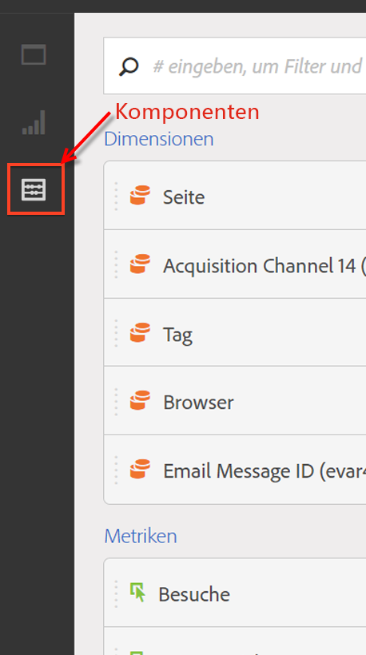

# Komponentenübersicht

Komponenten in Analysis Workspace bestehen aus Metriken, Dimensionen, Segmenten und Zeitgranularitäten, die Sie per Drag-and-Drop in einem Projekt platzieren können. Wenn Sie benutzerdefinierte Komponenten erstellen, z. B. benutzerdefinierte Datumsbereiche, werden sie diesen Feldern hinzugefügt.

Klicken Sie in der linken Leiste auf das Symbol **[!UICONTROL Komponenten]**, um auf das Bedienfeld „Komponenten“ zuzugreifen. Sie können zwischen Bedienfeldern (leeres Bedienfeld, [Freiform-Bedienfeld](/help/analyze/analysis-workspace/visualizations/freeform-table.md) oder Bedienfeld [Segmentvergleich](/help/analyze/analysis-workspace/c-panels/c-segment-comparison/segment-comparison.md)), [Visualisierungen](/help/analyze/analysis-workspace/visualizations/freeform-analysis-visualizations.md) und Komponenten mithilfe der Symbole auf der linken Leiste oder mithilfe von [Tastaturbefehlen](/help/analyze/analysis-workspace/build-workspace-project/fa-shortcut-keys.md) wechseln.

Siehe [Erstellen eines Freiformanalyseprojekts](/help/analyze/analysis-workspace/build-workspace-project/t-freeform-project.md), um Informationen über die Verwendung von Komponenten in einem Projekt zu erhalten.

## Komponentenaktionen {#section_B7BB29B89AE04297874CDE2C52EAD516}

Sie können Komponenten (separat oder mehrere gleichzeitig) auf verschiedene Weisen verwalten. Klicken Sie mit der rechten Maustaste auf eine Komponente oder klicken Sie oben in der Komponentenliste auf **[!UICONTROL Aktionen]**.

>[!NOTE]
>
>Diese Aktionen beziehen sich nicht auf Zeitkomponenten.

| Komponentenaktion | Beschreibung |
|--- |--- |
| Tag | Organisieren oder verwalten Sie Komponenten, indem Sie Tags darauf anwenden. Dies wird dann bei der jeweiligen Komponentenverwaltung angezeigt, beispielsweise „Analysen“ > „Komponenten“ > „Segmente“ oder „Analysen“ > „Komponenten“ > „Projekte“. |
| Favorit | Fügen Sie die Komponente Ihrer Favoritenliste hinzu. Dies wird dann bei der jeweiligen Komponentenverwaltung angezeigt, beispielsweise „Analysen“ > „Komponenten“ > „Segmente“ oder „Analysen“ > „Komponenten“ > „Projekte“. |
| Genehmigen | Genehmigen Sie die Komponente, um sie zu autorisieren. Dies wird dann bei der jeweiligen Komponentenverwaltung angezeigt, beispielsweise „Analysen“ > „Komponenten“ > „Segmente“ oder „Analysen“ > „Komponenten“ > „Projekte“. |
| Freigabe | Gilt nur für Segmente. |
| Löschen | Gilt nur für Segmente. |

[Erstellen von Metriken, Segmenten und Daten auf YouTube](https://www.youtube.com/watch?v=XXJuNAte8E8&amp;index=25&amp;list=PL2tCx83mn7GuNnQdYGOtlyCu0V5mEZ8sS) (2:51)
