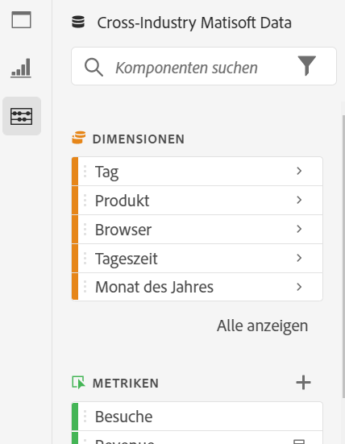
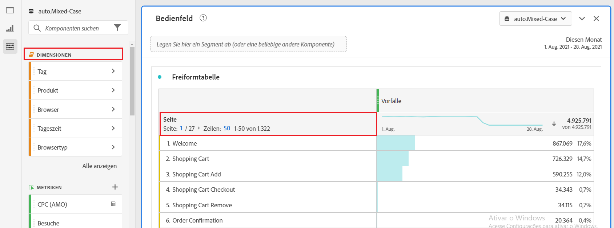
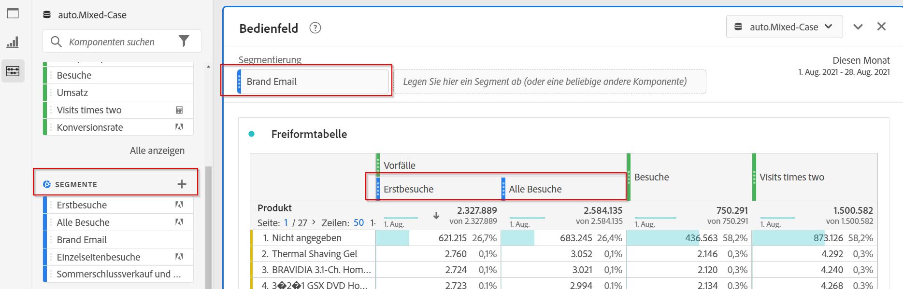
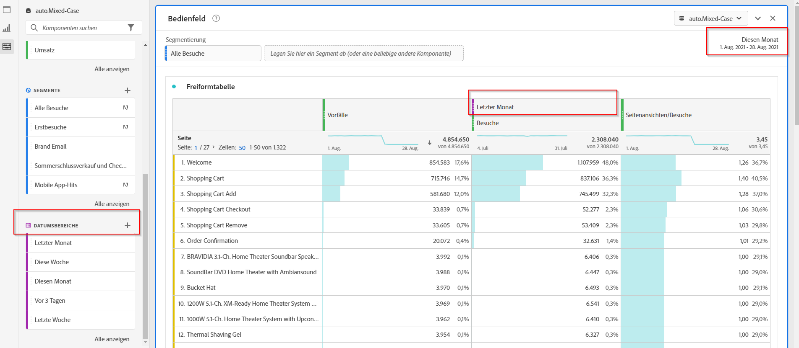
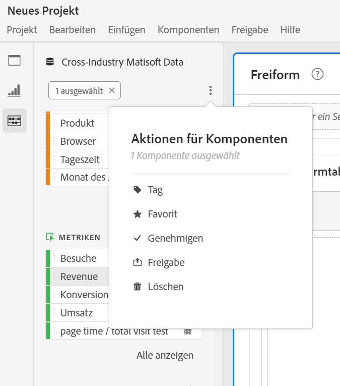

# Komponentenübersicht

Komponenten in Analysis Workspace bestehen aus Dimensionen, Metriken, Segmenten und Datumsbereichen, die Sie per Drag &amp; Drop in ein Projekt ziehen können.

Um das Menü &quot;Komponenten&quot;aufzurufen, klicken Sie in der linken Leiste auf das Symbol **[!UICONTROL Komponenten]**. Sie können zwischen [Bedienfeldern](https://experienceleague.adobe.com/docs/analytics/analyze/analysis-workspace/panels/panels.html?lang=de-DE), [Visualisierungen](https://docs.adobe.com/content/help/de-DE/analytics/analyze/analysis-workspace/visualizations/freeform-analysis-visualizations.html) und Komponenten aus den linken Schienensymbolen oder über [Hotkeys](/help/analyze/analysis-workspace/build-workspace-project/fa-shortcut-keys.md) wechseln.

Sie können die Dichteeinstellungen [für Ansichten](https://docs.adobe.com/content/help/de-DE/analytics/analyze/analysis-workspace/build-workspace-project/view-density.html) auch so anpassen, dass das Projekt in der linken Leiste weitere Werte gleichzeitig sehen kann, indem Sie **[!UICONTROL Projekt > Projektinfo und Einstellungen > Ansicht-Dichte]** aufrufen.

## Dimensionen {#dimensions}

[****](https://docs.adobe.com/content/help/en/analytics/components/dimensions/overview.html) Dimensionen sind Textattribute, die das Verhalten Ihres Besuchers beschreiben und in Ihrer Analyse angezeigt, aufgeschlüsselt und verglichen werden können. Sie befinden sich in der Leiste &quot;Komponente links&quot;(orangefarbener Abschnitt) und werden in der Regel als Tabellenzeilen angewendet.

Beispiele für Dimensionen sind [!UICONTROL Seitenname], [!UICONTROL Marketing-Kanal], [!UICONTROL Gerätetyp] und [!UICONTROL Produkte]. Dimensionen werden von der Adobe bereitgestellt und über Ihre benutzerdefinierte Implementierung erfasst (eVar, Props, Classifications usw.).

Jede Dimension enthält auch **Dimensionselemente** darin. Elemente der Dimension finden Sie in der Leiste &quot;Linke Komponente&quot;, indem Sie auf den Pfeil neben dem jeweiligen Dimensionsnamen klicken (Elemente sind gelb).

Beispiele für Dimensionselemente sind [!UICONTROL Homepage] (innerhalb der Dimension [!UICONTROL Seite]), [!UICONTROL Gebührenpflichtige Suche] (innerhalb der Dimension [!UICONTROL Marketing-Kanal]), [!UICONTROL Tablet] (innerhalb der Dimension [!UICONTROL Mobilgerätetyp] ) usw.

## Metriken {#metrics}

[**Metriken**](https://docs.adobe.com/content/help/en/analytics/components/metrics/overview.html) sind quantitative Maßnahmen zum Verhalten von Besuchern. Sie befinden sich in der linken Leiste Komponente (grüner Abschnitt) und werden normalerweise als Tabellenspalten angewendet.

Zu den Metriken zählen [!UICONTROL Seitenbesuche], [!UICONTROL Ansichten], [!UICONTROL Bestellungen], [!UICONTROL Durchschnittliche Besuchszeit] und [!UICONTROL Umsatz/Bestellung]. Metriken werden von der Adobe bereitgestellt oder über Ihre benutzerdefinierte Implementierung ([!UICONTROL Erfolgsmetriken]) erfasst oder mit dem [Aufbau berechneter Metriken](https://docs.adobe.com/content/help/de-DE/analytics/components/calculated-metrics/calcmetric-workflow/cm-build-metrics.html) erstellt.

## Segmente {#segments}

[**Bei**](https://docs.adobe.com/content/help/de-DE/analytics/analyze/analysis-workspace/components/t-freeform-project-segment.html) Segmenten handelt es sich um Filter der Audience, die auf Ihre Analyse angewendet werden. Sie befinden sich in der Leiste &quot;Komponente links&quot;(blauer Abschnitt) und werden normalerweise oben in einem Bereich oder über den Metrikspalten in einer Tabelle angewendet.

Beispiele für Segmente sind [!UICONTROL Besucher für Mobilgeräte], [!UICONTROL E-Mail-Besuche] und [!UICONTROL Authentifizierte Treffer]. Segmente werden durch Adoben bereitgestellt oder im Dropzone [panel](https://docs.adobe.com/content/help/en/analytics/analyze/analysis-workspace/panels/panels.html) erstellt oder mit dem [Segmentaufbau](https://docs.adobe.com/content/help/de-DE/analytics/components/segmentation/segmentation-workflow/seg-build.html) erstellt.

## Datumsbereiche {#date-ranges}

[**Datumsbereiche**](https://docs.adobe.com/content/help/de-DE/analytics/analyze/analysis-workspace/components/calendar-date-ranges/calendar.html) sind der Datumsbereich, über den Sie Ihre Analyse durchführen. Sie befinden sich in der Leiste &quot;Komponente links&quot;(violetter Abschnitt) und werden normalerweise im Kalender der einzelnen Bereiche angewendet.

Beispiele für Datumsbereiche sind Juli 2019, [!UICONTROL Letzte 4 Wochen] und [!UICONTROL Diesen Monat]. Datumsbereiche werden nach Adobe bereitgestellt, im [Bereichskalender](https://docs.adobe.com/content/help/en/analytics/analyze/analysis-workspace/panels/panels.html) angewendet oder mit dem [Datumsbereichsaufbau](https://docs.adobe.com/content/help/en/analytics/analyze/analysis-workspace/components/calendar-date-ranges/custom-date-ranges.html) erstellt.

## Komponentenaktionen {#actions}

Sie können Komponenten (einzeln oder durch Auswahl mehrerer Komponenten) direkt in der linken Leiste verwalten. Klicken Sie mit der rechten Maustaste auf eine Komponente oder klicken Sie auf das Aktionspunkt-Symbol oben in der Liste der Komponente.

| Komponentenaktion | Beschreibung |
|--- |--- |
| Tag | Organisieren oder verwalten Sie Komponenten, indem Sie Tags darauf anwenden. Sie können dann in der linken Leiste nach Tag suchen, indem Sie auf den Filter klicken oder # eingeben. Tags fungieren auch als Filter in den Komponentenmanagern. |
| Favorit | Fügen Sie die Komponente Ihrer Favoritenliste hinzu. Wie Tags können Sie in der linken Leiste nach Favoriten suchen und sie in den Komponentenmanagern filtern. |
| Genehmigen | Markieren Sie Komponenten als genehmigt, um Ihren Benutzern zu signalisieren, dass die Komponente vom Unternehmen genehmigt wurde. Wie Tags können Sie in der linken Leiste nach Genehmigt suchen und in den Komponentenmanagern filtern. |
| Freigeben | Freigeben von Komponenten für Benutzer in Ihrer Organisation. Diese Option steht nur für benutzerdefinierte Komponenten zur Verfügung, z. B. Segmente oder berechnete Metriken. |
| Löschen | Löschen Sie Komponenten, die Sie nicht mehr benötigen. Diese Option steht nur für benutzerdefinierte Komponenten zur Verfügung, z. B. Segmente oder berechnete Metriken. |

Benutzerdefinierte Komponenten können auch über ihre jeweiligen Komponentenmanager verwaltet werden. Beispiel: Der [Segment-Manager](/help/components/segmentation/segmentation-workflow/seg-manage.md).
