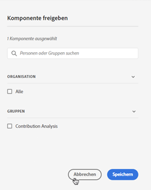

# Anmerkungen verwalten

>[!NOTE]
>
>Diese Funktion wird derzeit nur eingeschränkt getestet.

Die [!UICONTROL Komponenten] > [!UICONTROL Anmerkungen] manager bietet viele Möglichkeiten zum Verwalten von Anmerkungen, z. B. das Freigeben, Filtern, Taggen, Genehmigen, Kopieren, Löschen und Kennzeichnen als Favoriten.

Die [!UICONTROL Anmerkungen] manager zeigt Ihnen alle Anmerkungen an, die Ihnen gehören und für alle Ihre Projekte gelten und die für Sie freigegeben wurden.

>[!NOTE]
>
>[!UICONTROL Anmerkungen] die Sie nur für ein bestimmtes Projekt erstellt haben, werden nicht im Manager angezeigt.

## Benutzeroberfläche von Annotations Manager

| UI-Element | Beschreibung |
| --- | --- | 
| [!UICONTROL Titel und Beschreibung] | Wird im Anmerkungs-Builder bereitgestellt. Um den Titel und die Beschreibung zu bearbeiten, klicken Sie auf den Titel-Link. Dadurch gelangen Sie zurück zum Anmerkungs-Builder. |
| [!UICONTROL Report Suite] | Die Report Suites, für die diese Anmerkung gilt. |
| [!UICONTROL Inhaber] | Gibt an, wem die Anmerkung gehört. Als Nicht-Administrator können Sie nur Anmerkungen anzeigen, deren Inhaber Sie sind, sowie Anmerkungen, die für Sie freigegeben wurden. |
| [!UICONTROL Angewandter Datumsbereich] | Das Datum oder der Datumsbereich, für das bzw. den diese Anmerkung gilt. |
| [!UICONTROL Freigegeben für] | Listet auf, für wie viele Einzelpersonen oder Gruppen Sie die Anmerkung freigegeben haben. Klicken Sie für weitere Details auf . |
| [!UICONTROL Änderungsdatum] | Zeigt das Datum und die Uhrzeit der letzten Änderung der Anmerkung an. |

## Anmerkungen bearbeiten

Die Bearbeitung einer Anmerkung bedeutet, dass Sie Datumsbereiche, Farben, Umfang oder nicht alle Report Suites oder Projekte anpassen können. Sie können Anmerkungen auf zwei Arten bearbeiten:

* Bewegen Sie in einem Liniendiagramm den Mauszeiger über die Anmerkung und klicken Sie im Popover auf das Stiftsymbol.

* Im [!UICONTROL Anmerkungs-Manager]klicken Sie auf den Titel der Anmerkung.

Beide dieser Optionen landen im Anmerkungs-Builder zurück. Dort können Sie die erforderlichen Anpassungen vornehmen und die neue Version speichern.

## Freigeben von Anmerkungen

1. Wählen Sie die Anmerkungen aus, die Sie freigeben möchten, und klicken Sie auf [!UICONTROL Freigeben].

1. Im [!UICONTROL Komponente freigeben] -Dialogfeld die Personen oder Gruppen durchsuchen, für die Sie die Anmerkungen freigeben möchten.

1. under [!UICONTROL Einrichtung], ....

1. Klicken Sie auf [!UICONTROL Speichern].

## Anmerkungen taggen

Gehen Sie wie folgt vor

