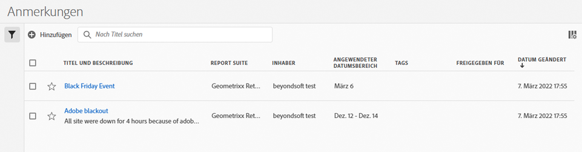

# Anmerkungen verwalten

>[!NOTE]
>
>Diese Funktion wird derzeit nur eingeschränkt getestet.

Die [!UICONTROL Komponenten] > [!UICONTROL Anmerkungen] manager bietet viele Möglichkeiten zum Verwalten von Anmerkungen, z. B. das Freigeben, Filtern, Taggen, Genehmigen, Kopieren, Löschen und Kennzeichnen als Favoriten.

Die [!UICONTROL Anmerkungen] manager zeigt Ihnen alle Anmerkungen an, die Ihnen gehören und für alle Ihre Projekte gelten und die für Sie freigegeben wurden.

>[!NOTE]
>
>[!UICONTROL Anmerkungen] die Sie nur für ein bestimmtes Projekt erstellt haben, werden nicht im Manager angezeigt.

## Benutzeroberfläche von Annotations Manager

| UI-Element | Beschreibung |
| --- | --- | 
| [!UICONTROL Titel und Beschreibung] | Wird im Anmerkungs-Builder bereitgestellt. Um den Titel und die Beschreibung zu bearbeiten, klicken Sie auf den Titel-Link. Dadurch gelangen Sie zurück zum Anmerkungs-Builder. |
| [!UICONTROL Report Suite] | Die Report Suites, für die diese Anmerkung gilt. |
| [!UICONTROL Inhaber] | Gibt an, wem die Anmerkung gehört. Als Nicht-Administrator können Sie nur Anmerkungen anzeigen, deren Inhaber Sie sind, sowie Anmerkungen, die für Sie freigegeben wurden. |
| [!UICONTROL Angewandter Datumsbereich] | Das Datum oder der Datumsbereich, für das bzw. den diese Anmerkung gilt. |
| [!UICONTROL Freigegeben für] | Listet auf, für wie viele Einzelpersonen oder Gruppen Sie die Anmerkung freigegeben haben. Klicken Sie für weitere Details auf . |
| [!UICONTROL Änderungsdatum] | Zeigt das Datum und die Uhrzeit der letzten Änderung der Anmerkung an. |

## Anmerkungen bearbeiten

Die Bearbeitung einer Anmerkung bedeutet, dass Sie Datumsbereiche, Farben, Umfang oder nicht alle Report Suites oder Projekte anpassen können. Sie können Anmerkungen auf zwei Arten bearbeiten:

* Bewegen Sie in einem Liniendiagramm den Mauszeiger über die Anmerkung und klicken Sie im Popover auf das Stiftsymbol.

* Im [!UICONTROL Anmerkungs-Manager]klicken Sie auf den Titel der Anmerkung.

Beide dieser Optionen landen im Anmerkungs-Builder zurück. Dort können Sie die erforderlichen Anpassungen vornehmen und die neue Version speichern.

## Sonstige Anmerkungsaufgaben

Mit dem Anmerkungs-Manager können Administratoren Anmerkungen bearbeiten, hinzufügen, taggen, löschen, umbenennen, genehmigen, kopieren, exportieren und filtern. Er ist für Nicht-Admin-Benutzer nicht sichtbar.

Wählen Sie einfach eine oder mehrere der Anmerkungen aus und die Taskleiste wird angezeigt.

| Aufgabe | Beschreibung |
| --- | --- |
| Fügen Sie | Sie gelangen zum Generator für Anmerkungen , in dem Sie neue Anmerkungen erstellen können. |
| Tag | Alle Benutzer können Tags für Anmerkungen erstellen und einen oder mehrere Tags auf eine Anmerkung anwenden. Sie sehen Tags jedoch nur für die Segmente, deren Inhaber Sie sind. Welche Arten von Tags sollten Sie erstellen? Hier finden Sie einige Vorschläge für nützliche Tags:<ul><li>Auf Teamnamen basierende Tags wie Social Marketing, Mobile Marketing</li><li>Projekt-Tags (Analyse-Tags) wie Entrypage-Analyse</li><li>Kategorie-Tags: Männer, Region</li><li>Arbeitsablauf-Tags: Kuratiert für (einen bestimmten Geschäftsbereich), Genehmigt</li></ul> |
| Löschen | Durch das Löschen einer Anmerkung wird sie aus jedem Projekt in Ihrer Organisation entfernt. |
| Umbenennen | Beim Umbenennen einer Anmerkung wird sie in allen Projekten, auf die sie angewendet wurde, umbenannt. |
| Kopieren | Erstellt eine eindeutige Kopie mit einer eigenen Anmerkungs-ID, jedoch mit demselben Namen und derselben Definition. |
| In CSV exportieren | Exportieren Sie die Anmerkungsdefinition in eine CSV-Datei. |
| Filter (linke Leiste) | Filtern Sie nach Tags, Report Suite, Inhabern und anderen Filtern (Meine, Genehmigt, Favoriten, Für mich freigegeben und Alle anzeigen). |
