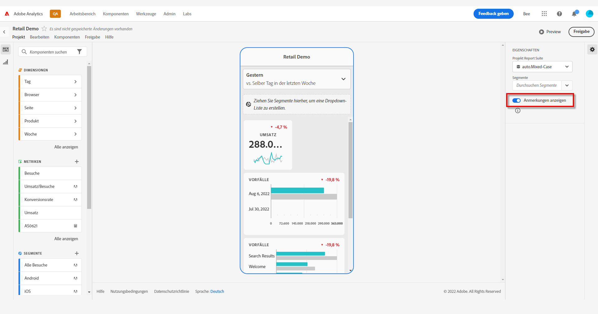
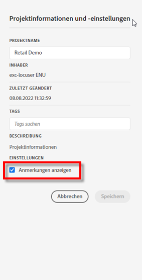
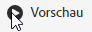

# Freigeben von Anmerkungen in mobilen Scorecards

Sie können in Workspace erstellte Anmerkungen in mobilen Scorecards anzeigen. Auf diese Weise können Sie kontextbezogene Datennuancen und Einblicke in Ihre Organisation und Kampagnen direkt in mobilen Scorecard-Projekten freigeben, die in der mobilen App der Analytics-Dashboards angezeigt werden.

## Anmerkungen in der Benutzeroberfläche in mobilen Scorecards

Um Anmerkungen in mobilen Scorecards aufzudecken, erstellen Sie die Anmerkung zuerst aus Workspace-Projekten oder aus dem Menü &quot;Komponenten&quot;.

Informationen zum Erstellen von Anmerkungen finden Sie unter [Anmerkungen erstellen](create-annotations.md). Anmerkungen sind standardmäßig in mobilen Scorecards deaktiviert und müssen für jede Scorecard aktiviert sein, die Sie in mobilen Scorecards platzieren möchten.

1. Aktivieren Sie Anmerkungen. Informationen zum Aktivieren von Anmerkungen finden Sie unter [Aktivieren oder Deaktivieren von Anmerkungen](overview.md#annotations-on-off).

1. Erstellen Sie eine Anmerkung und stellen Sie sicher, dass sie für alle Ihre Projekte freigegeben ist. Informationen zum Erstellen einer Anmerkung in Workspace finden Sie unter [Anmerkungen erstellen](create-annotations.md).

1. Auswählen **Anmerkungen anzeigen** , um die Anmerkung in mobilen Scorecards anzuzeigen.

   

1. Bestätigen Sie, dass die Option Anmerkungen anzeigen ausgewählt ist, gehen Sie zu **Projekt** > **Projektinformationen und Einstellungen**.

   

## Anzeigen von Anmerkungen in mobilen Scorecards

Wenn Anmerkungen aktiviert sind, werden im Scorecard Builder Anmerkungssymbole angezeigt. Anmerkungen werden nur in Diagrammen und Tabellen in der Detailansicht angezeigt. Anmerkungen sind in der Ansicht der Hauptkachel der Scorecard nicht sichtbar.

Wenn Anmerkungssymbole sichtbar sind, können Sie Anmerkungen auf der Arbeitsfläche des Builders nicht vollständig anzeigen oder damit interagieren. Verwenden Sie den Vorschaumodus, um Anmerkungen so anzuzeigen und zu bearbeiten, wie sie in der App angezeigt werden. 

Anmerkungsfarben werden ausgewählt, wenn die Anmerkung in Workspace erstellt wird. Graue Anmerkungen weisen auf das Vorhandensein von mehr als einer Anmerkung hin.  

## Anzeigen von Diagrammanmerkungen

| Datum | Erscheinungsbild |
| --- | --- |
| **Einzeltag** |    |
| **Datumsbereich** |  |
| **Überlappende Anmerkungen** |   Um Anmerkungsdetails in der Analytics-Dashboards-App anzuzeigen, tippen Sie auf ein Anmerkungssymbol.   Wenn Sie eine Anmerkung in einem Diagramm anzeigen, können Sie nach links und rechts wischen, um durch alle im Diagramm vorhandenen Anmerkungen zu navigieren. Wischen Sie beim Anzeigen einer Anmerkung in der Tabelle nach links und rechts, um durch alle Anmerkungen zu navigieren, die mit diesem Zeilenelement in der Tabelle verknüpft sind.      In Diagrammen ohne zeitbasierte *x-Achse*, wie z. B. Ringdiagramme oder horizontale Balkendiagramme, können Anmerkungen, die für das Diagramm gelten, durch Tippen auf das Symbol unten rechts angezeigt werden.    |
