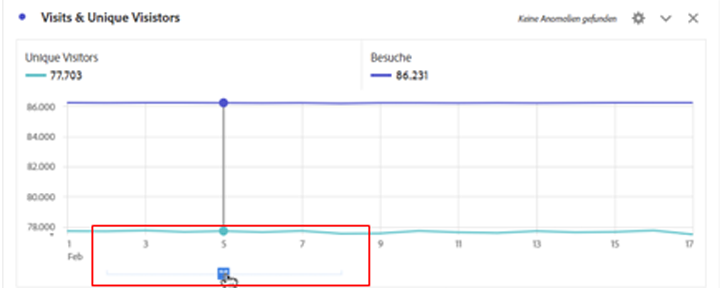
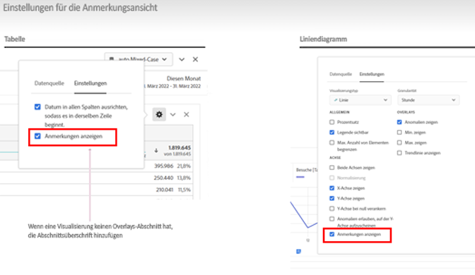
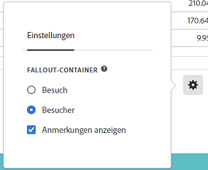

# Anmerkungen – Übersicht

Mit Anmerkungen in Analysis Workspace können Sie Ihrer Organisation kontextbezogene Informationen und Einblicke zu Daten effektiv übermitteln. Durch sie können Sie Kalenderereignisse an bestimmte Dimensionen/Metriken binden. Sie können etwa ein Datum oder einen Datumsbereich mit bekannten Datenproblemen, öffentlichen Feiertagen, Kampagnenstarts usw. kommentieren. Sie können dann Ereignisse grafisch darstellen und sehen, ob sich Kampagnen oder andere Ereignisse auf den Traffic Ihrer Site, den Umsatz oder andere Metriken ausgewirkt haben.

Angenommen, Sie geben Projekte für Ihr Unternehmen frei. Wenn der Traffic aufgrund einer Marketing-Kampagne stark angestiegen ist, können Sie die Anmerkung „Start der Kampagne“ erstellen und diese auf Ihre gesamte Report Suite anwenden. Wenn Ihre Benutzer Datensätze betrachten, die dieses Datum enthalten, sehen sie die Anmerkung in ihren Projekten gemeinsam mit ihren Daten.

Beachten Sie:

* Anmerkungen können an ein einzelnes Datum oder einen Datumsbereich gebunden werden.

* Sie können auf Ihren gesamten Datensatz oder auf bestimmte Metriken, Dimensionen oder Segmente angewendet werden.

* Sie können auf das Projekt angewendet werden, in dem sie erstellt wurden (Standard), oder auf alle Projekte.

* Sie können auf die Report Suite angewendet werden, in der sie erstellt wurden (Standard), oder auf alle Report Suites.

## Zugriffsberechtigungen {#permissions}

Standardmäßig können nur Administratoren Anmerkungen erstellen. Benutzer haben die Berechtigung, Anmerkungen anzuzeigen, wie dies bei anderen Analytics-Komponenten der Fall ist (z. B. Segmente, berechnete Metriken usw.).

Administratoren können jedoch über die [Adobe Admin Console](https://experienceleague.adobe.com/docs/analytics/admin/admin-console/permissions/analytics-tools.html?lang=de) Benutzern die Berechtigung zur [!UICONTROL Erstellung von Anmerkungen] (Analytics-Tools) erteilen.

## Aktivieren oder Deaktivieren von Anmerkungen {#on-off}

Anmerkungen können auf verschiedenen Ebenen aktiviert oder deaktiviert werden:

* Auf Visualisierungsebene: Einstellungen der [!UICONTROL Visualisierung] > [!UICONTROL Anmerkungen anzeigen]

* Auf Projektebene: [!UICONTROL Projektinfo und Einstellungen] > [!UICONTROL Anmerkungen anzeigen]

* Auf Benutzerebene: [!UICONTROL Komponenten] > [!UICONTROL Benutzereinstellungen] > [!UICONTROL Daten] > [!UICONTROL Anmerkungen anzeigen]

