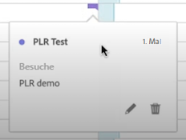
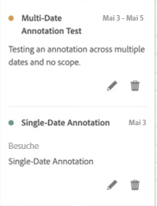

# Anzeigen von Anmerkungen

Anmerkungen werden je nachdem, ob sie sich über einen einzelnen Tag oder einen Datumsbereich erstrecken, etwas unterschiedlich angezeigt.

## Anzeigen von Anmerkungen in Liniendiagrammen oder Tabellen

| Datum | Erscheinungsbild |
| --- | --- |
| **Einzeltag** | 
Wenn Sie den Mauszeiger über die Anmerkung bewegen, können Sie deren Details anzeigen, sie durch Auswahl des Stiftsymbols bearbeiten oder löschen:
  |
| **Datumsbereich** | Das Symbol ändert sich, und wenn Sie den Mauszeiger darüber bewegen, wird der Datumsbereich angezeigt.

Wenn Sie die Anmerkung im Liniendiagramm auswählen, werden ihre Metadaten angezeigt und Sie können sie bearbeiten oder löschen:
In einer Tabelle wird an jedem Datum im Datumsbereich ein Symbol angezeigt.
 |
| **Überlappende Anmerkungen** | An Tagen, an denen es mehr als eine Anmerkung gibt, wird das Symbol grau dargestellt.

Wenn Sie den Mauszeiger über das graue Symbol bewegen, werden alle sich überlappenden Anmerkungen angezeigt:
 |

{style=&quot;table-layout:auto&quot;}

## Anzeigen von Anmerkungen in einer PDF-Datei

Da Symbole in einer PDF-Datei nicht auf den Mauszeiger reagieren können, enthält diese Datei (nach dem Export) am unteren Rand eines Bedienfelds Anmerkungen zu Erklärungen. Siehe folgendes Beispiel:

## Anzeigen von Anmerkungen mit Daten ohne Trendansicht

Manchmal werden Anmerkungen mit Daten ohne Trendansicht angezeigt, die jedoch an eine bestimmte Dimension gebunden sind. In diesem Fall werden sie nur in einer zusammenfassenden Anmerkung in der rechten unteren Ecke angezeigt. Siehe folgendes Beispiel:

Das Zusammenfassungsdiagramm wird in allen Visualisierungstypen in der Ecke angezeigt, nicht nur in nicht Trend-Freiformtabellen und Zusammenfassungsnummern. Es wird auch in Visualisierungen wie [!UICONTROL Ringdiagramm], [!UICONTROL Fluss],[!UICONTROL Fallout],[!UICONTROL Kohorte]usw.

