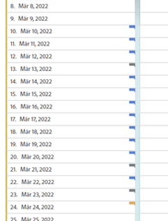
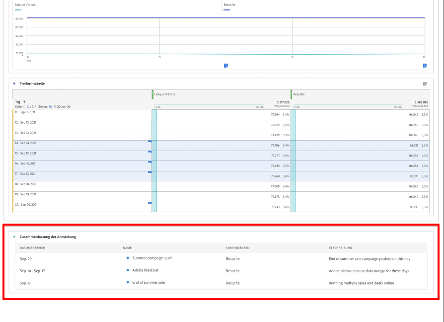

# Anzeigen von Anmerkungen

>[!NOTE]
>
>Diese Funktion wird derzeit nur eingeschränkt getestet.

Anmerkungen werden je nachdem, ob sie sich über einen einzelnen Tag oder einen Datumsbereich erstrecken, etwas unterschiedlich angezeigt.

## Anzeigen von Anmerkungen in Liniendiagrammen oder Tabellen

| Datum | Erscheinungsbild |
| --- | --- |
| **Einzeltag** |  |
| **Datumsbereich** | Das Symbol ändert sich. Wenn Sie den Mauszeiger darüber bewegen, wird der Datumsbereich angezeigt.

In einer Tabelle wird an jedem Datum im Datumsbereich ein Symbol angezeigt.

Beachten Sie Folgendes: an Tagen mit mehr als einer Anmerkung verknüpft ist, wird das Symbol grau dargestellt. |

## Anzeigen von Anmerkungen in einem Zusammenfassungsdiagramm

## Anzeigen von Anmerkungen in einer PDF-Datei

Da Sie nicht den Mauszeiger über Symbole in einer PDF-Datei bewegen können, enthält diese Datei (nach dem Export) am unteren Rand eines Bedienfelds Anmerkungen zu Erklärungen. Siehe folgendes Beispiel:

## Anzeigen von Anmerkungen, die nicht auf Daten basieren

Manchmal sind Anmerkungen nicht an ein Datum gebunden, sondern an eine bestimmte Dimension. In diesem Fall werden sie nur in einer Zusammenfassungsanmerkung in der rechten unteren Ecke angezeigt. Siehe folgendes Beispiel:

