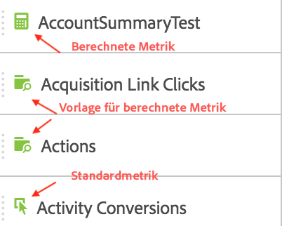
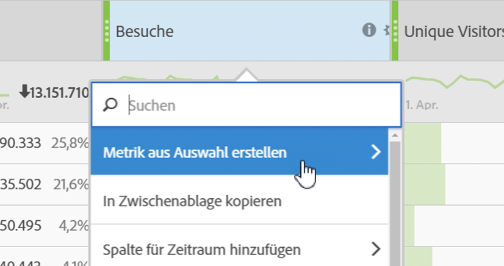
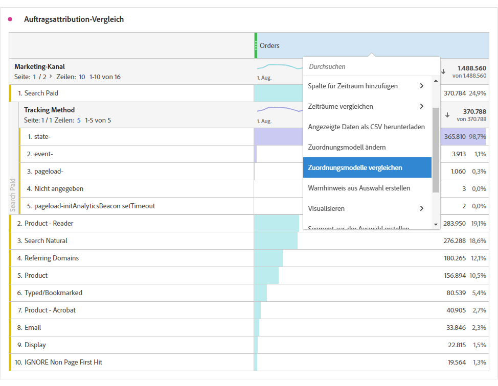

# Metriken

In Analysis Workspace gibt es zwei Möglichkeiten zur Verwendung von Metriken.

Sie können entweder eine Standardmetrik, eine berechnete Metrik oder eine Vorlage für berechnete Metriken aus dem Menü [!UICONTROL Komponenten] in die Tabelle ziehen:

>[!NOTE]
>
>Die Verwendung von Metriken ist einfach und leistungsstark zugleich. Sie können einem Bericht Metriken hinzufügen, indem Sie die entsprechende Metrik in den Metrikabschnitt einer Tabelle ziehen. Sie können Dimensionen auch nach Metriken aufschlüsseln, um die Tabellenansicht detailliert zu steuern. Außerdem können Sie eine Metrik als Dimension und eine Dimension als Metrik einfügen, um einen Zeitverlaufsbericht zu erstellen. Spielen Sie mit den verschiedenen Komponenten und sehen Sie, was Sie tun können. Die Möglichkeiten sind endlos.

Oder Sie können auf **[!UICONTROL Komponenten]** > **[!UICONTROL Neue Metrik]** klicken. Sie gelangen so zum [Generator für berechnete Metriken](/help/components/c-calcmetrics/cm-overview.md), wo Sie aus bereits vorhandenen Metriken benutzerdefinierte Metriken erstellen können.

Um das schnelle Erstellen berechneter Metriken zu vereinfachen, wurde dem Spalten-Kontextmenü von Freiformtabellen die Option **[!UICONTROL Metrik aus Auswahl erstellen]** hinzugefügt. Diese Option wird angezeigt, wenn mindestens eine Spaltenüberschriftszelle ausgewählt ist.

[Verwenden von Beitragsmetriken auf YouTube](https://www.youtube.com/watch?v=ngmJHcg65o8&amp;list=PL2tCx83mn7GuNnQdYGOtlyCu0V5mEZ8sS&amp;index=32) (4:16)

## Vergleichen von Metriken mit verschiedenen Attributionsmodellen

If you&#39;d like to quickly and easily compare one attribution model to another, right click a metric and select **[!UICONTROL Compare Attribution Models]**:

Dadurch können Sie Attributionsmodelle schnell und einfach miteinander vergleichen, ohne eine Metrik hereinzuziehen und sie zweifach zu konfigurieren.
