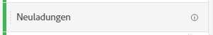
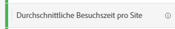

# Metriken

Mit Metriken können Sie Datenpunkte in Analysis Workspace quantifizieren. Sie werden meist als Spalten in einer Visualisierung verwendet und sind an Dimensionen gebunden.

Adobe bietet verschiedene Arten von Metriken zur Verwendung in Analysis Workspace:

* **Standardmetriken**: Die meisten Metriken, die Sie in Projekten verwenden, sind Standardmetriken. Beispiele sind [Seitenansichten](/help/components/metrics/page-views.md), [Umsatz](/help/components/metrics/revenue.md)oder [Benutzerspezifische Ereignisse](/help/components/metrics/custom-events.md). Siehe [Übersicht über Metriken](/help/components/metrics/overview.md) Weitere Informationen finden Sie im Benutzerhandbuch zu Komponenten.

   

* **Berechnete Metriken**: Benutzerdefinierte Metriken, die auf Standardmetriken, statischen Zahlen oder algorithmischen Funktionen basieren. Benutzerdefinierte berechnete Metriken zeigen ein Rechnersymbol in der Liste der verfügbaren Komponenten. Siehe [Übersicht über berechnete Metriken](/help/components/c-calcmetrics/cm-overview.md) Weitere Informationen finden Sie im Benutzerhandbuch zu Komponenten.

   

* **Vorlagen für berechnete Metriken**: Von Adoben definierte Metriken, die sich ähnlich wie berechnete Metriken verhalten. Sie können sie unverändert in Workspace-Projekten verwenden oder eine Kopie speichern, um ihre Logik anzupassen. In Vorlagen für berechnete Metriken wird in der Liste der verfügbaren Adoben ein Symbol angezeigt.

   

Metriken sind in ihrer Verwendung in Analysis Workspace flexibel. Ziehen Sie eine Metrik in eine leere Freiformtabelle, um die Trendansicht dieser Metrik über den Datumsbereich des Projekts anzuzeigen. Sie können auch eine Metrik ziehen, wenn eine Dimension vorhanden ist, um diese Metrik im Vergleich zu jedem Dimensionselement anzuzeigen. Wenn Sie eine Metrik auf eine vorhandene Metrik-Kopfzeile ziehen, wird sie ersetzt und durch Ziehen einer Metrik neben eine Kopfzeile können Sie beide Metriken nebeneinander sehen.

>[!VIDEO](https://video.tv.adobe.com/v/40817/?quality=12)

## Berechnete Metriken

Berechnete Metriken ermöglichen es Ihnen, mithilfe einfacher Operatoren oder statistischer Funktionen einfach zu erkennen, wie sich Metriken zueinander verhalten. Es gibt mehrere Möglichkeiten, berechnete Metriken zu erstellen:

* Klicken Sie auf das Pluszeichen neben der Überschrift Metriken unter der Liste der Komponenten auf der linken Seite.
* Navigieren Sie zu **[!UICONTROL Komponenten]** > **[!UICONTROL Berechnete Metriken]** > **[!UICONTROL Hinzufügen]**.
* Klicken Sie mit der rechten Maustaste auf eine Spaltenüberschrift > **[!UICONTROL Metrik aus Auswahl erstellen]** wenn mindestens eine Spaltenüberschriftszelle ausgewählt ist. Diese Option erstellt automatisch eine berechnete Metrik für Sie, ohne dass der Regel-Builder für berechnete Metriken verwendet werden muss.

[Berechnete Metriken: implementierungslose Metriken](https://experienceleague.adobe.com/docs/analytics-learn/tutorials/components/calculated-metrics/calculated-metrics-implementationless-metrics.html?lang=de) (3:42)

## Vergleichen von Metriken mit verschiedenen Attributionsmodellen

Wenn Sie Attributionsmodelle schnell und einfach miteinander vergleichen möchten, können Sie mit der rechten Maustaste auf eine Metrik klicken und **[!UICONTROL Attributionsmodelle vergleichen]** auswählen:

Dadurch können Sie Attributionsmodelle schnell und einfach miteinander vergleichen, ohne eine Metrik hereinzuziehen und sie zweifach zu konfigurieren.

## Verwenden der Funktion [!UICONTROL Kumulativer Durchschnitt] zum Anwenden der Metrikausgleichung

Im Folgenden finden Sie ein Video zum Thema:

>[!VIDEO](https://video.tv.adobe.com/v/27068/?quality=12)
