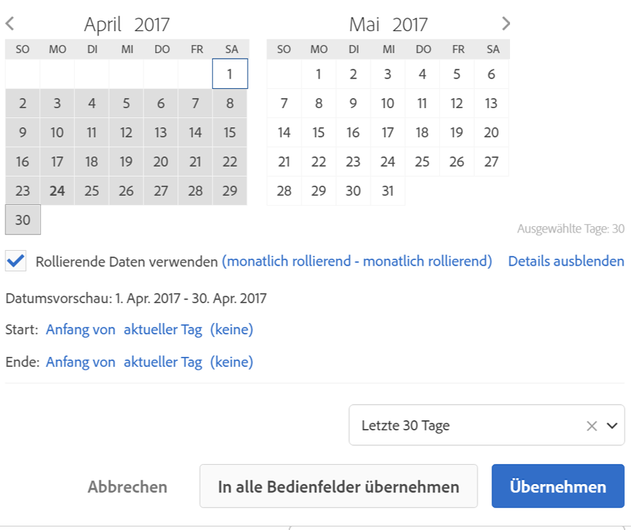

# Überblick über Kalender- und Datumsbereiche

Im Kalender können Sie Daten und Datumsbereiche festlegen oder eine Voreinstellung auswählen.

Wenn Sie im Kalender etwas auswählen, bezieht sich diese Auswahl auf das jeweilige Bedienfeld. Sie haben jedoch die Möglichkeit, die Auswahl auf sämtliche Bedienfelder anzuwenden. Der Workspace-Kalender zeigt standardmäßig den aktuellen und den vorherigen Monat an.

Mit dem ersten Klick öffnet sich die Auswahl eines Datumsbereichs. Anschließend kann der Datumsbereich in beide Richtungen markiert werden. Mit einem zweiten Klick wählen Sie den Bereich für das Enddatum aus. If the `Shift` key is held down (or right-click is used) while clicking the first date, it will append to the range.

Sie können Datums- (und Zeitdimensionen) mittels Drag &amp; Drop in einem Workspace-Projekt ablegen. Sie können spezifische Tage, Wochen, Monate, Jahre oder ein rollierendes Datum auswählen.

[Verwenden von Datumsbereichen und Kalendern im Analysis Workspace auf youtube](https://www.youtube.com/watch?v=L4FSrxr3SDA&list=PL2tCx83mn7GuNnQdYGOtlyCu0V5mEZ8sS&index=28) (4:07)

| Einstellung | Beschreibung |
|--- |--- |
| Ausgewählte Tage | Gewählte Tage/Wochen/Monate/Jahre. |
| Rollierende Daten verwenden | Mithilfe rollierender Daten können Sie einen dynamischen Bericht generieren, der zum Zeitpunkt seiner Ausführung einen bestimmten Zeitraum voraus oder zurück umfasst. Wenn Sie zum Beispiel einen Bericht zu allen Bestellungen haben möchten, die im letzten Monat aufgegeben wurden (wobei sich „Letzter Monat“auf das Feld „Erstellungsdatum“ bezieht), und diesen Bericht dann im Dezember ausführen, würden Ihnen alle Bestellungen angezeigt, die im November aufgegeben wurden. Führen Sie den gleichen Bericht im Januar aus, werden Ihnen die Bestellungen aus dem Dezember angezeigt.  Datumsvorschau: Gibt an, welchen Zeitraum der rollierende Kalender umfasst.  Start: Sie können zwischen den folgenden Optionen wählen: „Aktueller Tag“, „Aktuelle Woche“, „Aktueller Monat“, „Aktuelles Quartal“ und „Aktuelles Jahr“.  Ende: Sie können zwischen den folgenden Optionen wählen: „Aktueller Tag“, „Aktuelle Woche“, „Aktueller Monat“, „Aktuelles Quartal“ und „Aktuelles Jahr“.  For an example, go [here](/help/analyze/analysis-workspace/components/calendar-date-ranges/custom-date-ranges.md). |
| Datumsbereich | Hier können Sie einen voreingestellten Datumsbereich auswählen. Der Standardwert lautet „Letzte 30 Tage“. |
| In alle Bedienfelder übernehmen | Hiermit können Sie den ausgewählten Datumsbereich nicht nur für das aktuelle Bedienfeld, sondern für alle Bedienfelder des Projekts ändern. |
| Übernehmen | Hiermit wird der Datumsbereich nur in diesem Bedienfeld übernommen. |
